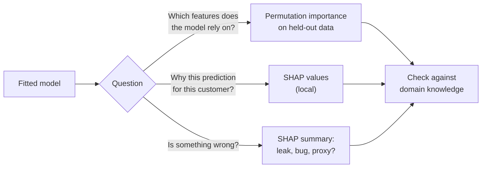

# Interpreting tree ensembles and comparing a challenger with the current model

A boosted model with 300 trees cannot be read like the depth-2 tree of page 1. Yet we must know what it has learned: to check that it uses sensible information, to find leaks and bugs, and to explain it to the people who rely on it. This page covers the third block of Session 10: **feature importance** (impurity-based), **permutation importance**, **SHAP values** as a tool for checking and debugging models, and the question every model update raises: is the new **challenger** model really better than the **current** model, by enough to replace it? The block ends with the second leaderboard round.

> [!NOTE]
> The code blocks on this page build on each other. They need the Telco data from GitHub and the package `shap`, which is part of the course environment. On macOS, LightGBM needs `brew install libomp` (page 3).



## 1. Feature importance: impurity-based and permutation importance

### Concept

**Impurity-based importance** (`feature_importances_` in scikit-learn, "gain" in the boosting libraries) adds up, for each feature, the decrease in impurity of all splits that use it, weighted by the number of rows reaching the split. It is computed from the training data during fitting and comes for free. It has two known biases: it favours features with many distinct values (continuous features, identifiers), because they offer many possible thresholds, and it measures how much the feature was *used on the training data*, including to fit noise.

**Permutation importance** (Breiman, 2001) measures how much a model's score drops when the values of one feature are randomly shuffled, which breaks the link between that feature and the target while keeping its distribution:

1. Compute the score on a dataset (preferably held-out data).
2. For feature j: shuffle column j, recompute the score; the importance is the drop. Repeat several times and average.

Worked example: a model has a test ROC AUC of 0.842. Shuffling `Contract` lowers it to 0.754; the permutation importance of `Contract` is 0.842 − 0.754 = 0.088. Shuffling `gender` leaves it at 0.842: importance 0; the model does not rely on it.

### Why it matters

Importance answers "which inputs does the model rely on?" Computed on held-out data, permutation importance shows what *generalises*; computed on training data, it shows what the model *memorised*. Comparing the two is a quick overfitting check.

### How it works in Python

To expose the bias, we add a column of random numbers, `random_id`, which carries no information about churn:

```python
import numpy as np
import pandas as pd
from sklearn.ensemble import RandomForestClassifier
from sklearn.inspection import permutation_importance
from sklearn.model_selection import train_test_split

URL = ("https://raw.githubusercontent.com/IBM/telco-customer-churn-on-icp4d/"
       "master/data/Telco-Customer-Churn.csv")
df = pd.read_csv(URL)
df["TotalCharges"] = pd.to_numeric(df["TotalCharges"], errors="coerce").fillna(0)
y = (df["Churn"] == "Yes").astype(int)
X = df.drop(columns=["customerID", "Churn"])
cat = X.select_dtypes(exclude="number").columns.tolist()
X_cat = X.astype({c: "category" for c in cat})
Xc_tr, Xc_te, y_tr, y_te = train_test_split(X_cat, y, test_size=0.25, stratify=y, random_state=0)

X_oh = pd.get_dummies(X, columns=cat, drop_first=True, dtype=int)
rng = np.random.default_rng(0)
Xo_tr = X_oh.loc[Xc_tr.index].assign(random_id=rng.random(len(Xc_tr)))   # pure noise column
Xo_te = X_oh.loc[Xc_te.index].assign(random_id=rng.random(len(Xc_te)))

rf = RandomForestClassifier(n_estimators=200, random_state=0, n_jobs=-1).fit(Xo_tr, y_tr)  # deep trees
imp = pd.DataFrame({"impurity": rf.feature_importances_}, index=Xo_tr.columns)
for name, (Xs, ys) in {"perm_train": (Xo_tr, y_tr), "perm_test": (Xo_te, y_te)}.items():
    imp[name] = permutation_importance(rf, Xs, ys, scoring="roc_auc", n_repeats=10,
                                       random_state=0, n_jobs=-1).importances_mean
print(imp.sort_values("impurity", ascending=False).head(6).round(3).to_string())
#                                 impurity  perm_train  perm_test
# TotalCharges                       0.164       0.015      0.012
# tenure                             0.152       0.024      0.027
# MonthlyCharges                     0.138       0.009      0.004
# random_id                          0.123       0.007     -0.000
# InternetService_Fiber optic        0.038       0.006      0.019
# PaymentMethod_Electronic check     0.036       0.009      0.003
```

By impurity, the random column is the fourth most important feature, ahead of the internet service type: deep trees split on it again and again to separate individual training rows. Permutation importance on the test data correctly gives it 0.000, and it ranks fibre-optic internet (0.019) above the charges. The three continuous features dominate the impurity ranking because they offer the most split points.

For the boosted model, permutation importance works the same way and can use the original categorical columns:

```python
from lightgbm import LGBMClassifier
from sklearn.metrics import roc_auc_score

lgbm = LGBMClassifier(n_estimators=300, learning_rate=0.05, num_leaves=8, verbose=-1, random_state=0)
lgbm.fit(Xc_tr, y_tr)
print(round(roc_auc_score(y_te, lgbm.predict_proba(Xc_te)[:, 1]), 3))          # 0.842
perm = permutation_importance(lgbm, Xc_te, y_te, scoring="roc_auc", n_repeats=10, random_state=0)
print(pd.Series(perm.importances_mean, index=X.columns).sort_values(ascending=False).head(4).round(3).to_dict())
# {'Contract': 0.088, 'tenure': 0.056, 'InternetService': 0.013, 'MonthlyCharges': 0.011}
```

### In practice

- Strobl et al. (2007) demonstrated with simulated and biological data that impurity importance in random forests favours variables with many categories or values; the scikit-learn example in [16-permutation-importance.ipynb](../workbooks/16-permutation-importance.ipynb) reproduces it with a random column on the Titanic data.
- Model risk management guidance for banks, such as the US Federal Reserve's SR 11-7, requires that the drivers of a model are understood and documented; permutation importance is one of the standard tools for this.

> [!WARNING]
> **Correlated features share importance.** `tenure` and `TotalCharges` (≈ tenure × monthly charges) carry similar information. Shuffling one barely hurts the model, because it can use the other, so both can look unimportant although together they matter. Check correlations, or permute correlated groups together.

> [!CAUTION]
> Importance describes the *model*, not the world. "Fibre-optic internet is important for the churn prediction" does not mean that fibre optic *causes* churn; it may be a proxy for price, region or customer type.

## 2. SHAP values as a model-checking tool

### Concept

**SHAP values** (SHapley Additive exPlanations; Lundberg & Lee, 2017) split *one* prediction into additive contributions of the features:

model output for customer i = base value + φ₁ + φ₂ + … + φ_p.

The **base value** is the average model output over the training data; φ_j is the contribution of feature j for this customer. For tree models the output is usually in **log-odds**, so contributions add up on the log-odds scale. The φ_j are **Shapley values** from cooperative game theory: the average change in the prediction when feature j is added, taken over all orders in which the features could be added. `shap.TreeExplainer` computes them exactly and quickly for tree ensembles (Lundberg et al., 2020).

Worked example (log-odds), the first test customer of the code below: the base value is −1.718, the average log-odds over the training data (it corresponds to 15 %, less than the churn rate of 26.5 %, because the average of log-odds is not the log-odds of the average). For this customer `Contract = Month-to-month` adds +0.719, `InternetService = DSL` adds −0.342, `tenure = 11` adds +0.317, `PaymentMethod` adds −0.300, and the other 15 features add +0.877 together. The sum −1.718 + 0.719 − 0.342 + 0.317 − 0.300 + 0.877 = −0.447 is exactly the model's log-odds, a churn probability of 1/(1 + e^0.447) = 39 %.

The mean absolute SHAP value per feature is a **global** importance; the individual values are **local** explanations.

### Why it matters: SHAP for checking and debugging

Use SHAP first as a tool for the modeller, not as a sales argument:

- **Find leaks.** A feature that should be weak but dominates the SHAP summary is the most common sign of target leakage (Session 9).
- **Find bugs.** Unexpected directions (a higher price *lowers* churn risk) or effects of an ID column point to errors in the feature pipeline.
- **Check single cases.** For a surprising prediction, the SHAP values show which inputs drove it, often revealing a data-quality problem in that row.
- **Find proxies.** A large contribution of a postcode or a name-derived feature may signal discrimination; that discussion belongs to the governance module, but SHAP is how you notice it.

### How it works in Python

```python
import shap

explainer = shap.TreeExplainer(lgbm)
sv = explainer(Xc_te)                                   # Explanation object: values, base_values, data
print(sv.values.shape, round(float(sv.base_values[0]), 3))   # (1761, 19) -1.718
global_imp = pd.Series(np.abs(sv.values).mean(axis=0), index=X.columns).sort_values(ascending=False)
print(global_imp.head(5).round(3).to_dict())
# {'Contract': 0.821, 'tenure': 0.487, 'OnlineSecurity': 0.257, 'MonthlyCharges': 0.25, 'InternetService': 0.219}

i = 0                                                   # one customer: check additivity
p = lgbm.predict_proba(Xc_te.iloc[[i]])[0, 1]
print(round(float(sv.base_values[i] + sv.values[i].sum()), 3), round(float(np.log(p / (1 - p))), 3))
# -0.447 -0.447: base value + contributions = model log-odds
print(pd.Series(sv.values[i], index=X.columns).sort_values(key=abs, ascending=False).head(4).round(3).to_dict())
# {'Contract': 0.719, 'InternetService': -0.342, 'tenure': 0.317, 'PaymentMethod': -0.3}
# shap.plots.beeswarm(sv)   # one dot per customer and feature; shap.plots.waterfall(sv[i]) for one customer
```

Now the debugging use. We add a feature `retention_offer` that marks customers who received a retention call. In this simulation, the call is made mostly *after* customers announced that they would leave, so the feature is recorded after the outcome: a leak.

```python
leak = lambda yy: np.where(yy == 1, rng.random(len(yy)) < 0.6, rng.random(len(yy)) < 0.05).astype(int)
leak_tr, leak_te = Xc_tr.assign(retention_offer=leak(y_tr)), Xc_te.assign(retention_offer=leak(y_te))
leaky = LGBMClassifier(n_estimators=300, learning_rate=0.05, num_leaves=8, verbose=-1, random_state=0)
leaky.fit(leak_tr, y_tr)
print(round(roc_auc_score(y_te, leaky.predict_proba(leak_te)[:, 1]), 3))       # 0.918: suspiciously good
sv_leak = shap.TreeExplainer(leaky)(leak_te)
print(pd.Series(np.abs(sv_leak.values).mean(axis=0), index=leak_te.columns)
      .sort_values(ascending=False).head(3).round(3).to_dict())
# {'retention_offer': 1.112, 'Contract': 0.698, 'tenure': 0.344}
```

The test AUC jumps from 0.842 to 0.918, and the SHAP summary shows one feature far ahead of contract type, which domain experts know as the strongest churn driver. The right reaction is not to celebrate but to ask *when* `retention_offer` is recorded. The same check on the case study would reveal a feature built from `classification_justification` (Session 9) as the top feature of a leaky heading model.

### In practice

- Lundberg et al. (2018) used SHAP values with gradient boosting to explain predictions of hypoxaemia risk during surgery to anaesthesiologists at the University of Washington, in *Nature Biomedical Engineering*.
- The SHAP example notebook [19-shap-causal-caution.ipynb](../workbooks/19-shap-causal-caution.ipynb), written by the SHAP authors, shows with a simulated subscription business why SHAP values must not be read as causal effects of changing a feature.

> [!CAUTION]
> SHAP values explain the model, not the customer's behaviour. "Month-to-month contract adds +0.72 log-odds" means the model's prediction rises; it does not mean that moving the customer to a yearly contract would lower *their* churn risk by that amount. Causal questions need experiments or causal methods.

> [!WARNING]
> The `shap` package changes its API often. Pin the version, check shapes (multi-class models return one set of values per class, an extra dimension), and note whether values are on the log-odds or probability scale.

## 3. Comparing a challenger with the current model

### Concept

In a running system there is always a **current model** (the *champion*), for example the logistic regression of Session 8. A new **challenger**, here the boosted model, should replace it only if it is better by a margin that is (a) larger than the noise of the evaluation and (b) worth the extra cost. A fair comparison requires:

1. **Same data, same splits.** Both models are evaluated on identical cross-validation folds and the identical test set, so that the comparison is **paired**: for each fold we look at the *difference* of the two scores.
2. **Uncertainty of the difference.** Report the mean difference with its fold-to-fold standard deviation, or a bootstrap confidence interval of the difference on the test set (Session 7). If the interval contains 0, the data do not show that the challenger is better.
3. **Costs beyond the metric.** Training and prediction time, memory, dependencies (OpenMP, GPU), explainability requirements, monitoring effort and the risk of a new pipeline.

Worked example: over 15 folds the challenger wins 12 times, with a mean difference in ROC AUC of +0.003 and a standard deviation of 0.004. The standard error of the mean is 0.004/√15 ≈ 0.001, so the improvement is probably real, but tiny: 0.003 AUC rarely changes a business decision.

### Why it matters

Without a disciplined comparison, teams replace working models with more complex ones on the strength of one lucky split. In production, model changes are usually staged: offline comparison as here, then a **shadow deployment** (the challenger predicts alongside the champion without affecting decisions) or an A/B test, and only then the switch (Session 16).

### How it works in Python

```python
from sklearn.compose import ColumnTransformer
from sklearn.linear_model import LogisticRegression
from sklearn.model_selection import RepeatedStratifiedKFold, cross_val_score
from sklearn.pipeline import make_pipeline
from sklearn.preprocessing import OneHotEncoder, StandardScaler

num = X.select_dtypes("number").columns.tolist()
current = make_pipeline(ColumnTransformer([("num", StandardScaler(), num),
                                           ("cat", OneHotEncoder(handle_unknown="ignore"), cat)]),
                        LogisticRegression(max_iter=1000))
challenger = LGBMClassifier(n_estimators=300, learning_rate=0.03, num_leaves=8, min_child_samples=40,
                            n_jobs=1, verbose=-1, random_state=0)

cv = RepeatedStratifiedKFold(n_splits=5, n_repeats=3, random_state=0)       # identical folds for both
s_cur = cross_val_score(current, Xc_tr, y_tr, cv=cv, scoring="roc_auc")
s_ch = cross_val_score(challenger, Xc_tr, y_tr, cv=cv, scoring="roc_auc")
d = s_ch - s_cur                                                            # paired differences
print(round(s_cur.mean(), 4), round(s_ch.mean(), 4), round(d.mean(), 4), round(d.std(ddof=1), 4),
      (d > 0).sum(), "of", len(d))
# 0.8452 0.848 0.0028 0.0037 12 of 15

# bootstrap confidence interval of the difference on the held-out test set
p_cur = current.fit(Xc_tr, y_tr).predict_proba(Xc_te)[:, 1]
p_ch = challenger.fit(Xc_tr, y_tr).predict_proba(Xc_te)[:, 1]
yt, rng_b, diffs = y_te.to_numpy(), np.random.default_rng(0), []
for _ in range(1000):
    idx = rng_b.integers(0, len(yt), len(yt))                               # resample test customers
    diffs.append(roc_auc_score(yt[idx], p_ch[idx]) - roc_auc_score(yt[idx], p_cur[idx]))
print(round(roc_auc_score(yt, p_cur), 3), round(roc_auc_score(yt, p_ch), 3),
      np.percentile(diffs, [2.5, 97.5]).round(3))
# 0.844 0.845 [-0.005  0.007]
```

The challenger wins 12 of 15 folds by 0.003 AUC on average. On the test set, the 95 % bootstrap interval of the difference, from −0.005 to +0.007, contains 0. The honest conclusion for the churn data: **keep the logistic regression**. It is as accurate, faster, has fewer dependencies, and its coefficients are easy to explain. On the case study the same procedure also says "keep the current model", and much more clearly: the linear classifier on the TF-IDF matrix is 17 percentage points more accurate than the boosted model on dense text components (next section and the leaderboard notebook).

> [!TIP]
> Write the comparison down as a small table: metric with interval, training time, prediction time per 1,000 rows, model size, and one sentence on explainability. Decide with the table, not with the first line.

### In practice

- Bernardi et al. (2019) report from 150 models deployed at Booking.com that gains in offline metrics often did not translate into business gains, which is why model changes there are validated in randomised online experiments.
- In banking, model validation units compare challengers with the champion on the same data before a model change is approved, as expected by supervisory guidance on model risk (for example SR 11-7 in the United States).

> [!WARNING]
> Comparing many challengers on the same test set and picking the best overfits the test set, just as tuning on it would. Use cross-validation to choose; use the test set once, for the final comparison.

## 4. The case study: a boosted model is not always the challenger that wins

The leaderboard task has 1,114 headings and the description as its main input. Gradient boosting cannot use the sparse TF-IDF matrix with 100,000 columns well, so the leaderboard notebook compresses it into 150 dense components (truncated SVD, Sessions 11 and 13) and adds the Session 9 features: text statistics, language, country, year and month. On the 50,000-decision sample, fitted on 2017–2021 and validated on 2022–2023:

| Model | Accuracy | Macro-F1 | Chapter accuracy | Fit time (laptop) |
|---|---|---|---|---|
| current: linear classifier (`SGDClassifier`, hinge loss) on the TF-IDF matrix | 0.779 | 0.512 | 0.847 | about 30 s |
| challenger: LightGBM on 150 text components + 10 metadata features | 0.610 | 0.291 | 0.736 | about 7 min |

The 95 % bootstrap interval of the accuracy difference (challenger − current) is [−0.175, −0.162]: the challenger is clearly worse. On the public leaderboard, the challenger trained on the whole sample reaches an accuracy of 0.647 and a macro-F1 of 0.293 (private part, 2025–2026: 0.614 and 0.268), far below the 0.806 of the linear model on the same sample (case-study README). Permutation importance explains why: shuffling the block of 150 text components lowers the accuracy by 0.60, shuffling any metadata column by at most 0.004. The model depends on the text, and the 150 components keep only 28 % of the variance of the TF-IDF matrix. A plausible explanation of the gap is that fine distinctions, such as the material words that separate 6403 (leather uppers) from 6404 (textile uppers), are partly lost in the compression; an exercise in the notebook tests it with more components. A booster also needs one tree per class and round, 1,114 × 150 trees here, which makes it slow to fit and to predict.

The general lesson: tree ensembles are the default for **tabular** data with a modest number of informative columns, such as the Telco churn table. For text with many classes, linear models on sparse features (Session 13) or embeddings (Session 14) are usually stronger. This is a result to report, not a failure: L2 shows what the flexible model costs and what it does not buy.

## Practice

Leaderboard round L2 in [20-case-study-leaderboard-gradient-boosting.ipynb](../workbooks/20-case-study-leaderboard-gradient-boosting.ipynb): build dense features (150 text components from character n-gram TF-IDF, text statistics, language, country, date), train LightGBM with settings that survive many rare classes, compare it with the linear text model as the current model on a time-based validation with a bootstrap interval, inspect it with permutation importance by feature group, and write the submission file `id,heading` for the test set.

## Check your understanding

1. Why can a column of random numbers get a high impurity-based importance in a random forest, but not a high permutation importance on test data?
2. Two features are strongly correlated. What happens to their permutation importances, and how can you deal with it?
3. A SHAP base value is −1.0 and the contributions of a customer are +0.8, −0.3 and +0.5. What is the model's log-odds and probability for this customer?
4. A new feature makes the test AUC jump from 0.84 to 0.92 and dominates the SHAP summary. What do you check before using it?
5. A challenger wins 9 of 15 folds with a mean AUC difference of +0.001. Would you replace the current model? What else would you consider?
6. Why may 150 text components lose the information that separates heading 6403 from 6404, although the full TF-IDF matrix keeps it?

## Further reading

- Molnar, C. (2025). *Interpretable Machine Learning*, 3rd edition, chapters on permutation feature importance and SHAP. https://christophm.github.io/interpretable-ml-book/
- Lundberg, S. M. & Lee, S.-I. (2017). A unified approach to interpreting model predictions. *Advances in Neural Information Processing Systems 30*. https://arxiv.org/abs/1705.07874
- scikit-learn developers (2025). *Permutation Importance vs Random Forest Feature Importance (MDI)*. scikit-learn example gallery. https://scikit-learn.org/stable/auto_examples/inspection/plot_permutation_importance.html
- Bernardi, L., Mavridis, T. & Estevez, P. (2019). 150 successful machine learning models: 6 lessons learned at Booking.com. *Proceedings of KDD 2019*, 1743–1751. https://doi.org/10.1145/3292500.3330744
