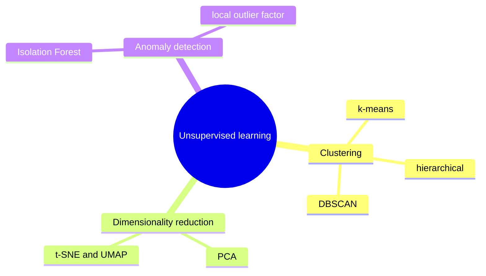
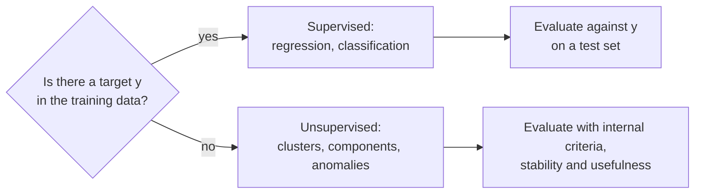
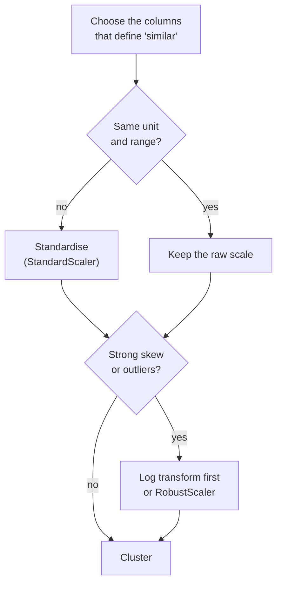
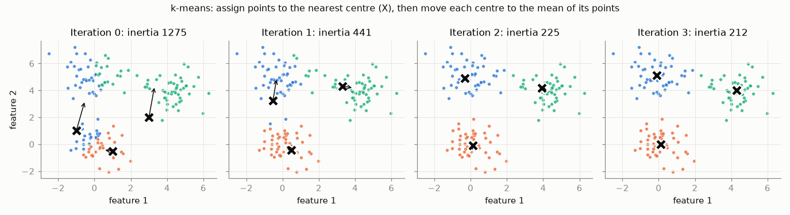
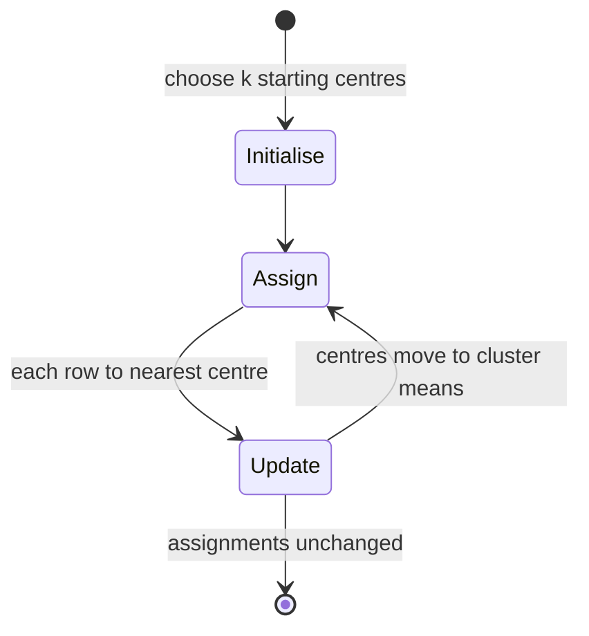
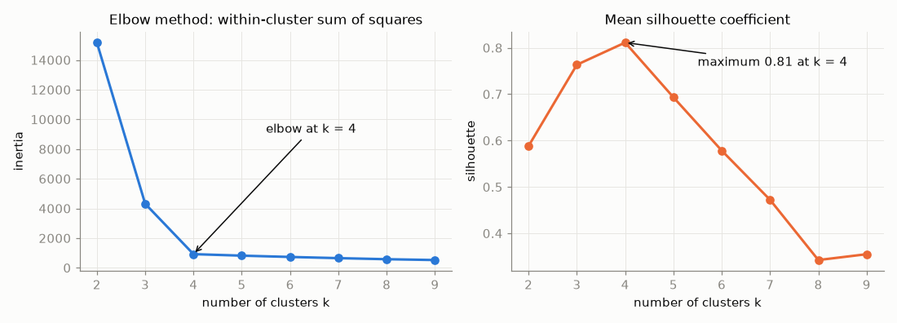

# Clustering and k-means

Until now every model in the course had a target: a rating, a churn flag, a sentiment class. This page starts the part of machine learning that works without one. It explains what unsupervised learning can and cannot deliver, why distances and scaling decide the result, how k-means works (computed by hand on six numbers) and how to choose the number of clusters with the elbow method and the silhouette coefficient. The running example is the Telco customer data of Sessions 6 and 8, now used without the churn label.

The code blocks on this page build on each other; run them in order from the repository root.



## Supervised and unsupervised learning

### Concept

In **supervised learning** each training row has inputs X and a known answer y (the **target** or **label**). The model learns a function from X to y, and we can measure how often it is right on new data. In **unsupervised learning** there is only X. The task is to describe structure in X: groups of similar rows (**clustering**), a few directions that summarise many columns (**dimensionality reduction**), or rows that do not fit the rest (**anomaly detection**).

A small example. A table of 7,032 Telco customers has the columns tenure (months as a customer), monthly charges and total charges, plus the column Churn (Yes/No).

- Supervised question: "Will this customer churn?" The model uses Churn as y and can be scored with accuracy or ROC AUC.
- Unsupervised question: "Which kinds of customers do we have?" The method sees only the three numeric columns. Churn can be used *afterwards* to describe the groups, but not to build them.

The difficulty is evaluation. Without y there is no "correct" grouping to compare with. Two analysts can produce two different segmentations, and both can be reasonable. Evaluation therefore uses three kinds of evidence:

1. **Internal criteria**: numbers computed from X and the clusters alone, such as the within-cluster sum of squares or the silhouette coefficient (below).
2. **Stability**: does the result stay the same on a different sample or with a different random start? (page 2)
3. **Usefulness**: can a person interpret the groups, and do they help a decision or a later model? (pages 2 and 4)



### Why it matters

Most data in organisations have no labels: customer records, sensor readings, documents. Labelling costs time and money. Unsupervised methods give a first structure (segments, a map of the data, a list of suspicious rows) that people can then inspect, name and act on. They are also used inside supervised pipelines, for example as extra features (page 4).

### How it works in Python

```python
import numpy as np
import pandas as pd
from sklearn.cluster import KMeans
from sklearn.metrics import silhouette_score
from sklearn.preprocessing import StandardScaler

url = ("https://raw.githubusercontent.com/IBM/telco-customer-churn-on-icp4d/"
       "master/data/Telco-Customer-Churn.csv")
telco = pd.read_csv(url)
telco["TotalCharges"] = pd.to_numeric(telco["TotalCharges"], errors="coerce")  # 11 blanks -> NaN
telco = telco.dropna(subset=["TotalCharges"])

X = telco[["tenure", "MonthlyCharges", "TotalCharges"]]   # the only input of the clustering
churn = telco["Churn"]                                     # kept aside to describe the clusters later
print(X.shape)                                             # (7032, 3)
print(X.describe().loc[["mean", "std"]].round(1))
#       tenure  MonthlyCharges  TotalCharges
# mean    32.4            64.8        2283.3
# std     24.5            30.1        2266.8
```

Note the API difference to supervised learning: `KMeans().fit(X)` takes no y.

### In practice

- **Cancer subtypes.** Perou et al. (2000, *Nature*) clustered gene-expression profiles of breast tumours without using outcomes and found subtypes (luminal, basal-like, HER2-enriched) that were later shown to differ in survival. The clinical value was established afterwards, with labelled data.
- **Geodemographic classification.** The UK Office for National Statistics publishes the Output Area Classification, which groups small areas into "supergroups" by census variables with k-means. Local authorities use it to target services.
- **Population structure.** Novembre et al. (2008, *Nature*) showed that the first two principal components of genetic data from Europeans reproduce the map of Europe, with no geographic labels in the input.

> [!WARNING]
> **A clustering always returns clusters.** k-means with k = 4 returns four groups even for uniform random noise. The algorithm does not tell you whether the groups exist; your evaluation must.

> [!CAUTION]
> **Do not cluster on the target.** If churn is part of X, the "segments" partly reproduce churn and look more useful than they are. Keep the label out of the clustering and use it only to describe the result.

## Distance, similarity and scaling

### Concept

Clustering groups rows that are "close". Closeness is measured by a **distance** (small = similar) or a **similarity** (large = similar).

- **Euclidean distance** between rows a and b with p columns: d(a, b) = √((a₁ − b₁)² + … + (aₚ − bₚ)²). It is the straight-line distance and the default of k-means.
- **Manhattan distance**: |a₁ − b₁| + … + |aₚ − bₚ|, the distance along a city grid. It is less dominated by one large difference.
- **Cosine similarity**: cos θ = (a · b) / (‖a‖ ‖b‖), the angle between two vectors, ignoring their length. It is used for text vectors (Sessions 13 and 14), where a long and a short document on the same topic should be similar.

Worked example with two columns, tenure (months) and total charges (dollars):

| Customer | tenure | total charges |
|---|---|---|
| A | 2 | 150 |
| B | 70 | 150 |
| C | 2 | 1,150 |

On the raw scale d(A, B) = √(68² + 0²) = 68 and d(A, C) = √(0² + 1000²) = 1,000. A is "closer" to B, although B has been a customer 35 times longer. The dollar column dominates because its numbers are larger. After **standardising** each column to mean 0 and standard deviation 1 (dividing tenure by its SD of 24.5 and total charges by 2,266.8), the distances become 68/24.5 = 2.78 and 1000/2266.8 = 0.44: now A is closer to C.



### Why it matters

Every distance-based method (k-means, hierarchical clustering, DBSCAN, k-nearest neighbours, PCA) inherits the scale of the columns. Without scaling, the column with the largest numbers decides the clusters, regardless of its importance. The choice of columns matters just as much: adding ten columns about phone services makes "similar" mean "similar in phone services".

### How it works in Python

```python
# k-means on the raw columns: total charges (range 19-8,685) dominates
raw = KMeans(n_clusters=3, n_init=10, random_state=0).fit(X)
print(X.groupby(raw.labels_).mean().round(0))
#    tenure  MonthlyCharges  TotalCharges
# 0    18.0            50.0         686.0
# 1    64.0            98.0        6293.0
# 2    44.0            78.0        3273.0     <- three bands of total charges

# k-means on standardised columns: all three columns count equally
Z = StandardScaler().fit_transform(X)
scaled = KMeans(n_clusters=3, n_init=10, random_state=0).fit(Z)
print(pd.Series(scaled.labels_).value_counts().sort_index().to_dict())
# {0: 2200, 1: 2147, 2: 2685}
```

### In practice

- **Customer analytics.** Retail and telecom segmentations typically standardise or log-transform spending variables before clustering, because spending is right-skewed.
- **Text and recommendation.** Search engines and recommender systems compare documents or users with cosine similarity, so that the length of a document or the activity of a user does not dominate.
- **Gene expression.** Eisen et al. (1998, *PNAS*) clustered genes with a correlation-based similarity, which compares the shape of expression profiles rather than their level.

> [!WARNING]
> **Scaling is a modelling decision, not a formality.** Standardising gives every column the same weight. If one column should matter more, weight it explicitly, and write the choice down.

> [!TIP]
> One-hot encoded categories (0/1 columns) and standardised numeric columns are on different scales too. For mixed data, try a small number of numeric columns first, or look up Gower distance and the k-prototypes algorithm, which are designed for mixed data.

## k-means computed by hand

### Concept

**k-means** splits n rows into k clusters. Each cluster has a **centre** (the **centroid**, the mean of its rows). The algorithm (Lloyd's algorithm) repeats two steps:

1. **Assign** every row to the nearest centre.
2. **Update** every centre to the mean of the rows assigned to it.

It stops when the assignments no longer change. The quantity that k-means makes smaller in each step is the **inertia** or **within-cluster sum of squares** (WCSS): the sum of squared distances of the rows to their own centre.

Worked example in one dimension: the six values 1, 2, 3, 8, 9, 15 with k = 2 and the (poor) starting centres c₁ = 1 and c₂ = 2.

| Iteration | Assignment | New centres |
|---|---|---|
| 1 | {1} to c₁; {2, 3, 8, 9, 15} to c₂ | c₁ = 1, c₂ = (2 + 3 + 8 + 9 + 15) / 5 = 7.4 |
| 2 | 2 is now closer to 1 than to 7.4, and 3 too: {1, 2, 3} and {8, 9, 15} | c₁ = 2, c₂ = 32 / 3 ≈ 10.67 |
| 3 | 8 is 6 from c₁ and 2.67 from c₂: assignments unchanged | stop |

Inertia at the end: (1 − 2)² + (2 − 2)² + (3 − 2)² = 2 for the first cluster and (8 − 10.67)² + (9 − 10.67)² + (15 − 10.67)² ≈ 28.67 for the second, 30.67 in total.





### Why it matters

Computing the steps once by hand shows what k-means assumes. It uses means, so outliers pull centres. It uses Euclidean distance to one centre, so it prefers round clusters of similar size. And it depends on the start: Lloyd's algorithm only finds a **local** minimum of the inertia. scikit-learn therefore uses a careful start (**k-means++**, which spreads the first centres apart) and repeats the whole algorithm `n_init` times, keeping the best run.

### How it works in Python

```python
x = np.array([1, 2, 3, 8, 9, 15], dtype=float)
centres = np.array([1.0, 2.0])                       # deliberately poor start
for it in range(1, 10):
    labels = np.argmin(np.abs(x[:, None] - centres), axis=1)    # step 1: assign
    new = np.array([x[labels == k].mean() for k in range(2)])   # step 2: update
    print(it, labels, new.round(2))
    if np.allclose(new, centres):
        break
    centres = new
# 1 [0 1 1 1 1 1] [1.  7.4]
# 2 [0 0 0 1 1 1] [ 2.   10.67]
# 3 [0 0 0 1 1 1] [ 2.   10.67]
inertia = ((x - centres[labels]) ** 2).sum()
print(round(inertia, 2))                              # 30.67

km = KMeans(n_clusters=2, n_init=10, random_state=0).fit(x.reshape(-1, 1))
print(km.cluster_centers_.ravel().round(2), round(km.inertia_, 2))   # [10.67  2.  ] 30.67
```

The order of the two centres in scikit-learn's output may differ; cluster numbers are arbitrary names.

### In practice

- **Colour quantisation.** Image software reduces an image to, for example, 16 colours by clustering the pixel colours with k-means and replacing each pixel by its centroid (workbook 01 shows this).
- **Vector quantisation in signal coding.** The Linde–Buzo–Gray algorithm (1980), a k-means variant, built codebooks for speech compression.
- **Geodemographics.** The ONS Output Area Classification mentioned above is a k-means clustering of standardised census variables.

> [!WARNING]
> **Cluster numbers are arbitrary.** Running k-means again can swap the labels 0, 1 and 2. Never hard-code "cluster 2 is the high-value segment"; identify clusters by their profile.

> [!CAUTION]
> **k-means assumes round, similar-sized clusters.** On elongated, nested or very unequal groups it cuts in the wrong places. Workbook 02 shows four such failures; DBSCAN and hierarchical clustering (page 2) handle some of them.

## Choosing the number of clusters: elbow method and silhouette

### Concept

k must be chosen before k-means runs. Two common aids:

- **Elbow method.** Fit k-means for k = 1, 2, …, 10 and plot the inertia. It always decreases with k (with k = n every row is its own cluster and the inertia is 0). Look for the **elbow**, the k after which adding a cluster brings little reduction.
- **Silhouette coefficient.** For a row i, let a(i) be the mean distance to the other rows of its own cluster and b(i) the mean distance to the rows of the nearest other cluster. Then s(i) = (b(i) − a(i)) / max(a(i), b(i)). Values near 1 mean the row sits well inside its cluster; near 0 it lies between two clusters; below 0 it is probably in the wrong cluster. The **mean silhouette** over all rows summarises a clustering, and the k with the highest mean is a candidate.

By hand for the value 1 in the example above: a = (|1 − 2| + |1 − 3|)/2 = 1.5; b = (7 + 8 + 14)/3 ≈ 9.67; s = (9.67 − 1.5)/9.67 ≈ 0.84.



### Why it matters

The choice of k changes the story told to the business: three segments or six. Both aids give evidence, not an answer. On clean toy data the elbow and the silhouette agree; on real data the elbow is often smooth and the silhouette flat. Then k is chosen by interpretability and purpose (how many segments can the marketing team serve?), checked with stability (page 2).

### How it works in Python

```python
rows = []
for k in range(2, 9):
    km = KMeans(n_clusters=k, n_init=10, random_state=0).fit(Z)
    rows.append({"k": k, "inertia": round(km.inertia_), "silhouette": round(silhouette_score(Z, km.labels_), 3)})
print(pd.DataFrame(rows).to_string(index=False))
#  k  inertia  silhouette
#  2     9701       0.480
#  3     6177       0.452
#  4     4145       0.472
#  5     3108       0.444
#  6     2560       0.438
#  7     2177       0.433
#  8     1883       0.431
```

No sharp elbow, and the silhouette varies little between 2 and 4. Three segments are a reasonable, interpretable choice. Describe them with their means and with the churn rate, which was not used for the clustering:

```python
telco["segment"] = KMeans(n_clusters=3, n_init=10, random_state=0).fit_predict(Z)
profile = telco.groupby("segment").agg(
    customers=("tenure", "size"),
    tenure=("tenure", "mean"),
    monthly=("MonthlyCharges", "mean"),
    churn_rate=("Churn", lambda s: (s == "Yes").mean()),
    month_to_month=("Contract", lambda s: (s == "Month-to-month").mean()),
)
print(profile.round(2))
#          customers  tenure  monthly  churn_rate  month_to_month
# segment
# 0             2200   58.56    89.70        0.15            0.26
# 1             2147   29.59    26.58        0.12            0.44
# 2             2685   13.27    74.96        0.47            0.87
```

A possible reading: segment 0 are long-standing customers with high bills, segment 1 low-cost customers, segment 2 new customers with high bills, mostly on monthly contracts; almost half of them churned. Names like these are interpretations that the business must confirm.

### In practice

- **Marketing segmentations** are usually settled at a k that the organisation can act on (for example four to eight segments with a named owner each), using statistics like these as a check.
- **The silhouette plot** of Rousseeuw (1987), a bar per row sorted within clusters, is a standard diagnostic; workbook 03 reproduces it for k = 2 to 6.
- **The gap statistic** (Tibshirani, Walther and Hastie, 2001) compares the inertia with that of uniform random data and is implemented in several statistics packages.

> [!WARNING]
> **The silhouette favours round, well-separated clusters.** It can prefer a wrong k when the true groups are elongated or nested, and it is computed with the same distance as k-means. Treat it as one piece of evidence.

> [!TIP]
> `silhouette_score` computes all pairwise distances. On more than about 20,000 rows pass `sample_size=10_000, random_state=0` to keep it fast.

*Practice (block 1):* segment the Telco customers with k-means and describe the segments: workbook [04-case-study-telco-segments.ipynb](../workbooks/04-case-study-telco-segments.ipynb).

## Check your understanding

1. Why is a clustering harder to evaluate than a classifier? Name three kinds of evidence you can use instead.
2. Customers A, B and C above: recompute the two distances after standardising. Why does the nearest neighbour of A change?
3. Run k-means by hand on the values 0, 1, 5, 6 with k = 2 and starting centres 0 and 1. How many iterations are needed, and what is the final inertia?
4. The inertia falls from k = 5 to k = 6. Does this mean six clusters are better? What would you check?
5. A segment has a churn rate of 47 %. Was churn used to build the segment? Why does that matter for how you report it?

## Further reading

- James, G., Witten, D., Hastie, T., Tibshirani, R. and Taylor, J. (2023). *An Introduction to Statistical Learning with Applications in Python*, Chapter 12.4 "Clustering Methods". Springer. https://www.statlearning.com/
- scikit-learn developers (2026). *User Guide: 2.3 Clustering*, section k-means. https://scikit-learn.org/stable/modules/clustering.html#k-means
- VanderPlas, J. (2016). *Python Data Science Handbook*, Chapter 5.11 "In Depth: k-Means Clustering". O'Reilly. https://jakevdp.github.io/PythonDataScienceHandbook/05.11-k-means.html
- Rousseeuw, P. J. (1987). Silhouettes: a graphical aid to the interpretation and validation of cluster analysis. *Journal of Computational and Applied Mathematics*, 20, 53–65. https://doi.org/10.1016/0377-0427(87)90125-7
