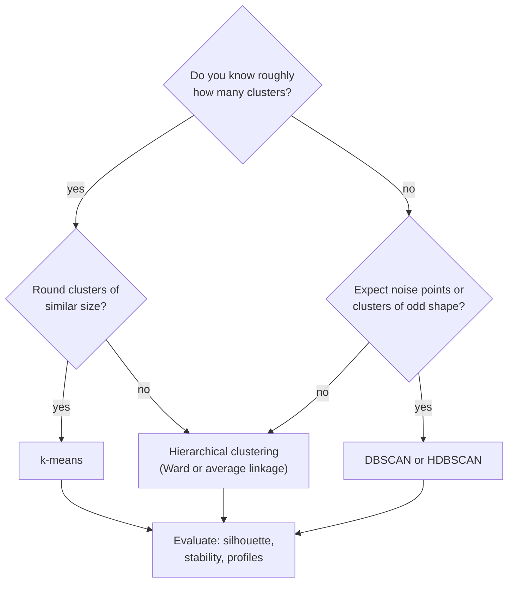
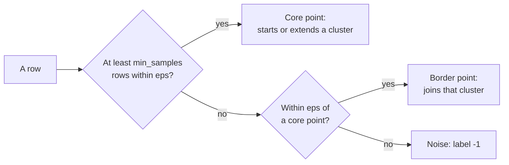

# Hierarchical clustering, DBSCAN and evaluating clusters

k-means needs the number of clusters in advance and assumes round groups. This page adds two methods with other assumptions: **hierarchical clustering**, which builds a whole tree of nested clusters and draws it as a dendrogram, and **DBSCAN**, which finds dense regions of any shape and leaves sparse points as noise. The last section asks the question that matters most in practice: is a clustering any good? It covers the silhouette coefficient for comparing methods, stability under resampling and cluster profiles for interpretation.

The running example is a table of 2,413 products of the case study, described by statistics of their reviews up to 2019 (number of reviews, mean rating, share of negative reviews, review length and so on). The code blocks build on each other; run them in order from the repository root.



```python
import numpy as np
import pandas as pd
from scipy.cluster.hierarchy import fcluster, linkage
from sklearn.cluster import DBSCAN, AgglomerativeClustering, KMeans
from sklearn.metrics import adjusted_rand_score, silhouette_score
from sklearn.neighbors import NearestNeighbors
from sklearn.preprocessing import StandardScaler

pd.set_option("display.width", 120)
pd.set_option("display.max_columns", 20)
cols = ["parent_asin", "rating", "helpful_vote", "verified_purchase", "n_images", "text", "date"]
reviews = pd.read_parquet("case-study/data/train.parquet", columns=cols)
early = reviews[reviews["date"] < "2020-01-01"].assign(      # keep 2020-2021 for testing (page 4)
    length=lambda d: d["text"].str.len(),
    negative=lambda d: d["rating"] <= 2,
    has_image=lambda d: d["n_images"] > 0,
)
products = early.groupby("parent_asin").agg(
    n_reviews=("rating", "size"), mean_rating=("rating", "mean"), sd_rating=("rating", "std"),
    share_negative=("negative", "mean"), share_verified=("verified_purchase", "mean"),
    mean_helpful=("helpful_vote", "mean"), median_length=("length", "median"),
    share_images=("has_image", "mean"), first=("date", "min"), last=("date", "max"),
)
products["years_active"] = (products["last"] - products["first"]).dt.days / 365.25
products = products.drop(columns=["first", "last"]).query("n_reviews >= 20")

features = products.copy()
for col in ["n_reviews", "mean_helpful", "median_length"]:   # right-skewed counts: log first
    features[col] = np.log1p(features[col])
Z = StandardScaler().fit_transform(features)
print(Z.shape)                                                # (2413, 9)
```

## Hierarchical clustering and dendrograms

### Concept

**Agglomerative hierarchical clustering** starts with every row as its own cluster and repeatedly merges the two closest clusters until one cluster is left. The result is a tree. A **dendrogram** draws it: the leaves are the rows, each merge is a horizontal bar, and its height is the distance at which the two clusters were joined. Cutting the tree with a horizontal line at some height gives a flat clustering; the number of vertical lines the cut crosses is the number of clusters.

How far apart are two *clusters*? The **linkage** decides:

- **single**: the distance of the closest pair of rows (one from each cluster); can form long chains;
- **complete**: the distance of the farthest pair; gives compact clusters;
- **average**: the mean of all pairwise distances;
- **Ward**: the merge that increases the within-cluster sum of squares least; similar in spirit to k-means and the usual default.

Worked example: the four values 1, 2, 5, 11.

| Step | Single linkage | Complete linkage |
|---|---|---|
| 1 | merge {1} and {2} at 1 | merge {1} and {2} at 1 |
| 2 | d({1, 2}, 5) = 3 (from 2), d(5, 11) = 6: merge {1, 2, 5} at 3 | d({1, 2}, 5) = 4 (from 1), d(5, 11) = 6: merge {1, 2, 5} at 4 |
| 3 | d({1, 2, 5}, 11) = 6: merge all at 6 | d({1, 2, 5}, 11) = 10: merge all at 10 |

The trees have the same shape here but different heights. Cutting the complete-linkage tree between 4 and 10 gives two clusters, {1, 2, 5} and {11}.


### Why it matters

The dendrogram shows structure at every level at once: a few large groups that split into subgroups. One does not have to fix k in advance; long vertical branches (a large gap between merge heights) suggest a natural number of clusters. Hierarchies are also meaningful in themselves: product categories, biological taxonomies, organisational units.

### How it works in Python

```python
# the worked example
tiny = np.array([[1.0], [2.0], [5.0], [11.0]])
print(linkage(tiny, method="single")[:, 2])      # [1. 3. 6.]   merge heights
print(linkage(tiny, method="complete")[:, 2])    # [ 1.  4. 10.]

# the products: Ward linkage, cut into four clusters
Z_ward = linkage(Z, method="ward")
ward_labels = fcluster(Z_ward, t=4, criterion="maxclust")       # labels 1..4
print(pd.Series(ward_labels).value_counts().sort_index().to_dict())
# {1: 834, 2: 690, 3: 689, 4: 200}

# the same with scikit-learn (labels 0..3, same partition)
agg = AgglomerativeClustering(n_clusters=4, linkage="ward").fit(Z)
print(adjusted_rand_score(ward_labels, agg.labels_))            # 1.0

# draw the top of the tree (scipy.cluster.hierarchy.dendrogram):
# dendrogram(Z_ward, truncate_mode="lastp", p=20)
```

The **adjusted Rand index** (ARI) used above compares two partitions of the same rows: 1 means identical (whatever the label numbers), about 0 means no more agreement than chance.

### In practice

- **Gene-expression heat maps.** Eisen et al. (1998, *PNAS*) introduced the clustered heat map with dendrograms on both axes; it remains the standard figure in genomics.
- **Phylogenetics.** Average linkage (UPGMA) is a classical method for building trees of species from genetic distances.
- **Document and product taxonomies.** Hierarchical clustering of product descriptions or support tickets proposes a first category tree that people then edit.

> [!WARNING]
> **Hierarchical clustering does not scale to large n.** It needs all pairwise distances: memory grows with n². Up to about 10,000–20,000 rows it is fine; beyond, cluster a sample or use k-means first.

> [!CAUTION]
> **Single linkage chains.** One row lying between two groups can join them. Workbook 06 compares the four linkages on six toy datasets.

## Density-based clustering: DBSCAN

### Concept

**DBSCAN** (Density-Based Spatial Clustering of Applications with Noise; Ester et al., 1996) defines clusters as dense regions. It has two parameters: a radius **eps** and a count **min_samples**.

- A **core point** has at least min_samples rows (itself included) within distance eps.
- A **border point** is within eps of a core point but is not core itself.
- A **noise point** is neither; DBSCAN gives it the label −1.

Clusters grow by connecting core points that lie within eps of each other, plus their border points. The number of clusters is a result, not an input.

Worked example: the values 1, 2, 3, 7, 12, 13, 14 with eps = 1.5 and min_samples = 3.

| Value | Rows within 1.5 (incl. itself) | Type |
|---|---|---|
| 2 | 1, 2, 3 | core |
| 1, 3 | two each | border (next to 2) |
| 13 | 12, 13, 14 | core |
| 12, 14 | two each | border (next to 13) |
| 7 | only itself | noise |

Result: two clusters, {1, 2, 3} and {12, 13, 14}, and one noise point, 7.



### Why it matters

DBSCAN finds clusters of any shape (rings, bands) and does not force every row into a cluster. That makes it useful when outliers are expected. Its weakness is one global eps: when clusters differ strongly in density, no single eps fits all. **HDBSCAN** (in scikit-learn since version 1.3) varies the density level and needs only a minimum cluster size (workbook 08).

### How it works in Python

```python
# the worked example
values = np.array([1, 2, 3, 7, 12, 13, 14], dtype=float).reshape(-1, 1)
print(DBSCAN(eps=1.5, min_samples=3).fit(values).labels_)     # [ 0  0  0 -1  1  1  1]

# choosing eps: distance of each product to its 10th nearest neighbour (the k-distance)
dist, _ = NearestNeighbors(n_neighbors=10).fit(Z).kneighbors(Z)
print(np.quantile(dist[:, -1], [0.5, 0.9, 0.95, 0.99]).round(2))   # [1.24 1.98 2.32 3.46]

for eps in (1.0, 1.5, 2.0):
    labels = DBSCAN(eps=eps, min_samples=10).fit(Z).labels_
    print(eps, pd.Series(labels).value_counts().to_dict())
# 1.0 {-1: 1424, 0: 964, 1: 11, 3: 9, 2: 5}
# 1.5 {0: 2060, -1: 353}
# 2.0 {0: 2330, -1: 83}
```

On the products DBSCAN finds one dense core and a fringe of unusual products, not several segments. This is a finding: the product statistics form one continuous cloud, without gaps. The noise points are candidates for the anomaly detection of page 4.

### In practice

- **Spatial data.** DBSCAN was designed for spatial databases; it is used to find hot spots in GPS points, for example stops in vehicle trajectories or clusters of reported incidents on a map.
- **Astronomy.** Density-based methods (including HDBSCAN) are used to find star clusters and stellar streams in the Gaia catalogue of the European Space Agency.
- **Recognition.** The DBSCAN paper received the SIGKDD Test of Time Award in 2014.

> [!WARNING]
> **eps depends on the scale and the number of columns.** Always scale first, and choose eps from the k-distance quantiles (or a k-distance plot: sorted distances, look for the bend), not by guessing.

> [!TIP]
> In many dimensions distances become similar to each other, and density is hard to estimate. Reduce to a few principal components first (page 3) when you have more than about ten columns.

## Evaluating and interpreting clusters

### Concept

Without a target, a clustering is judged on three questions.

1. **Separation (internal criteria).** Are rows closer to their own cluster than to others? The mean **silhouette** (page 1) compares methods and values of k on the same data. A value above about 0.5 indicates clear structure; values around 0.2 indicate weak, overlapping groups (rules of thumb, Kaufman and Rousseeuw, 1990).
2. **Stability.** Would a slightly different sample give the same clusters? Draw bootstrap samples (rows drawn with replacement), refit, predict the cluster of every original row and compare the partitions with the ARI. Stable clusters have ARI close to 1.
3. **Interpretation (cluster profiles).** A **profile** is a table of means (or medians) of each feature per cluster, ideally on the original scale, plus the size of each cluster and variables not used in the clustering. If no one can describe a cluster in one sentence, it will not be used.

### Why it matters

A segmentation that changes with the random seed, or that only splits a continuous cloud at arbitrary points, should not drive decisions. Reporting silhouette, stability and profiles together lets a reader judge how much structure there really is.

### How it works in Python

```python
km = KMeans(n_clusters=4, n_init=10, random_state=0).fit(Z)
print(round(silhouette_score(Z, km.labels_), 3))          # 0.194   k-means
print(round(silhouette_score(Z, agg.labels_), 3))         # 0.138   Ward
print(round(adjusted_rand_score(km.labels_, agg.labels_), 2))   # 0.49: the methods partly agree

# stability: refit on bootstrap samples, compare with the first fit
rng = np.random.default_rng(0)
aris = []
for seed in range(10):
    idx = rng.choice(len(Z), size=len(Z), replace=True)
    boot = KMeans(n_clusters=4, n_init=10, random_state=seed).fit(Z[idx])
    aris.append(adjusted_rand_score(km.labels_, boot.predict(Z)))
print(np.round([min(aris), np.median(aris)], 2))           # [0.79 0.88]  fairly stable

# profile on the original scale
products["cluster"] = km.labels_
print(products.groupby("cluster")[["n_reviews", "mean_rating", "share_negative",
                                   "median_length", "years_active"]].mean().round(2)
      .assign(size=products["cluster"].value_counts().sort_index()))
#          n_reviews  mean_rating  share_negative  median_length  years_active  size
# cluster
# 0            45.52         4.46            0.08          91.17          3.01   929
# 1            55.20         4.21            0.14         181.54          2.22   283
# 2            43.63         3.34            0.36         109.88          2.46   699
# 3           180.68         4.13            0.16         143.03          6.49   502
```

Reading: a silhouette of 0.19 means weak separation, but the partition is fairly stable under resampling. The profiles are interpretable: well-rated products (0), products with long reviews (1), poorly rated products with many negative reviews (2) and established products with many reviews over many years (3). Such clusters are a useful *summary* of a continuous cloud, not natural kinds.

### In practice

- **Market research.** Commercial segmentations are typically validated by checking that segments differ on variables not used to build them (purchase behaviour, survey answers) and that they can be reproduced in a new survey wave.
- **Clinical research.** Data-driven patient subgroups, for example the five adult-onset diabetes clusters of Ahlqvist et al. (2018, *The Lancet Diabetes & Endocrinology*), were replicated in independent cohorts before being discussed as clinically relevant.
- **Benchmarks with known labels.** On data with known classes, the ARI between clusters and classes is used to compare clustering algorithms (workbook 09 shows the visual version).

> [!WARNING]
> **Do not compare silhouettes across different feature sets or scalings.** The silhouette depends on the distance; it is only comparable for different clusterings of the same matrix.

> [!CAUTION]
> **Profiles on standardised data hide the units.** "Cluster 2 has a mean rating of −1.2" means nothing to a product manager. Report profiles on the original scale and add the cluster size.

*Practice (block 2):* compare k-means, hierarchical clustering and DBSCAN on the product features: part A of workbook [24-case-study-product-clusters.ipynb](../workbooks/24-case-study-product-clusters.ipynb).

## Check your understanding

1. Build the single-linkage and complete-linkage trees for the values 0, 3, 4, 10 by hand. Where would you cut to get two clusters?
2. In the DBSCAN example, what happens with eps = 1.5 and min_samples = 4? And with eps = 5 and min_samples = 3?
3. DBSCAN on the products returns one cluster and 353 noise points. Is this a failure of DBSCAN? What does it tell you about the data?
4. A clustering has silhouette 0.19 and bootstrap ARI 0.86. Write two sentences for a report that describe what these numbers mean.
5. Why should a cluster profile include a variable that was not used to build the clusters?

## Further reading

- James, G., Witten, D., Hastie, T., Tibshirani, R. and Taylor, J. (2023). *An Introduction to Statistical Learning with Applications in Python*, Chapter 12.4.2 "Hierarchical Clustering". Springer. https://www.statlearning.com/
- Ester, M., Kriegel, H.-P., Sander, J. and Xu, X. (1996). A density-based algorithm for discovering clusters in large spatial databases with noise. *Proceedings of KDD-96*, 226–231. https://cdn.aaai.org/KDD/1996/KDD96-037.pdf
- scikit-learn developers (2026). *User Guide: 2.3 Clustering*, sections on hierarchical clustering, DBSCAN, HDBSCAN and clustering performance evaluation. https://scikit-learn.org/stable/modules/clustering.html
- Hennig, C. (2007). Cluster-wise assessment of cluster stability. *Computational Statistics & Data Analysis*, 52(1), 258–271. https://doi.org/10.1016/j.csda.2006.11.025
