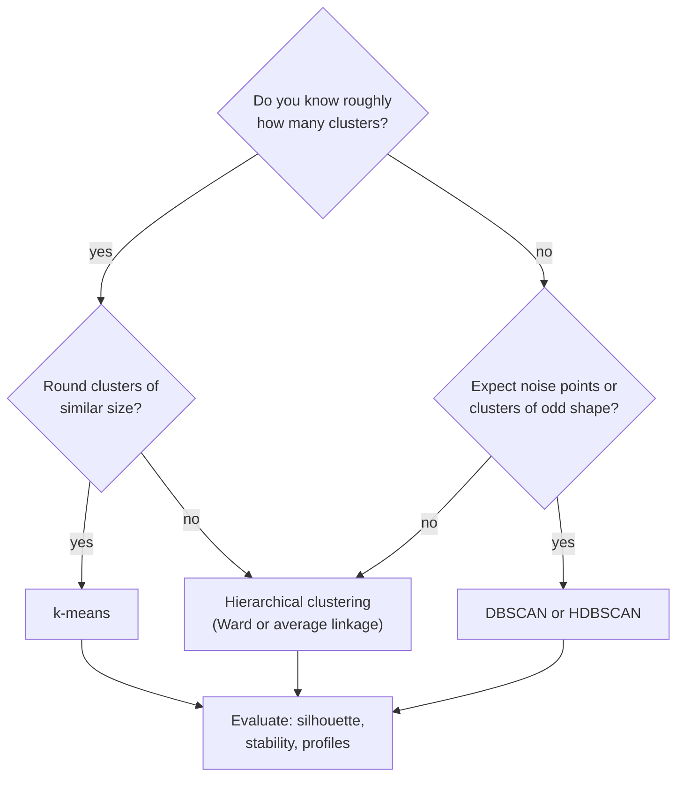
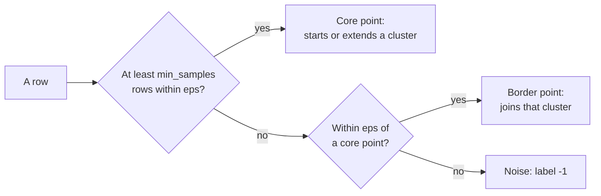

# Hierarchical clustering, DBSCAN and evaluating clusters

k-means needs the number of clusters in advance and assumes round groups. This page adds two methods with other assumptions: **hierarchical clustering**, which builds a whole tree of nested clusters and draws it as a dendrogram, and **DBSCAN**, which finds dense regions of any shape and leaves sparse points as noise. The last section asks the question that matters most in practice: is a clustering any good? It covers the silhouette coefficient for comparing methods, stability under resampling and cluster profiles for interpretation.

The running example are the Berlin listings of Inside Airbnb (snapshot of 26 June 2026; prepare the data with `uv run python case-study/prepare_airbnb.py`). The practical question: **what kinds of Airbnb offers exist in Berlin?** A city office that enforces the rules on short-term rentals, a tourism board or a new host would like a handful of types rather than 12,776 single listings. We use the 8,439 listings with a price and describe each by six numbers: the nightly price, the number of guests, the minimum number of nights, the number of nights bookable in the next year, the reviews of the last twelve months (a sign of recent activity) and the distance to Alexanderplatz. Price, minimum nights and reviews are strongly skewed, so they enter on the log scale (Session 4); then every column is standardised (page 1). Room type, district and host are left out of the clustering and used afterwards to describe the clusters. The code blocks build on each other; run them in order from the repository root.



```python
import numpy as np
import pandas as pd
from scipy.cluster.hierarchy import fcluster, linkage
from sklearn.cluster import DBSCAN, AgglomerativeClustering, KMeans
from sklearn.metrics import adjusted_rand_score, silhouette_score
from sklearn.neighbors import NearestNeighbors
from sklearn.preprocessing import StandardScaler

pd.set_option("display.width", 150)
pd.set_option("display.max_columns", 12)
listings = pd.read_parquet("case-study/data/airbnb/listings.parquet")
d = listings.dropna(subset=["price", "minimum_nights"]).reset_index(drop=True)   # 34 % have no price
lat0, lon0 = 52.5219, 13.4132                                   # Alexanderplatz
d["north_km"] = (d["latitude"] - lat0) * 111.2                  # degrees -> km (good enough within a city)
d["east_km"] = (d["longitude"] - lon0) * 111.2 * np.cos(np.radians(lat0))
d["km_centre"] = np.hypot(d["north_km"], d["east_km"])

features = pd.DataFrame({
    "log_price": np.log(d["price"]),                  # skewed: log first (Session 4)
    "guests": d["accommodates"],
    "log_min_nights": np.log(d["minimum_nights"]),
    "availability_365": d["availability_365"],        # nights bookable in the next year
    "log_reviews_ltm": np.log1p(d["number_of_reviews_ltm"]),   # reviews in the last 12 months
    "km_centre": d["km_centre"],
})
Z = StandardScaler().fit_transform(features)
print(Z.shape)                                        # (8439, 6)
```

> [!NOTE]
> **Ethics.** Inside Airbnb scrapes public listing pages. Describe clusters in aggregate (sizes, medians, shares) and never single out or name hosts.

## Hierarchical clustering and dendrograms

### Concept

**Agglomerative hierarchical clustering** starts with every row as its own cluster and repeatedly merges the two closest clusters until one cluster is left. The result is a tree. A **dendrogram** draws it: the leaves are the rows, each merge is a horizontal bar, and its height is the distance at which the two clusters were joined. Cutting the tree with a horizontal line at some height gives a flat clustering; the number of vertical lines the cut crosses is the number of clusters.

How far apart are two *clusters*? The **linkage** decides:

- **single**: the distance of the closest pair of rows (one from each cluster); can form long chains;
- **complete**: the distance of the farthest pair; gives compact clusters;
- **average**: the mean of all pairwise distances;
- **Ward**: the merge that increases the within-cluster sum of squares least; similar in spirit to k-means and the usual default.

Worked example: the four values 1, 2, 5, 11.

| Step | Single linkage | Complete linkage |
|---|---|---|
| 1 | merge {1} and {2} at 1 | merge {1} and {2} at 1 |
| 2 | d({1, 2}, 5) = 3 (from 2), d(5, 11) = 6: merge {1, 2, 5} at 3 | d({1, 2}, 5) = 4 (from 1), d(5, 11) = 6: merge {1, 2, 5} at 4 |
| 3 | d({1, 2, 5}, 11) = 6: merge all at 6 | d({1, 2, 5}, 11) = 10: merge all at 10 |

The trees have the same shape here but different heights. Cutting the complete-linkage tree between 4 and 10 gives two clusters, {1, 2, 5} and {11}.


### Why it matters

The dendrogram shows structure at every level at once: a few large groups that split into subgroups. One does not have to fix k in advance; long vertical branches (a large gap between merge heights) suggest a natural number of clusters. Hierarchies are also meaningful in themselves: product categories, biological taxonomies, organisational units, and the HS nomenclature of the main case study (sections, chapters, headings, subheadings).

### How it works in Python

```python
# the worked example
tiny = np.array([[1.0], [2.0], [5.0], [11.0]])
print(linkage(tiny, method="single")[:, 2])      # [1. 3. 6.]   merge heights
print(linkage(tiny, method="complete")[:, 2])    # [ 1.  4. 10.]

# the listings: Ward linkage on a random sample of 2,000 (memory grows with n squared)
rng = np.random.default_rng(0)
idx = rng.choice(len(Z), size=2000, replace=False)
Zs = Z[idx]
Z_ward = linkage(Zs, method="ward")
print(Z_ward[-5:, 2].round(1))                                  # [31.9 40.7 42.5 47.8 86.6]  last merge heights
ward_labels = fcluster(Z_ward, t=5, criterion="maxclust")       # labels 1..5
print(pd.Series(ward_labels).value_counts().sort_index().to_dict())
# {1: 377, 2: 713, 3: 179, 4: 141, 5: 590}

# the same with scikit-learn (labels 0..4, same partition)
agg = AgglomerativeClustering(n_clusters=5, linkage="ward").fit(Zs)
print(adjusted_rand_score(ward_labels, agg.labels_))            # 1.0

# draw the top of the tree (scipy.cluster.hierarchy.dendrogram):
# dendrogram(Z_ward, truncate_mode="lastp", p=20)
```

The last merge heights show one very large gap (from 47.8 to 86.6): at the top, the tree splits the listings into two groups that are far apart. Below that the heights grow slowly, so there is no single natural number of clusters between three and six; five is chosen here to compare with k-means below.

The **adjusted Rand index** (ARI) used above compares two partitions of the same rows: 1 means identical (whatever the label numbers), about 0 means no more agreement than chance.

### In practice

- **Gene-expression heat maps.** Eisen et al. (1998, *PNAS*) introduced the clustered heat map with dendrograms on both axes; it remains the standard figure in genomics.
- **Phylogenetics.** Average linkage (UPGMA) is a classical method for building trees of species from genetic distances.
- **Document and product taxonomies.** Hierarchical clustering of product descriptions or support tickets proposes a first category tree that people then edit; the HS nomenclature of the main case study is such a tree, built by people.

> [!WARNING]
> **Hierarchical clustering does not scale to large n.** It needs all pairwise distances: memory grows with n². Up to about 10,000–20,000 rows it is fine; beyond, cluster a sample or use k-means first.

> [!CAUTION]
> **Single linkage chains.** One row lying between two groups can join them. Workbook 06 compares the four linkages on six toy datasets.

## Density-based clustering: DBSCAN

### Concept

**DBSCAN** (Density-Based Spatial Clustering of Applications with Noise; Ester et al., 1996) defines clusters as dense regions. It has two parameters: a radius **eps** and a count **min_samples**.

- A **core point** has at least min_samples rows (itself included) within distance eps.
- A **border point** is within eps of a core point but is not core itself.
- A **noise point** is neither; DBSCAN gives it the label −1.

Clusters grow by connecting core points that lie within eps of each other, plus their border points. The number of clusters is a result, not an input.

Worked example: the values 1, 2, 3, 7, 12, 13, 14 with eps = 1.5 and min_samples = 3.

| Value | Rows within 1.5 (incl. itself) | Type |
|---|---|---|
| 2 | 1, 2, 3 | core |
| 1, 3 | two each | border (next to 2) |
| 13 | 12, 13, 14 | core |
| 12, 14 | two each | border (next to 13) |
| 7 | only itself | noise |

Result: two clusters, {1, 2, 3} and {12, 13, 14}, and one noise point, 7.



### Why it matters

DBSCAN finds clusters of any shape (rings, bands) and does not force every row into a cluster. That makes it useful when outliers are expected. Its weakness is one global eps: when clusters differ strongly in density, no single eps fits all. **HDBSCAN** (in scikit-learn since version 1.3) varies the density level and needs only a minimum cluster size (workbook 08).

### How it works in Python

```python
# the worked example
values = np.array([1, 2, 3, 7, 12, 13, 14], dtype=float).reshape(-1, 1)
print(DBSCAN(eps=1.5, min_samples=3).fit(values).labels_)     # [ 0  0  0 -1  1  1  1]

# on the six standardised features; choose eps from the distance to the 10th neighbour (k-distance)
dist, _ = NearestNeighbors(n_neighbors=10).fit(Z).kneighbors(Z)
print(np.quantile(dist[:, -1], [0.5, 0.9, 0.99]).round(2))      # [0.57 0.91 1.46]
for eps in (0.5, 1.0):
    labels = pd.Series(DBSCAN(eps=eps, min_samples=10).fit(Z).labels_)
    print(eps, labels.nunique() - (labels == -1).any(), "clusters,", (labels == -1).sum(), "noise points")
# 0.5 11 clusters, 4091 noise points
# 1.0 1 clusters, 229 noise points

# on the map: dense areas of listings (coordinates in km, eps = 300 m)
C = d[["east_km", "north_km"]].to_numpy()
dist, _ = NearestNeighbors(n_neighbors=30).fit(C).kneighbors(C)
print(np.quantile(dist[:, -1], [0.1, 0.5, 0.9]).round(2))       # [0.18 0.34 1.6 ]  km to the 30th neighbour
spots = DBSCAN(eps=0.3, min_samples=30).fit(C).labels_
d["hot_spot"] = spots
print(len(set(spots)) - 1, "hot spots,", (spots == -1).sum(), "listings outside")   # 24 hot spots, 3499 listings outside
top = (d[d["hot_spot"] >= 0].groupby("hot_spot")
       .agg(listings=("id", "size"), area=("neighbourhood", lambda s: s.mode()[0]), median_price=("price", "median"))
       .nlargest(3, "listings"))
print(top)
#           listings                      area  median_price
# hot_spot
# 0             1703            Alexanderplatz         170.5
# 1              789      südliche Luisenstadt         129.0
# 2              585  Frankfurter Allee Süd FK         139.8
```

On the six features DBSCAN shows what kind of cloud the listings form. With a small eps it finds eleven small, dense groups (mostly listings with identical minimum nights and no recent reviews) and declares half the listings noise; with a larger eps everything joins one cluster, except 229 noise points. There are no dense blobs separated by empty space: the listings form one continuous cloud with denser and sparser regions. This is a finding, not a failure. It means that any segmentation of these listings cuts a continuum, and the 229 noise points at eps = 1.0 are the unusual listings that page 4 examines as anomalies.

On the map, DBSCAN does what it was designed for. With a radius of 300 m and at least 30 listings, it finds 24 hot spots of Airbnb listings; the largest, around Alexanderplatz and Mitte, has 1,703 listings, followed by parts of Kreuzberg (südliche Luisenstadt) and Friedrichshain. 3,499 listings lie outside any hot spot; their median distance to Alexanderplatz is 6.5 km, against 3.1 km inside. A city office could use such hot spots to decide where to check registration numbers first.

### In practice

- **Spatial data.** DBSCAN was designed for spatial databases; it is used to find hot spots in GPS points, for example stops in vehicle trajectories or clusters of reported incidents on a map, and, as above, concentrations of short-term rentals.
- **Astronomy.** Density-based methods (including HDBSCAN) are used to find star clusters and stellar streams in the Gaia catalogue of the European Space Agency.
- **Recognition.** The DBSCAN paper received the SIGKDD Test of Time Award in 2014.

> [!WARNING]
> **eps depends on the scale and the number of columns.** Always scale first, and choose eps from the k-distance quantiles (or a k-distance plot: sorted distances, look for the bend), not by guessing.

> [!TIP]
> In many dimensions distances become similar to each other, and density is hard to estimate. Reduce to a few principal components first (page 3) when you have more than about ten columns.

## Evaluating and interpreting clusters

### Concept

Without a target, a clustering is judged on three questions.

1. **Separation (internal criteria).** Are rows closer to their own cluster than to others? The mean **silhouette** (page 1) compares methods and values of k on the same data. A value above about 0.5 indicates clear structure; values around 0.2 indicate weak, overlapping groups (rules of thumb, Kaufman and Rousseeuw, 1990).
2. **Stability.** Would a slightly different sample give the same clusters? Draw bootstrap samples (rows drawn with replacement), refit, predict the cluster of every original row and compare the partitions with the ARI. Stable clusters have ARI close to 1.
3. **Interpretation (cluster profiles).** A **profile** is a table of means (or medians) of each feature per cluster, ideally on the original scale, plus the size of each cluster and variables not used in the clustering. If no one can describe a cluster in one sentence, it will not be used.

### Why it matters

A segmentation that changes with the random seed, or that only splits a continuous cloud at arbitrary points, should not drive decisions. Reporting silhouette, stability and profiles together lets a reader judge how much structure there really is.

### How it works in Python

```python
km = KMeans(n_clusters=5, n_init=10, random_state=0).fit(Z)
print(round(silhouette_score(Z, km.labels_), 3))                  # 0.29   k-means, all listings
print(round(silhouette_score(Zs, km.labels_[idx]), 3),            # 0.302  k-means on the Ward sample
      round(silhouette_score(Zs, agg.labels_), 3))                # 0.257  Ward
print(round(adjusted_rand_score(km.labels_[idx], agg.labels_), 2))   # 0.65: the methods largely agree

# stability: refit on bootstrap samples, compare with the first fit
aris = []
for seed in range(10):
    boot = rng.choice(len(Z), size=len(Z), replace=True)
    refit = KMeans(n_clusters=5, n_init=10, random_state=seed).fit(Z[boot])
    aris.append(adjusted_rand_score(km.labels_, refit.predict(Z)))
print(np.round([min(aris), np.median(aris)], 2))                   # [0.96 0.98]  very stable

# profile on the original scale, plus variables NOT used in the clustering
d["cluster"] = km.labels_
profile = d.groupby("cluster").agg(
    listings=("id", "size"), price=("price", "median"), guests=("accommodates", "median"),
    min_nights=("minimum_nights", "median"), open_days=("availability_365", "median"),
    reviews_ltm=("number_of_reviews_ltm", "median"), km_centre=("km_centre", "median"),
    entire_home=("room_type", lambda s: (s == "Entire home/apt").mean()),
    multi_host=("calculated_host_listings_count", lambda s: (s > 1).mean()),
    licence=("license", lambda s: s.notna().mean()),             # registration field filled in
)
print(profile.round(2))
#          listings   price  guests  min_nights  open_days  reviews_ltm  km_centre  entire_home  multi_host  licence
# cluster
# 0            2514  153.00     2.0         1.0      307.0         15.0       3.62         0.68        0.70     0.98
# 1            2412  136.55     2.0         2.0       63.0          8.0       4.01         0.64        0.41     0.99
# 2            1698   22.84     2.0        92.0      275.0          0.0       4.33         0.82        0.52     0.20
# 3            1037  293.00     7.0         1.0      273.0         18.0       3.72         0.95        0.81     0.99
# 4             778  119.10     3.0         2.0      257.0          4.0      13.61         0.65        0.46     0.95
outer = ["Spandau", "Marzahn - Hellersdorf", "Treptow - Köpenick", "Steglitz - Zehlendorf", "Reinickendorf"]
print(pd.crosstab(d["district"], d["cluster"], normalize="index").loc[["Mitte", "Neukölln"] + outer].round(2))
# cluster                   0     1     2     3     4
# district
# Mitte                  0.34  0.27  0.23  0.16  0.00
# Neukölln               0.22  0.42  0.18  0.09  0.10
# Spandau                0.00  0.00  0.10  0.01  0.89
# Marzahn - Hellersdorf  0.04  0.09  0.24  0.08  0.55
# Treptow - Köpenick     0.06  0.16  0.15  0.05  0.57
# Steglitz - Zehlendorf  0.05  0.08  0.28  0.06  0.53
# Reinickendorf          0.19  0.14  0.26  0.00  0.41
```

Reading: a silhouette of 0.29 means weak to moderate separation, in line with the continuous cloud that DBSCAN showed. But the partition is very stable under resampling (median ARI 0.98), Ward on a sample largely agrees with it (ARI 0.65), and every cluster can be described in one sentence:

| Cluster | Description | Evidence |
|---|---|---|
| 0 | **Year-round holiday flats**, often run by hosts with several listings | bookable 307 nights, 1-night minimum, 15 reviews a year, 70 % multi-listing hosts |
| 1 | **Occasional lets**, probably people renting out their own home now and then | bookable only 63 nights, 41 % multi-listing hosts |
| 2 | **Medium-term rentals** of three months or more | 92-night minimum, no recent reviews, a nightly price of €23, registration field filled in for only 20 % |
| 3 | **Large group flats** | 7 guests, €293 a night, 95 % entire homes |
| 4 | **Outer districts** | 13.6 km from the centre; 89 % of the Spandau listings |

Three findings deserve a remark. The district table confirms cluster 4 with variables that the clustering did not see: almost no listing in Mitte belongs to it, most listings in Spandau do. And cluster 2 reveals a data problem: a median of €23 a night for entire flats is not a short-stay price. These listings are let for months at a time, and their scraped nightly price is not comparable with the price of a holiday flat. Anyone who models "the price of an Airbnb night" (Sessions 6 and 10) should treat them separately; page 4 does so. Finally, the registration field: 95–99 % of the listings in the short-stay clusters show something in it (including placeholders, Session 4), but only 20 % of the medium-term rentals. Whether that reflects the rules for longer lets or missing registrations cannot be decided from the data; it is a question for the city office, not for the algorithm.

A clustering finds whatever dominates the distance, not necessarily what you care about. Here the six columns were chosen to describe the *offer*; adding ten amenity columns would make "similar" mean "similar equipment". The same happens with text: k-means on TF-IDF vectors of the multilingual EBTI descriptions of the main case study groups them mainly by language, because German and French descriptions share almost no words (Sessions 13 and 14 return to this).

### In practice

- **Market research.** Commercial segmentations are typically validated by checking that segments differ on variables not used to build them (purchase behaviour, survey answers) and that they can be reproduced in a new survey wave.
- **Clinical research.** Data-driven patient subgroups, for example the five adult-onset diabetes clusters of Ahlqvist et al. (2018, *The Lancet Diabetes & Endocrinology*), were replicated in independent cohorts before being discussed as clinically relevant.
- **Housing policy.** Inside Airbnb reports listings by simple rules (entire homes, high availability, hosts with several listings) to estimate how many homes are used for short-term rental rather than housing; a clustering like the one above is a data-driven check of such rules.
- **Benchmarks with known labels.** On data with known classes, the ARI between clusters and classes is used to compare clustering algorithms (workbook 09 shows the visual version).

> [!WARNING]
> **Do not compare silhouettes across different feature sets or scalings.** The silhouette depends on the distance; it is only comparable for different clusterings of the same matrix.

> [!CAUTION]
> **Profiles on transformed data hide the meaning.** "Cluster 2 has a mean of −1.2 on standardised availability" means nothing to a city official. Report profiles in terms people know (median price in euros, nights, kilometres, shares of room types and districts) and add the cluster size.

*Practice (block 2):* what kinds of Airbnb offers exist in Berlin? Compare k-means, hierarchical clustering and DBSCAN on the listings and describe the clusters by district and room type: part A of workbook [24-case-study-airbnb-listing-segments.ipynb](../workbooks/24-case-study-airbnb-listing-segments.ipynb).

## Check your understanding

1. Build the single-linkage and complete-linkage trees for the values 0, 3, 4, 10 by hand. Where would you cut to get two clusters?
2. In the DBSCAN example, what happens with eps = 1.5 and min_samples = 4? And with eps = 5 and min_samples = 3?
3. DBSCAN on the six listing features returns one cluster and 229 noise points at eps = 1.0. Is this a failure of DBSCAN? What does it tell you about the listings?
4. The listing clusters have silhouette 0.29 and median bootstrap ARI 0.98. Write two sentences for a report that describe what these numbers mean.
5. Why should a cluster profile include a variable that was not used to build the clusters? Which variables did that job here?
6. The medium-term rentals have a median nightly price of €23. What does this mean for a price model trained on all listings?

## Further reading

- James, G., Witten, D., Hastie, T., Tibshirani, R. and Taylor, J. (2023). *An Introduction to Statistical Learning with Applications in Python*, Chapter 12.4.2 "Hierarchical Clustering". Springer. https://www.statlearning.com/
- Ester, M., Kriegel, H.-P., Sander, J. and Xu, X. (1996). A density-based algorithm for discovering clusters in large spatial databases with noise. *Proceedings of KDD-96*, 226–231. https://cdn.aaai.org/KDD/1996/KDD96-037.pdf
- scikit-learn developers (2026). *User Guide: 2.3 Clustering*, sections on hierarchical clustering, DBSCAN, HDBSCAN and clustering performance evaluation. https://scikit-learn.org/stable/modules/clustering.html
- Hennig, C. (2007). Cluster-wise assessment of cluster stability. *Computational Statistics & Data Analysis*, 52(1), 258–271. https://doi.org/10.1016/j.csda.2006.11.025
