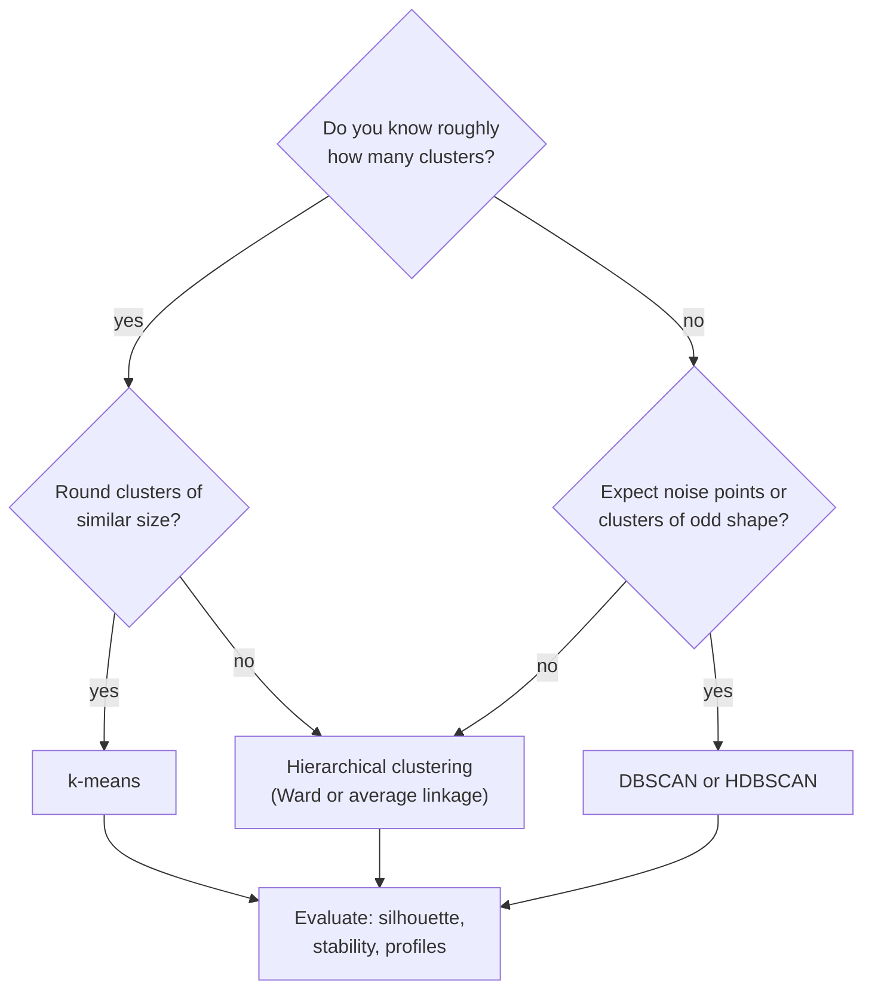
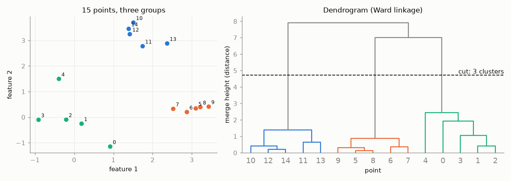
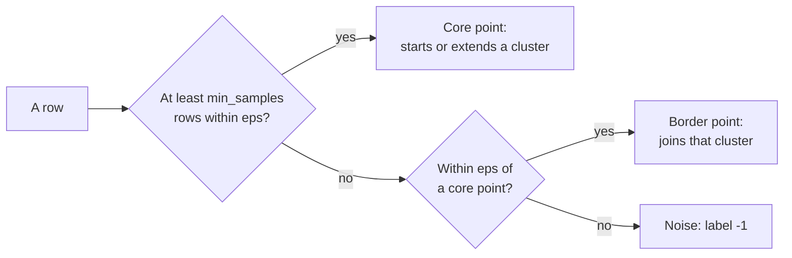

# Hierarchical clustering, DBSCAN and evaluating clusters

k-means needs the number of clusters in advance and assumes round groups. This page adds two methods with other assumptions: **hierarchical clustering**, which builds a whole tree of nested clusters and draws it as a dendrogram, and **DBSCAN**, which finds dense regions of any shape and leaves sparse points as noise. The last section asks the question that matters most in practice: is a clustering any good? It covers the silhouette coefficient for comparing methods, stability under resampling and cluster profiles for interpretation.

The running example are the 2,321 decisions of chapter 94 in the case-study sample (furniture, seats, mattresses and bedding, lamps and light fittings). Each decision is turned into 50 numbers in two ways: from its **description** (in the language of the issuing country) and from its English **keywords**, assigned by customs. In both cases the text becomes a TF-IDF matrix (Session 13), which truncated SVD (page 3) compresses to 50 components; each row is then scaled to length 1, so that Euclidean distances behave like cosine distances. Keywords are not allowed as inputs of the heading model (Session 9), but for exploring the data they are fair game. The code blocks build on each other; run them in order from the repository root.



```python
import numpy as np
import pandas as pd
from scipy.cluster.hierarchy import fcluster, linkage
from sklearn.cluster import DBSCAN, AgglomerativeClustering, KMeans
from sklearn.decomposition import TruncatedSVD
from sklearn.feature_extraction.text import TfidfVectorizer
from sklearn.metrics import adjusted_rand_score, silhouette_score
from sklearn.neighbors import NearestNeighbors
from sklearn.pipeline import make_pipeline
from sklearn.preprocessing import Normalizer

pd.set_option("display.width", 120)
sample = pd.read_parquet("case-study/data/train_sample.parquet")
furn = sample[sample["chapter"] == "94"].reset_index(drop=True)
print(len(furn), furn["heading"].value_counts().to_dict())
# 2321 {'9405': 976, '9403': 839, '9401': 285, '9404': 195, '9406': 16, '9402': 10}


def lsa():
    """50 SVD components of a TF-IDF matrix, each row scaled to length 1."""
    return make_pipeline(TruncatedSVD(50, random_state=0), Normalizer())


desc_vec = TfidfVectorizer(min_df=3, sublinear_tf=True, token_pattern=r"(?u)\b[^\W\d_]{2,}\b")
Z_desc = lsa().fit_transform(desc_vec.fit_transform(furn["description"]))
kw_vec = TfidfVectorizer(min_df=3, lowercase=False, token_pattern=None,     # one token per keyword
                         tokenizer=lambda s: [w.strip() for w in s.split(",") if w.strip()])
Z_kw = lsa().fit_transform(kw_vec.fit_transform(furn["keywords"].fillna("")))
print(Z_desc.shape, Z_kw.shape)                               # (2321, 50) (2321, 50)
```

## Hierarchical clustering and dendrograms

### Concept

**Agglomerative hierarchical clustering** starts with every row as its own cluster and repeatedly merges the two closest clusters until one cluster is left. The result is a tree. A **dendrogram** draws it: the leaves are the rows, each merge is a horizontal bar, and its height is the distance at which the two clusters were joined. Cutting the tree with a horizontal line at some height gives a flat clustering; the number of vertical lines the cut crosses is the number of clusters.

How far apart are two *clusters*? The **linkage** decides:

- **single**: the distance of the closest pair of rows (one from each cluster); can form long chains;
- **complete**: the distance of the farthest pair; gives compact clusters;
- **average**: the mean of all pairwise distances;
- **Ward**: the merge that increases the within-cluster sum of squares least; similar in spirit to k-means and the usual default.

Worked example: the four values 1, 2, 5, 11.

| Step | Single linkage | Complete linkage |
|---|---|---|
| 1 | merge {1} and {2} at 1 | merge {1} and {2} at 1 |
| 2 | d({1, 2}, 5) = 3 (from 2), d(5, 11) = 6: merge {1, 2, 5} at 3 | d({1, 2}, 5) = 4 (from 1), d(5, 11) = 6: merge {1, 2, 5} at 4 |
| 3 | d({1, 2, 5}, 11) = 6: merge all at 6 | d({1, 2, 5}, 11) = 10: merge all at 10 |

The trees have the same shape here but different heights. Cutting the complete-linkage tree between 4 and 10 gives two clusters, {1, 2, 5} and {11}.



### Why it matters

The dendrogram shows structure at every level at once: a few large groups that split into subgroups. One does not have to fix k in advance; long vertical branches (a large gap between merge heights) suggest a natural number of clusters. Hierarchies are also meaningful in themselves: product categories, biological taxonomies, organisational units, and the HS nomenclature itself (sections, chapters, headings, subheadings).

### How it works in Python

```python
# the worked example
tiny = np.array([[1.0], [2.0], [5.0], [11.0]])
print(linkage(tiny, method="single")[:, 2])      # [1. 3. 6.]   merge heights
print(linkage(tiny, method="complete")[:, 2])    # [ 1.  4. 10.]

# the decisions (keyword components): Ward linkage, cut into four clusters
Z_ward = linkage(Z_kw, method="ward")
ward_labels = fcluster(Z_ward, t=4, criterion="maxclust")       # labels 1..4
print(pd.Series(ward_labels).value_counts().sort_index().to_dict())
# {1: 452, 2: 584, 3: 192, 4: 1093}

# the same with scikit-learn (labels 0..3, same partition)
agg = AgglomerativeClustering(n_clusters=4, linkage="ward").fit(Z_kw)
print(adjusted_rand_score(ward_labels, agg.labels_))            # 1.0

# draw the top of the tree (scipy.cluster.hierarchy.dendrogram):
# dendrogram(Z_ward, truncate_mode="lastp", p=20)
```

The **adjusted Rand index** (ARI) used above compares two partitions of the same rows: 1 means identical (whatever the label numbers), about 0 means no more agreement than chance.

### In practice

- **Gene-expression heat maps.** Eisen et al. (1998, *PNAS*) introduced the clustered heat map with dendrograms on both axes; it remains the standard figure in genomics.
- **Phylogenetics.** Average linkage (UPGMA) is a classical method for building trees of species from genetic distances.
- **Document and product taxonomies.** Hierarchical clustering of product descriptions or support tickets proposes a first category tree that people then edit; the HS nomenclature is such a tree, built by people.

> [!WARNING]
> **Hierarchical clustering does not scale to large n.** It needs all pairwise distances: memory grows with n². Up to about 10,000–20,000 rows it is fine; beyond, cluster a sample or use k-means first.

> [!CAUTION]
> **Single linkage chains.** One row lying between two groups can join them. Workbook 06 compares the four linkages on six toy datasets.

## Density-based clustering: DBSCAN

### Concept

**DBSCAN** (Density-Based Spatial Clustering of Applications with Noise; Ester et al., 1996) defines clusters as dense regions. It has two parameters: a radius **eps** and a count **min_samples**.

- A **core point** has at least min_samples rows (itself included) within distance eps.
- A **border point** is within eps of a core point but is not core itself.
- A **noise point** is neither; DBSCAN gives it the label −1.

Clusters grow by connecting core points that lie within eps of each other, plus their border points. The number of clusters is a result, not an input.

Worked example: the values 1, 2, 3, 7, 12, 13, 14 with eps = 1.5 and min_samples = 3.

| Value | Rows within 1.5 (incl. itself) | Type |
|---|---|---|
| 2 | 1, 2, 3 | core |
| 1, 3 | two each | border (next to 2) |
| 13 | 12, 13, 14 | core |
| 12, 14 | two each | border (next to 13) |
| 7 | only itself | noise |

Result: two clusters, {1, 2, 3} and {12, 13, 14}, and one noise point, 7.



### Why it matters

DBSCAN finds clusters of any shape (rings, bands) and does not force every row into a cluster. That makes it useful when outliers are expected. Its weakness is one global eps: when clusters differ strongly in density, no single eps fits all. **HDBSCAN** (in scikit-learn since version 1.3) varies the density level and needs only a minimum cluster size (workbook 08).

### How it works in Python

```python
# the worked example
values = np.array([1, 2, 3, 7, 12, 13, 14], dtype=float).reshape(-1, 1)
print(DBSCAN(eps=1.5, min_samples=3).fit(values).labels_)     # [ 0  0  0 -1  1  1  1]

# choosing eps: distance of each decision to its 10th nearest neighbour (the k-distance)
dist, _ = NearestNeighbors(n_neighbors=10).fit(Z_kw).kneighbors(Z_kw)
print(np.quantile(dist[:, -1], [0.5, 0.9, 0.95, 0.99]).round(2))   # [0.64 0.83 0.86 0.94]

for eps in (0.3, 0.5):
    labels = pd.Series(DBSCAN(eps=eps, min_samples=10).fit(Z_kw).labels_)
    print(eps, labels.nunique() - 1, "clusters,", (labels == -1).sum(), "noise points")
# 0.3 17 clusters, 2009 noise points
# 0.5 32 clusters, 1412 noise points
```

On the keyword components DBSCAN finds many small, very dense groups and declares most decisions noise. The dense groups are decisions with (almost) identical keyword lists, for example dozens of "LED, LIGHT FITTINGS, OF PLASTICS" decisions; between them the density is low everywhere. This is a finding, not a failure: the data are a few broad product types with many fine variants, not a handful of dense blobs. With one global eps, DBSCAN cannot see both levels; HDBSCAN (workbook 08) or k-means and Ward suit this data better.

### In practice

- **Spatial data.** DBSCAN was designed for spatial databases; it is used to find hot spots in GPS points, for example stops in vehicle trajectories or clusters of reported incidents on a map.
- **Astronomy.** Density-based methods (including HDBSCAN) are used to find star clusters and stellar streams in the Gaia catalogue of the European Space Agency.
- **Recognition.** The DBSCAN paper received the SIGKDD Test of Time Award in 2014.

> [!WARNING]
> **eps depends on the scale and the number of columns.** Always scale first, and choose eps from the k-distance quantiles (or a k-distance plot: sorted distances, look for the bend), not by guessing.

> [!TIP]
> In many dimensions distances become similar to each other, and density is hard to estimate. Reduce to a few principal components first (page 3) when you have more than about ten columns.

## Evaluating and interpreting clusters

### Concept

Without a target, a clustering is judged on three questions.

1. **Separation (internal criteria).** Are rows closer to their own cluster than to others? The mean **silhouette** (page 1) compares methods and values of k on the same data. A value above about 0.5 indicates clear structure; values around 0.2 indicate weak, overlapping groups (rules of thumb, Kaufman and Rousseeuw, 1990).
2. **Stability.** Would a slightly different sample give the same clusters? Draw bootstrap samples (rows drawn with replacement), refit, predict the cluster of every original row and compare the partitions with the ARI. Stable clusters have ARI close to 1.
3. **Interpretation (cluster profiles).** A **profile** is a table of means (or medians) of each feature per cluster, ideally on the original scale, plus the size of each cluster and variables not used in the clustering. If no one can describe a cluster in one sentence, it will not be used.

### Why it matters

A segmentation that changes with the random seed, or that only splits a continuous cloud at arbitrary points, should not drive decisions. Reporting silhouette, stability and profiles together lets a reader judge how much structure there really is.

### How it works in Python

```python
km = KMeans(n_clusters=4, n_init=10, random_state=0).fit(Z_kw)
print(round(silhouette_score(Z_kw, km.labels_), 3))       # 0.119   k-means
print(round(silhouette_score(Z_kw, agg.labels_), 3))      # 0.084   Ward
print(round(adjusted_rand_score(km.labels_, agg.labels_), 2))   # 0.47: the methods partly agree

# stability: refit on bootstrap samples, compare with the first fit
rng = np.random.default_rng(0)
aris = []
for seed in range(10):
    idx = rng.choice(len(Z_kw), size=len(Z_kw), replace=True)
    boot = KMeans(n_clusters=4, n_init=10, random_state=seed).fit(Z_kw[idx])
    aris.append(adjusted_rand_score(km.labels_, boot.predict(Z_kw)))
print(np.round([min(aris), np.median(aris)], 2))           # [0.76 0.9 ]  fairly stable

# profile: variables NOT used in the clustering (heading) and the most typical keywords
furn["cluster"] = km.labels_
print(pd.crosstab(furn["cluster"], furn["heading"]))
# heading  9401  9402  9403  9404  9405  9406
# cluster
# 0           0     1     5     0   355     1
# 1          31     2   775     6     8    10
# 2           0     0     0     0   599     0
# 3         254     7    59   189    14     5
X_kw, terms = kw_vec.transform(furn["keywords"].fillna("")), kw_vec.get_feature_names_out()
for c in range(4):
    weights = np.asarray(X_kw[furn["cluster"].to_numpy() == c].mean(axis=0)).ravel()
    print(c, list(terms[weights.argsort()[::-1][:3]]))
# 0 ['LIGHTING SYSTEMS', 'LED', 'FOR LIGHTING']
# 1 ['FURNITURE', 'OF WOOD', 'TABLES']
# 2 ['LIGHT FITTINGS', 'ELECTRIC', 'LED']
# 3 ['SEATS', 'UPHOLSTERED', 'CUSHIONS']

# the same k-means on the DESCRIPTION components
km_desc = KMeans(n_clusters=4, n_init=10, random_state=0).fit(Z_desc)
print(round(adjusted_rand_score(furn["heading"], km_desc.labels_), 3),
      round(adjusted_rand_score(furn["language"], km_desc.labels_), 3))   # 0.009 0.96
print(round(adjusted_rand_score(furn["heading"], km.labels_), 3))          # 0.623 (keywords)
```

Reading: a silhouette of 0.12 means weak separation, but the partition is fairly stable under resampling, and the profile is easy to describe: two lighting clusters (lighting systems and LED modules; electric light fittings), furniture of wood and metal (9403), and seats with bedding (9401, 9404). The heading, which the clustering did not see, confirms the reading (ARI 0.62). The last lines carry the main lesson: the same k-means on the **description** components finds four clusters that are almost exactly the four main **languages** (ARI with the language 0.96, with the heading 0.01): German, French, Swedish and English descriptions share almost no words, so in a TF-IDF space the language is the strongest structure. A clustering finds whatever dominates the distance, not necessarily what you care about. Multilingual embeddings (Session 14) or a single language are ways out.

### In practice

- **Market research.** Commercial segmentations are typically validated by checking that segments differ on variables not used to build them (purchase behaviour, survey answers) and that they can be reproduced in a new survey wave.
- **Clinical research.** Data-driven patient subgroups, for example the five adult-onset diabetes clusters of Ahlqvist et al. (2018, *The Lancet Diabetes & Endocrinology*), were replicated in independent cohorts before being discussed as clinically relevant.
- **Benchmarks with known labels.** On data with known classes, the ARI between clusters and classes is used to compare clustering algorithms (workbook 09 shows the visual version).

> [!WARNING]
> **Do not compare silhouettes across different feature sets or scalings.** The silhouette depends on the distance; it is only comparable for different clusterings of the same matrix.

> [!CAUTION]
> **Profiles on transformed data hide the meaning.** "Cluster 2 has a mean of −1.2 on component 7" means nothing to a customs officer. Report profiles in terms people know (the original variables, typical keywords, the headings) and add the cluster size.

*Practice (block 2):* compare k-means, hierarchical clustering and DBSCAN on the decisions of one chapter: part A of workbook [24-case-study-decision-clusters.ipynb](../workbooks/24-case-study-decision-clusters.ipynb).

## Check your understanding

1. Build the single-linkage and complete-linkage trees for the values 0, 3, 4, 10 by hand. Where would you cut to get two clusters?
2. In the DBSCAN example, what happens with eps = 1.5 and min_samples = 4? And with eps = 5 and min_samples = 3?
3. DBSCAN on the keyword components returns 17 small clusters and 2,009 noise points. Is this a failure of DBSCAN? What does it tell you about the data?
4. A clustering has silhouette 0.12 and median bootstrap ARI 0.90. Write two sentences for a report that describe what these numbers mean.
5. Why should a cluster profile include a variable that was not used to build the clusters?
6. k-means on the description components reproduces the languages. Name two ways to obtain clusters of products instead.

## Further reading

- James, G., Witten, D., Hastie, T., Tibshirani, R. and Taylor, J. (2023). *An Introduction to Statistical Learning with Applications in Python*, Chapter 12.4.2 "Hierarchical Clustering". Springer. https://www.statlearning.com/
- Ester, M., Kriegel, H.-P., Sander, J. and Xu, X. (1996). A density-based algorithm for discovering clusters in large spatial databases with noise. *Proceedings of KDD-96*, 226–231. https://cdn.aaai.org/KDD/1996/KDD96-037.pdf
- scikit-learn developers (2026). *User Guide: 2.3 Clustering*, sections on hierarchical clustering, DBSCAN, HDBSCAN and clustering performance evaluation. https://scikit-learn.org/stable/modules/clustering.html
- Hennig, C. (2007). Cluster-wise assessment of cluster stability. *Computational Statistics & Data Analysis*, 52(1), 258–271. https://doi.org/10.1016/j.csda.2006.11.025
