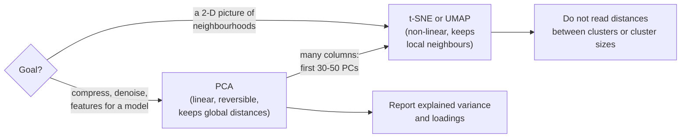

# Dimensionality reduction: PCA, t-SNE and UMAP

Tables in practice have many columns, and people can only look at two or three at a time. **Dimensionality reduction** replaces many columns by a few new ones that keep as much of the relevant information as possible. This page covers the linear standard method, **principal component analysis** (PCA), with its two key outputs, explained variance and loadings, and then two non-linear methods made for pictures, **t-SNE** and **UMAP**. It ends with what such pictures can and cannot show.

The code blocks build on each other; run them in order. They use two built-in scikit-learn datasets, 178 wines with 13 chemical measurements and 1,797 images of handwritten digits with 64 pixels each, and finally the amenities of the Berlin Airbnb listings (prepare the data with `uv run python case-study/prepare_airbnb.py`).



## Principal component analysis: explained variance and loadings

### Concept

PCA finds new axes, the **principal components** (PCs). Each PC is a weighted sum of the original columns. The first PC is the direction along which the rows vary most (largest **variance**). The second PC is the direction of largest remaining variance that is uncorrelated with (at right angles to) the first, and so on. With p columns there are p components; usually the first few carry most of the variance.

Three outputs matter:

- **Scores**: the coordinates of each row on the new axes; PC1 and PC2 scores give a 2-D map of the data.
- **Explained variance ratio**: the share of the total variance carried by each PC. A **scree plot** shows these shares; the cumulative sum tells how many PCs keep, say, 80 % of the variance.
- **Loadings**: the weights of the original columns in each PC. They say what a component *means*: a PC with large weights on alcohol, proline and colour intensity describes "strong, dark wines".

Worked example with two standardised columns that have correlation 0.8. Their covariance matrix is [[1, 0.8], [0.8, 1]]. Its **eigenvectors** (the directions that the matrix only stretches) are (1, 1)/√2 and (1, −1)/√2, with **eigenvalues** (the stretch factors, here the variances along those directions) 1 + 0.8 = 1.8 and 1 − 0.8 = 0.2. So PC1 is the average direction of the two columns and explains 1.8 / (1.8 + 0.2) = 90 % of the variance; PC2, their difference, explains 10 %. Both loadings on PC1 are 1/√2 ≈ 0.71: the two columns count equally.


The **biplot** on the right combines scores (points) and loadings (arrows). Points lie in the direction of the arrows of the columns on which they have high values. The three wine cultivars, which PCA did not see, separate clearly in the first two components.

### Why it matters

Correlated columns carry overlapping information. PCA summarises them in a few uncorrelated scores. This helps to plot high-dimensional data, to remove noise (dropping the last PCs), to speed up later methods and to deal with models that suffer from many correlated inputs. Because PCA uses variance, it must be run on **standardised** columns unless all columns share one unit; otherwise the column with the largest numbers becomes PC1 on its own.

### How it works in Python

```python
import numpy as np
import pandas as pd
from sklearn.datasets import load_digits, load_wine
from sklearn.decomposition import PCA
from sklearn.manifold import TSNE, trustworthiness
from sklearn.preprocessing import StandardScaler

# the worked example: eigenvalues and eigenvectors of a 2 x 2 correlation matrix
eigval, eigvec = np.linalg.eigh(np.array([[1.0, 0.8], [0.8, 1.0]]))
print(eigval.round(2), np.abs(eigvec[:, -1]).round(2))   # [0.2 1.8] [0.71 0.71]

wine = load_wine(as_frame=True)                            # 178 wines, 13 measurements
Z = StandardScaler().fit_transform(wine.data)
pca = PCA().fit(Z)
print(pca.explained_variance_ratio_[:3].round(3))          # [0.362 0.192 0.111]
print(pca.explained_variance_ratio_.cumsum()[[1, 4]].round(2))   # [0.55 0.8 ]: 2 PCs 55 %, 5 PCs 80 %
print(PCA().fit(wine.data).explained_variance_ratio_[0].round(3))   # 0.998 without standardising

loadings = pd.DataFrame(pca.components_[:2].T, index=wine.data.columns, columns=["PC1", "PC2"])
print(loadings.reindex(loadings["PC1"].abs().sort_values(ascending=False).index).head(4).round(2))
#                                PC1   PC2
# flavanoids                    0.42 -0.00
# total_phenols                 0.39  0.07
# od280/od315_of_diluted_wines  0.38 -0.16
# proanthocyanins               0.31  0.04

scores = pca.transform(Z)[:, :2]                           # coordinates for a scatter plot
print(scores.shape)                                         # (178, 2)
```

PC1 is a "phenol" axis (flavanoids, total phenols, proanthocyanins). Without standardising, proline (values in the hundreds and thousands) alone accounts for 99.8 % of the variance.

`PCA(n_components=0.8)` keeps as many components as needed for 80 % of the variance. The sign of a component is arbitrary: two libraries may return PC1 and −PC1.

### In practice

- **Population genetics.** Novembre et al. (2008, *Nature*): PC1 and PC2 of the genotypes of about 1,400 Europeans reproduce the map of Europe.
- **Finance.** Litterman and Scheinkman (1991, *Journal of Fixed Income*): three components, called level, slope and curvature, explain most movements of government bond yields; risk desks still report exposures on them.
- **Faces and images.** Turk and Pentland (1991) represented faces by their first principal components ("eigenfaces"); workbook 13 reproduces the idea.

> [!WARNING]
> **High explained variance is not high relevance.** PCA keeps the directions with most variance, not those most related to a target. A small component can be the one that predicts churn.

> [!CAUTION]
> **Fit PCA on training data only.** Inside a model pipeline, PCA is a preparation step like scaling: `make_pipeline(StandardScaler(), PCA(10), model)`. Fitting it on all data before a split leaks information from the test set (Session 7).

## t-SNE and UMAP for visualisation

### Concept

PCA is linear: it can only rotate and project. Data that lie on a curved surface (images of the same digit written in different ways, for example) are not separated by any flat projection. Two non-linear methods focus on **neighbourhoods** instead of variance:

- **t-SNE** (t-distributed stochastic neighbour embedding; van der Maaten and Hinton, 2008) turns distances into probabilities that two rows are neighbours, both in the original space and in a 2-D map, and moves the points in the map until the two sets of probabilities match. The **perplexity** (typically 5–50) sets roughly how many neighbours each point considers.
- **UMAP** (uniform manifold approximation and projection; McInnes, Healy and Melville, 2018) builds a graph of the **n_neighbors** nearest neighbours of every row and lays the graph out in 2-D. **min_dist** sets how tightly points may be packed. UMAP is usually faster than t-SNE, keeps somewhat more global structure and can transform new rows.

Both keep **local** structure: rows that are neighbours in the original space stay neighbours in the map. A measure of this is **trustworthiness** (between 0 and 1): how many of the 10 nearest neighbours of each point in the map are also among its true neighbours.

### Why it matters

A good 2-D map lets people see groups, outliers and mislabelled examples in data with dozens or thousands of columns (amenity indicators, TF-IDF vectors of texts in Session 13, embeddings in Session 14). But the maps distort. Distances *between* groups, the *size* of groups and the empty space in a t-SNE or UMAP map have no reliable meaning, and different settings can produce different pictures from the same data.

### How it works in Python

```python
digits = load_digits()                                     # 1,797 images, 8 x 8 = 64 pixels
X = digits.data
pca_map = PCA(n_components=2).fit_transform(X)
tsne_map = TSNE(n_components=2, perplexity=30, random_state=0).fit_transform(X)   # about 10-30 s

for name, emb in {"PCA": pca_map, "t-SNE": tsne_map}.items():
    print(name, round(trustworthiness(X, emb, n_neighbors=10), 3))
# PCA 0.83
# t-SNE 0.993
print(PCA().fit(X).explained_variance_ratio_[:2].round(3))   # [0.149 0.136]: only 29 % in 2 PCs

# UMAP (package umap-learn, in the course environment)
import umap  # noqa: E402
umap_map = umap.UMAP(n_neighbors=15, min_dist=0.1, random_state=0).fit_transform(X)
print("UMAP", round(trustworthiness(X, umap_map, n_neighbors=10), 3))   # UMAP 0.988

# plot: plt.scatter(*tsne_map.T, c=digits.target, s=4, cmap="tab10")
```

In the t-SNE and UMAP maps the ten digits form ten separate groups, although the labels were not used; in the PCA map they overlap. Workbook 17 shows how the t-SNE picture changes with the perplexity, workbook 18 how UMAP changes with n_neighbors and min_dist.

### In practice

- **Single-cell biology.** t-SNE and UMAP maps of gene expression in thousands of single cells are the standard figure for showing cell types; Becht et al. (2019, *Nature Biotechnology*) compared UMAP with t-SNE for this use.
- **Inspecting embeddings.** The TensorFlow Embedding Projector shows PCA, t-SNE and UMAP views of word or image embeddings to explore what a model has learned.
- **Data quality.** Mislabelled training examples often appear as points of one colour inside a group of another colour in a t-SNE map of image or text data.

> [!WARNING]
> **Do not cluster on a t-SNE map, and do not read distances between groups.** t-SNE inflates dense groups and shrinks sparse ones; distances between well-separated groups are arbitrary. Cluster on the original data (or on PCA scores) and use the map only to look.

> [!CAUTION]
> **Fix the random seed and try several settings.** t-SNE and UMAP are stochastic. A structure that appears for one perplexity or one seed only is not a finding. Wattenberg, Viégas and Johnson (2016) show striking examples.

> [!TIP]
> For data with hundreds of columns (text embeddings), first reduce to 30–50 principal components, then run t-SNE or UMAP on the scores. It is faster and removes noise.

## What do Airbnb listings offer? PCA of amenities

### Concept

Every Airbnb listing has a list of **amenities** chosen by the host from a form: "Wifi", "Kitchen", "Hair dryer", "Wine glasses" and so on. Turned into a table, this is one 0/1 column per amenity (**indicator** or **dummy** columns): 2,653 different labels in the Berlin data, most of them rare. Such tables are wide and redundant: a listing with "Cooking basics" usually also has "Dishes and silverware" and "Dining table". PCA can show which bundles of amenities vary together and summarise a listing's equipment in a few scores.

All indicator columns share one unit (0 or 1), so PCA can be run on them without standardising; standardising would give rare amenities the same weight as common ones. Columns that almost every listing has (Wifi, 91 %) or almost none has carry little information and are dropped first.

### Why it matters

A host who wants to know "what do comparable listings offer?" or an analyst who wants to use the equipment in a price model (Sessions 6 and 10) cannot work with 2,653 columns. A few components with readable loadings are a compact description. The loadings can also reveal how the data were *collected*, which is often the more important finding.

### How it works in Python

```python
import json  # noqa: E402

from sklearn.preprocessing import MultiLabelBinarizer  # noqa: E402

listings = pd.read_parquet("case-study/data/airbnb/listings.parquet")
lists = listings["amenities"].apply(json.loads)                 # '["Wifi", "Kitchen", ...]' -> list
mlb = MultiLabelBinarizer()
A = pd.DataFrame(mlb.fit_transform(lists), columns=mlb.classes_, index=listings.index)
share = A.mean()
A = A.loc[:, (share >= 0.05) & (share <= 0.95)]                 # drop very rare and near-universal items
print(len(mlb.classes_), A.shape)                               # 2653 (12776, 90)

pca_a = PCA().fit(A)                                            # 0/1 columns share one unit: no scaling
print(pca_a.explained_variance_ratio_[:3].round(3),             # [0.212 0.058 0.046]
      pca_a.explained_variance_ratio_.cumsum()[[1, 9]].round(2))   # [0.27 0.48]: 2 PCs 27 %, 10 PCs 48 %
loadings = pd.DataFrame(pca_a.components_[:2].T, index=A.columns, columns=["PC1", "PC2"])
print(loadings["PC1"].nlargest(4).round(2).to_dict())
# {'Hot water kettle': 0.23, 'Dining table': 0.21, 'Cooking basics': 0.21, 'Wine glasses': 0.21}
print(loadings["PC2"].nlargest(3).round(2).to_dict(), loadings["PC2"].nsmallest(2).round(2).to_dict())
# {'Heating': 0.37, 'Stove': 0.26, 'Coffee maker': 0.23} {'Central heating': -0.25, 'Cleaning products': -0.17}

scores = pca_a.transform(A)
print(round(np.corrcoef(scores[:, 0], A.sum(axis=1))[0, 1], 2))   # 0.98: PC1 = how many amenities are listed
print(pd.crosstab(A["Heating"], A["Central heating"]))
# Central heating     0     1
# Heating
# 0                1596  2961
# 1                8219     0
medium_term = listings["minimum_nights"] >= 90
print(pd.Series(scores[:, 0]).groupby(listings["room_type"]).median().round(2).to_dict())
# {'Entire home/apt': 0.51, 'Hotel room': -0.82, 'Private room': -0.91, 'Shared room': -0.11}
print(pd.Series(scores[:, 0]).groupby(medium_term).median().round(2).to_dict())   # {False: 0.67, True: -1.59}
has_price = listings["price"].notna()
print(round(np.corrcoef(scores[has_price, 0], np.log(listings.loc[has_price, "price"]))[0, 1], 2))   # 0.34
```


Three readings. **PC1 (21 % of the variance) is the size of the amenity list**: almost all columns load positively (a handful, such as "Washer", slightly negatively), led by kitchen and household items, and the scores correlate 0.98 with the number of amenities listed. Entire homes score high, private and hotel rooms low; medium-term rentals list far fewer amenities than short stays (median −1.59 against 0.67). PC1 correlates only moderately with the log price (0.34). **PC2 is not about equipment at all.** It contrasts "Heating" with "Central heating": no listing has both labels, and listings with "Central heating" also tend to use other specific labels ("Induction stove" instead of "Stove"). They are more common among listings first reviewed since 2022. PC2 most likely separates two versions of the amenity form, a property of how the data were entered, not of the flats; the data cannot confirm this. **Two components keep only 27 % of the variance**: amenities are a list of many fairly independent items, not a few strong bundles.

### In practice

- **Survey and questionnaire analysis.** PCA (and the related factor analysis) of many yes/no or rating items is a standard way to find a few underlying dimensions, for example the OECD's PISA index of economic, social and cultural status, which for many survey cycles was the first principal component of parental education, parental occupation and home possessions.
- **Recommender systems.** Matrix factorisation of user–item tables, a close relative of PCA, was a central technique of the Netflix Prize (2006–2009).
- **Market research.** Product feature lists (cars, phones, holiday rentals) are summarised with PCA or correspondence analysis to map which products resemble each other.

> [!WARNING]
> **A component can encode the data-collection process.** Changes of a form, a scraper or a coding scheme create correlated columns, and PCA will find them as a strong direction. Before naming a component, look at its loadings and ask whether they describe the objects or the way they were recorded.

> [!TIP]
> For very wide sparse tables (text, thousands of amenity labels), use `TruncatedSVD`, which works on sparse matrices without centring them; Session 13 uses it for TF-IDF vectors of texts.

*Practice (block 3):* summarise the amenities of the Berlin listings with PCA and map the listings with t-SNE: part B of workbook [24-case-study-airbnb-listing-segments.ipynb](../workbooks/24-case-study-airbnb-listing-segments.ipynb).

## Check your understanding

1. Two standardised columns have correlation 0. What are the eigenvalues of their correlation matrix, and how much variance does PC1 explain?
2. In the wine data PC1 explains 36 % after standardising and 99.8 % without. Which result is misleading, and why?
3. What does a loading of 0.42 for flavanoids on PC1 tell you? What does it not tell you?
4. In a t-SNE map, group A is twice as large as group B and far away from it. Which of these two observations can you report?
5. When would you prefer PCA scores over a UMAP map as input to a later model?
6. The second amenity component contrasts "Heating" with "Central heating". Why should you not call it a "heating quality" component? How could you check the explanation offered above?

## Further reading

- James, G., Witten, D., Hastie, T., Tibshirani, R. and Taylor, J. (2023). *An Introduction to Statistical Learning with Applications in Python*, Chapter 12.2 "Principal Components Analysis". Springer. https://www.statlearning.com/
- Wattenberg, M., Viégas, F. and Johnson, I. (2016). How to use t-SNE effectively. *Distill*. https://doi.org/10.23915/distill.00002
- Coenen, A. and Pearce, A. (2019). *Understanding UMAP*. Google PAIR. https://pair-code.github.io/understanding-umap/
- McInnes, L., Healy, J. and Melville, J. (2018). UMAP: uniform manifold approximation and projection for dimension reduction. arXiv:1802.03426. https://arxiv.org/abs/1802.03426
