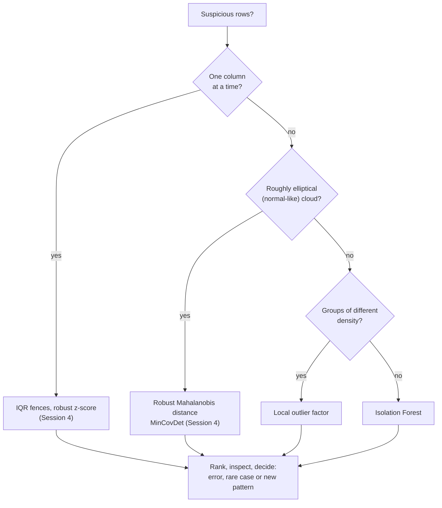
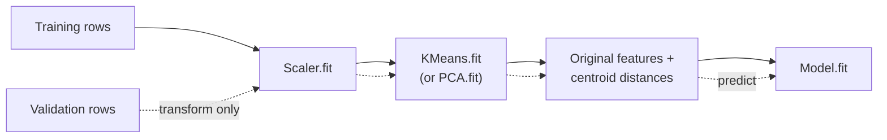

# Anomaly detection and unsupervised features

Session 4 flagged outliers one column at a time (IQR fences, z-scores, the median absolute deviation) and in combinations of columns with the Mahalanobis distance. This page continues with two **model-based** detectors that need no assumption of a normal distribution, **Isolation Forest** and the **local outlier factor** (LOF), and compares them with the Mahalanobis distance on the same small example. The examples are implausible Airbnb listings in Berlin (prices far from what size and location suggest, extreme minimum stays). The second section closes the session: the output of a clustering or a PCA can be fed as **features** into a supervised model, and we test whether location clusters improve a gradient-boosting price model.

The code blocks build on each other; run them in order from the repository root.



## Model-based anomaly detection: Isolation Forest and local outlier factor

### Concept

An **anomaly** (or outlier) is a row that differs strongly from the bulk of the data. Detectors return a **score** for every row; a threshold, or a guess of the share of anomalies (the **contamination**), turns scores into flags.

- **Isolation Forest** (Liu, Ting and Zhou, 2008) builds many random trees. Each tree splits the data on a random column at a random value, again and again, until every row stands alone. An unusual row is **isolated** after few splits, because it lies far from the others on some column. The score is the average path length to isolation over all trees: short path, high anomaly score. It needs no distances and scales to large data.
- **Local outlier factor** (Breunig et al., 2000) compares the density around a row (how close its k nearest neighbours are) with the density around those neighbours. LOF ≈ 1: as dense as its neighbourhood. LOF ≫ 1: in a much sparser region than its neighbours. Because it is *local*, it finds rows that are unusual relative to their own group, even when another group is sparse everywhere.

A small example (from Session 4). A person is 192 cm tall and weighs 55 kg. Neither value is extreme on its own (z-scores 2.2 and −1.4), but the combination is: given the height, a weight of about 88 kg would be typical.

| Method | What it looks at | Flags 192 cm / 55 kg? |
|---|---|---|
| z-score per column | each column alone | no (no \|z\| > 3) |
| robust Mahalanobis distance | distance from the centre, scaled by covariance | yes (distance 6.5 vs typical 1.2) |
| Isolation Forest, contamination 1 % | random axis-parallel splits | no (5 rows score higher) |
| LOF, 20 neighbours, contamination 1 % | density relative to neighbours | yes (LOF 4.2) |

Isolation Forest splits along one column at a time, so a point that is unusual only in the *combination* of two correlated columns is not isolated quickly. LOF and the Mahalanobis distance see the combination.

### Why it matters

Data errors, fraud, machine faults and genuinely new patterns all appear as anomalies. Univariate rules miss unusual combinations, and the Mahalanobis distance assumes one elliptical cloud. Model-based detectors cover the other cases. No detector is best everywhere; workbook 20 shows four detectors on five toy datasets, and workbook 23 compares Isolation Forest and LOF on real benchmark data.

### How it works in Python

```python
import numpy as np
import pandas as pd
from scipy.stats import chi2
from sklearn.covariance import MinCovDet
from sklearn.ensemble import IsolationForest
from sklearn.neighbors import LocalOutlierFactor
from sklearn.preprocessing import StandardScaler

rng = np.random.default_rng(0)
height = rng.normal(172, 9, 500)                                   # cm
weight = 0.9 * height - 85 + rng.normal(0, 6, 500)                 # kg, correlated with height
X = np.vstack([np.column_stack([height, weight]), [192, 55]])      # row 500: tall and light

print(((X[500] - X.mean(axis=0)) / X.std(axis=0)).round(1))       # [ 2.2 -1.4]  no |z| > 3
d2 = MinCovDet(random_state=0).fit(X).mahalanobis(X)               # squared robust distances
print(np.sqrt(d2[500]).round(1), (d2 > chi2.ppf(0.999, df=2)).sum())   # 6.5 3

iso = IsolationForest(contamination=0.01, random_state=0).fit(X)
iso_score = -iso.score_samples(X)                                  # higher = more anomalous
print(iso.predict(X)[500], (iso_score > iso_score[500]).sum())    # 1 5   (1 = inlier, -1 = outlier)

lof = LocalOutlierFactor(n_neighbors=20, contamination=0.01)
flags = lof.fit_predict(X)
print(flags[500], round(-lof.negative_outlier_factor_[500], 2))   # -1 4.22
```

Now on real data: the Berlin Airbnb listings. A platform, a city office or a data analyst wants to find **implausible listings**: prices far from what the size and location suggest, extreme minimum stays, typing errors. We use the 6,924 listings with a price and a minimum stay below 90 nights; the medium-term rentals found on page 2 have a different kind of price and are left out.

```python
from sklearn.ensemble import HistGradientBoostingRegressor  # noqa: E402
from sklearn.model_selection import KFold, cross_val_predict  # noqa: E402

pd.set_option("display.width", 160)
pd.set_option("display.max_columns", 12)
listings = pd.read_parquet("case-study/data/airbnb/listings.parquet")
lat0, lon0 = 52.5219, 13.4132                                   # Alexanderplatz
listings["north_km"] = (listings["latitude"] - lat0) * 111.2
listings["east_km"] = (listings["longitude"] - lon0) * 111.2 * np.cos(np.radians(lat0))
listings["km_centre"] = np.hypot(listings["north_km"], listings["east_km"])
short = listings[listings["price"].notna() & (listings["minimum_nights"] < 90)].reset_index(drop=True)
short["log_price"] = np.log(short["price"])
short["log_min_nights"] = np.log(short["minimum_nights"])
print(len(short))                                               # 6924

cols = ["log_price", "accommodates", "log_min_nights", "km_centre"]
Z = StandardScaler().fit_transform(short[cols])
short["iso"] = -IsolationForest(random_state=0).fit(Z).score_samples(Z)
short["lof"] = -LocalOutlierFactor(n_neighbors=20).fit(Z).negative_outlier_factor_
show = ["property_type", "accommodates", "price", "minimum_nights", "km_centre"]
print(short.nlargest(3, "iso")[show + ["iso"]].round(2))
#      property_type  accommodates   price  minimum_nights  km_centre   iso
# 4689     Houseboat            16  4458.0             1.0      22.45  0.75   <- large, expensive, far out
# 5497   Entire home            16  2296.0             1.0      21.07  0.74
# 5826     Houseboat            12  2270.4             1.0      22.43  0.72
print(short.nlargest(3, "lof")[show + ["lof"]].round(2))
#              property_type  accommodates    price  minimum_nights  km_centre   lof
# 2405    Entire rental unit             3    72.28            60.0       6.86  2.89   <- 60-night minimum
# 5410  Shared room in hotel            16    46.00             1.0       3.49  2.61   <- 16 guests for 46 euros
# 5497           Entire home            16  2296.00             1.0      21.07  2.52
```

Isolation Forest ranks the listings at the edge of the data first: houseboats and large houses for 12–16 guests at more than €2,000 a night, 21–22 km from the centre. They are rare, but not necessarily wrong. LOF finds listings that do not fit their neighbours: a 60-night minimum among short stays, a shared room in a hotel for 16 guests at €46 (a dormitory bed, probably, with the room size as "guests"). A sharper check states directly what "implausible" means: **the price compared with the price expected for the size, room type and location**. The expected price comes from a regression model (Sessions 6 and 10); each listing's prediction is made by a model that did not see that listing (`cross_val_predict`), so a listing cannot explain away its own price.

```python
X = pd.get_dummies(short[["accommodates", "bedrooms", "east_km", "north_km", "room_type"]], dtype=float)
expected = cross_val_predict(HistGradientBoostingRegressor(random_state=0), X, short["log_price"],
                             cv=KFold(5, shuffle=True, random_state=0))
short["ratio"] = np.exp(short["log_price"] - expected)          # actual price / expected price
print(short["ratio"].quantile([0.01, 0.5, 0.99]).round(2).to_list())   # [0.37, 1.0, 2.86]
print(((short["ratio"] > 3) | (short["ratio"] < 1 / 3)).sum())         # 110 listings off by a factor of 3
print(short.nlargest(3, "ratio")[show + ["number_of_reviews", "ratio"]].round(2))
#      property_type  accommodates    price  minimum_nights  km_centre  number_of_reviews  ratio
# 6858   Entire home             5   7999.2             1.0      15.60                  0  40.79
# 4024   Entire loft             7  10025.0             2.0      14.50                 68  34.32
# 5406   Entire home             2    950.0             1.0       9.64                 11   9.66
print(short.nsmallest(3, "ratio")[show + ["number_of_reviews", "ratio"]].round(2))
#                     property_type  accommodates  price  minimum_nights  km_centre  number_of_reviews  ratio
# 95             Entire rental unit             2  14.68             1.0       2.94                 51   0.09
# 70    Private room in rental unit             2   9.03            25.0       3.59                310   0.09
# 1858           Entire rental unit             2  18.85             2.0       4.38                 24   0.10
print((listings["minimum_nights"] > 365).sum(), listings["minimum_nights"].max())   # 10 1125.0

top_iso = set(short.nlargest(100, "iso").index)
top_ratio = set(short.assign(dev=np.abs(np.log(short["ratio"]))).nlargest(100, "dev").index)
print(len(top_iso & top_ratio))                                 # 27: the two lists overlap little
```

Half of the listings cost between 0.81 and 1.25 times their expected price (the median ratio is 1.0); 110 listings are off by a factor of three or more. At the top, a flat for five at €7,999 a night (40 times the expected price) and the €10,025 loft for seven: placeholder prices that block the calendar or typing errors, not market prices. At the bottom, entire flats near the centre for €15–19 a night, a tenth of the expected price: probably monthly rates entered as nightly prices, or discounts that the scraper read as the price. Ten listings in the whole table require a minimum stay of more than a year, up to 1,125 nights; for a short-term rental platform that is a placeholder, not a rule. Only 27 of the top 100 Isolation Forest listings are among the 100 largest price ratios: a generic detector looks for *rare* listings, the domain check for *inconsistent* ones. The domain check is easier to explain and to act on ("price 40 times the expected price; please check"), and it says what to do next: a person checks the listing page, and the price model of Session 10 excludes or caps such rows.

### In practice

- **Fraud detection.** Card issuers and payment providers screen transactions with anomaly scores alongside supervised fraud models, because new fraud patterns have no labels yet. The credit-card fraud data of the Université Libre de Bruxelles (Dal Pozzolo et al., 2015), a common public benchmark, has 0.17 % fraudulent transactions.
- **Industrial monitoring.** Condition monitoring of machines (bearings, turbines) scores multivariate sensor readings and raises alarms for review, because faults are rare and varied.
- **IT operations.** Monitoring platforms flag unusual combinations of latency, error rate and traffic in server metrics; an engineer then decides whether there is an incident.

> [!WARNING]
> **The contamination parameter is a guess, not a result.** `contamination=0.01` simply flags the top 1 % of scores. Prefer to look at the ranked scores and choose a threshold with the people who will review the flags (how many can they check per week?).

> [!CAUTION]
> **Anomalous is not the same as wrong.** The top Isolation Forest listings above are houseboats and large houses that may well be genuine. Deleting flagged rows without inspection removes exactly the cases that may matter most (Session 4).

> [!TIP]
> Without labels, evaluate a detector by inspecting a sample of the top-ranked rows. With a few known anomalies, use precision among the top k or the ROC AUC, as in workbook 23.

## Clusters and components as features

### Concept

Unsupervised outputs can be inputs to a supervised model:

- **Cluster membership** as a categorical feature (one-hot encoded), or the **distances to each centroid** (`KMeans.transform`), which are numeric and smoother.
- **Principal component scores** instead of, or in addition to, many correlated columns.
- **Anomaly scores** as a feature ("how unusual is this transaction?").
- **Aggregates at another level**, such as the cluster of a whole group of rows (all listings of a host, all products of a seller) attached to each row.

Like scaling, these are **preparation steps** that are fitted. They belong inside the pipeline and are fitted on the training folds only. Clusters computed on all data, including the test rows, leak information.



### Why it matters

A cluster or a component can summarise many columns in a way a model would otherwise have to learn from scratch, which helps simple models and small data. With flexible models (gradient boosting) and enough data, the gain is often small, because the model can find the same structure itself. The only way to know is to compare with and without, using cross-validation or a time split.

### How it works in Python

```python
from sklearn.cluster import KMeans  # noqa: E402
from sklearn.compose import make_column_transformer  # noqa: E402
from sklearn.decomposition import PCA  # noqa: E402
from sklearn.linear_model import LogisticRegression  # noqa: E402
from sklearn.model_selection import GroupKFold, StratifiedKFold, cross_val_score  # noqa: E402
from sklearn.pipeline import FunctionTransformer, make_pipeline, make_union  # noqa: E402
from sklearn.preprocessing import OrdinalEncoder  # noqa: E402

url = ("https://raw.githubusercontent.com/IBM/telco-customer-churn-on-icp4d/"
       "master/data/Telco-Customer-Churn.csv")
telco = pd.read_csv(url)
telco["TotalCharges"] = pd.to_numeric(telco["TotalCharges"], errors="coerce")
telco = telco.dropna(subset=["TotalCharges"])
tcols = ["tenure", "MonthlyCharges", "TotalCharges"]
y = (telco["Churn"] == "Yes").astype(int)
cv = StratifiedKFold(n_splits=5, shuffle=True, random_state=0)
models = {
    "3 columns": make_pipeline(StandardScaler(), LogisticRegression()),
    "3 columns + 8 centroid distances": make_pipeline(
        StandardScaler(),
        make_union(FunctionTransformer(), KMeans(n_clusters=8, n_init=10, random_state=0)),
        LogisticRegression(max_iter=1000)),
    "2 principal components": make_pipeline(StandardScaler(), PCA(n_components=2), LogisticRegression()),
}
for name, model in models.items():
    auc = cross_val_score(model, telco[tcols], y, cv=cv, scoring="roc_auc").mean()
    print(f"{name:34s} ROC AUC {auc:.3f}")
# 3 columns                          ROC AUC 0.809
# 3 columns + 8 centroid distances   ROC AUC 0.814
# 2 principal components             ROC AUC 0.807
```

`make_union(FunctionTransformer(), KMeans(...))` keeps the original columns and appends the eight distances; because it sits inside the pipeline, k-means is refitted in every fold. The centroid distances let the linear model bend its boundary and gain 0.005 ROC AUC, a small effect of the size of the fold-to-fold noise. Two components lose almost nothing compared with three columns.

Now a case where a cluster feature has a plausible job: **location in a price model**. A gradient-boosting model for the log price of the short-stay listings (as in Session 10) knows the district, but Berlin's twelve districts are large and mixed. k-means on the coordinates gives 20 **location clusters**, compact areas of similar size; their centroid distances describe where a listing is more finely than the district. The baseline is the district alone, the competitor the raw coordinates, which a tree can split on directly. Hosts with many similar listings would make random folds optimistic (Session 7), so the folds are grouped by host.

```python
def price_model(location=None):
    parts = [(OrdinalEncoder(), ["room_type", "district"]),
             ("passthrough", ["accommodates", "bedrooms", "minimum_nights"])]
    if location == "clusters":                                   # 20 centroid distances, refitted per fold
        parts.append((KMeans(n_clusters=20, n_init=10, random_state=0), ["east_km", "north_km"]))
    if location == "coordinates":
        parts.append(("passthrough", ["east_km", "north_km"]))
    return make_pipeline(make_column_transformer(*parts),
                         HistGradientBoostingRegressor(categorical_features=[0, 1], random_state=0))


for name, location in [("district only", None), ("+ 20 location-cluster distances", "clusters"),
                       ("+ raw coordinates", "coordinates")]:
    mae_log = -cross_val_score(price_model(location), short, short["log_price"], groups=short["host_id"],
                               cv=GroupKFold(n_splits=5), scoring="neg_mean_absolute_error")
    print(f"{name:32s} MAE (log) {mae_log.mean():.3f} +/- {mae_log.std():.3f}")
# district only                    MAE (log) 0.299 +/- 0.008
# + 20 location-cluster distances  MAE (log) 0.291 +/- 0.009
# + raw coordinates                MAE (log) 0.289 +/- 0.010
```

An MAE of 0.30 on the log scale means that a typical prediction is off by a factor of about e^0.30 ≈ 1.35. The location clusters reduce the error a little (0.299 to 0.291, about the size of the fold-to-fold spread), but the raw coordinates do as well or slightly better (0.289): a tree can find the expensive areas itself when it gets the coordinates. Cluster features earn their place where the model cannot use the raw information (a linear model cannot use latitude and longitude well), where a summary must be explained to people ("listings in location cluster 7"), or where the same areas are reused in many analyses.

### In practice

- **Feature learning with k-means.** Coates and Ng (2012) showed that centroid distances of k-means fitted on image patches give features that are competitive with much more complex methods for image recognition.
- **Principal component regression** replaces many correlated predictors by their first components (ISLP, Chapter 6.3); it is used in chemometrics, where spectra have hundreds of correlated wavelengths.
- **Geodemographic codes as covariates.** Area classifications such as the ONS Output Area Classification are used as area-level variables in health and social research.

> [!WARNING]
> **Fit the clustering inside the cross-validation.** Clusters fitted on all rows, then used as a feature in cross-validation, carry information from the validation folds. Use a pipeline, as in both examples above, or build the clusters from an earlier period only.

> [!CAUTION]
> **A small gain in one split is not evidence.** Report the spread across folds or a confidence interval (Session 7) before claiming that clusters improve a model. And compare with the obvious alternative: here, raw coordinates.

*Practice (block 3):* case study: which Berlin listings are implausible, and do location clusters improve the price model of Session 10? Rank the listings with Isolation Forest, LOF and the price ratio, inspect the top of each list, and compare the price model with and without cluster features under grouped cross-validation: part C of workbook [24-case-study-airbnb-listing-segments.ipynb](../workbooks/24-case-study-airbnb-listing-segments.ipynb).

## Check your understanding

1. Why does Isolation Forest miss the 192 cm / 55 kg person while LOF finds it?
2. A colleague sets `contamination=0.05` and reports "5 % of the Berlin listings are fake". What is wrong with this statement?
3. The top Isolation Forest listings are houseboats and large houses far from the centre; the top price-ratio listings cost 30–40 times their expected price. Which list would you send to a city office, and why?
4. Why must the expected price be predicted by a model that did not see the listing (`cross_val_predict`) rather than by a model fitted on all listings?
5. Location clusters lower the MAE from 0.299 to 0.291, raw coordinates to 0.289. What would you recommend for the Session 10 price model, and when would the clusters still be useful?
6. A listing has a price ratio of 0.1: it costs a tenth of what its size and location suggest. Name three possible explanations and how you would tell them apart.

## Further reading

- scikit-learn developers (2026). *User Guide: 2.7 Novelty and Outlier Detection*. https://scikit-learn.org/stable/modules/outlier_detection.html
- Liu, F. T., Ting, K. M. and Zhou, Z.-H. (2008). Isolation forest. *Proceedings of the 8th IEEE International Conference on Data Mining*, 413–422. https://doi.org/10.1109/ICDM.2008.17
- Breunig, M. M., Kriegel, H.-P., Ng, R. T. and Sander, J. (2000). LOF: identifying density-based local outliers. *Proceedings of ACM SIGMOD 2000*, 93–104. https://doi.org/10.1145/342009.335388
- Hyndman, R. J. (2026). *That's Weird: Anomaly Detection Using R*. OTexts. https://otexts.com/weird/
