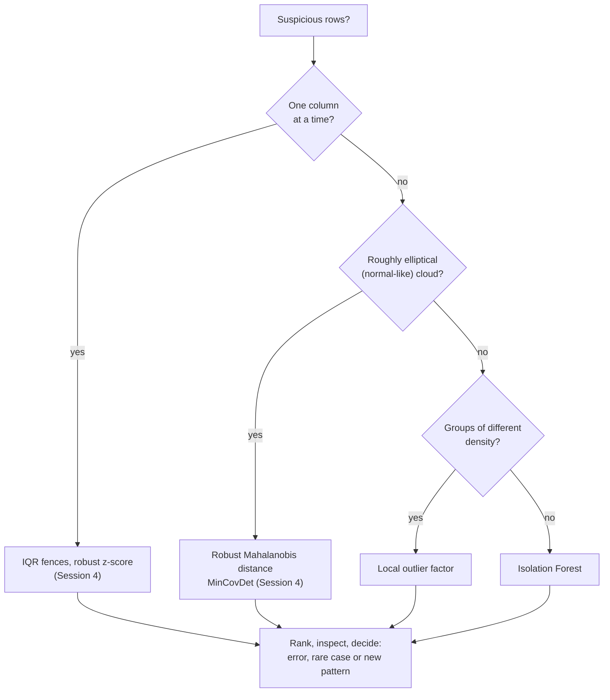
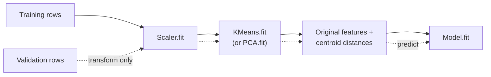

# Anomaly detection and unsupervised features

Session 4 flagged outliers one column at a time (IQR fences, z-scores, the median absolute deviation) and in combinations of columns with the Mahalanobis distance. This page continues with two **model-based** detectors that need no assumption of a normal distribution, **Isolation Forest** and the **local outlier factor** (LOF), and compares them with the Mahalanobis distance on the same small example. The second section closes the session: the output of a clustering or a PCA can be fed as **features** into a supervised model, and the case study tests whether that helps.

The code blocks build on each other; run them in order from the repository root.



## Model-based anomaly detection: Isolation Forest and local outlier factor

### Concept

An **anomaly** (or outlier) is a row that differs strongly from the bulk of the data. Detectors return a **score** for every row; a threshold, or a guess of the share of anomalies (the **contamination**), turns scores into flags.

- **Isolation Forest** (Liu, Ting and Zhou, 2008) builds many random trees. Each tree splits the data on a random column at a random value, again and again, until every row stands alone. An unusual row is **isolated** after few splits, because it lies far from the others on some column. The score is the average path length to isolation over all trees: short path, high anomaly score. It needs no distances and scales to large data.
- **Local outlier factor** (Breunig et al., 2000) compares the density around a row (how close its k nearest neighbours are) with the density around those neighbours. LOF ≈ 1: as dense as its neighbourhood. LOF ≫ 1: in a much sparser region than its neighbours. Because it is *local*, it finds rows that are unusual relative to their own group, even when another group is sparse everywhere.

A small example (from Session 4). A person is 192 cm tall and weighs 55 kg. Neither value is extreme on its own (z-scores 2.2 and −1.4), but the combination is: given the height, a weight of about 88 kg would be typical.

| Method | What it looks at | Flags 192 cm / 55 kg? |
|---|---|---|
| z-score per column | each column alone | no (no \|z\| > 3) |
| robust Mahalanobis distance | distance from the centre, scaled by covariance | yes (distance 6.5 vs typical 1.2) |
| Isolation Forest, contamination 1 % | random axis-parallel splits | no (5 rows score higher) |
| LOF, 20 neighbours, contamination 1 % | density relative to neighbours | yes (LOF 4.2) |

Isolation Forest splits along one column at a time, so a point that is unusual only in the *combination* of two correlated columns is not isolated quickly. LOF and the Mahalanobis distance see the combination.

### Why it matters

Data errors, fraud, machine faults and genuinely new patterns all appear as anomalies. Univariate rules miss unusual combinations, and the Mahalanobis distance assumes one elliptical cloud. Model-based detectors cover the other cases. No detector is best everywhere; workbook 20 shows four detectors on five toy datasets, and workbook 23 compares Isolation Forest and LOF on real benchmark data.

### How it works in Python

```python
import numpy as np
import pandas as pd
from scipy.stats import chi2
from sklearn.covariance import MinCovDet
from sklearn.ensemble import IsolationForest
from sklearn.neighbors import LocalOutlierFactor
from sklearn.preprocessing import StandardScaler

rng = np.random.default_rng(0)
height = rng.normal(172, 9, 500)                                   # cm
weight = 0.9 * height - 85 + rng.normal(0, 6, 500)                 # kg, correlated with height
X = np.vstack([np.column_stack([height, weight]), [192, 55]])      # row 500: tall and light

print(((X[500] - X.mean(axis=0)) / X.std(axis=0)).round(1))       # [ 2.2 -1.4]  no |z| > 3
d2 = MinCovDet(random_state=0).fit(X).mahalanobis(X)               # squared robust distances
print(np.sqrt(d2[500]).round(1), (d2 > chi2.ppf(0.999, df=2)).sum())   # 6.5 3

iso = IsolationForest(contamination=0.01, random_state=0).fit(X)
iso_score = -iso.score_samples(X)                                  # higher = more anomalous
print(iso.predict(X)[500], (iso_score > iso_score[500]).sum())    # 1 5   (1 = inlier, -1 = outlier)

lof = LocalOutlierFactor(n_neighbors=20, contamination=0.01)
flags = lof.fit_predict(X)
print(flags[500], round(-lof.negative_outlier_factor_[500], 2))   # -1 4.22
```

Now on real data: the Telco customers, scaled as on page 1.

```python
url = ("https://raw.githubusercontent.com/IBM/telco-customer-churn-on-icp4d/"
       "master/data/Telco-Customer-Churn.csv")
telco = pd.read_csv(url)
telco["TotalCharges"] = pd.to_numeric(telco["TotalCharges"], errors="coerce")
telco = telco.dropna(subset=["TotalCharges"])
cols = ["tenure", "MonthlyCharges", "TotalCharges"]
Z = StandardScaler().fit_transform(telco[cols])

telco["iso"] = -IsolationForest(random_state=0).fit(Z).score_samples(Z)
lof = LocalOutlierFactor(n_neighbors=20).fit(Z)
telco["lof"] = -lof.negative_outlier_factor_
print(telco.nlargest(3, "iso")[cols + ["iso"]].round(2))
#       tenure  MonthlyCharges  TotalCharges   iso
# 2115      71          118.65       8477.60  0.66   <- the most expensive, longest customers
# 4586      72          118.75       8672.45  0.66
# 6118      72          118.20       8547.15  0.66
print(telco.nlargest(3, "lof")[cols + ["lof"]].round(2))
#       tenure  MonthlyCharges  TotalCharges   lof
# 4262       2            66.4         94.55  4.08   <- total charges low for 2 months of 66.40
# 4290       1            40.1         40.10  4.06
# 252        1            40.2         40.20  4.00

# a domain check is often sharper: total charges should be close to tenure x monthly charges
ratio = telco["TotalCharges"] / (telco["tenure"] * telco["MonthlyCharges"])
print(ratio.quantile([0.001, 0.5, 0.999]).round(2).to_list())      # [0.75, 1.0, 1.31]
```

Isolation Forest ranks the customers at the edge of the data first: they are rare, but not wrong. LOF finds short-tenure customers whose total does not fit their neighbours. A ratio built from domain knowledge (total ≈ tenure × monthly charge) states directly what "inconsistent" means. Model-based detectors produce a ranked list for inspection; they do not decide what is an error.

On the case study, a natural anomaly score needs no detector at all: **the distance of a decision from the centre of its own heading**. Decisions whose description is far from the typical description of their heading are either unusual products, borderline cases between headings, or possible misclassifications. We use the German decisions of chapter 94 (to avoid the language effect of pages 2 and 3), represent each description by 50 SVD components scaled to length 1, average them per heading (the **centroid**) and compute the cosine similarity of every decision to its heading's centroid.

```python
from sklearn.decomposition import TruncatedSVD
from sklearn.feature_extraction.text import TfidfVectorizer
from sklearn.pipeline import make_pipeline
from sklearn.preprocessing import Normalizer

sample = pd.read_parquet("case-study/data/train_sample.parquet")
de = sample[(sample["chapter"] == "94") & (sample["language"] == "de")].reset_index(drop=True)
Z_text = make_pipeline(TfidfVectorizer(min_df=3, sublinear_tf=True), TruncatedSVD(50, random_state=0),
                       Normalizer()).fit_transform(de["description"])
centroids = pd.DataFrame(Z_text).groupby(de["heading"]).mean()
own = centroids.loc[de["heading"]].to_numpy()
de["similarity"] = (Z_text * own).sum(axis=1) / np.linalg.norm(own, axis=1)   # cosine to own centroid
print(len(de), de["similarity"].quantile([0.01, 0.5]).round(2).to_list())      # 1422 [0.38, 0.71]
print(de.nsmallest(4, "similarity")[["heading", "similarity", "keywords"]].round(2).to_string())
#      heading  similarity                                                              keywords
# 1221    9405        0.27              FOR LIGHTING,HOUSINGS,LED,MOUNTED,PRINTED CIRCUIT BOARDS
# 1116    9405        0.29          CABLES,CONNECTIONS,HOUSINGS,INSULATED,PRINTED CIRCUIT BOARDS
# 1134    9405        0.30                   DOORS,LIGHT FITTINGS,NON-ELECTRIC,OF GLASS,OF METAL
# 925     9405        0.31  DOORS,GATHERED BY HAND,LIGHT FITTINGS,NON-ELECTRIC,OF GLASS,OF METAL
```

The English keywords make the German decisions readable. The two least typical lamp decisions are LED modules on printed circuit boards with housings and cables: products on the border between lamps (9405) and electrical parts of chapter 85, exactly the kind of case a customs specialist would want to review. The next ones are non-electric light fittings of glass and metal, a rare kind of 9405. None of these is necessarily wrong; the ranking tells an expert where to look first.

### In practice

- **Fraud detection.** Card issuers and payment providers screen transactions with anomaly scores alongside supervised fraud models, because new fraud patterns have no labels yet. The credit-card fraud data of the Université Libre de Bruxelles (Dal Pozzolo et al., 2015), a common public benchmark, has 0.17 % fraudulent transactions.
- **Industrial monitoring.** Condition monitoring of machines (bearings, turbines) scores multivariate sensor readings and raises alarms for review, because faults are rare and varied.
- **IT operations.** Monitoring platforms flag unusual combinations of latency, error rate and traffic in server metrics; an engineer then decides whether there is an incident.

> [!WARNING]
> **The contamination parameter is a guess, not a result.** `contamination=0.01` simply flags the top 1 % of scores. Prefer to look at the ranked scores and choose a threshold with the people who will review the flags (how many can they check per week?).

> [!CAUTION]
> **Anomalous is not the same as wrong.** The top Isolation Forest rows above are valid, valuable customers. Deleting flagged rows without inspection removes exactly the cases that may matter most (Session 4).

> [!TIP]
> Without labels, evaluate a detector by inspecting a sample of the top-ranked rows. With a few known anomalies, use precision among the top k or the ROC AUC, as in workbook 23.

## Clusters and components as features

### Concept

Unsupervised outputs can be inputs to a supervised model:

- **Cluster membership** as a categorical feature (one-hot encoded), or the **distances to each centroid** (`KMeans.transform`), which are numeric and smoother.
- **Principal component scores** instead of, or in addition to, many correlated columns.
- **Anomaly scores** as a feature ("how unusual is this transaction?").
- **Aggregates at another level**, such as the cluster of a whole group of rows (all decisions of a customs office, all products of a seller) attached to each row.

Like scaling, these are **preparation steps** that are fitted. They belong inside the pipeline and are fitted on the training folds only. Clusters computed on all data, including the test rows, leak information.



### Why it matters

A cluster or a component can summarise many columns in a way a model would otherwise have to learn from scratch, which helps simple models and small data. With flexible models (gradient boosting) and enough data, the gain is often small, because the model can find the same structure itself. The only way to know is to compare with and without, using cross-validation or a time split.

### How it works in Python

```python
from sklearn.cluster import KMeans
from sklearn.decomposition import PCA
from sklearn.linear_model import LogisticRegression
from sklearn.model_selection import StratifiedKFold, cross_val_score
from sklearn.pipeline import FunctionTransformer, make_pipeline, make_union

y = (telco["Churn"] == "Yes").astype(int)
cv = StratifiedKFold(n_splits=5, shuffle=True, random_state=0)
models = {
    "3 columns": make_pipeline(StandardScaler(), LogisticRegression()),
    "3 columns + 8 centroid distances": make_pipeline(
        StandardScaler(),
        make_union(FunctionTransformer(), KMeans(n_clusters=8, n_init=10, random_state=0)),
        LogisticRegression(max_iter=1000)),
    "2 principal components": make_pipeline(StandardScaler(), PCA(n_components=2), LogisticRegression()),
}
for name, model in models.items():
    auc = cross_val_score(model, telco[cols], y, cv=cv, scoring="roc_auc").mean()
    print(f"{name:34s} ROC AUC {auc:.3f}")
# 3 columns                          ROC AUC 0.809
# 3 columns + 8 centroid distances   ROC AUC 0.814
# 2 principal components             ROC AUC 0.807
```

`make_union(FunctionTransformer(), KMeans(...))` keeps the original columns and appends the eight distances; because it sits inside the pipeline, k-means is refitted in every fold. The centroid distances let the linear model bend its boundary and gain 0.005 ROC AUC, a small effect of the size of the fold-to-fold noise. Two components lose almost nothing compared with three columns. On the case study the effect goes the other way: in the practice notebook, adding the distances to 8 k-means centroids to 50 text components of the chapter-94 decisions changes the validation accuracy of a gradient-boosting model for the heading from 0.898 to 0.891, within the noise. A flexible model on informative features gains nothing from a summary of the same features.

### In practice

- **Feature learning with k-means.** Coates and Ng (2012) showed that centroid distances of k-means fitted on image patches give features that are competitive with much more complex methods for image recognition.
- **Principal component regression** replaces many correlated predictors by their first components (ISLP, Chapter 6.3); it is used in chemometrics, where spectra have hundreds of correlated wavelengths.
- **Geodemographic codes as covariates.** Area classifications such as the ONS Output Area Classification are used as area-level variables in health and social research.

> [!WARNING]
> **Fit the clustering inside the cross-validation.** Clusters fitted on all rows, then used as a feature in cross-validation, carry information from the validation folds. Use a pipeline, or build the clusters from an earlier period only, as in the case study (clusters fitted on 2017–2021, used for 2022–2023).

> [!CAUTION]
> **A small gain in one split is not evidence.** Report the spread across folds or a confidence interval (Session 7) before claiming that clusters improve a model.

*Practice (block 3):* cluster the decisions of one chapter, visualise them with truncated SVD and t-SNE, rank the decisions that are far from their heading's centroid, and test whether cluster features improve a gradient-boosting model (Session 10) on a time-based split: part B of workbook [24-case-study-decision-clusters.ipynb](../workbooks/24-case-study-decision-clusters.ipynb).

## Check your understanding

1. Why does Isolation Forest miss the 192 cm / 55 kg person while LOF finds it?
2. A colleague sets `contamination=0.05` and reports "5 % of our transactions are anomalies". What is wrong with this statement?
3. The top Isolation Forest customers are the longest and most expensive ones. Should they be removed before training a churn model? Why or why not?
4. Why must `KMeans` sit inside the pipeline when its distances are used as features in cross-validation?
5. Adding cluster features raises the ROC AUC from 0.809 to 0.814. What would you need to see before recommending the change?
6. A decision has a low similarity to its heading's centroid. Name three possible explanations and how you would tell them apart.

## Further reading

- scikit-learn developers (2026). *User Guide: 2.7 Novelty and Outlier Detection*. https://scikit-learn.org/stable/modules/outlier_detection.html
- Liu, F. T., Ting, K. M. and Zhou, Z.-H. (2008). Isolation forest. *Proceedings of the 8th IEEE International Conference on Data Mining*, 413–422. https://doi.org/10.1109/ICDM.2008.17
- Breunig, M. M., Kriegel, H.-P., Ng, R. T. and Sander, J. (2000). LOF: identifying density-based local outliers. *Proceedings of ACM SIGMOD 2000*, 93–104. https://doi.org/10.1145/342009.335388
- Hyndman, R. J. (2026). *That's Weird: Anomaly Detection Using R*. OTexts. https://otexts.com/weird/
