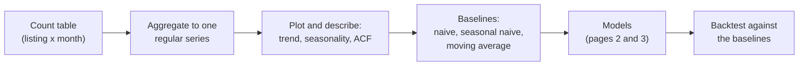

# Time series and baseline forecasts

A **time series** is a sequence of values measured at successive points in time. Forecasting asks what the next values will be and how certain that is. This page covers the three things to do before any model: describe the series (trend, seasonality, autocorrelation), build it correctly from event or count data (aggregating to months with pandas), and compute the **baselines** that every later model must beat. The example is demand for short-term rentals in Berlin, measured by the number of guest reviews written per month on Airbnb, from the case-study table `case-study/data/airbnb/reviews_monthly.parquet` (Inside Airbnb, snapshot of 26 June 2026; prepare it with `uv run python case-study/prepare_airbnb.py`).

Reviews are a **proxy** for stays: not every guest writes a review, and the share who do can change over time. A city administration, a tourism board or a host who plans prices and cleaning staff would like to know the number of stays; the number of reviews is the closest public measure. The series has a clear trend, a strong summer season and a deep break during the COVID-19 pandemic, which makes it a good teaching series.

The code blocks build on each other; run them in order from the repository root.



## Time series: trend, seasonality and autocorrelation

### Concept

We write the series as y₁, y₂, …, y_T, where t counts the periods (here months). Most series combine three **components**:

- **Trend**: the long-run level and its direction (growth, decline, a change of direction).
- **Seasonality**: a pattern that repeats with a fixed **period** m, for example m = 12 for monthly data with a yearly cycle, m = 7 for daily data with a weekly cycle.
- **Remainder**: what is left, the irregular part.

In an **additive** decomposition y = trend + seasonal + remainder. In a **multiplicative** one y = trend × seasonal × remainder, which fits when the seasonal swings grow with the level. Taking logarithms turns a multiplicative series into an additive one. **STL** (seasonal–trend decomposition using LOESS, a local regression) estimates the components; with `robust=True` it gives little weight to extreme months, so that a one-off shock does not distort the seasonal pattern.

**Autocorrelation** at lag k is the correlation between the series and itself shifted by k periods, corr(y_t, y_{t−k}). The **autocorrelation function** (ACF) lists it for k = 1, 2, …. Small worked example: the series 2, 4, 6, 8 has a lag-1 pairing (2, 4), (4, 6), (6, 8), a perfect linear relation: any trend makes the low-lag autocorrelations large. To see seasonality, remove the trend first, for example by **differencing** (y_t − y_{t−1}); for log counts the difference is roughly the monthly growth rate.

The series used in this session sums the reviews of all Berlin listings per month from January 2016 to May 2026 (125 months). Three features are visible at once: growth from about 1,000 reviews a month in early 2016 to more than 13,000 in summer 2025, a summer peak every year, and a collapse in spring 2020: 4,865 reviews in July 2019, 285 in April 2020, when tourist stays were banned, and a slow recovery until late 2021.


### Why it matters

The components say what a forecasting model must capture. A model that ignores a summer peak of +24 % or a change of level is wrong by construction. Autocorrelation is the reason time series need their own methods: neighbouring months are not independent observations, so random train–test splits and ordinary cross-validation do not apply (page 3). A break such as the pandemic raises a further question that this session returns to several times: which part of the history still describes the future?

### How it works in Python

```python
import numpy as np
import pandas as pd
from statsmodels.tsa.seasonal import STL
from statsmodels.tsa.stattools import acf

reviews = pd.read_parquet("case-study/data/airbnb/reviews_monthly.parquet")   # listing_id, month, n_reviews
y = reviews.groupby("month")["n_reviews"].sum()["2016":"2026-05"].rename("reviews")
y.index.freq = "MS"                                   # monthly, dated at the month start
log_y = np.log(y)
print(len(y), y.loc[["2019-07-01", "2020-04-01", "2025-07-01"]].to_list())   # 125 [4865, 285, 13132]

stl = STL(log_y, period=12, seasonal=13, robust=True).fit()   # trend + seasonal + remainder = log_y
recent = stl.seasonal["2022":"2025"]
factor = np.exp(recent).groupby(recent.index.month).mean()     # multiplicative seasonal factors
print(factor.round(2).to_dict())
# {1: 0.71, 2: 0.74, 3: 0.89, 4: 1.03, 5: 1.18, 6: 1.24, 7: 1.24, 8: 1.14, 9: 1.23, 10: 1.14, 11: 0.88, 12: 0.81}
print(round(np.exp(stl.resid["2020-04-01"]), 2))               # 0.1: April 2020 at 10 % of the expected value

print(acf(log_y, nlags=12)[[1, 6, 12]].round(2))                      # [0.91 0.57 0.49]  trend dominates
print(acf(log_y["2022":].diff().dropna(), nlags=12)[[1, 6, 12]].round(2))   # [ 0.41 -0.3   0.64]  yearly pattern
# plots: stl.plot(); statsmodels.graphics.tsaplots.plot_acf(log_y["2022":].diff().dropna(), lags=24)
```

Since 2022, June, July and September have about 24 % more reviews than the trend; January and February about 27 % fewer. Berlin's tourist season explains this reading, but the data alone cannot show the cause. The STL remainder puts April 2020 at a tenth of the expected value: the pandemic is a shock that no seasonal pattern describes. On the log counts of the whole period, the ACF is high at every lag because of the trend. After differencing the post-pandemic months, lag 12 stands out with 0.64: the yearly pattern is strong compared with the month-to-month noise.

### In practice

- **Official statistics.** Eurostat and the national statistical offices publish seasonally adjusted figures, computed with X-13ARIMA-SEATS or TRAMO/SEATS (for example in JDemetra+). The Statistical Office for Berlin-Brandenburg publishes monthly guest and overnight-stay figures for accommodation establishments.
- **Tourism and hospitality.** Hotels and short-term rental hosts set prices and plan cleaning and staff around the seasonal peak; revenue-management systems start from a decomposition like the one above.
- **Retail.** Staff and stock are planned around the seasonal peak of the year-end holidays.

> [!WARNING]
> **A trend makes the ACF look strong at every lag.** High autocorrelations of a trending series are not evidence of seasonality or of a useful predictor. Difference first.

> [!CAUTION]
> **A decomposition describes, it does not explain.** The January factor of 0.71 says *that* January is low, not *why*. And a robust decomposition only downweights the pandemic months; it does not tell you whether the world after the break is the same as before.

## Aggregating to regular time intervals with pandas

### Concept

Forecasting methods expect one value per period at a fixed **frequency**. Event data (one row per review, order or call) become a series by counting or summing per period. In pandas the timestamps go into a `DatetimeIndex`, and **`resample`** groups them into calendar periods: `"D"` days, `"W"` weeks ending on Sunday, `"MS"` months labelled by their first day, `"QS"` quarters, `"YS"` years. An aggregation (`size`, `sum`, `mean`) then gives one value per period.

The case-study table `reviews_monthly` is already aggregated one step: one row per listing and month with at least one review. Summing over listings gives the city-wide series; selecting a listing or a district gives one of thousands of smaller series. The table `calendar` has one row per listing and day for the next 365 days (is the night still bookable?), a daily series that can be resampled to weeks or months.

Small example: 3 and 5 reviews on 30 and 31 January, 2 and 4 on 1 and 3 February give 8 for January and 6 for February.

### Why it matters

The frequency is a modelling decision. It sets what can be forecast (a monthly staff plan needs monthly values), how noisy each value is (daily counts are noisier) and which seasonal patterns are visible. Many forecasting errors start with a badly built series: missing periods, a partial first or last period, a series whose definition changes over time.

### How it works in Python

```python
tiny = pd.Series([3, 5, 2, 4], index=pd.to_datetime(["2026-01-30", "2026-01-31", "2026-02-01", "2026-02-03"]))
print(tiny.resample("MS").sum().to_dict())
# {Timestamp('2026-01-01 00:00:00'): 8, Timestamp('2026-02-01 00:00:00'): 6}

# the last months: the snapshot was scraped between 26 June and 3 July 2026
full = reviews.groupby("month")["n_reviews"].sum()
print(full.loc["2026-04":].to_dict())
# {Timestamp('2026-04-01 00:00:00'): 11720, Timestamp('2026-05-01 00:00:00'): 15024,
#  Timestamp('2026-06-01 00:00:00'): 9968, Timestamp('2026-07-01 00:00:00'): 22}
print(full.groupby(full.index.year).sum().loc[[2016, 2019, 2020, 2021, 2025]].to_dict())
# {2016: 17829, 2019: 53965, 2020: 26499, 2021: 35447, 2025: 130357}

# one listing: months without reviews are missing rows, not zeros
one = reviews[reviews["listing_id"] == reviews["listing_id"].iloc[0]].set_index("month")["n_reviews"]["2016":"2026-05"]
dense = one.reindex(pd.date_range("2016-01-01", "2026-05-01", freq="MS"), fill_value=0)
print(len(one), len(dense), round(one.mean(), 2), round(dense.mean(), 2))   # 20 125 1.6 0.26

# a daily series: share of listings still bookable on each future night, resampled to months
calendar = pd.read_parquet("case-study/data/airbnb/calendar.parquet")      # listing_id, date, available
open_share = calendar.groupby("date")["available"].mean()
print(open_share.resample("MS").mean().round(2).iloc[[0, 1, 6, 12]].to_dict())
# {Timestamp('2026-06-01 00:00:00'): 0.13, Timestamp('2026-07-01 00:00:00'): 0.31,
#  Timestamp('2026-12-01 00:00:00'): 0.48, Timestamp('2027-06-01 00:00:00'): 0.36}
```

Four lessons. First, the snapshot was scraped at the end of June 2026, so June has only part of its reviews (9,968) and July almost none (22): the series must end with the last complete month, May 2026. Second, a review table only knows the listings that still exist on the scraping date. Listings that left Airbnb before June 2026 took their reviews with them, so the early years are undercounted, by an unknown amount, and the growth since 2016 is partly an artefact of this **survivorship**. Third, the first listing of the table has reviews in only 20 of 125 months: a mean computed without the empty months (1.6) is six times the true monthly mean (0.26). `reindex` with `fill_value=0` (or `resample(...).sum()` on event data) keeps the empty months. Fourth, the calendar shows that only 13 % of the nights in the last days of June 2026 were still bookable, against 48 % for December 2026. This is not a forecast of demand: far-away nights are open because they have not been booked or blocked *yet*. The first and last calendar months are also partial (26–30 June 2026, 1–2 July 2027).

### In practice

- **Electricity grid operators** forecast load per 15 minutes or per hour for balancing, and per month for planning; the frequency follows the decision.
- **Public health agencies** count notified cases per week, as in the weekly reports of the Robert Koch Institute, partly because daily counts are distorted by reporting delays at weekends.
- **Retailers** forecast sales per product and store per day; the M5 competition used Walmart unit sales at this level.

> [!WARNING]
> **The last period may not be complete.** A month that is not over yet, or a dataset that was scraped in the middle of a month, has a low last value that is not a real drop. Cut incomplete periods before modelling.

> [!TIP]
> Use `resample(...).size()` for counts of events and `.sum()` for amounts or pre-aggregated counts. For time zones, convert timestamps with `tz_convert` before resampling to days.

## Baselines: naive, seasonal naive and moving average

### Concept

A **baseline** is a forecast so simple that any proposed model must beat it to be worth using. The three standard ones, for a forecast **horizon** of h periods after the last observed value y_T:

- **Naive**: every future value equals the last observation, ŷ_{T+h} = y_T. It is the best possible forecast for a random walk (for example many share prices).
- **Seasonal naive**: every future value equals the value one season earlier, ŷ_{T+h} = y_{T+h−m}. With monthly data, next July equals last July.
- **Moving average**: the mean of the last n observations, ŷ_{T+h} = (y_T + … + y_{T−n+1}) / n. It smooths noise but lags behind changes.

For a growing series, a common business variant is the **seasonal naive forecast times growth**: last year's value of the same month multiplied by the growth of the last twelve months over the twelve months before. It is still a rule anyone can compute in a spreadsheet.

Errors are measured on a **hold-out period**: the last part of the series, never used to fit. Here the hold-out period is the last twelve complete months, June 2025 to May 2026. The **mean absolute error** MAE = mean |y_t − ŷ_t| is in the units of the series ("on average 1,000 reviews off per month"). Scaled errors that compare across series follow on page 3.

Worked example: the last three training months, March to May 2025, had 9,135, 10,575 and 11,977 reviews. Naive forecasts 11,977 for every month; the 3-month moving average forecasts (9,135 + 10,575 + 11,977) / 3 ≈ 10,562; seasonal naive forecasts June 2025 = June 2024 = 11,837 and December 2025 = December 2024 = 7,899. The twelve months up to May 2025 had 26 % more reviews than the twelve months before, so the growth variant forecasts June 2025 as 11,837 × 1.26 ≈ 14,900.


### Why it matters

Without a baseline, a complex model can look useful while being worse than "same as last year". Baselines also show what kind of series one has: when the naive forecast is hard to beat, the series behaves like a random walk and there is little to learn from its own past. Here every baseline has an obvious flaw: the flat ones ignore the season, plain seasonal naive ignores the growth.

### How it works in Python

```python
train, test = y[:"2025-05"], y["2025-06":]           # hold out the last 12 complete months
h = len(test)

naive = pd.Series(train.iloc[-1], index=test.index)                     # last value
snaive = pd.Series(train.iloc[-12:].to_numpy(), index=test.index)       # same month last year
moving = pd.Series(train.iloc[-3:].mean(), index=test.index)            # mean of the last 3 months
growth = train.iloc[-12:].sum() / train.iloc[-24:-12].sum()             # last 12 months vs the 12 before
snaive_growth = snaive * growth
print(round(growth, 2))                                                 # 1.26


def mae(actual, forecast):
    return np.mean(np.abs(np.asarray(actual) - np.asarray(forecast)))


for name, fc in {"naive": naive, "seasonal naive": snaive, "moving average": moving,
                 "seasonal naive x growth": snaive_growth}.items():
    print(f"{name:24s} MAE {mae(test, fc):5.0f}")
# naive                    MAE  1710
# seasonal naive           MAE  1586
# moving average           MAE  1935
# seasonal naive x growth  MAE  1038
```

In the hold-out year the seasonal naive forecast beats the flat forecasts, but it is still about 1,600 reviews per month too low (14 % of the mean of 11,466), because the market grew. Multiplying by last year's growth cuts the error to about 1,000. One hold-out year is a single test, though: page 3 repeats the comparison from six forecast origins.

### In practice

- **Forecasting competitions.** In the M4 competition (100,000 series, 2018) many submitted methods did not beat simple statistical benchmarks; the naive and seasonal naive forecasts are the reference points of the error measures.
- **Demand planning.** Planners report *forecast value added*: the improvement of the official forecast over a naive forecast. Negative values are common, for example when manual adjustments make forecasts worse.
- **Finance.** For exchange rates and share prices, the random-walk (naive) forecast is notoriously hard to beat, as Meese and Rogoff (1983) showed for exchange-rate models.

> [!WARNING]
> **Never evaluate on random months.** A random split puts later months into training and lets the model use the future to "predict" the past.

> [!CAUTION]
> **Avoid MAPE for small counts.** The mean absolute percentage error divides by the actual value and explodes when values are close to zero, as for a single listing or for April 2020 (285 reviews). Use MAE or the scaled MASE (page 3).

> [!NOTE]
> **Ethics.** Inside Airbnb scrapes public listing pages. Work with aggregates such as the city-wide series, and do not single out or name hosts.

*Practice (block 1):* compute the monthly number of reviews in Berlin and its baseline forecasts: Part 1 of [10-case-study-airbnb-review-forecast.ipynb](../workbooks/10-case-study-airbnb-review-forecast.ipynb).

## Check your understanding

1. Monthly reviews have a seasonal swing of ±1,000 at a level of 4,000 and ±3,000 at a level of 12,000. Additive or multiplicative decomposition? What transformation helps?
2. The ACF of the log counts is 0.91 at lag 1 and 0.49 at lag 12. Does this show a yearly pattern? What should you compute instead?
3. The snapshot was scraped at the end of June 2026. What happens to the series and to a naive forecast if June 2026 is kept?
4. Why can the growth of the review series since 2016 be overstated? Name the mechanism and one way to check its size.
5. Why must the hold-out period be at the end of the series?

## Further reading

- Hyndman, R. J., Athanasopoulos, G., Garza, A., Challu, C., Mergenthaler, M. and Olivares, K. G. (2026). *Forecasting: Principles and Practice, the Pythonic Way*. OTexts. Chapters 2 (time series graphics), 3 (decomposition) and 5.2 (simple forecasting methods). https://otexts.com/fpppy/
- statsmodels developers (2026). *Seasonal-Trend decomposition using LOESS (STL)*. https://www.statsmodels.org/stable/examples/notebooks/generated/stl_decomposition.html
- pandas developers (2026). *Time series / date functionality*, section "Resampling". https://pandas.pydata.org/docs/user_guide/timeseries.html#resampling
- Inside Airbnb (2026). *Data assumptions* (how listings, calendars and reviews are scraped). https://insideairbnb.com/data-assumptions/
