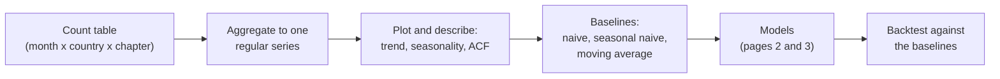
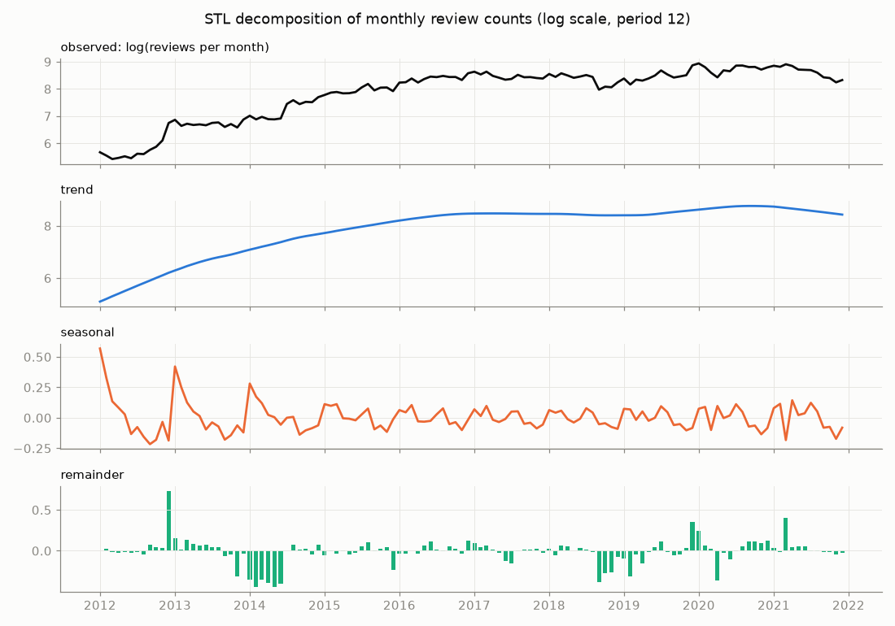
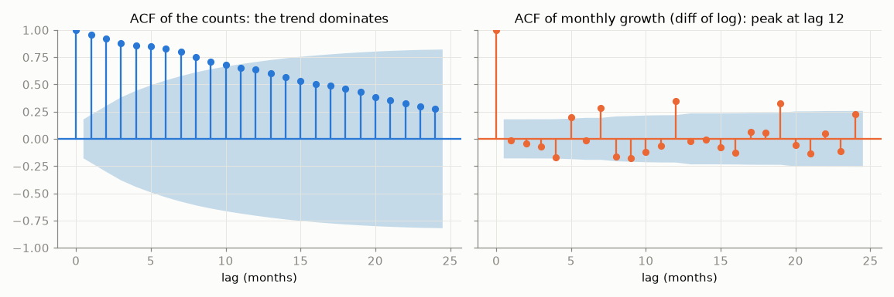
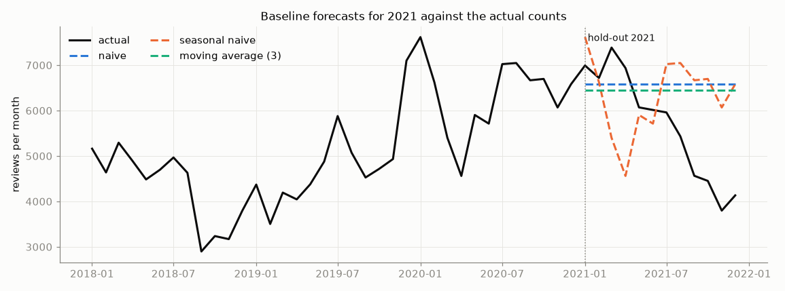

# Time series and baseline forecasts

A **time series** is a sequence of values measured at successive points in time. Forecasting asks what the next values will be and how certain that is. This page covers the three things to do before any model: describe the series (trend, seasonality, autocorrelation), build it correctly from event or count data (aggregating decisions to months with pandas), and compute the **baselines** that every later model must beat. The example is the number of Binding Tariff Information (BTI) decisions that EU customs authorities issue per month, from the case-study table `monthly_counts.parquet`.

The code blocks build on each other; run them in order from the repository root.



## Time series: trend, seasonality and autocorrelation

### Concept

We write the series as y₁, y₂, …, y_T, where t counts the periods (here months). Most series combine three **components**:

- **Trend**: the long-run level and its direction (growth, decline, a change of direction).
- **Seasonality**: a pattern that repeats with a fixed **period** m, for example m = 12 for monthly data with a yearly cycle, m = 7 for daily data with a weekly cycle.
- **Remainder**: what is left, the irregular part.

In an **additive** decomposition y = trend + seasonal + remainder. In a **multiplicative** one y = trend × seasonal × remainder, which fits when the seasonal swings grow with the level. Taking logarithms turns a multiplicative series into an additive one. **STL** (seasonal–trend decomposition using LOESS, a local regression) estimates the components robustly.

**Autocorrelation** at lag k is the correlation between the series and itself shifted by k periods, corr(y_t, y_{t−k}). The **autocorrelation function** (ACF) lists it for k = 1, 2, …. Small worked example: the series 2, 4, 6, 8 has a lag-1 pairing (2, 4), (4, 6), (6, 8), a perfect linear relation: any trend makes the low-lag autocorrelations large. To see seasonality, remove the trend first, for example by **differencing** (y_t − y_{t−1}); for log counts the difference is roughly the monthly growth rate.

The series used in this session counts the decisions of the EU member states per month from January 2010 to September 2026 (201 months). Decisions of the United Kingdom (`GB`) are left out, because they stop after December 2020 (Brexit); keeping them would put a step of about 250 decisions per month into the series (next section).





### Why it matters

The components say what a forecasting model must capture. A model that ignores a 12 % December dip or a change of level is wrong by construction. Autocorrelation is the reason time series need their own methods: neighbouring months are not independent observations, so random train–test splits and ordinary cross-validation do not apply (page 3).

### How it works in Python

```python
import numpy as np
import pandas as pd
from statsmodels.tsa.seasonal import STL
from statsmodels.tsa.stattools import acf

counts = pd.read_parquet("case-study/data/monthly_counts.parquet")   # month, issuing_country, chapter, n_decisions
eu = counts[counts["issuing_country"] != "GB"]                       # GB stops in 2021 (Brexit)
y = eu.groupby("month")["n_decisions"].sum()["2010":"2026-09"].rename("decisions")
y.index.freq = "MS"                                   # monthly, dated at the month start
log_y = np.log(y)

stl = STL(log_y, period=12, robust=True).fit()        # trend + seasonal + remainder = log_y
factor = np.exp(stl.seasonal).groupby(y.index.month).mean()   # multiplicative seasonal factors
print(factor.round(2).to_dict())
# {1: 0.95, 2: 1.0, 3: 1.07, 4: 1.03, 5: 0.96, 6: 1.08, 7: 1.07, 8: 0.98, 9: 1.03, 10: 1.0, 11: 0.99, 12: 0.88}

print(acf(y, nlags=12)[[1, 6, 12]].round(2))                       # [ 0.35 -0.    0.2 ]  weak persistence
print(acf(log_y.diff().dropna(), nlags=12)[[1, 6, 12]].round(2))   # [-0.38 -0.01  0.17]  yearly pattern
# plots: stl.plot(); statsmodels.graphics.tsaplots.plot_acf(log_y.diff().dropna(), lags=24)
```

December has 12 % fewer decisions than the trend, January 5 % fewer; March, June and July are 7–8 % above it. A plausible reading is the holiday season in customs offices, but the data alone cannot show the cause. The series has no strong trend: it moves between about 39,000 and 48,000 decisions per year. The negative lag-1 autocorrelation of the growth rates means that a high month tends to be followed by a lower one: much of the month-to-month movement is noise around a fairly stable level. After differencing, lag 12 stands out with a modest 0.17: the yearly pattern exists, but it is weak compared with the noise.

### In practice

- **Official statistics.** Eurostat and the national statistical offices publish seasonally adjusted unemployment and production figures, computed with X-13ARIMA-SEATS or TRAMO/SEATS (for example in JDemetra+).
- **Public administration.** Authorities that handle applications (tax offices, customs, immigration offices) plan staff from monthly case counts with their holiday dips.
- **Retail.** Staff and stock are planned around the seasonal peak of the year-end holidays.

> [!WARNING]
> **A trend makes the ACF look strong at every lag.** High autocorrelations of a trending series are not evidence of seasonality or of a useful predictor. Difference first.

> [!CAUTION]
> **A decomposition describes, it does not explain.** The December factor of 0.88 says *that* December is low, not *why*.

## Aggregating to regular time intervals with pandas

### Concept

Forecasting methods expect one value per period at a fixed **frequency**. Event data (one row per decision, order or call) become a series by counting or summing per period. In pandas the timestamps go into a `DatetimeIndex`, and **`resample`** groups them into calendar periods: `"D"` days, `"W"` weeks ending on Sunday, `"MS"` months labelled by their first day, `"QS"` quarters, `"YS"` years. An aggregation (`size`, `sum`, `mean`) then gives one value per period.

The case-study table `monthly_counts` is already aggregated one step: one row per month, issuing country and chapter, with the number of decisions whose validity starts in that month. Summing over countries and chapters gives the total series; selecting a country or a chapter gives one of thousands of smaller series.

Small example: 3 and 5 decisions on 30 and 31 January, 2 and 4 on 1 and 3 February give 8 for January and 6 for February.

### Why it matters

The frequency is a modelling decision. It sets what can be forecast (a monthly staff plan needs monthly values), how noisy each value is (daily counts are noisier) and which seasonal patterns are visible. Many forecasting errors start with a badly built series: missing periods, a partial first or last period, impossible dates, a series that changes its definition (a country that leaves).

### How it works in Python

```python
tiny = pd.Series([3, 5, 2, 4], index=pd.to_datetime(["2021-01-30", "2021-01-31", "2021-02-01", "2021-02-03"]))
print(tiny.resample("MS").sum().to_dict())
# {Timestamp('2021-01-01 00:00:00'): 8, Timestamp('2021-02-01 00:00:00'): 6}

print(len(y), y.index[0].date(), y.index[-1].date())       # 201 2010-01-01 2026-09-01
print(y.groupby(y.index.year).sum().loc[[2010, 2015, 2020, 2025]].to_dict())
# {2010: 42717, 2015: 44184, 2020: 39194, 2025: 43408}

# data quality: start dates in the future (typing errors and decisions not yet valid)
print(counts.loc[counts["month"] > "2026-09-01"].groupby("month")["n_decisions"].sum().to_dict())
# {... 2026-10-01: 67, 2026-11-01: 11, 2026-12-01: 3, 2027-01-01: 1, 2055-11-01: 1, 2200-07-01: 1}

# a definition change: the United Kingdom stops after 2020
gb = counts[counts["issuing_country"] == "GB"].groupby(counts["month"].dt.year)["n_decisions"].sum()
print(gb.loc[2018:2020].to_dict(), gb.index.max())         # {2018: 2895, 2019: 2885, 2020: 2503} 2200

# small series have empty months; groupby only keeps months that occur
at63 = counts.query("issuing_country == 'AT' and chapter == '63'").set_index("month")["n_decisions"]["2010":"2026-09"]
full = at63.reindex(pd.date_range("2010-01-01", "2026-09-01", freq="MS"), fill_value=0)
print(len(at63), len(full), round(at63.mean(), 2), round(full.mean(), 2))   # 85 201 2.33 0.99
```

Three lessons. First, the table contains start dates up to the year 2200; October 2026 has only 67 decisions because the data were exported at the start of that month, so the series must end with the last complete month, September 2026. (The `2200` in the GB line is one such impossible date.) Second, the United Kingdom issued about 2,500–2,900 decisions a year until 2020 and none afterwards; a forecast of the EU total must either leave GB out from the start, as we do, or model the break. Third, Austria issued chapter-63 decisions (other made-up textile articles) in only 85 of 201 months: a mean computed without the empty months (2.33) is more than twice the true monthly mean (0.99). `reindex` with `fill_value=0` (or `resample(...).sum()` on event data) keeps the empty months.

### In practice

- **Electricity grid operators** forecast load per 15 minutes or per hour for balancing, and per month for planning; the frequency follows the decision.
- **Public health agencies** count notified cases per week, as in the weekly reports of the Robert Koch Institute, partly because daily counts are distorted by reporting delays at weekends.
- **Retailers** forecast sales per product and store per day; the M5 competition used Walmart unit sales at this level.

> [!WARNING]
> **The last period may not be complete.** A month that is not over yet, or a dataset that was exported on the 2nd, has a low last value that is not a real drop. Cut incomplete periods before modelling.

> [!TIP]
> Use `resample(...).size()` for counts of events and `.sum()` for amounts or pre-aggregated counts. For time zones, convert timestamps with `tz_convert` before resampling to days.

## Baselines: naive, seasonal naive and moving average

### Concept

A **baseline** is a forecast so simple that any proposed model must beat it to be worth using. The three standard ones, for a forecast **horizon** of h periods after the last observed value y_T:

- **Naive**: every future value equals the last observation, ŷ_{T+h} = y_T. It is the best possible forecast for a random walk (for example many share prices).
- **Seasonal naive**: every future value equals the value one season earlier, ŷ_{T+h} = y_{T+h−m}. With monthly data, next December equals last December.
- **Moving average**: the mean of the last n observations, ŷ_{T+h} = (y_T + … + y_{T−n+1}) / n. It smooths noise but lags behind changes.

Errors are measured on a **hold-out period**: the last part of the series, never used to fit. Here the hold-out period is the last twelve months, October 2025 to September 2026. The **mean absolute error** MAE = mean |y_t − ŷ_t| is in the units of the series ("on average 300 decisions off per month"). Scaled errors that compare across series follow on page 3.

Worked example: the last three training months, July to September 2025, had 3,867, 3,272 and 3,731 decisions. Naive forecasts 3,731 for every month; the 3-month moving average forecasts (3,867 + 3,272 + 3,731) / 3 ≈ 3,623; seasonal naive forecasts October 2025 = October 2024 = 3,606 and December 2025 = December 2024 = 2,728.



### Why it matters

Without a baseline, a complex model can look useful while being worse than "same as last year". Baselines also show what kind of series one has: when the naive forecast is hard to beat, the series behaves like a random walk and there is little to learn from its own past.

### How it works in Python

```python
train, test = y[:"2025-09"], y["2025-10":]           # hold out the last 12 months
h = len(test)

naive = pd.Series(train.iloc[-1], index=test.index)                     # last value
snaive = pd.Series(train.iloc[-12:].to_numpy(), index=test.index)       # same month last year
moving = pd.Series(train.iloc[-3:].mean(), index=test.index)            # mean of the last 3 months


def mae(actual, forecast):
    return np.mean(np.abs(np.asarray(actual) - np.asarray(forecast)))


for name, fc in {"naive": naive, "seasonal naive": snaive, "moving average": moving}.items():
    print(f"{name:15s} MAE {mae(test, fc):5.0f}")
# naive           MAE   349
# seasonal naive  MAE   258
# moving average  MAE   349
```

In the hold-out year the seasonal naive forecast is best: it is the only baseline that expects the December dip. The two flat forecasts err by about 350 decisions per month, roughly 10 % of the level. One hold-out year is a single test, though: page 3 repeats the comparison over five years.

### In practice

- **Forecasting competitions.** In the M4 competition (100,000 series, 2018) many submitted methods did not beat simple statistical benchmarks; the naive and seasonal naive forecasts are the reference points of the error measures.
- **Demand planning.** Planners report *forecast value added*: the improvement of the official forecast over a naive forecast. Negative values are common, for example when manual adjustments make forecasts worse.
- **Finance.** For exchange rates and share prices, the random-walk (naive) forecast is notoriously hard to beat, as Meese and Rogoff (1983) showed for exchange-rate models.

> [!WARNING]
> **Never evaluate on random months.** A random split puts later months into training and lets the model use the future to "predict" the past.

> [!CAUTION]
> **Avoid MAPE for small counts.** The mean absolute percentage error divides by the actual value and explodes when values are close to zero, as in the Austrian chapter-63 series above. Use MAE or the scaled MASE (page 3).

*Practice (block 1):* compute the monthly number of decisions and its baseline forecasts: Part 1 of [10-case-study-decision-forecast.ipynb](../workbooks/10-case-study-decision-forecast.ipynb).

## Check your understanding

1. Monthly sales have a seasonal swing of ±1,000 units at a level of 10,000 and ±3,000 at a level of 30,000. Additive or multiplicative decomposition? What transformation helps?
2. The lag-1 autocorrelation of the monthly growth rates is −0.38. What does a negative value say about consecutive months?
3. The data were exported on 2 October 2026. What happens to the series and to a naive forecast if October 2026 is kept?
4. Why would the EU total including GB be a poor series to forecast from 2021 onwards? Name two ways to handle it.
5. Why must the hold-out period be at the end of the series?

## Further reading

- Hyndman, R. J., Athanasopoulos, G., Garza, A., Challu, C., Mergenthaler, M. and Olivares, K. G. (2026). *Forecasting: Principles and Practice, the Pythonic Way*. OTexts. Chapters 2 (time series graphics), 3 (decomposition) and 5.2 (simple forecasting methods). https://otexts.com/fpppy/
- statsmodels developers (2026). *Seasonal-Trend decomposition using LOESS (STL)*. https://www.statsmodels.org/stable/examples/notebooks/generated/stl_decomposition.html
- pandas developers (2026). *Time series / date functionality*, section "Resampling". https://pandas.pydata.org/docs/user_guide/timeseries.html#resampling
