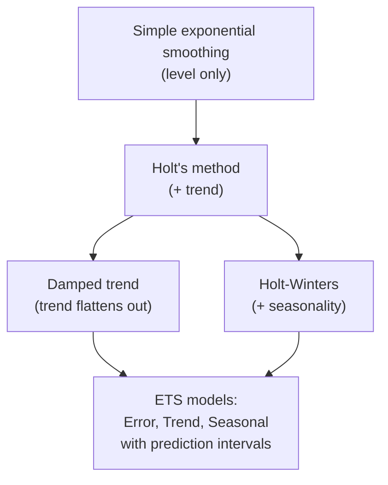
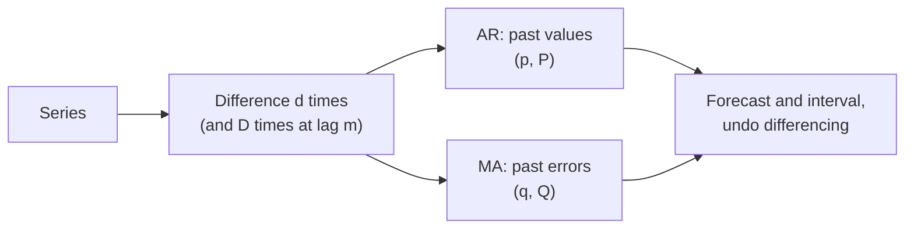

# Exponential smoothing, prediction intervals and ARIMA

The baselines of page 1 use either the last value or a plain average. **Exponential smoothing** sits in between: it averages all past values with weights that decrease the older a value is, and it extends naturally to trend and seasonality. Its statistical form, the **ETS** model, also gives **prediction intervals**: a range that should contain the future value with a stated probability. The page ends with a short outlook on **ARIMA**, the other classical family of forecasting models.

The code blocks build on each other; run them in order from the repository root. They continue the monthly series of BTI decisions of page 1 (EU member states without the United Kingdom, January 2010 to September 2026).



```python
import numpy as np
import pandas as pd
from statsmodels.tsa.exponential_smoothing.ets import ETSModel
from statsmodels.tsa.holtwinters import SimpleExpSmoothing
from statsmodels.tsa.statespace.sarimax import SARIMAX

counts = pd.read_parquet("case-study/data/monthly_counts.parquet")
y = (counts[counts["issuing_country"] != "GB"].groupby("month")["n_decisions"].sum()
     ["2010":"2026-09"].rename("decisions"))
y.index.freq = "MS"
train, test = y[:"2025-09"], y["2025-10":]
h = len(test)


def mae(actual, forecast):
    return np.mean(np.abs(np.asarray(actual) - np.asarray(forecast)))
```

## Exponential smoothing

### Concept

**Simple exponential smoothing** (SES) keeps one number, the **level** ℓ, and updates it after each observation:

ℓ_t = α·y_t + (1 − α)·ℓ_{t−1},  forecast ŷ_{T+h} = ℓ_T for every horizon h.

The **smoothing parameter** α (between 0 and 1) sets how fast the level reacts. Unrolling the formula shows that the weights on past values are α, α(1 − α), α(1 − α)², …: they decay exponentially. α = 1 gives the naive forecast; a small α gives a long, smooth average.

Worked example with α = 0.5, the series 10, 12, 11, 15 and a starting level of 10:

| t | y_t | ℓ_t = 0.5·y_t + 0.5·ℓ_{t−1} |
|---|---|---|
| 1 | 10 | 0.5·10 + 0.5·10 = 10 |
| 2 | 12 | 0.5·12 + 0.5·10 = 11 |
| 3 | 11 | 0.5·11 + 0.5·11 = 11 |
| 4 | 15 | 0.5·15 + 0.5·11 = 13 |

The forecast for t = 5, 6, … is 13.

Extensions add further smoothed components, each with its own parameter:

- **Holt's method** adds a **trend** b_t (the current slope); the forecast is ℓ_T + h·b_T, a straight line.
- A **damped trend** multiplies the slope by φ < 1 for each further step, so long-horizon forecasts flatten out instead of growing forever. Damped trends are a robust default for business series.
- **Holt–Winters** adds a **seasonal** component s_t with period m, added (additive) or multiplied (multiplicative).

The parameters are estimated by minimising the one-step-ahead forecast errors on the training data.

### Why it matters

Exponential smoothing is fast, needs little data, and its components (level, trend, seasonal pattern) can be explained to non-specialists. It performs well in forecasting competitions: in the M3 and M4 competitions, exponential smoothing methods and their combinations were among the strongest statistical approaches.

### How it works in Python

```python
# the worked example
tiny = pd.Series([10.0, 12.0, 11.0, 15.0])
ses = SimpleExpSmoothing(tiny, initialization_method="known", initial_level=10).fit(
    smoothing_level=0.5, optimized=False)
print(ses.forecast(2).to_list())          # [13.0, 13.0]

# damped trend + additive seasonality on log counts (multiplicative on the original scale)
ets = ETSModel(np.log(train), error="add", trend="add", damped_trend=True,
               seasonal="add", seasonal_periods=12).fit(disp=False)
print(dict(zip(ets.param_names[:4], ets.params[:4].round(3))))
# {'smoothing_level': 0.168, 'smoothing_trend': 0.0, 'smoothing_seasonal': 0.0, 'damping_trend': 0.874}
ets_fc = np.exp(ets.forecast(h))
print(f"ETS MAE {mae(test, ets_fc):.0f}")   # ETS MAE 282 (naive 349, seasonal naive 258)
```

The estimated α = 0.17 means the level moves slowly: each new month changes it by only 17 % of the surprise, which suits a noisy series around a stable level. The trend parameter is 0 and the damping 0.87, so the trend hardly matters; the seasonal pattern is fixed (γ = 0). In the hold-out year ETS (MAE 282) beats the flat baselines clearly but not the seasonal naive forecast (258). Page 3 checks whether that holds in other years.

### In practice

- **Inventory and supply chain.** Planning systems forecast demand for thousands of products with exponential smoothing because it is cheap to fit and update every week; Gardner (2006) reviews decades of such use.
- **Forecasting competitions.** The M3 competition (3,003 series) and the M4 competition (100,000 series) found that exponential smoothing and simple combinations were hard to beat (Makridakis and Hibon, 2000; Makridakis, Spiliotis and Assimakopoulos, 2020).
- **Open-source tools.** Nixtla's StatsForecast fits `AutoETS` models to millions of series in parallel; workbook 02 shows it on the classic air passengers data.

> [!WARNING]
> **A non-damped trend extrapolates forever.** Holt's linear trend fitted on a growth phase forecasts unlimited growth. Prefer a damped trend unless there is a reason to expect the trend to continue.

> [!TIP]
> When seasonal swings grow with the level, fit an additive model on the **log** of the series and transform back with `np.exp`, as above. This keeps forecasts positive, too.

## Prediction intervals

### Concept

A **point forecast** is a single number. A **prediction interval** gives a range that should contain the future value with a stated probability, for example 95 %. For the simplest ETS model (SES with normal errors of standard deviation σ), the 95 % interval h steps ahead is

ŷ_{T+h} ± 1.96 · σ · √(1 + (h − 1)·α²).

The interval widens with h, because the uncertainty about the level accumulates. Example: with σ = 300 decisions and α = 0.2, the half-width is 1.96·300 = 588 for h = 1 and 1.96·300·√(1 + 11·0.04) = 588·1.2 ≈ 706 for h = 12.

A prediction interval is not a **confidence interval**. A confidence interval describes uncertainty about a parameter (for example the mean number of decisions per month); a prediction interval describes where a single future observation will fall, so it is much wider.

A 95 % interval is **calibrated** if about 95 % of future values fall inside it. This **coverage** can be checked in a backtest (page 3).


### Why it matters

Decisions depend on the range more than on the point. A customs office that must answer BTI applications within the legal deadline is staffed for a high but plausible number of applications, not for the average. A forecast without an interval hides the most important information: how wrong it may be.

### How it works in Python

```python
pred = ets.get_prediction(start=test.index[0], end=test.index[-1])
frame = np.exp(pred.summary_frame(alpha=0.05))      # columns mean, pi_lower, pi_upper (back on counts)
print(frame.iloc[[0, -1]].round(0))
#               mean  pi_lower  pi_upper
# 2025-10-01  3627.0    3003.0    4379.0
# 2026-09-01  3588.0    2891.0    4454.0
inside = (test >= frame["pi_lower"]) & (test <= frame["pi_upper"])
print(inside.sum(), "of", h, "months inside the 95 % interval")   # 12 of 12 months inside
```

Twelve of twelve months fall inside, as hoped. The interval is about ±20 % of the point forecast and widens only a little with the horizon, because α is small: the level is estimated from many months and does not drift much. Intervals computed on the log scale are asymmetric on the original scale (the upper part is longer), which suits counts.

### In practice

- **Central banks.** The Bank of England publishes its inflation forecast as a "fan chart", in which shaded bands show the probability ranges; the format has been used since the 1990s.
- **Weather services.** Ensemble forecasts give probabilities and ranges ("70 % chance of rain"), and forecasters check their calibration systematically.
- **Capacity planning.** Call centres and hospitals plan staff for an upper quantile of the forecast demand, such as the 80th or 90th percentile.

> [!WARNING]
> **Model-based intervals are usually too narrow.** They assume the model is correct and the future behaves like the past. Structural breaks (a pandemic, a member state leaving the EU, a new nomenclature) are not in the interval. Check coverage in a backtest.

> [!TIP]
> Conformal prediction gives intervals with empirical coverage from backtest errors, for any model including gradient boosting. StatsForecast and MLForecast implement it (`ConformalIntervals`), and the Nixtla tutorials show how.

## ARIMA as an outlook

### Concept

**ARIMA(p, d, q)** models describe the autocorrelation of a series directly:

- **I** (integrated, d): difference the series d times to remove the trend (d = 1: monthly changes);
- **AR** (autoregressive, p): the differenced value depends linearly on its own p previous values;
- **MA** (moving average, q): and on the q previous forecast errors (not the same as the moving-average baseline).

**Seasonal ARIMA** adds the same terms at the seasonal lag, written (P, D, Q)_m. The classic "airline model" (0, 1, 1)(0, 1, 1)₁₂, introduced by Box and Jenkins for airline passenger numbers, differences once at lag 1 and once at lag 12 and has one MA term of each kind. Choosing p, d and q is traditionally done with the ACF and partial ACF; automatic methods (`AutoARIMA`) compare candidate models with an information criterion (AIC).



### Why it matters

ARIMA and exponential smoothing are the two standard statistical families for single series; each is equivalent to the other in some special cases, and neither dominates. ARIMA can include external predictors (ARIMAX, dynamic regression; FPP Chapter 10). This course stops at an outlook; the models are covered in depth in FPP Chapter 9.

### How it works in Python

```python
airline = SARIMAX(np.log(train), order=(0, 1, 1), seasonal_order=(0, 1, 1, 12)).fit(disp=False)
fc = airline.get_forecast(h)
arima_fc = np.exp(fc.predicted_mean)
print(f"airline model MAE {mae(test, arima_fc):.0f}")      # airline model MAE 285
interval = np.exp(fc.conf_int(alpha=0.05))                 # 95 % prediction interval
print(((test >= interval.iloc[:, 0]) & (test <= interval.iloc[:, 1])).sum(), "of 12 inside")   # 12 of 12 inside
```

The airline model is as accurate as ETS in the hold-out year (MAE 285 against 282) and also covers all twelve months. One year is one test, though; workbook 05 (statsmodels) and the cross-validation of workbook 08 (StatsForecast, with `AutoARIMA`) go further.

### In practice

- **Seasonal adjustment.** X-13ARIMA-SEATS, used by the US Census Bureau and many statistical offices, fits seasonal ARIMA models to extend series before adjusting them.
- **Macroeconomic forecasting.** ARIMA models are a standard benchmark in central bank and research forecasting exercises.
- **Large-scale forecasting.** Nixtla reports that its `AutoARIMA` was more accurate and much faster than Prophet on large collections of series (StatsForecast experiments repository).

> [!CAUTION]
> **Differencing at lag 12 and lag 1 amplifies recent changes.** Seasonal ARIMA models can react strongly to the last year, which is good after a lasting change and bad after a one-off spike.

*Practice (block 2):* fit exponential smoothing and compare it with the baselines: Part 2 of [10-case-study-decision-forecast.ipynb](../workbooks/10-case-study-decision-forecast.ipynb).

## Check your understanding

1. Continue the worked SES example with y₅ = 9. What is ℓ₅ and the forecast for t = 6? What would it be with α = 0.9?
2. Why does a damped trend often forecast better than a straight-line trend over twelve months?
3. A 95 % interval contains 12 of 12 actual values in one year. Is it calibrated? What would you need to know more?
4. Explain to the head of a customs office the difference between a confidence interval for the mean number of decisions per month and a prediction interval for next December.
5. What do the two "1" in the airline model (0, **1**, 1)(0, **1**, 1)₁₂ do to the series?

## Further reading

- Hyndman, R. J., Athanasopoulos, G., Garza, A., Challu, C., Mergenthaler, M. and Olivares, K. G. (2026). *Forecasting: Principles and Practice, the Pythonic Way*. OTexts. Chapters 8 (exponential smoothing) and 9 (ARIMA models). https://otexts.com/fpppy/
- statsmodels developers (2026). *Exponential smoothing* and *ETS models* (example notebooks). https://www.statsmodels.org/stable/examples/notebooks/generated/exponential_smoothing.html
- Gardner, E. S. (2006). Exponential smoothing: the state of the art, part II. *International Journal of Forecasting*, 22(4), 637–666. https://doi.org/10.1016/j.ijforecast.2006.03.005
