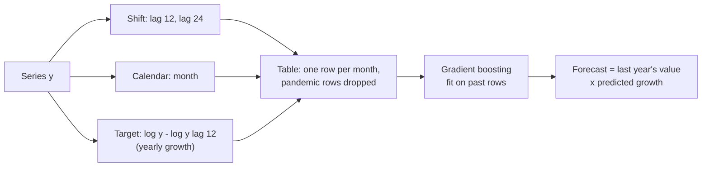
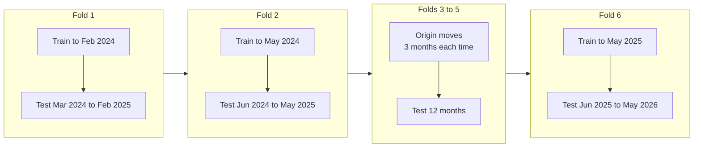
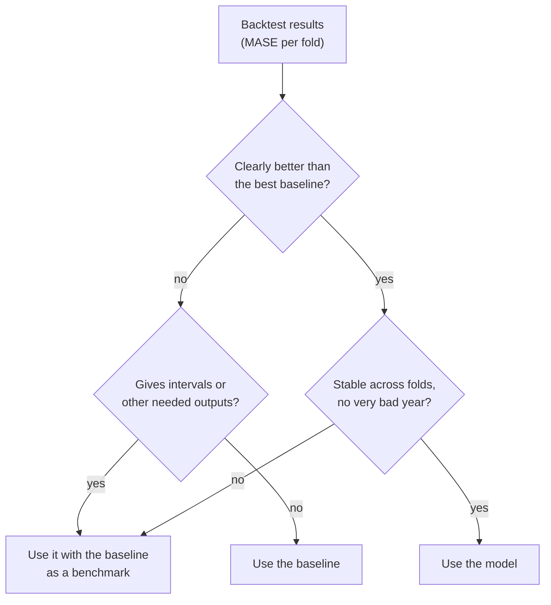

# Lag features, backtesting and forecast metrics

The last block brings forecasting back to the machine-learning tools of Sessions 8–10. A regression model can forecast once the series is turned into a table of **lag features**. To decide between the baselines, exponential smoothing, ARIMA and the machine-learning model, one hold-out year is not enough: **rolling-origin backtesting** repeats the test from several forecast origins. The errors are summarised with **MAE** and the scaled **MASE**, and the coverage of the prediction intervals is checked. A short test asks whether the Berlin weather of Session 2 improves the forecast. The page ends with a model recommendation and a forecast of the next twelve months of Airbnb reviews in Berlin.

The code blocks build on each other; run them in order from the repository root.

```python
import warnings

import numpy as np
import pandas as pd
from sklearn.ensemble import HistGradientBoostingRegressor
from statsmodels.tsa.exponential_smoothing.ets import ETSModel
from statsmodels.tsa.statespace.sarimax import SARIMAX

warnings.filterwarnings("ignore")                       # statsmodels convergence messages
pd.set_option("display.width", 150)
pd.set_option("display.max_columns", 10)
reviews = pd.read_parquet("case-study/data/airbnb/reviews_monthly.parquet")
y = reviews.groupby("month")["n_reviews"].sum()["2016":"2026-05"].rename("reviews")
y.index.freq = "MS"
log_y = np.log(y)
train, test = y[:"2025-05"], y["2025-06":]
covid = pd.Series((y.index >= "2020-03-01") & (y.index <= "2021-12-01"), index=y.index)   # the break
```

## Machine learning with lag features

### Concept

Any regression model forecasts if we turn the series into a table. Each row is a period t; the target is y_t; the features are **lags** (earlier values y_{t−k}) and **calendar features** such as the month. The rule: a feature may only use information that is available at the moment the forecast is made.

For a forecast of the next 12 months there are two strategies:

- **Direct**: use only lags of 12 or more. Then every feature is known for all 12 forecast months, and one model predicts all of them.
- **Recursive**: predict one month ahead with lags 1, 2, …, then feed the prediction back in as a lag for the next month. Errors can accumulate.

Small example: to predict March 2026 directly from a forecast origin at the end of May 2025, the features are lag 12 (March 2025) and lag 24 (March 2024), both known in May 2025. Lag 1 (February 2026) is not known in May 2025 and must not be used.

Tree ensembles (Session 10) cannot predict values outside the range of the training targets: a forest trained on months with at most 13,000 reviews never forecasts 15,000. On a growing series this is a real limitation. The remedy is to transform the target. Here the target is the **yearly growth** on the log scale, log y_t − log y_{t−12} (0.16 means about 17 % more than the same month a year earlier); the forecast is then last year's value times the predicted growth. Growth rates of the past *do* cover the range of future growth rates.

A break also damages lag features: a row whose target, lag 12 or lag 24 falls into the pandemic months describes a growth that will not repeat. Those rows are dropped, which leaves few rows for training.



### Why it matters

The table view lets forecasting use everything from Sessions 8–10: many series in one model, external features (prices, events, holidays, weather) and gradient boosting. Many top solutions of the M5 competition (Walmart sales, 42,840 series) were gradient-boosted trees on lag features (Makridakis, Spiliotis and Assimakopoulos, 2022). For a single short series, however, there is little for a flexible model to learn.

### How it works in Python

```python
frame = pd.DataFrame({"target": log_y - log_y.shift(12),            # yearly growth on the log scale
                      "lag12": log_y.shift(12), "lag24": log_y.shift(24), "month": y.index.month})
touched = covid | covid.shift(12, fill_value=False) | covid.shift(24, fill_value=False)
frame = frame[~touched].dropna()                                    # drop rows touched by the break
print(len(frame), frame.index[0].date(), frame.loc["2026-03-01"].round(2).to_dict())
# 55 2018-01-01 {'target': 0.16, 'lag12': 9.12, 'lag24': 8.94, 'month': 3.0}

fit_rows = frame.loc[:"2025-05"]
hgb = HistGradientBoostingRegressor(min_samples_leaf=5, random_state=0).fit(
    fit_rows.drop(columns="target"), fit_rows["target"])
lag_fc = np.exp(frame.loc[test.index, "lag12"] + hgb.predict(frame.loc[test.index].drop(columns="target")))
print(len(fit_rows), f"training rows, MAE {np.mean(np.abs(test - lag_fc)):.0f}")
# 43 training rows, MAE 1011
```

Of 125 months, only 55 rows survive: the first 24 months have no lag 24, and the pandemic touches the targets or lags of every month from March 2020 to December 2023. 43 rows remain for the hold-out fit. In the hold-out year the lag model (MAE 1,011) is about as good as the seasonal naive forecast times growth (1,038) and worse than ETS (851) and the airline model (450). `min_samples_leaf=5` is needed because the default of 20 leaves almost no splits on so few rows. Workbook 06 (scikit-learn) shows lag features with more data, and workbook 09 (MLForecast) builds them automatically for many series.

### In practice

- **Retail.** Top M5 solutions used LightGBM on lags, rolling means, prices and calendar events across thousands of products and stores, so that one model learns from many series.
- **Energy.** Load forecasts combine lagged load with temperature forecasts and calendar features (weekday, holidays); the scikit-learn example on bike-sharing demand (workbook 07) shows the same idea for hourly demand.
- **Hospitality.** Hotel and short-term rental demand models combine booking lags with calendar features such as school holidays, trade fairs and large events.

> [!WARNING]
> **Lag 1 in a 12-month-ahead forecast is leakage.** In the backtest the true value of last month is available, in reality it is not. Check for every feature: would I know this value on the day I make the forecast?

> [!CAUTION]
> **Rolling means must also be shifted.** A 3-month rolling mean that includes the target month uses the target to predict itself. Compute it on the shifted series: `y.shift(12).rolling(3).mean()`.

## Rolling-origin backtesting

### Concept

One hold-out year is one sample of forecast performance. **Rolling-origin backtesting** (also called time series cross-validation) repeats the evaluation: fit on all data up to a **forecast origin**, forecast the next h periods, move the origin forward, repeat. Each fold uses only the past to predict the future. With an **expanding window** the training data grow from fold to fold; with a **sliding window** they keep a fixed length.

The origin may move by a full horizon (non-overlapping test years, as `TimeSeriesSplit(n_splits=5, test_size=12)` in scikit-learn does) or by a smaller step, so that the test periods overlap. A smaller step gives more folds from a short history. Here the post-pandemic history is short: the first origin must leave ETS at least two full years since January 2022, so the origins move by three months, from March 2024 to June 2025: six folds of twelve months each, the last being the hold-out year of pages 1 and 2.



StatsForecast and MLForecast have `cross_validation` methods with a `step_size` argument that do the same for many series (workbooks 08 and 09).

### Why it matters

Forecast accuracy varies strongly from year to year. Backtesting shows how often a model beats the baseline and how large its worst errors are, instead of crowning the model that happened to fit one particular year. It is the forecasting version of the cross-validation of Session 7, with the order of time respected.

### How it works in Python

The function below returns the forecasts of six models for one fold: three baselines, ETS fitted since 2022, the airline model with the pandemic months marked as missing, and the lag model. ETS and the airline model also return their 95 % intervals.

```python
def forecasts(y_tr, test_index):
    n = len(test_index)
    ets = ETSModel(np.log(y_tr["2022":]), error="add", trend="add", damped_trend=True,
                   seasonal="add", seasonal_periods=12).fit(disp=False)
    pred = np.exp(ets.get_prediction(start=test_index[0], end=test_index[-1]).summary_frame(alpha=0.05))
    log_gap = np.log(y_tr).where(~covid[y_tr.index])                 # pandemic months -> NaN
    air = SARIMAX(log_gap, order=(0, 1, 1), seasonal_order=(0, 1, 1, 12)).fit(disp=False).get_forecast(n)
    rows = frame.loc[:y_tr.index[-1]]
    hgb = HistGradientBoostingRegressor(min_samples_leaf=5, random_state=0).fit(
        rows.drop(columns="target"), rows["target"])
    last_year = y_tr.iloc[-12:].to_numpy()
    point = {
        "naive": np.repeat(y_tr.iloc[-1], n),
        "seasonal naive": last_year,
        "seasonal naive x growth": last_year * last_year.sum() / y_tr.iloc[-24:-12].sum(),
        "ETS": pred["mean"].to_numpy(),
        "airline": np.exp(air.predicted_mean.to_numpy()),
        "lag model": np.exp(frame.loc[test_index, "lag12"]
                            + hgb.predict(frame.loc[test_index].drop(columns="target"))),
    }
    intervals = {"ETS": pred[["pi_lower", "pi_upper"]].to_numpy(),
                 "airline": np.exp(air.conf_int(alpha=0.05).to_numpy())}
    return point, intervals
```

## Forecast metrics: MAE and MASE

### Concept

- **MAE** = mean |y_t − ŷ_t|, in the units of the series. Easy to explain, but not comparable across series of different size (an error of 100 is large for a district with 300 reviews a month and tiny for the city with 12,000).
- **MASE** (mean absolute scaled error; Hyndman and Koehler, 2006) divides the MAE by the in-sample MAE of the seasonal naive forecast on the **training** data: scale = mean |y_t − y_{t−m}| over the training period. MASE < 1 means the forecast errs less than the seasonal naive forecast did, on average, in the past. MASE is comparable across series and well defined when values are close to zero.
- **Coverage** of a prediction interval is the share of actual values inside it; a 95 % interval should have coverage close to 0.95 over many forecasts.

Worked example: the training series 10, 12, 14, 11, 13, 15 with m = 3. The seasonal differences are |11 − 10|, |13 − 12|, |15 − 14| = 1, 1, 1, so the scale is 1. A forecast with MAE 1.5 on the test period has MASE 1.5: it errs 50 % more than seasonal naive did in-sample.

With a break in the training data the scale needs care: the seasonal differences of 2020 and 2021 are huge, which would make every model's MASE look small. The scale below uses the training months since January 2022 only, so the first differences are 2023 minus 2022.

### Why it matters

Scaled errors make results comparable across series and across folds with different levels, which is why forecasting competitions (M4) used MASE. Reporting MAE alongside keeps the result understandable ("about 500 reviews per month off").

### How it works in Python

```python
def mae(actual, forecast):
    return np.mean(np.abs(np.asarray(actual) - np.asarray(forecast)))


def mase(actual, forecast, y_tr, m=12):
    history = y_tr["2022":].to_numpy()                        # skip the pandemic years
    scale = np.mean(np.abs(history[m:] - history[:-m]))       # in-sample seasonal naive MAE
    return mae(actual, forecast) / scale


results = []
for origin in pd.date_range("2024-03-01", "2025-06-01", freq="3MS"):    # six forecast origins
    test_index = pd.date_range(origin, periods=12, freq="MS")
    y_tr, y_te = y[:origin - pd.offsets.MonthBegin()], y[test_index]
    point, intervals = forecasts(y_tr, test_index)
    for name, fc in point.items():
        row = {"test from": origin.strftime("%Y-%m"), "model": name,
               "MAE": mae(y_te, fc), "MASE": mase(y_te, fc, y_tr)}
        if name in intervals:
            lo, hi = intervals[name].T
            row["coverage"] = np.mean((y_te.to_numpy() >= lo) & (y_te.to_numpy() <= hi))
        results.append(row)
bt = pd.DataFrame(results)
print(bt.pivot(index="test from", columns="model", values="MASE").round(2))
# model       ETS  airline  lag model  naive  seasonal naive  seasonal naive x growth
# test from
# 2024-03    1.01     0.39       0.48   2.67            1.65                     0.57
# 2024-06    0.38     0.28       0.39   1.12            1.47                     0.41
# 2024-09    0.21     0.29       0.60   1.19            1.06                     0.36
# 2024-12    0.57     0.21       0.67   1.75            0.97                     0.53
# 2025-03    0.39     0.44       0.80   1.94            0.90                     0.74
# 2025-06    0.51     0.27       0.61   1.03            0.96                     0.63
print(bt.groupby("model")[["MAE", "MASE"]].mean().round(2).sort_values("MASE"))
#                              MAE  MASE
# model
# airline                   482.74  0.31
# ETS                       768.50  0.51
# seasonal naive x growth   836.94  0.54
# lag model                 933.56  0.59
# seasonal naive           1762.78  1.17
# naive                    2460.62  1.62
print(bt.groupby("model")["coverage"].mean().dropna().round(2).to_dict())   # {'ETS': 0.83, 'airline': 1.0}
```

### Does the Berlin weather add anything?

Session 2 fetched the daily Berlin weather from the Open-Meteo API with the question whether the weather explains how busy the Airbnb market is. `case-study/prepare_airbnb.py` stores the same data as `weather_daily.parquet` (temperature, rain and sunshine per day since 2016). The season of the weather is already in every model of this page: July is warm and busy every year, and the month feature, the seasonal naive rule and the seasonal part of ETS and of the airline model capture that. The question is whether the *deviations* help: does a warmer or drier month than usual bring more stays than the season alone suggests?

Two things must be separated. To **explain** the past, the observed weather of each month can be used. To **forecast** twelve months ahead, it cannot: weather forecasts reach about two weeks, so at the forecast origin the only honest value for next March is the usual March weather, the monthly mean of the training years (the **climate**). The backtest below runs both versions. With the observed weather of the test months it is an upper bound that no real forecast can reach; with the climate it is what a forecaster could actually do.

Two models get the weather. The lag model gets the change of monthly mean temperature and monthly rain against the same month a year earlier (its target is the growth against that month). The airline model gets the deviation from the usual month as exogenous variables (`exog` in `SARIMAX`); with the climate, the future deviation is zero.

```python
daily = pd.read_parquet("case-study/data/airbnb/weather_daily.parquet").set_index("date")
wx = daily.resample("MS").agg({"temperature_2m_mean": "mean", "precipitation_sum": "sum"}).loc[y.index]
wx.columns = ["temp", "rain"]                                       # °C (monthly mean), mm (monthly total)
pairs = pd.concat([(log_y - log_y.shift(12)).rename("growth"), wx - wx.shift(12)], axis=1)[~touched].dropna()
print(len(pairs), pairs.corr()["growth"].round(2).to_dict())        # growth against change of the weather
# 67 {'growth': 1.0, 'temp': 0.08, 'rain': 0.06}


def weather_change(y_tr, known):
    """Weather minus the same month a year earlier. After the origin the weather is the observed one
    (known="actual": not available when the forecast is made) or the monthly mean of the training years."""
    w = wx.copy()
    later = w.index > y_tr.index[-1]
    if known == "climate":
        past = wx[:y_tr.index[-1]]
        w.loc[later] = past.groupby(past.index.month).mean().loc[w.index[later].month].to_numpy()
    return (w - wx.shift(12)).add_prefix("change_")


def lag_model_weather(y_tr, test_index, known):
    table = frame.join(weather_change(y_tr, known))
    rows = table.loc[:y_tr.index[-1]]
    hgb = HistGradientBoostingRegressor(min_samples_leaf=5, random_state=0).fit(
        rows.drop(columns="target"), rows["target"])
    return np.exp(table.loc[test_index, "lag12"] + hgb.predict(table.loc[test_index].drop(columns="target")))


def airline_weather(y_tr, test_index, known):
    past = wx[:y_tr.index[-1]]
    anomaly = wx - past.groupby(past.index.month).mean().loc[wx.index.month].to_numpy()   # vs the usual month
    future = anomaly.loc[test_index] if known == "actual" else 0 * anomaly.loc[test_index]
    log_gap = np.log(y_tr).where(~covid[y_tr.index])
    air = SARIMAX(log_gap, exog=anomaly.loc[y_tr.index], order=(0, 1, 1),
                  seasonal_order=(0, 1, 1, 12)).fit(disp=False)
    return np.exp(air.forecast(len(test_index), exog=future))


rows = []
for origin in pd.date_range("2024-03-01", "2025-06-01", freq="3MS"):    # the same six folds
    test_index = pd.date_range(origin, periods=12, freq="MS")
    y_tr, y_te = y[:origin - pd.offsets.MonthBegin()], y[test_index]
    for known in ("actual", "climate"):
        rows.append({"model": f"airline + weather ({known})",
                     "MASE": mase(y_te, airline_weather(y_tr, test_index, known), y_tr)})
        rows.append({"model": f"lag model + weather ({known})",
                     "MASE": mase(y_te, lag_model_weather(y_tr, test_index, known), y_tr)})
with_weather = pd.concat([bt.loc[bt["model"].isin(["airline", "lag model"]), ["model", "MASE"]], pd.DataFrame(rows)])
print(with_weather.groupby("model")["MASE"].agg(["mean", "max"]).round(2))
#                                mean   max
# model
# airline                        0.31  0.44
# airline + weather (actual)     0.36  0.69
# airline + weather (climate)    0.36  0.69
# lag model                      0.59  0.80
# lag model + weather (actual)   0.63  0.85
# lag model + weather (climate)  0.64  0.89

anomaly = wx - wx.groupby(wx.index.month).transform("mean")
fit = SARIMAX(log_y.where(~covid), exog=anomaly, order=(0, 1, 1), seasonal_order=(0, 1, 1, 12)).fit(disp=False)
print(fit.params[["temp", "rain"]].round(4).to_dict(), fit.pvalues[["temp", "rain"]].round(2).to_dict())
# {'temp': 0.0039, 'rain': -0.0002} {'temp': 0.21, 'rain': 0.38}
```

**The weather does not improve the forecast, not even with the weather that actually happened.** The yearly growth of the reviews hardly moves with the change of the weather (correlations 0.08 and 0.06 over 67 months). In the backtest, both models get slightly *worse* with weather (airline 0.36 instead of 0.31 mean MASE, lag model 0.63–0.64 instead of 0.59); the observed and the climate version are almost equal, so the weather values themselves carry almost no information, and the extra parameters only make the fit less stable (the airline fold from March 2025 rises from 0.44 to 0.69). Fitted on all months, a month 1 °C warmer than usual comes with 0.4 % more reviews (p = 0.21), while the typical one-month-ahead error of the model is about 7 %.

Plausible reasons, worth stating in a report: most stays are booked weeks or months ahead, when the weather of the stay is not yet known; a month is a long time, so a few rainy days hardly change its mean; Berlin is visited for the city, events and trade fairs more than for the beach; and reviews are written days after the stay, which blurs the link further. The test also has limits: monthly totals and six folds can only detect a large effect. Daily data (bookings from the `calendar` table, rain on the day) could show a short-term effect that the monthly series hides, and for that the forecast of the coming two weeks would be usable. The decision for this forecast is clear: **leave the weather out**, and say in the report that it was tested.

### Reading the backtest and recommending a model

- **The airline model with the pandemic marked as missing is best on average and never bad.** Its mean MASE is 0.31; it is the best model in four of the six folds, and its worst fold (0.44) is better than the average of every other model. It uses the whole history except the break.
- **ETS fitted since 2022 is second, but unstable.** Its mean MASE is 0.51, it wins two folds, but in the first fold, with only 26 months of training data, it is worse than seasonal naive times growth (1.01 against 0.57). A short history makes the trend estimate fragile.
- **Simple rules are hard to beat.** Seasonal naive times growth (MASE 0.54) is almost as good as ETS and better than the lag model (0.59). Plain seasonal naive (1.17) and naive (1.62) are worse than the in-sample seasonal naive scale: they ignore growth or season.
- **The lag model loses to a spreadsheet rule.** With 28 to 43 training rows there is little for gradient boosting to learn beyond what "last year times growth" already says.
- **The weather adds nothing.** Neither the observed weather nor the climate improves the airline or the lag model (previous section).
- **The intervals differ in quality.** ETS covered 83 % of the test months for a nominal 95 %: too narrow. The airline intervals covered all of them (100 %), at the cost of being wide.

A defensible recommendation: **the airline model on log counts, with March 2020 to December 2021 marked as missing**, reported with its 95 % interval, because it has the lowest error in all but two folds and its intervals were never too narrow. Report seasonal naive times growth as the benchmark everybody understands, state the assumption about the pandemic months, and refit every month. The forecast for the next twelve months, fitted on all data up to May 2026:

```python
log_gap = log_y.where(~covid)
final = SARIMAX(log_gap, order=(0, 1, 1), seasonal_order=(0, 1, 1, 12)).fit(disp=False)
fc = final.get_forecast(12)                                         # June 2026 to May 2027
outlook = pd.DataFrame({"mean": np.exp(fc.predicted_mean)}).join(np.exp(fc.conf_int(alpha=0.05)))
outlook.columns = ["mean", "pi_lower", "pi_upper"]
print(outlook.loc[["2026-07-01", "2026-12-01", "2027-05-01"]].round(0))
#                mean  pi_lower  pi_upper
# 2026-07-01  16130.0   13640.0   19074.0
# 2026-12-01  11307.0    8504.0   15033.0
# 2027-05-01  17910.0   12420.0   25827.0
print(round(outlook["mean"].sum()), y["2025-06":].sum())   # 168301 137595: +22 % on the last 12 months
```

The model expects about 168,000 reviews from June 2026 to May 2027, 22 % more than in the last twelve months, which continues the growth of recent years. Three caveats belong in the report, next to the numbers. First, reviews are a proxy for stays, and the series overstates growth because listings that left the platform are missing from the snapshot (page 1). Second, May 2026 was unusually high (15,024 reviews, +25 % on May 2025); the airline model reacts strongly to the last months, so a single high month raises the whole forecast. Third, the new EU rules on short-term rental registration apply since 20 May 2026; if they remove listings, the next months will fall below the interval, and the model should be refitted, or the change modelled as a new break. The intervals are for single months. The interval for the twelve-month total is not the sum of the monthly limits (errors partly cancel); it would need a simulation from the model.



### In practice

- **Forecasting competitions.** The M4 competition ranked methods by a combination of MASE and the symmetric MAPE; the M5 accuracy track used a scaled squared error (RMSSE) for the same reason (Makridakis, Spiliotis and Assimakopoulos, 2020; 2022).
- **Energy trading and grid operation.** Load and price models are backtested on many past days, with coverage of the forecast quantiles checked, before they are used for bidding.
- **Central banks** evaluate forecasting models in real-time out-of-sample exercises that reproduce, at each origin, only the data known at that date.

> [!WARNING]
> **Never use shuffled k-fold cross-validation on a time series.** It puts later months into the training folds, and the error looks better than it will be in use.

> [!CAUTION]
> **Tuning on the backtest makes it optimistic.** If you choose hyperparameters, the model or the treatment of the break on the same folds you report, hold out a final period or report the result as a model-selection result, not as an estimate of future accuracy. The choices of this page (start ETS in 2022, mark March 2020 to December 2021 as missing) were made after looking at the series, so the backtest numbers are somewhat optimistic.

*Practice (block 3):* case study: backtest the models, test whether the Berlin weather adds anything, and recommend one with its prediction interval: Part 3 of [10-case-study-airbnb-review-forecast.ipynb](../workbooks/10-case-study-airbnb-review-forecast.ipynb).

## Check your understanding

1. For a forecast made at the end of May 2026 for March 2027, which of these features may be used: lag 1, lag 6, lag 12, the month, a 3-month rolling mean of the shifted series `y.shift(12)`?
2. Why can a gradient-boosting model trained on months with at most 13,000 reviews not forecast 15,000? How does the growth target change this?
3. Compute the MASE scale for the training series 5, 7, 6, 8, 9, 7 with m = 2.
4. Why does the MASE scale on this page skip the years 2020 and 2021? What would happen to the MASE of every model otherwise?
5. A colleague reports that the forecast improves a lot when the observed temperature of the test months is added. Why is that comparison not fair, and which weather values could the forecast really use at the origin?
6. ETS won the hold-out year against seasonal naive times growth, but lost the first fold clearly. Which evidence do you trust more, and why?

## Further reading

- Hyndman, R. J., Athanasopoulos, G., Garza, A., Challu, C., Mergenthaler, M. and Olivares, K. G. (2026). *Forecasting: Principles and Practice, the Pythonic Way*. OTexts. Chapter 5 (the forecaster's toolbox: evaluating accuracy, time series cross-validation). https://otexts.com/fpppy/
- Hyndman, R. J. and Koehler, A. B. (2006). Another look at measures of forecast accuracy. *International Journal of Forecasting*, 22(4), 679–688. https://doi.org/10.1016/j.ijforecast.2006.03.001
- Makridakis, S., Spiliotis, E. and Assimakopoulos, V. (2022). M5 accuracy competition: results, findings, and conclusions. *International Journal of Forecasting*, 38(4), 1346–1364. https://doi.org/10.1016/j.ijforecast.2021.11.013
- scikit-learn developers (2026). *Time-related feature engineering* (example). https://scikit-learn.org/stable/auto_examples/applications/plot_cyclical_feature_engineering.html
