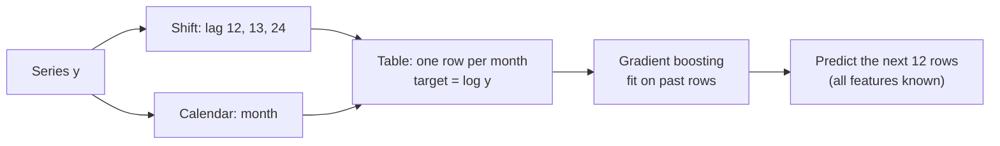
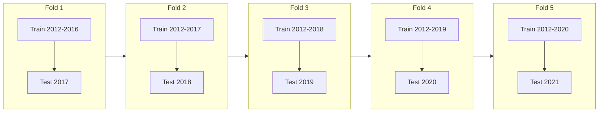
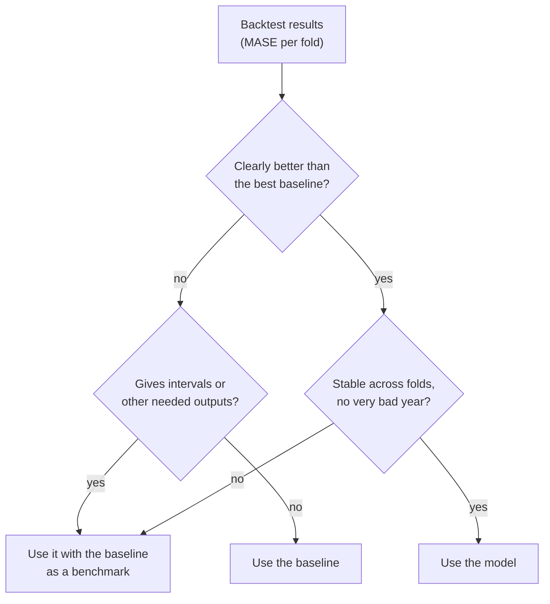

# Lag features, backtesting and forecast metrics

The last block brings forecasting back to the machine-learning tools of Sessions 8–10. A regression model can forecast once the series is turned into a table of **lag features**. To decide between the baselines, exponential smoothing and the machine-learning model, one hold-out year is not enough: **rolling-origin backtesting** repeats the test over several years. The errors are summarised with **MAE** and the scaled **MASE**, and the coverage of the prediction intervals is checked. The page ends with a model recommendation for the review series.

The code blocks build on each other; run them in order from the repository root.

```python
import numpy as np
import pandas as pd
from sklearn.ensemble import HistGradientBoostingRegressor
from sklearn.model_selection import TimeSeriesSplit
from statsmodels.tsa.exponential_smoothing.ets import ETSModel

pd.set_option("display.width", 120)
reviews = pd.read_parquet("case-study/data/train.parquet", columns=["date"])
y = reviews.set_index("date").resample("MS").size()["2012":"2021"].rename("reviews")
y.index.freq = "MS"
log_y = np.log(y)
train, test = y[:"2020"], y["2021"]
```

## Machine learning with lag features

### Concept

Any regression model forecasts if we turn the series into a table. Each row is a period t; the target is y_t; the features are **lags** (earlier values y_{t−k}) and **calendar features** such as the month. The rule: a feature may only use information that is available at the moment the forecast is made.

For a forecast of the next 12 months there are two strategies:

- **Direct**: use only lags of 12 or more. Then every feature is known for all 12 forecast months, and one model predicts all of them.
- **Recursive**: predict one month ahead with lags 1, 2, …, then feed the prediction back in as a lag for the next month. Errors can accumulate.

Small example: to predict March 2021 directly 12 months ahead, the features are lag 12 (March 2020), lag 13 (February 2020) and lag 24 (March 2019), all known in December 2020. Lag 1 (February 2021) is not known in December 2020 and must not be used.

Tree ensembles (Session 10) cannot predict values outside the range of the training targets: a forest trained up to a level of 7,000 never forecasts 8,000. On trending series this is a real limitation; transforming the target (logs, differences, growth rates) helps.



### Why it matters

The table view lets forecasting use everything from Sessions 8–10: many series in one model, external features (prices, promotions, holidays, weather) and gradient boosting. Many top solutions of the M5 competition (Walmart sales, 42,840 series) were gradient-boosted trees on lag features (Makridakis, Spiliotis and Assimakopoulos, 2022). For a single short series, however, there is little for a flexible model to learn.

### How it works in Python

```python
frame = pd.DataFrame({"target": log_y})
for lag in (12, 13, 24):                       # only values known 12 months before the target month
    frame[f"lag{lag}"] = log_y.shift(lag)
frame["month"] = frame.index.month
frame = frame.dropna()                         # the first 24 months have no lag 24
print(frame.loc["2021-03-01"].round(2).to_dict())
# {'target': 8.91, 'lag12': 8.59, 'lag13': 8.8, 'lag24': 8.34, 'month': 3.0}

X_train, y_train = frame.loc[:"2020"].drop(columns="target"), frame.loc[:"2020", "target"]
X_test = frame.loc["2021"].drop(columns="target")
hgb = HistGradientBoostingRegressor(min_samples_leaf=5, random_state=0).fit(X_train, y_train)
lag_fc = pd.Series(np.exp(hgb.predict(X_test)), index=test.index)
print(len(X_train), f"training rows, MAE {np.mean(np.abs(test - lag_fc)):.0f}")
# 84 training rows, MAE 1722
```

84 training rows remain, and the lag model is worse in 2021 than all baselines of page 1 (naive 1,162). `min_samples_leaf=5` is needed because the default of 20 leaves almost no splits on so few rows. Workbook 06 (scikit-learn) shows lag features with more data, and workbook 09 (MLForecast) builds them automatically for many series.

### In practice

- **Retail.** Top M5 solutions used LightGBM on lags, rolling means, prices and calendar events across thousands of products and stores, so that one model learns from many series.
- **Energy.** Load forecasts combine lagged load with temperature forecasts and calendar features (weekday, holidays); the scikit-learn example on bike-sharing demand (workbook 07) shows the same idea for hourly demand.
- **Hospitals.** Emergency department arrivals are forecast from lags, weekday, holidays and weather.

> [!WARNING]
> **Lag 1 in a 12-month-ahead forecast is leakage.** In the backtest the true value of last month is available, in reality it is not. Check for every feature: would I know this value on the day I make the forecast?

> [!CAUTION]
> **Rolling means must also be shifted.** A 3-month rolling mean that includes the target month uses the target to predict itself. Compute it on the shifted series: `y.shift(12).rolling(3).mean()`.

## Rolling-origin backtesting

### Concept

One hold-out year is one sample of forecast performance. **Rolling-origin backtesting** (also called time series cross-validation) repeats the evaluation: fit on all data up to a **forecast origin**, forecast the next h periods, move the origin forward, repeat. Each fold uses only the past to predict the future. With an **expanding window** the training data grow from fold to fold; with a **sliding window** they keep a fixed length.



scikit-learn's `TimeSeriesSplit(n_splits=5, test_size=12)` produces exactly these five folds on 120 months. StatsForecast and MLForecast have `cross_validation` methods that do the same for many series (workbooks 08 and 09).

### Why it matters

Forecast accuracy varies strongly from year to year. Backtesting shows how often a model beats the baseline and how large its worst errors are, instead of crowning the model that happened to fit one particular year. It is the forecasting version of the cross-validation of Session 7, with the order of time respected.

### How it works in Python

The function below returns the forecasts of four models for one fold. The lag model reuses the table `frame` built above; ETS also returns its 95 % interval.

```python
def forecasts(y_tr, test_index):
    ets = ETSModel(np.log(y_tr), error="add", trend="add", damped_trend=True,
                   seasonal="add", seasonal_periods=12).fit(disp=False)
    pred = np.exp(ets.get_prediction(start=test_index[0], end=test_index[-1]).summary_frame(alpha=0.05))
    rows = frame.loc[:y_tr.index[-1]]
    hgb = HistGradientBoostingRegressor(min_samples_leaf=5, random_state=0).fit(
        rows.drop(columns="target"), rows["target"])
    point = {
        "naive": np.repeat(y_tr.iloc[-1], len(test_index)),
        "seasonal naive": y_tr.iloc[-12:].to_numpy(),
        "ETS": pred["mean"].to_numpy(),
        "lag model": np.exp(hgb.predict(frame.loc[test_index].drop(columns="target"))),
    }
    return point, pred[["pi_lower", "pi_upper"]]
```

## Forecast metrics: MAE and MASE

### Concept

- **MAE** = mean |y_t − ŷ_t|, in the units of the series. Easy to explain, but not comparable across series of different size (an error of 100 is large for a product with 50 sales a month and tiny for one with 50,000).
- **MASE** (mean absolute scaled error; Hyndman and Koehler, 2006) divides the MAE by the in-sample MAE of the seasonal naive forecast on the **training** data: scale = mean |y_t − y_{t−m}| over the training period. MASE < 1 means the forecast errs less than the seasonal naive forecast did, on average, in the past. MASE is comparable across series and well defined when values are close to zero.
- **Coverage** of a prediction interval is the share of actual values inside it; a 95 % interval should have coverage close to 0.95 over many forecasts.

Worked example: the training series 10, 12, 14, 11, 13, 15 with m = 3. The seasonal differences are |11 − 10|, |13 − 12|, |15 − 14| = 1, 1, 1, so the scale is 1. A forecast with MAE 1.5 on the test period has MASE 1.5: it errs 50 % more than seasonal naive did in-sample.

### Why it matters

Scaled errors make results comparable across series and across folds with different levels, which is why forecasting competitions (M4) used MASE. Reporting MAE alongside keeps the result understandable ("about 900 reviews per month off").

### How it works in Python

```python
def mae(actual, forecast):
    return np.mean(np.abs(np.asarray(actual) - np.asarray(forecast)))


def mase(actual, forecast, y_tr, m=12):
    history = np.asarray(y_tr)
    scale = np.mean(np.abs(history[m:] - history[:-m]))     # in-sample seasonal naive MAE
    return mae(actual, forecast) / scale


results = []
for train_idx, test_idx in TimeSeriesSplit(n_splits=5, test_size=12).split(y):
    y_tr, y_te = y.iloc[train_idx], y.iloc[test_idx]
    point, interval = forecasts(y_tr, y_te.index)
    covered = ((y_te >= interval["pi_lower"]) & (y_te <= interval["pi_upper"])).mean()
    for name, fc in point.items():
        results.append({"year": y_te.index[0].year, "model": name, "MAE": mae(y_te, fc),
                        "MASE": mase(y_te, fc, y_tr), "ETS coverage": covered})
bt = pd.DataFrame(results)
print(bt.pivot(index="year", columns="model", values="MASE").round(2))
# model    ETS  lag model  naive  seasonal naive
# year
# 2017    0.92       0.47   0.64            0.65
# 2018    0.79       0.62   0.72            0.69
# 2019    1.18       0.89   1.17            1.27
# 2020    0.90       2.13   0.92            1.73
# 2021    1.06       1.69   1.14            1.42
print(bt.groupby("model")[["MAE", "MASE"]].mean().round(2))
#                     MAE  MASE
# model
# ETS              931.27  0.97
# lag model       1112.50  1.16
# naive            881.17  0.92
# seasonal naive  1100.38  1.15
print(bt.groupby("year")["ETS coverage"].first().to_list())   # [1.0, 1.0, 1.0, 1.0, 1.0]
```

### Reading the backtest and recommending a model

- **No model wins every year.** The lag model is best from 2017 to 2019, when growth was steady, and worst in 2020 and 2021, when the series broke its pattern; trees cannot extrapolate beyond the levels they have seen.
- **Naive and ETS are close on average** (MASE 0.92 and 0.97). The difference is smaller than the spread across years.
- **The ETS intervals covered every month in every fold.** A 95 % interval that never misses is probably too wide; with 60 test months we would expect about three misses.

A defensible recommendation for the monthly review forecast: **damped ETS on log counts**, reported with its 95 % interval, because its accuracy matches the best baseline, it models the January peak explicitly, and it provides an interval that has held in five out of five backtest years. Report it together with the naive forecast as a benchmark, state that the intervals are conservative, and refit every month.



### In practice

- **Forecasting competitions.** The M4 competition ranked methods by a combination of MASE and the symmetric MAPE; the M5 accuracy track used a scaled squared error (RMSSE) for the same reason (Makridakis, Spiliotis and Assimakopoulos, 2020; 2022).
- **Energy trading and grid operation.** Load and price models are backtested on many past days, with coverage of the forecast quantiles checked, before they are used for bidding.
- **Central banks** evaluate forecasting models in real-time out-of-sample exercises that reproduce, at each origin, only the data known at that date.

> [!WARNING]
> **Never use shuffled k-fold cross-validation on a time series.** It puts later months into the training folds, and the error looks better than it will be in use.

> [!CAUTION]
> **Tuning on the backtest makes it optimistic.** If you choose hyperparameters (or the model) on the same folds you report, hold out a final period or report the result as a model-selection result, not as an estimate of future accuracy.

*Practice (block 3):* case study: backtest the models and recommend one with its prediction interval: Part 3 of [10-case-study-review-forecast.ipynb](../workbooks/10-case-study-review-forecast.ipynb).

## Check your understanding

1. For a forecast made on 31 December 2020 for June 2021, which of these features may be used: lag 1, lag 6, lag 12, the month, a 3-month rolling mean of the shifted series `y.shift(12)`?
2. Why can a gradient-boosting model trained on levels up to 7,000 not forecast 8,000? How does a log transform or a growth target change this?
3. Compute the MASE scale for the training series 5, 7, 6, 8, 9, 7 with m = 2.
4. Model A has a mean MASE of 0.92, model B 0.97, and the MASE of each varies between 0.6 and 1.2 across years. Would you call A better? What else would you report?
5. A 95 % interval covers 60 of 60 test months. Is that good news? What would you do?

## Further reading

- Hyndman, R. J., Athanasopoulos, G., Garza, A., Challu, C., Mergenthaler, M. and Olivares, K. G. (2026). *Forecasting: Principles and Practice, the Pythonic Way*. OTexts. Chapter 5 (the forecaster's toolbox: evaluating accuracy, time series cross-validation). https://otexts.com/fpppy/
- Hyndman, R. J. and Koehler, A. B. (2006). Another look at measures of forecast accuracy. *International Journal of Forecasting*, 22(4), 679–688. https://doi.org/10.1016/j.ijforecast.2006.03.001
- Makridakis, S., Spiliotis, E. and Assimakopoulos, V. (2022). M5 accuracy competition: results, findings, and conclusions. *International Journal of Forecasting*, 38(4), 1346–1364. https://doi.org/10.1016/j.ijforecast.2021.11.013
- scikit-learn developers (2026). *Time-related feature engineering* (example). https://scikit-learn.org/stable/auto_examples/applications/plot_cyclical_feature_engineering.html
