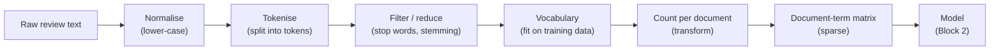
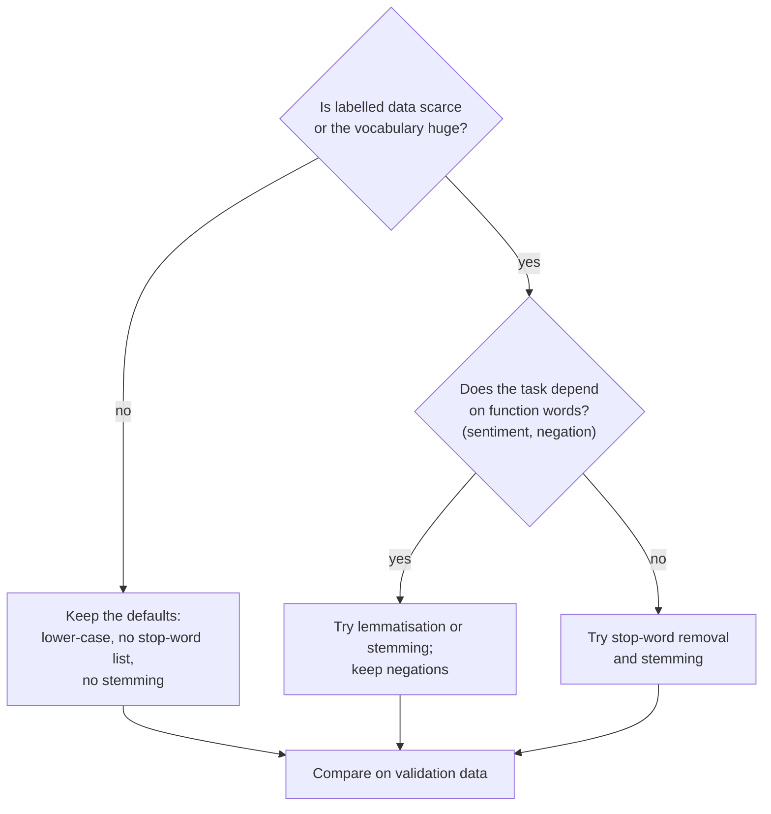

# Text as data: tokens, vocabulary and the document-term matrix

A statistical model needs numbers, but a review is a string of characters. This page shows the first and most important step of every text model: turning documents into a table of counts. It covers the vocabulary of a corpus, the usual preprocessing steps, the bag-of-words representation computed by hand and with scikit-learn, and the sparse matrices that make this representation fit into memory. The choices made here decide what any later model can and cannot see, from logistic regression in this session to the language models of Session 14.

The code blocks on this page build on each other; run them in order from the repository root (see the session [README](../README.md#setup) for the environment).



## Documents, tokens and vocabulary

### Concept

A **corpus** is a collection of texts. Each text in it is a **document**; in the case study one document is one review (title plus text). A **token** is one unit of text after splitting, usually a word, sometimes a number or a punctuation mark. A **type** is a distinct token: in "the pump works and the pump hums" there are seven tokens but only five types (`the`, `pump`, `works`, `and`, `hums`). The **vocabulary** is the set of types the model knows, and each type gets one fixed column number.

Worked example, by hand:

| Document | Tokens |
|---|---|
| d1 = "The pump works well." | the, pump, works, well |
| d2 = "The pump does not work." | the, pump, does, not, work |

Together the two documents have 9 tokens and 7 types. Sorted alphabetically, the vocabulary is `does, not, pump, the, well, work, works`; `does` is column 0 and `works` column 6. Note that `work` and `works` are two different types: the computer does not know they are related.

In scikit-learn the vocabulary is learned by `fit` and applied by `transform`. A word that did not occur during `fit` has no column, so it is silently ignored later. This is the **out-of-vocabulary** problem: new product names or misspellings in the test reviews are invisible to the model.

### Why it matters

Every text model starts by splitting text into tokens and mapping them to numbers. If the vocabulary is learned from the wrong data (for example from training and test reviews together) information leaks from the test set. If it is learned from too little data, many words in new documents are out of vocabulary. The size of the vocabulary also sets the number of model parameters: a linear model has one weight per vocabulary entry and class.

### How it works in Python

```python
from collections import Counter

import pandas as pd
from sklearn.feature_extraction.text import CountVectorizer

docs = ["The pump works well.", "The pump does not work."]
tokens = [d.lower().replace(".", "").split() for d in docs]
print(tokens[1])                          # ['the', 'pump', 'does', 'not', 'work']
print(Counter(tokens[0] + tokens[1]).most_common(2))   # [('the', 2), ('pump', 2)]
vocab = sorted(set(tokens[0]) | set(tokens[1]))
print(len(vocab), vocab)   # 7 ['does', 'not', 'pump', 'the', 'well', 'work', 'works']

cv = CountVectorizer()                    # the same steps in one object
cv.fit(docs)                              # learn the vocabulary
print(cv.vocabulary_["works"])            # 6: the column of 'works'
print(cv.transform(["The pump broke."]).toarray())
# [[0 0 1 1 0 0 0]]: 'broke' is out of vocabulary and simply disappears

# the case-study corpus: one document = title + text
reviews = pd.read_parquet("case-study/data/train_sample.parquet")
texts = reviews["title"] + " " + reviews["text"]
n_tokens = texts.str.split().str.len()
print(len(texts), int(n_tokens.sum()))    # 50000 documents, about 2.0 million tokens
print(n_tokens.median())                  # 24.0: half of all reviews are very short
```

### In practice

- Search engines such as Elasticsearch and Apache Lucene pass every indexed document through an *analyzer* that tokenises and normalises it before the index is built; the query goes through the same analyzer so that query tokens and document tokens match.
- In political science, Grimmer and Stewart (2013) review the "text as data" approach, in which speeches, party manifestos and press releases are analysed through their word counts.
- Mosteller and Wallace (1964) attributed the disputed *Federalist Papers* to James Madison by comparing how often the candidate authors used common words such as "upon" and "whilst". This is one of the earliest statistical studies that treated text as counts.

> [!WARNING]
> **Fit the vocabulary on training data only.** If `fit` sees the validation or test documents, the vocabulary (and later the TF-IDF weights) contain information from data the model should not have seen. Put the vectoriser inside a scikit-learn `Pipeline`, so that cross-validation refits it on each training fold (Session 7).

## Preprocessing: lower-casing, stop words, stemming and lemmatisation

### Concept

Preprocessing maps different surface forms to one form, so that the vocabulary becomes smaller and counts become more reliable.

- **Normalisation** maps different spellings to one form. The most common step is **lower-casing** ("Great", "GREAT" → "great"). Others are removing accents, URLs or HTML tags.
- **Tokenisation** splits text into tokens. scikit-learn's default pattern `(?u)\b\w\w+\b` keeps runs of two or more letters or digits. As a result "I've" becomes `ve`, "3" disappears and "doesn't" becomes `doesn` (the `t` is a single letter and is dropped).
- **Stop words** are very frequent function words ("the", "and", "for", "these") that carry little content. Removing them shrinks the vocabulary. scikit-learn ships a list of 318 English stop words.
- **Stemming** cuts word endings with fixed rules. The Porter stemmer (Porter, 1980) maps "works", "working" and "worked" to `work`, but also "batteries" to `batteri`. A stem need not be a real word.
- **Lemmatisation** looks a word up together with its part of speech (noun, verb, ...) and returns its dictionary form, the **lemma**: "batteries" → `battery`, "was" → `be`, "dying" → `die`. It needs a trained language pipeline such as spaCy's, is slower than stemming and more accurate.

Worked example for the sentence "I've used these Vitamins for 3 months - NOT impressed!!":

| Step | Result |
|---|---|
| lower-case and tokenise | ve, used, these, vitamins, for, months, not, impressed |
| remove stop words | ve, used, vitamins, months, impressed |
| stem (Porter) | ve, use, vitamin, month, impress |

The stop-word step has removed `not`, and with it the opinion of the sentence.

| Step | Vocabulary | Information lost | Cost |
|---|---|---|---|
| lower-casing | smaller | "US" vs "us", shouting in capitals | none |
| stop-word removal | smaller | negation ("not", "no", "never"), pronouns | none |
| stemming | much smaller | some distinct words merge ("universe", "university" → `univers`) | fast |
| lemmatisation | smaller | little | needs a language model; slower |



### Why it matters

Preprocessing reduces the number of columns and merges forms that mean the same thing, which helps when there are few labelled documents. Every step also removes information. For sentiment, the default English stop-word list is harmful because it contains "not", "no" and "never". Whether a step helps is therefore an empirical question: test it on validation data instead of applying it by habit. With 50,000 reviews and TF-IDF, light preprocessing (lower-casing only) is usually as good as or better than heavy preprocessing.

### How it works in Python

```python
import re

from nltk.stem import PorterStemmer          # pure Python; no data download needed
from sklearn.feature_extraction.text import ENGLISH_STOP_WORDS

text = "I've used these Vitamins for 3 months - NOT impressed!!"
tokens = re.findall(r"(?u)\b\w\w+\b", text.lower())    # scikit-learn's default token pattern
print(tokens)   # ['ve', 'used', 'these', 'vitamins', 'for', 'months', 'not', 'impressed']
print([t for t in tokens if t not in ENGLISH_STOP_WORDS])
                # ['ve', 'used', 'vitamins', 'months', 'impressed']: 'not' is gone
print(len(ENGLISH_STOP_WORDS), "not" in ENGLISH_STOP_WORDS)   # 318 True

stemmer = PorterStemmer()                    # rule-based suffix stripping
print([stemmer.stem(w) for w in ["works", "working", "worked", "batteries", "university"]])
                # ['work', 'work', 'work', 'batteri', 'univers']

# effect on the vocabulary of the case-study sample
for name, kwargs in [("default", {}),
                     ("no lower-casing", {"lowercase": False}),
                     ("stop words removed", {"stop_words": "english"})]:
    print(name, len(CountVectorizer(**kwargs).fit(texts).vocabulary_))
# default 32110 / no lower-casing 42789 / stop words removed 31811
```

Lemmatisation needs spaCy and its small English pipeline (about 13 MB). The block below is optional; install the pipeline as shown in the comment.

```python
# optional: uv run --with spacy --with "en_core_web_sm@https://github.com/explosion/spacy-models/releases/download/en_core_web_sm-3.8.0/en_core_web_sm-3.8.0-py3-none-any.whl" python ...
import spacy

nlp = spacy.load("en_core_web_sm", disable=["parser", "ner"])   # keep tagger and lemmatiser
doc = nlp("The batteries were dying and I was not happy.")
print([t.lemma_ for t in doc])
# ['the', 'battery', 'be', 'die', 'and', 'I', 'be', 'not', 'happy', '.']
```

### In practice

- Elasticsearch offers stemmer and stop-word *token filters* for dozens of languages, so that a query for "running" also finds "run".
- Clinical text-mining pipelines normalise spelling variants and abbreviations before they match terms to medical vocabularies.
- Sentiment tools keep negations: the VADER lexicon-based sentiment analyser (Hutto and Gilbert, 2014) has explicit rules for "not", "never" and "but" because they change the polarity of the words around them.

> [!CAUTION]
> `stop_words="english"` removes "not", "no", "never", "nor" and "against". For sentiment classification this throws away exactly the words that reverse an opinion. If you remove stop words at all, use your own list without negations.

> [!TIP]
> German text (for team projects) has long compound words ("Zahnbürstenaufsatz") and rich inflection. Stemming or lemmatisation helps more there than in English. spaCy provides German pipelines (`de_core_news_sm`); NLTK provides a German Snowball stemmer.

## Bag-of-words computed by hand

### Concept

The **bag-of-words** representation describes a document only by how often each vocabulary word occurs in it. The order of the words is thrown away, as if the words were shaken in a bag. Stacking the count vectors of all documents gives the **document-term matrix** (DTM): one row per document, one column per vocabulary word, and in cell (i, j) the count of word j in document i.

Worked example with three short reviews:

- d1 = "great pump, works great"
- d2 = "pump stopped working"
- d3 = "not great, not bad"

Step 1: tokenise and collect the vocabulary in alphabetical order: `bad, great, not, pump, stopped, working, works` (7 types).

Step 2: count each word in each document.

| | bad | great | not | pump | stopped | working | works |
|---|---|---|---|---|---|---|---|
| d1 | 0 | 2 | 0 | 1 | 0 | 0 | 1 |
| d2 | 0 | 0 | 0 | 1 | 1 | 1 | 0 |
| d3 | 1 | 1 | 2 | 0 | 0 | 0 | 0 |

Step 3: read the table. d1 and d2 share one word (`pump`); d1 and d3 share `great`. The row sums (4, 3, 4) are the document lengths in tokens. The column sums are the corpus frequencies of the words. Most cells are zero even in this tiny example (12 of 21).

The figure shows the same idea for five documents.


A bag-of-words vector is a point in a space with one axis per word. Two documents are similar if they use the same words in similar proportions. This is the basis of keyword search and of the text classifiers in Block 2.

### Why it matters

Bag-of-words is simple, fast, and transparent: every column is a word you can read, and every model weight can be traced back to a word. It is a strong baseline for classification of reviews, e-mails and tickets. Its blind spots (word order, synonyms) are the subject of Block 3 and the motivation for Session 14.

### How it works in Python

```python
mini = ["great pump, works great", "pump stopped working", "not great, not bad"]
cv = CountVectorizer()
X = cv.fit_transform(mini)
print(cv.get_feature_names_out())
# ['bad' 'great' 'not' 'pump' 'stopped' 'working' 'works']
print(X.toarray())
# [[0 2 0 1 0 0 1]
#  [0 0 0 1 1 1 0]
#  [1 1 2 0 0 0 0]]
print(X.sum(axis=1).A1, X.sum(axis=0).A1)   # row sums [4 3 4], column sums [1 3 2 2 1 1 1]

# bag-of-words ignores order: these two reviews get the same vector
same = cv.transform(["works great, great pump", "great pump, works great"]).toarray()
print((same[0] == same[1]).all())            # True

# binary=True records presence instead of counts (useful for short texts)
print(CountVectorizer(binary=True).fit_transform(mini).toarray()[0])  # [0 1 0 1 0 0 1]
```

### In practice

- Spam filters have classified e-mail from word counts since the late 1990s; Paul Graham's essay *A Plan for Spam* (2002) popularised naive Bayes on token counts for this task.
- Slapin and Proksch (2008) developed *Wordfish*, which places German parties on a political scale using only the word counts of their manifestos.
- Pang, Lee and Vaithyanathan (2002) classified movie reviews as positive or negative with bag-of-words features; the best model reached close to 83 % accuracy, a result that started the field of sentiment classification.

> [!NOTE]
> "Bag-of-words" does not mean "single words only". The columns can also be pairs of words (bigrams, Block 2) or character sequences. What makes it a bag is that the position of each unit in the document is ignored.

## Sparse, high-dimensional matrices

### Concept

The document-term matrix of a real corpus is **high-dimensional**: it has tens of thousands of columns, often more columns than rows. It is also **sparse**: almost all cells are zero, because one review uses only a few dozen of the 32,000 vocabulary words.

A **sparse matrix** stores only the non-zero cells. The **CSR** format (compressed sparse row), used by scikit-learn, keeps three arrays:

- `data`: the non-zero values, row by row;
- `indices`: the column number of each value;
- `indptr`: where each row starts in `data` (length = number of rows + 1).

For the three-review matrix above:

```
data    = [2 1 1 | 1 1 1 | 1 2 1]
indices = [1 3 6 | 3 4 5 | 1 2 0]
indptr  = [0, 3, 6, 9]
```

Row 0 consists of `data[0:3]` in columns `indices[0:3]` = 1, 3, 6 (great = 2, pump = 1, works = 1). Within a row the column numbers need not be sorted (row 2 lists great, not, bad in the order they were counted). Nine stored values replace 21 cells; for the review sample the saving is a factor of about 750.

Word frequencies follow **Zipf's law**: a few words (`the`, `it`, `and`) occur extremely often, and most words occur very rarely. In the review sample, 43 % of all vocabulary words occur only once. The parameters `min_df` (drop words in fewer than k documents) and `max_df` (drop words in more than a share of documents) cut both tails and shrink the matrix.

### Why it matters

Sparsity decides which models can be used. Linear models (logistic regression, linear support vector machines, naive Bayes) work directly on sparse input and fit in seconds. Methods that need dense input or distances in all dimensions (k-nearest neighbours on raw counts, many tree ensembles, standard PCA) become slow, run out of memory, or work poorly. Calling `.toarray()` on the full matrix converts it to dense storage and can crash the kernel.

### How it works in Python

```python
print(X.data, X.indices, X.indptr)   # [2 1 1 1 1 1 1 2 1] [1 3 6 3 4 5 1 2 0] [0 3 6 9]

cv = CountVectorizer()
D = cv.fit_transform(texts)                      # scipy.sparse CSR matrix
print(D.shape)                                   # (50000, 32110): documents x vocabulary
print(f"{D.nnz / (D.shape[0] * D.shape[1]):.5f}")  # 0.00086: 99.9 % of cells are zero
print(round(D.nnz / D.shape[0], 1))              # 27.6 distinct words per review
sparse_mb = (D.data.nbytes + D.indices.nbytes + D.indptr.nbytes) / 1e6
print(round(sparse_mb, 1), round(D.shape[0] * D.shape[1] * 8 / 1e9, 1))
# 16.8 MB as sparse matrix, 12.8 GB if stored dense with 8-byte numbers

counts = pd.Series(D.sum(axis=0).A1, index=cv.get_feature_names_out())
print(counts.nlargest(5).index.tolist())         # ['the', 'it', 'and', 'to', 'for']
print(round((counts == 1).mean(), 2))            # 0.43 of all words occur only once

# min_df and max_df cut the rare and the ubiquitous words
small = CountVectorizer(min_df=5, max_df=0.5).fit(texts)
print(len(small.vocabulary_))                    # 9740 words remain
```

### In practice

- Document-term matrices are the input to classic topic models such as latent Dirichlet allocation (Blei, Ng and Jordan, 2003), used to analyse news archives and scientific literature.
- Weinberger et al. (2009) described the **hashing trick** for spam filtering at Yahoo: instead of storing a vocabulary, each word is hashed directly to one of a fixed number of columns. scikit-learn's `HashingVectorizer` implements it (see workbook 03); it is used when the vocabulary is too large or keeps changing.
- Zipf's law (Zipf, 1949) appears in almost every language corpus and is the reason why vocabularies keep growing as more text is added.

> [!WARNING]
> Never call `.toarray()` or `.todense()` on a full document-term matrix, and avoid pandas `DataFrame` versions of it. Inspect a few rows (`D[:5].toarray()`) or use sparse-aware functions (`D.sum(axis=0)`, `D.nnz`).

> [!TIP]
> `StandardScaler` would subtract the column means and destroy sparsity. For sparse text features use `with_mean=False`, or better, use TF-IDF with row normalisation (Block 2).

## Check your understanding

1. A corpus has 4 documents with 10, 12, 8 and 10 tokens and 25 types in total. How many rows and columns does its document-term matrix have, and what is the sum of all cells?
2. Why does `CountVectorizer` ignore the word "Tylenol" in a test review if it never occurred in the training reviews? Name one consequence for a deployed model.
3. Give one preprocessing step that helps and one that hurts a sentiment classifier, and explain why.
4. Write down the CSR arrays (`data`, `indices`, `indptr`) for the matrix `[[0, 3], [1, 0], [0, 0]]`.
5. Why can logistic regression be trained on a 50,000 × 32,000 count matrix on a laptop, but k-nearest neighbours on the dense version cannot?

## Further reading

- Jurafsky, D. and Martin, J. H. (2026). *Speech and Language Processing*, 3rd ed. draft, chapter "Words and Tokens". https://web.stanford.edu/~jurafsky/slp3/
- Manning, C. D., Raghavan, P. and Schütze, H. (2008). *Introduction to Information Retrieval*, chapter 2 "The term vocabulary and postings lists". Cambridge University Press. https://nlp.stanford.edu/IR-book/
- scikit-learn developers. *Text feature extraction* (user guide, section 6.2.3). https://scikit-learn.org/stable/modules/feature_extraction.html#text-feature-extraction
- spaCy documentation. *Linguistic features: tokenization and lemmatization*. https://spacy.io/usage/linguistic-features
