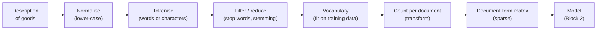
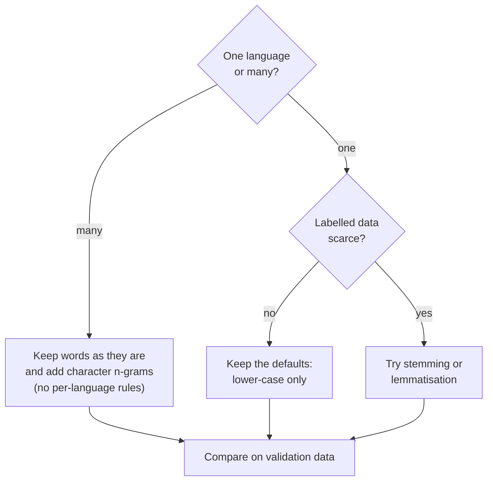
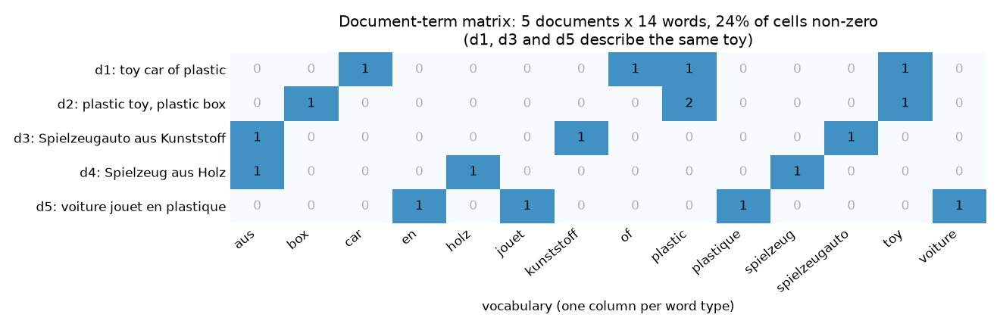

# Text as data: tokens, vocabulary and the document-term matrix

A statistical model needs numbers, but a customs decision is a string of characters: a description of goods in German, French, Polish or one of 19 other languages. This page shows the first and most important step of every text model: turning documents into a table of counts. It covers the vocabulary of a corpus, the usual preprocessing steps and what they mean for a multilingual corpus, the bag-of-words representation computed by hand and with scikit-learn, and the sparse matrices that make this representation fit into memory. The choices made here decide what any later model can and cannot see, from the linear classifiers of this session to the language models of Session 14.

**The case study in one paragraph.** Traders who are unsure how their product is classified in the EU customs tariff can ask a customs authority for a Binding Tariff Information (BTI) decision; customs describes the product and states its code, and the European Commission publishes all decisions in the EBTI database. The code follows the Harmonized System (HS): 21 sections, 97 chapters (2 digits), about 1,200 headings (4 digits) and finer subheadings. Our task is to predict the **four-digit heading** from the **description of goods**. This session starts the part of the course that works with these decisions (Sessions 13–16, with the leaderboard rounds L1, L2 and L3); Block 2 sets out the task, the time-based split and the leaderboard ([theory page 02](02-tfidf-and-text-classification.md#the-ebti-task-and-the-leaderboard)), and [case-study/README.md](../../../case-study/README.md) describes the data.

The code blocks on this page build on each other; run them in order from the repository root (see the session [README](../README.md#setup) for the environment).



## Documents, tokens and vocabulary

### Concept

A **corpus** is a collection of texts. Each text in it is a **document**; in the case study one document is the description of goods of one decision. A **token** is one unit of text after splitting, usually a word, sometimes a number or a punctuation mark. A **type** is a distinct token: in "toy car made of plastic, plastic car" there are seven tokens but only five types (`toy`, `car`, `made`, `of`, `plastic`). The **vocabulary** is the set of types the model knows, and each type gets one fixed column number.

Worked example, by hand:

| Document | Tokens |
|---|---|
| d1 = "Toy car made of plastic." | toy, car, made, of, plastic |
| d2 = "Car seat cover made of textile." | car, seat, cover, made, of, textile |

Together the two documents have 11 tokens and 8 types. Sorted alphabetically, the vocabulary is `car, cover, made, of, plastic, seat, textile, toy`; `car` is column 0 and `toy` column 7.

In scikit-learn the vocabulary is learned by `fit` and applied by `transform`. A word that did not occur during `fit` has no column, so it is silently ignored later. This is the **out-of-vocabulary** problem: a new product name, a misspelling, or a word in a language that was rare in the training data is invisible to the model.

### Why it matters

Every text model starts by splitting text into tokens and mapping them to numbers. If the vocabulary is learned from the wrong data (for example from training and test decisions together), information leaks from the test set. If it is learned from too little data, many words in new documents are out of vocabulary; with 22 languages this happens quickly. The size of the vocabulary also sets the number of model parameters: a linear model has one weight per vocabulary entry and class, and the case study has about 1,100 classes.

### How it works in Python

```python
from collections import Counter

import pandas as pd
from sklearn.feature_extraction.text import CountVectorizer

docs = ["Toy car made of plastic.", "Car seat cover made of textile."]
tokens = [d.lower().replace(".", "").split() for d in docs]
print(tokens[1])                          # ['car', 'seat', 'cover', 'made', 'of', 'textile']
print(Counter(tokens[0] + tokens[1]).most_common(3))   # [('car', 2), ('made', 2), ('of', 2)]
vocab = sorted(set(tokens[0]) | set(tokens[1]))
print(len(vocab), vocab)   # 8 ['car', 'cover', 'made', 'of', 'plastic', 'seat', 'textile', 'toy']

cv = CountVectorizer()                    # the same steps in one object
cv.fit(docs)                              # learn the vocabulary
print(cv.vocabulary_["toy"])              # 7: the column of 'toy'
print(cv.transform(["Toy truck made of wood."]).toarray())
# [[0 0 1 1 0 0 0 1]]: 'truck' and 'wood' are out of vocabulary and simply disappear

# the case-study corpus: one document = one description of goods
decisions = pd.read_parquet("case-study/data/train_sample.parquet")
texts = decisions["description"]
n_tokens = texts.str.split().str.len()
print(len(texts), int(n_tokens.sum()))    # 50000 documents, 4504393 tokens
print(n_tokens.median())                  # 82.0 tokens in a typical description
print(texts.str.len().groupby(decisions["language"]).median().loc[["fr", "en", "de"]].to_dict())
# {'fr': 272.0, 'en': 309.0, 'de': 740.0}: German descriptions are more than twice as long
```

### In practice

- Search engines such as Elasticsearch and Apache Lucene pass every indexed document through an *analyzer* that tokenises and normalises it, with one analyzer per language; the query goes through the same analyzer so that query tokens and document tokens match.
- Customs administrations work on the same task as this course: the World Customs Organization's data-analytics initiative (BACUDA) and several national administrations have built models that suggest HS codes from the free-text goods descriptions of declarations, so that officers check suggestions instead of searching the tariff.
- Mosteller and Wallace (1964) attributed the disputed *Federalist Papers* to James Madison by comparing how often the candidate authors used common words such as "upon" and "whilst", one of the earliest statistical studies that treated text as counts.

> [!WARNING]
> **Fit the vocabulary on training data only.** If `fit` sees the validation or test documents, the vocabulary (and later the TF-IDF weights) contain information from data the model should not have seen. Put the vectoriser inside a scikit-learn `Pipeline`, so that cross-validation refits it on each training fold (Session 7).

## Preprocessing: lower-casing, stop words, stemming and lemmatisation

### Concept

Preprocessing maps different surface forms to one form, so that the vocabulary becomes smaller and counts become more reliable.

- **Normalisation** maps different spellings to one form. The most common step is **lower-casing** ("Kunststoff", "KUNSTSTOFF" → "kunststoff"). Others are removing accents, HTML tags or line breaks. Some decisions are written entirely in capitals, so lower-casing matters here.
- **Tokenisation** splits text into tokens. scikit-learn's default pattern `(?u)\b\w\w+\b` keeps runs of two or more letters or digits. Numbers such as `220` (volts) or `100` (per cent) become tokens; single characters disappear.
- **Stop words** are very frequent function words ("the", "and", "aus", "mit", "de", "la") that carry little content. scikit-learn ships only an **English** list of 318 words. In the case study, where 57 % of the descriptions are German and 16 % French, this list removes almost nothing.
- **Stemming** cuts word endings with fixed rules. The Snowball stemmers (an extension of Porter, 1980) exist for German, French, Dutch, Swedish and other languages and map "Spielzeuge", "Spielzeugen" to `spielzeug`. A stem need not be a real word ("chaussures" → `chaussur`).
- **Lemmatisation** looks a word up together with its part of speech and returns its dictionary form, the **lemma**. It needs a trained pipeline per language (spaCy has German, French, Dutch, Polish and others), is slower than stemming and more accurate.

A special problem of German, Dutch and Swedish is **compounding**: "Kinderspielzeug", "Kunststoffspielzeug" and "Holzspielzeug" (children's, plastic and wooden toy) are three separate tokens that share no column with "Spielzeug". Stemming does not help, because the stem is the whole compound.

Worked example for the German description "Kinderspielzeug aus Kunststoff, in Form eines Autos, mit Rädern aus Gummi":

| Step | Result |
|---|---|
| lower-case and tokenise | kinderspielzeug, aus, kunststoff, in, form, eines, autos, mit, rädern, aus, gummi |
| remove English stop words | the same except `in`: the English list does not know German |
| remove a German stop-word list | kinderspielzeug, kunststoff, form, autos, rädern, gummi |
| German stemming | kinderspielzeug, kunststoff, form, autos, rad, gummi (the compound stays whole; the loan word "autos" is not reduced) |

| Step | Vocabulary | Information lost | Cost |
|---|---|---|---|
| lower-casing | smaller | little (German nouns are capitalised, but the word stays) | none |
| stop-word removal | slightly smaller | "ohne" (without), "nicht" (not), "pour" (for) can matter for a tariff | needs one list per language |
| stemming | smaller | distinct words may merge | one stemmer per language |
| lemmatisation | smaller | little | one language model per language; slow |
| character n-grams (Block 2) | much larger | none; replaces most of the above | more features |



### Why it matters

Preprocessing reduces the number of columns and merges forms that mean the same thing, which helps when labelled data are scarce. Every step also removes information, and in a multilingual corpus every rule-based step must exist once per language. Character n-grams (Block 2) are the pragmatic alternative: they need no language-specific rules and share pieces such as `spiel` and `zeug` between compounds. Whether a step helps is an empirical question: test it on validation data instead of applying it by habit.

### How it works in Python

```python
import re

from nltk.stem.snowball import SnowballStemmer      # pure Python; no data download needed
from sklearn.feature_extraction.text import ENGLISH_STOP_WORDS

text = "Kinderspielzeug aus Kunststoff, in Form eines Autos, mit Rädern aus Gummi"
tokens = re.findall(r"(?u)\b\w\w+\b", text.lower())     # scikit-learn's default token pattern
print(tokens)
# ['kinderspielzeug', 'aus', 'kunststoff', 'in', 'form', 'eines', 'autos', 'mit', 'rädern', 'aus', 'gummi']
print([t for t in tokens if t not in ENGLISH_STOP_WORDS])   # only 'in' is removed
german_stop = {"aus", "in", "eines", "mit", "der", "die", "das", "und", "einem", "einer"}
print([t for t in tokens if t not in german_stop])
# ['kinderspielzeug', 'kunststoff', 'form', 'autos', 'rädern', 'gummi']

de = SnowballStemmer("german")
print([de.stem(w) for w in ["Spielzeug", "Spielzeuge", "Spielzeugen", "Kunststoff", "Kunststoffen"]])
# ['spielzeug', 'spielzeug', 'spielzeug', 'kunststoff', 'kunststoff']
fr = SnowballStemmer("french")
print([fr.stem(w) for w in ["jouet", "jouets", "chaussure", "chaussures"]])
# ['jouet', 'jouet', 'chaussur', 'chaussur']

# effect on the vocabulary of the case-study sample
for name, kwargs in [("default", {}), ("no lower-casing", {"lowercase": False}),
                     ("English stop words removed", {"stop_words": "english"})]:
    print(name, len(CountVectorizer(**kwargs).fit(texts).vocabulary_))
# default 213583 / no lower-casing 237686 / English stop words removed 213336

# compounds: character 4-grams shared by 'Kunststoffspielzeug' and 'Spielzeug'
grams = CountVectorizer(analyzer="char_wb", ngram_range=(4, 4)).build_analyzer()
print(sorted(set(grams("Kunststoffspielzeug")) & set(grams("Spielzeug"))))
# ['elze', 'eug ', 'ielz', 'lzeu', 'piel', 'spie', 'zeug']: the compound and the simple word now overlap
```

The English stop-word list removes 247 of 213,583 word types: it was made for English text.

### In practice

- Elasticsearch offers stemmer, stop-word and *decompounder* token filters for German, Dutch and the Scandinavian languages, so that a query for "Spielzeug" also finds "Kinderspielzeug".
- Machine-translation and search systems for the EU institutions handle all 24 official languages; the EU's IATE terminology database links the same concept across languages, which rule-based preprocessing cannot do on its own.
- The SpaCy and Stanza libraries provide tokenisers and lemmatisers for dozens of languages, which is why multilingual projects often start with them rather than with hand-written rules.

> [!CAUTION]
> `stop_words="english"` is a fixed English list. Applied to German or French text it does almost nothing; applied to English text it also removes "not", "no", "without" and "nor". "Shoes without laces" and "shoes with laces" can belong to different subheadings. If you remove stop words at all, use your own list per language and check it.

> [!TIP]
> The descriptions also contain line breaks (`\r\n`), measurements ("30 cm", "220 V") and the placeholder `<CODE>` where a number repeated the decision's own code. The default tokeniser turns `<CODE>` into the token `code`; keep this in mind when you read the most important features in Block 3.

## Bag-of-words computed by hand

### Concept

The **bag-of-words** representation describes a document only by how often each vocabulary word occurs in it. The order of the words is thrown away, as if the words were shaken in a bag. Stacking the count vectors of all documents gives the **document-term matrix** (DTM): one row per document, one column per vocabulary word, and in cell (i, j) the count of word j in document i.

Worked example with three short descriptions:

- d1 = "toy car, plastic car"
- d2 = "plastic box with lid"
- d3 = "toy box made of wood"

Step 1: tokenise and collect the vocabulary in alphabetical order: `box, car, lid, made, of, plastic, toy, with, wood` (9 types).

Step 2: count each word in each document.

| | box | car | lid | made | of | plastic | toy | with | wood |
|---|---|---|---|---|---|---|---|---|---|
| d1 | 0 | 2 | 0 | 0 | 0 | 1 | 1 | 0 | 0 |
| d2 | 1 | 0 | 1 | 0 | 0 | 1 | 0 | 1 | 0 |
| d3 | 1 | 0 | 0 | 1 | 1 | 0 | 1 | 0 | 1 |

Step 3: read the table. d1 and d2 share `plastic`; d2 and d3 share `box`; d1 and d3 share `toy`. The row sums (4, 4, 5) are the document lengths in tokens. The column sums are the corpus frequencies of the words. Most cells are zero even in this tiny example (15 of 27).

The figure shows the same idea for five short descriptions in three languages.



A bag-of-words vector is a point in a space with one axis per word. Two documents are similar if they use the same words in similar proportions. The figure shows the consequence for a multilingual corpus: an English and a German description of the same toy share no word and therefore look unrelated. A classifier can still learn both, but only from labelled examples in each language.

### Why it matters

Bag-of-words is simple, fast and transparent: every column is a word you can read, and every model weight can be traced back to a word. Descriptions of goods are well suited, because the decisive information is mostly in nouns and materials ("Schuhe", "Leder", "Kunststoff"). Its blind spots (word order, synonyms, other languages) are the subject of Block 3 and the motivation for Session 14.

### How it works in Python

```python
mini = ["toy car, plastic car", "plastic box with lid", "toy box made of wood"]
cv = CountVectorizer()
X = cv.fit_transform(mini)
print(cv.get_feature_names_out())
# ['box' 'car' 'lid' 'made' 'of' 'plastic' 'toy' 'with' 'wood']
print(X.toarray())
# [[0 2 0 0 0 1 1 0 0]
#  [1 0 1 0 0 1 0 1 0]
#  [1 0 0 1 1 0 1 0 1]]
print(X.sum(axis=1).A1, X.sum(axis=0).A1)   # row sums [4 4 5], column sums [2 2 1 1 1 2 2 1 1]

# bag-of-words ignores order: these two descriptions get the same vector
same = cv.transform(["plastic car, toy car", "toy car, plastic car"]).toarray()
print((same[0] == same[1]).all())            # True

# binary=True records presence instead of counts (useful for short texts)
print(CountVectorizer(binary=True).fit_transform(mini).toarray()[0])  # [0 1 0 0 0 1 1 0 0]
```

### In practice

- Spam filters have classified e-mail from word counts since the late 1990s; Paul Graham's essay *A Plan for Spam* (2002) popularised naive Bayes on token counts for this task.
- Slapin and Proksch (2008) developed *Wordfish*, which places German parties on a political scale using only the word counts of their manifestos.
- Automatic coding of occupations and industries in surveys and censuses (for example by the US Census Bureau and national statistics offices) started from bag-of-words matching of free-text answers against coding indexes, the same kind of problem as matching a description of goods to a tariff heading.

> [!NOTE]
> "Bag-of-words" does not mean "single words only". The columns can also be pairs of words (bigrams, Block 2) or character sequences. What makes it a bag is that the position of each unit in the document is ignored.

## Sparse, high-dimensional matrices

### Concept

The document-term matrix of a real corpus is **high-dimensional**: in the case-study sample it has 213,583 columns, four times as many as there are documents, because 22 languages each bring their own vocabulary. It is also **sparse**: almost all cells are zero, because one description uses only a few dozen distinct words.

A **sparse matrix** stores only the non-zero cells. The **CSR** format (compressed sparse row), used by scikit-learn, keeps three arrays:

- `data`: the non-zero values, row by row;
- `indices`: the column number of each value;
- `indptr`: where each row starts in `data` (length = number of rows + 1).

For the three-description matrix above:

```
data    = [1 2 1 | 1 1 1 1 | 1 1 1 1 1]
indices = [6 1 5 | 5 0 7 2 | 6 0 3 4 8]
indptr  = [0, 3, 7, 12]
```

Row 0 consists of `data[0:3]` in columns `indices[0:3]` = 6, 1, 5 (toy = 1, car = 2, plastic = 1). Within a row the column numbers need not be sorted; they appear in the order in which the words were first counted. Twelve stored values replace 27 cells; for the case-study sample the saving is a factor of more than 2,000.

Word frequencies follow **Zipf's law**: a few words (`mit`, `aus`, `und`, `de`) occur extremely often, and most words occur very rarely. In the sample, half of all vocabulary words occur only once. The parameters `min_df` (drop words in fewer than k documents) and `max_df` (drop words in more than a share of documents) cut both tails and shrink the matrix.

### Why it matters

Sparsity decides which models can be used. Linear models (logistic regression, linear support vector machines, naive Bayes) work directly on sparse input and fit in seconds to minutes. Methods that need dense input or distances in all dimensions (k-nearest neighbours on raw counts, many tree ensembles, standard PCA) become slow, run out of memory, or work poorly; this is why the tree models of Session 10 are rarely applied to raw word counts. Calling `.toarray()` on the full matrix converts it to dense storage: 85 GB for the sample.

### How it works in Python

```python
print(X.data, X.indices, X.indptr)   # [1 2 1 1 1 1 1 1 1 1 1 1] [6 1 5 5 0 7 2 6 0 3 4 8] [ 0  3  7 12]

cv = CountVectorizer()
D = cv.fit_transform(texts)                      # scipy.sparse CSR matrix
print(D.shape)                                   # (50000, 213583): documents x vocabulary
print(f"{D.nnz / (D.shape[0] * D.shape[1]):.5f}")  # 0.00029: 99.97 % of cells are zero
print(round(D.nnz / D.shape[0], 1))              # 61.9 distinct words per description
sparse_mb = (D.data.nbytes + D.indices.nbytes + D.indptr.nbytes) / 1e6
print(round(sparse_mb, 1), round(D.shape[0] * D.shape[1] * 8 / 1e9, 1))
# 37.4 MB as sparse matrix, 85.4 GB if stored dense with 8-byte numbers

counts = pd.Series(D.sum(axis=0).A1, index=cv.get_feature_names_out())
print(counts.nlargest(8).index.tolist())         # ['mit', 'aus', 'und', 'der', 'in', 'de', 'einem', 'die']
print(round((counts == 1).mean(), 2))            # 0.5 of all words occur only once

# min_df and max_df cut the rare and the ubiquitous words
small = CountVectorizer(min_df=5, max_df=0.5).fit(texts)
print(len(small.vocabulary_))                    # 42871 words remain
```

### In practice

- Document-term matrices are the input to classic topic models such as latent Dirichlet allocation (Blei, Ng and Jordan, 2003), used to analyse news archives and scientific literature.
- Weinberger et al. (2009) described the **hashing trick** for spam filtering at Yahoo: instead of storing a vocabulary, each word is hashed directly to one of a fixed number of columns. scikit-learn's `HashingVectorizer` implements it (see workbook 03); it is used when the vocabulary is too large or keeps changing, as with new product names.
- Zipf's law (Zipf, 1949) appears in almost every language corpus and is the reason why vocabularies keep growing as more text is added; with several languages, the growth is faster still.

> [!WARNING]
> Never call `.toarray()` or `.todense()` on a full document-term matrix, and avoid pandas `DataFrame` versions of it. Inspect a few rows (`D[:5].toarray()`) or use sparse-aware functions (`D.sum(axis=0)`, `D.nnz`).

> [!TIP]
> `StandardScaler` would subtract the column means and destroy sparsity. For sparse text features use `with_mean=False`, or better, use TF-IDF with row normalisation (Block 2).

## Practice: vocabulary and document-term matrix of the decisions

Workbook [01-case-study-vocabulary-and-dtm.ipynb](../workbooks/01-case-study-vocabulary-and-dtm.ipynb): count tokens and types per language, build the document-term matrix, look at Zipf's law, compare preprocessing settings (including German stemming and character n-grams), and read one description next to its English keywords and the English text of its heading.

## Check your understanding

1. A corpus has 4 documents with 10, 12, 8 and 10 tokens and 25 types in total. How many rows and columns does its document-term matrix have, and what is the sum of all cells?
2. Why does `CountVectorizer` ignore the word "Akkuschrauber" (cordless screwdriver) in a test description if it never occurred in the training descriptions? Name one consequence for a deployed model.
3. Why does `stop_words="english"` hardly change the vocabulary of the case study? Give one stop word whose removal could harm a tariff classifier.
4. Write down the CSR arrays (`data`, `indices`, `indptr`) for the matrix `[[0, 3], [1, 0], [0, 0]]`.
5. Why is the vocabulary of the 50,000 decisions four times larger than the number of documents, while an English-only corpus of the same size would have a much smaller vocabulary?

## Further reading

- Jurafsky, D. and Martin, J. H. (2026). *Speech and Language Processing*, 3rd ed. draft, chapter "Words and Tokens". https://web.stanford.edu/~jurafsky/slp3/
- Manning, C. D., Raghavan, P. and Schütze, H. (2008). *Introduction to Information Retrieval*, chapter 2 "The term vocabulary and postings lists" (including compound splitting). Cambridge University Press. https://nlp.stanford.edu/IR-book/
- scikit-learn developers. *Text feature extraction* (user guide, section 6.2.3). https://scikit-learn.org/stable/modules/feature_extraction.html#text-feature-extraction
- World Customs Organization. *What is the Harmonized System (HS)?* https://www.wcoomd.org/en/topics/nomenclature/overview/what-is-the-harmonized-system.aspx
