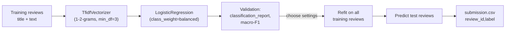

# TF-IDF, n-grams and linear text classifiers

Raw counts treat every word alike: "the" counts as much as "refund". This page introduces TF-IDF, a weighting that makes informative words count more, and n-grams, which keep short phrases such as "not good". It then shows why linear models are the standard classifiers for this kind of sparse, high-dimensional input, and how to read per-class metrics when one class (neutral reviews) is rare. The page ends with the practice task of this block: the third leaderboard round (L3) with a TF-IDF classifier.

The code blocks on this page build on each other; run them in order from the repository root.



## TF-IDF: weighting words by how informative they are

### Concept

**Term frequency** tf(t, d) is the count of term t in document d. **Document frequency** df(t) is the number of documents that contain t at least once. With N documents, the **inverse document frequency** is

  idf(t) = log(N / df(t)).

It is large for rare terms and zero for a term that occurs in every document. **TF-IDF** is the product tf(t, d) × idf(t): a term gets a high weight in a document if it is frequent there and rare elsewhere.

Worked example with N = 3 documents: d1 = "great pump great price", d2 = "great smell", d3 = "bad pump".

| Term | tf in d1 | df | idf = ln(3 / df) | tf × idf |
|---|---|---|---|---|
| great | 2 | 2 | ln(1.5) = 0.405 | 0.811 |
| pump | 1 | 2 | 0.405 | 0.405 |
| price | 1 | 1 | ln(3) = 1.099 | 1.099 |

"price" occurs once in d1, but it gets the highest weight because no other document uses it.

scikit-learn's `TfidfVectorizer` makes three changes to this textbook formula:

1. **Smoothed idf**: idf(t) = ln((1 + N) / (1 + df(t))) + 1. It acts as if one extra document contained every term, so no division by zero occurs, and the "+ 1" keeps terms that appear everywhere from being removed entirely. For the example: great and pump get ln(4/3) + 1 = 1.288, price gets ln(4/2) + 1 = 1.693.
2. **L2 normalisation**: each row is divided by its Euclidean length, so that every document vector has length 1. Long and short reviews become comparable, and the dot product of two rows is their cosine similarity. For d1: the raw weights (2 × 1.288, 1.288, 1.693) = (2.576, 1.288, 1.693) have length 3.34, giving (0.771, 0.386, 0.507).
3. **Sublinear tf** (optional, `sublinear_tf=True`): tf is replaced by 1 + ln(tf). The tenth "great" in a review then adds much less than the second.

### Why it matters

Raw counts are dominated by frequent words that carry little information. TF-IDF down-weights them automatically, without a hand-made stop-word list, and the row normalisation removes the effect of review length. TF-IDF is the standard input for linear text classifiers and was the core of classic keyword search.

### How it works in Python

```python
import numpy as np
import pandas as pd
from sklearn.feature_extraction.text import CountVectorizer, TfidfVectorizer

docs = ["great pump great price", "great smell", "bad pump"]
# by hand for document 1, with scikit-learn's smoothed idf (N = 3 documents)
tf = {"great": 2, "pump": 1, "price": 1}           # counts in document 1
df = {"great": 2, "pump": 2, "price": 1}           # documents that contain the word
idf = {w: np.log((1 + 3) / (1 + df[w])) + 1 for w in tf}
print({w: round(float(v), 3) for w, v in idf.items()})   # great 1.288, pump 1.288, price 1.693
w = np.array([tf[t] * idf[t] for t in tf])
print((w / np.linalg.norm(w)).round(3))            # [0.771 0.386 0.507] after L2 normalisation

tfidf = TfidfVectorizer()
T = tfidf.fit_transform(docs)
print(tfidf.get_feature_names_out())               # ['bad' 'great' 'price' 'pump' 'smell']
print(T.toarray().round(3)[0])                     # [0.    0.771 0.507 0.386 0.   ]
print(np.linalg.norm(T.toarray(), axis=1))         # [1. 1. 1.]: every row has length 1

# on the case-study sample: which words get the lowest and highest idf?
reviews = pd.read_parquet("case-study/data/train_sample.parquet")
texts = reviews["title"] + " " + reviews["text"]
vec = TfidfVectorizer(min_df=3).fit(texts)
idf_s = pd.Series(vec.idf_, index=vec.get_feature_names_out()).sort_values()
print(idf_s.index[:5].tolist())                    # ['the', 'and', 'it', 'to', 'for']
print(idf_s.round(2).iloc[[0, -1]].to_dict())      # 'the' 1.66; the rarest words (3 documents) 10.43
```

### In practice

- TF-IDF ranking was the core of classic search engines. Apache Lucene, on which Elasticsearch and Solr are built, used a TF-IDF similarity by default until version 6 (2016), when it switched to BM25, a refinement of the same idea with saturating term frequency and length normalisation.
- Keyword extraction: the terms with the highest TF-IDF weight in a document summarise what distinguishes it from the rest of the corpus. Newsrooms and digital libraries use this to tag articles.
- Spärck Jones (1972) introduced the idea of weighting terms by their inverse document frequency in a paper on information retrieval; it is still the default weighting in many retrieval systems.

> [!NOTE]
> TF-IDF is still a bag-of-words representation: it changes the *values* in the document-term matrix, not its columns. The matrix keeps the same shape and the same sparsity.

## n-grams: keeping short phrases

### Concept

An **n-gram** is a sequence of n consecutive tokens. Unigrams are single words, **bigrams** are pairs ("not good"), **trigrams** are triples ("waste of money"). `ngram_range=(1, 2)` adds all bigrams to the vocabulary next to the unigrams.

Worked example: "good, not bad" and "bad, not good" contain the same three words. With unigrams their vectors are identical. With bigrams the first review contains `good not` and `not bad`, the second `bad not` and `not good`, so the vectors differ and a model can learn that `not good` is negative.

The cost is size. The number of distinct bigrams grows much faster than the number of words, and most of them occur only once. `min_df` (minimum document frequency) removes the rare ones. In the review sample with `min_df=3` there are about 13,000 unigrams, 94,000 features with bigrams and 164,000 with trigrams.

**Character n-grams** (`analyzer="char_wb"`) use sequences of letters inside words instead of words. They are robust to misspellings ("excelent") and to unknown inflections, at the price of many more features.

### Why it matters

Negation and short phrases carry much of the sentiment in reviews: "stopped working", "not worth", "no smell". Unigrams plus bigrams is the standard setting for TF-IDF text classifiers and usually gives a clear gain over unigrams alone; longer n-grams add little. Wang and Manning (2012) showed that simple bigram models are strong baselines for sentiment classification.

### How it works in Python

```python
pair = ["good, not bad", "bad, not good"]
uni = CountVectorizer().fit(pair)
print(uni.transform(pair).toarray())       # [[1 1 1] [1 1 1]]: identical vectors
bi = CountVectorizer(ngram_range=(1, 2)).fit(pair)
print(bi.get_feature_names_out())
# ['bad' 'bad not' 'good' 'good not' 'not' 'not bad' 'not good']
print(bi.transform(pair).toarray())        # [[1 0 1 1 1 1 0] [1 1 1 0 1 0 1]]: now different

for rng in [(1, 1), (1, 2), (1, 3)]:
    v = TfidfVectorizer(ngram_range=rng, min_df=3).fit(texts)
    print(rng, len(v.vocabulary_))         # (1, 1) 13089 / (1, 2) 93778 / (1, 3) 163916

# character n-grams survive a misspelling
ch = TfidfVectorizer(analyzer="char_wb", ngram_range=(3, 4)).fit(["excellent"])
print(ch.transform(["excelent"]).nnz)      # 12 of the 15 character n-grams of 'excelent' are known
```

### In practice

- The Google Books Ngram Viewer charts how often words and phrases (up to five-grams) appeared in millions of digitised books over time.
- Language identification often uses character n-grams; Cavnar and Trenkle (1994) described the classic n-gram frequency method that many language detectors still follow.
- Keyword-based monitoring of customer feedback typically tracks bigrams such as "late delivery" or "customer service" rather than single words, because single words are too ambiguous.

> [!WARNING]
> Every additional n-gram range multiplies the number of features and the memory needed. Always combine n-grams with `min_df` (for example 2–5) and check `len(vectorizer.vocabulary_)` before fitting a model.

## Linear models for text classification

### Concept

A **linear classifier** computes one score per class as a weighted sum of the features, plus an intercept: score_k(d) = b_k + Σ_j w_kj x_dj. It predicts the class with the highest score. For text, each feature is one n-gram, so each weight says how much that n-gram pushes a review towards a class.

Worked example: suppose the model has the weights below for the class "neg" and a review has TF-IDF values `not` = 0.5, `good` = 0.4, `not good` = 0.6.

| n-gram | weight (neg) | value | product |
|---|---|---|---|
| not | 2.0 | 0.5 | 1.0 |
| good | −3.0 | 0.4 | −1.2 |
| not good | 4.0 | 0.6 | 2.4 |

With intercept −1.0 the score for "neg" is −1.0 + 1.0 − 1.2 + 2.4 = 1.2. The bigram outweighs the positive word "good".

Three linear classifiers are common for text:

| Model | Idea | Output | Notes |
|---|---|---|---|
| Multinomial naive Bayes | word probabilities per class, assumed independent | probabilities (poorly calibrated) | very fast; works on counts |
| Logistic regression | minimises log-loss; softmax turns scores into probabilities (Session 6) | probabilities | `C` = inverse regularisation strength |
| Linear support vector machine (`LinearSVC`) | maximises the margin between classes | scores only | often slightly more accurate |

**Regularisation** is essential: with 94,000 features and 40,000 reviews, a model without a penalty could fit the training data perfectly by memorising rare n-grams. In scikit-learn a smaller `C` means a stronger penalty. `class_weight="balanced"` gives errors on the rare neutral class more weight during training.

The vectoriser and the classifier belong into one **pipeline**. Then `fit` learns the vocabulary and idf weights only from the training part, and cross-validation or grid search (Session 7) refits both on every fold.

### Why it matters

Linear models are fast on sparse input (seconds for 50,000 reviews), need little tuning, and are easy to inspect, because each weight belongs to a readable n-gram. TF-IDF with logistic regression is the baseline every more complex text model has to beat; in the case study it reaches a validation macro-F1 of about 0.74. Tree ensembles (Session 10) are a poor fit here: they split on one feature at a time and struggle with 100,000 sparse columns.

### How it works in Python

```python
from sklearn.linear_model import LogisticRegression
from sklearn.metrics import f1_score
from sklearn.model_selection import train_test_split
from sklearn.naive_bayes import MultinomialNB
from sklearn.pipeline import make_pipeline
from sklearn.svm import LinearSVC

y = reviews["label"]
X_tr, X_va, y_tr, y_va = train_test_split(texts, y, test_size=0.2, stratify=y, random_state=0)

def tfidf(**kw):
    return TfidfVectorizer(ngram_range=(1, 2), min_df=3, sublinear_tf=True, **kw)

models = {
    "naive Bayes (counts)": make_pipeline(CountVectorizer(ngram_range=(1, 2), min_df=3),
                                          MultinomialNB()),
    "logreg unigrams": make_pipeline(TfidfVectorizer(min_df=3, sublinear_tf=True),
                                     LogisticRegression(C=4, class_weight="balanced",
                                                        max_iter=2000)),
    "logreg 1-2-grams": make_pipeline(tfidf(), LogisticRegression(C=4, class_weight="balanced",
                                                                  max_iter=2000)),
    "logreg 1-2-grams, stop words": make_pipeline(tfidf(stop_words="english"),
                                                  LogisticRegression(C=4, class_weight="balanced",
                                                                     max_iter=2000)),
    "linear SVM 1-2-grams": make_pipeline(tfidf(), LinearSVC(C=0.5, class_weight="balanced")),
}
for name, model in models.items():
    model.fit(X_tr, y_tr)
    print(f"{name:30s} {f1_score(y_va, model.predict(X_va), average='macro'):.3f}")
# naive Bayes (counts)           0.733
# logreg unigrams                0.691
# logreg 1-2-grams               0.739
# logreg 1-2-grams, stop words   0.653   <- removing 'not' costs 9 points
# linear SVM 1-2-grams           0.746
```

Each model fits in a few seconds. Bigrams add about five points of macro-F1; the stop-word list removes about nine.

### In practice

- Routing customer e-mails and support tickets to the right team is often done with TF-IDF and a linear model, because it is cheap to retrain when categories change.
- Pang, Lee and Vaithyanathan (2002) compared naive Bayes, maximum entropy (logistic regression) and support vector machines on bag-of-words features of movie reviews; the SVM was best, close to 83 % accuracy.
- Research on clinical notes, such as automatic assignment of diagnosis codes, uses bag-of-words logistic regression as the baseline that neural models are compared with.

> [!WARNING]
> **Do not compare models on the test set.** Choose the n-gram range, `min_df`, `C` and the classifier on a validation split or with cross-validation on the training data. The leaderboard is used once per round, for the final choice.

> [!TIP]
> To tune `C` and `ngram_range` together, pass the pipeline to `GridSearchCV` with parameter names such as `"tfidfvectorizer__ngram_range"` and `"logisticregression__C"` (Session 7). Use `n_jobs=-1` and a small grid: each fit takes seconds, but a grid multiplies them.

## Per-class metrics

### Concept

For each class k, compare the predictions with the true labels:

- **Precision** = correct predictions of k / all predictions of k. "When the model says neutral, how often is it right?"
- **Recall** = correct predictions of k / all true members of k. "Of all neutral reviews, how many does the model find?"
- **F1** = 2 × precision × recall / (precision + recall), the harmonic mean; it is low if either of the two is low.
- **Support** = the number of true members of k in the evaluation data.

Three averages summarise the per-class values:

| Average | Definition | Effect with rare classes |
|---|---|---|
| macro | plain mean of the per-class F1 values | the rare class counts as much as the frequent one |
| weighted | mean weighted by support | dominated by the frequent class |
| micro | computed from all predictions pooled; equals accuracy for single-label tasks | dominated by the frequent class |

Worked example: a validation set has 100 neutral reviews. The model predicts "neu" 120 times, of which 50 are correct. Precision = 50 / 120 = 0.42, recall = 50 / 100 = 0.50, F1 = 2 × 0.42 × 0.50 / 0.92 = 0.45. If the positive and negative classes have F1 = 0.94 and 0.82, macro-F1 = (0.94 + 0.82 + 0.45) / 3 = 0.74, while accuracy can still be close to 0.90.

### Why it matters

The leaderboard metric is macro-F1, because accuracy rewards ignoring the neutral class: a model that never predicts "neu" loses only 7.5 % accuracy in training but gets F1 = 0 for one of three classes. The per-class report shows *where* a model is weak. For reviews, it is almost always the neutral class, which mixes praise and complaints.

### How it works in Python

```python
from sklearn.metrics import accuracy_score, classification_report

logreg = models["logreg 1-2-grams"]
pred = logreg.predict(X_va)
print(classification_report(y_va, pred, digits=2))
#               precision    recall  f1-score   support
#          neg       0.80      0.84      0.82      1922
#          neu       0.43      0.48      0.45       748
#          pos       0.95      0.93      0.94      7330
#     accuracy                           0.88     10000
#    macro avg       0.73      0.75      0.74     10000
# weighted avg       0.89      0.88      0.88     10000

for avg in ["macro", "weighted", "micro"]:
    print(avg, round(f1_score(y_va, pred, average=avg), 3))   # 0.739 / 0.883 / 0.880
print(round(accuracy_score(y_va, pred), 3))                   # 0.88 (= micro-F1)
```

### In practice

- Content-moderation systems report recall per category (for example hate speech, spam, self-harm), because a high overall accuracy can hide a category that is almost never detected.
- Medical screening tests are described by sensitivity (recall of the "ill" class) and specificity (recall of the "healthy" class), the same per-class view under different names.
- Shared tasks in NLP research, such as the SemEval sentiment tasks, rank systems by macro-averaged scores for the same reason as this course: to prevent the majority class from dominating.

> [!IMPORTANT]
> Validation macro-F1 (0.74) is higher than the public leaderboard score of the same model (0.69). Two reasons: the validation split is random, while the test set contains later reviews (2022–2023) with different class shares (26 % instead of 19 % negative) and new products; and 15 % of the training reviews, all written before 2019, carry an automatic title such as "Five Stars" that names the rating and almost never occurs in the test years. Block 3 ([error analysis](03-error-analysis-and-limits.md#the-most-informative-n-grams-per-class)) shows how to find such shortcuts. A random split overestimates performance under drift; Sessions 7 and 16 discuss time-based validation and monitoring.

## Practice: leaderboard round L3 with a TF-IDF classifier

The task is to train the TF-IDF classifier on the 50,000-review sample, predict the 51,436 test reviews, and submit a file with one row per test review and the columns `review_id,label`. The reference value on the public leaderboard is 0.69 macro-F1 for the sample and 0.71 for the full training set (434,373 reviews). Workbook [05-case-study-tfidf-leaderboard.ipynb](../workbooks/05-case-study-tfidf-leaderboard.ipynb) contains the full exercise.

```python
test = pd.read_parquet("case-study/data/test.parquet")
final = make_pipeline(tfidf(), LogisticRegression(C=4, class_weight="balanced", max_iter=2000))
final.fit(texts, y)                                  # refit on all 50,000 sample reviews
submission = pd.DataFrame({"review_id": test["review_id"],
                           "label": final.predict(test["title"] + " " + test["text"])})
print(submission.shape, submission["label"].value_counts(normalize=True).round(2).to_dict())
# (51436, 2) {'pos': 0.63, 'neg': 0.28, 'neu': 0.09}
submission.to_csv("submission.csv", index=False)
```

Score it locally (where the solution file is available) or upload it to the course leaderboard:

```bash
uv run --with pandas --with scikit-learn python case-study/score.py submission.csv
# private_macro_f1       0.6979
# private_accuracy       0.8446
# public_macro_f1        0.6863
# public_accuracy        0.8442
```

> [!TIP]
> `class_weight="balanced"` changes little on the random validation split (0.739 vs 0.738) but a lot on the test years (public macro-F1 0.69 vs 0.65), because it makes the model predict "neg" and "neu" more often, and both classes are more frequent in 2022–2023. Validation results do not always predict how a choice behaves under drift.

## Check your understanding

1. Compute the textbook idf = ln(N / df) of a word that occurs in 500 of 50,000 reviews, and of a word that occurs in all of them. What does scikit-learn's smoothed idf give for the second word?
2. Why does L2 normalisation make a short and a long review with the same word proportions get the same TF-IDF vector?
3. Give two reviews that have identical unigram vectors but different meanings, and show which bigrams separate them.
4. A model predicts "neu" for 40 reviews, 30 of them correctly; the validation set has 120 neutral reviews. Compute precision, recall and F1 for "neu".
5. Why is the vectoriser placed inside the pipeline instead of being fitted once on all reviews before the split?

## Further reading

- Jurafsky, D. and Martin, J. H. (2026). *Speech and Language Processing*, 3rd ed. draft, chapters "Naive Bayes, Text Classification and Sentiment" and "Logistic Regression". https://web.stanford.edu/~jurafsky/slp3/
- scikit-learn developers. *Working with text data* (tutorial). https://scikit-learn.org/1.4/tutorial/text_analytics/working_with_text_data.html (documentation of version 1.4; the tutorial is not part of later versions)
- scikit-learn developers. *Classification of text documents using sparse features* (example). https://scikit-learn.org/stable/auto_examples/text/plot_document_classification_20newsgroups.html
- Wang, S. and Manning, C. D. (2012). Baselines and bigrams: simple, good sentiment and topic classification. *Proceedings of ACL 2012*, 90–94. https://aclanthology.org/P12-2018/
