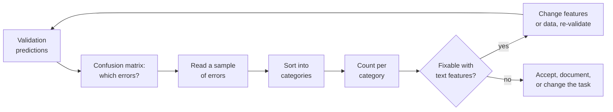
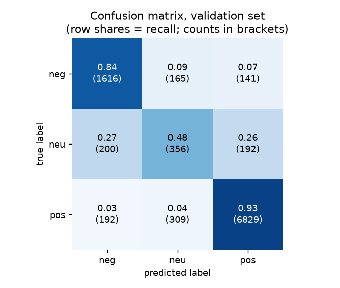
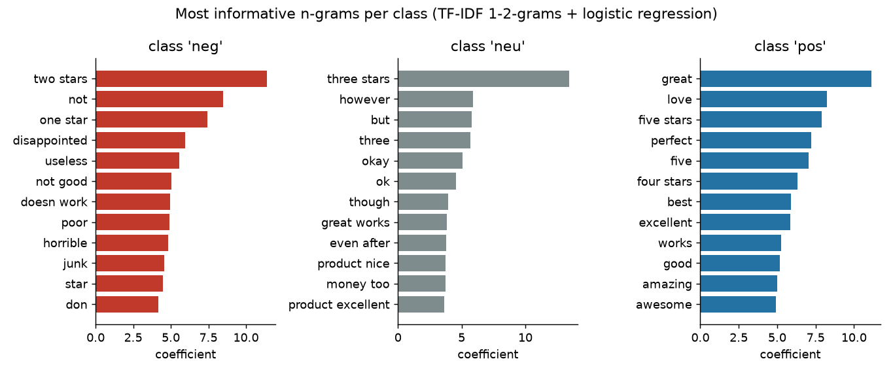
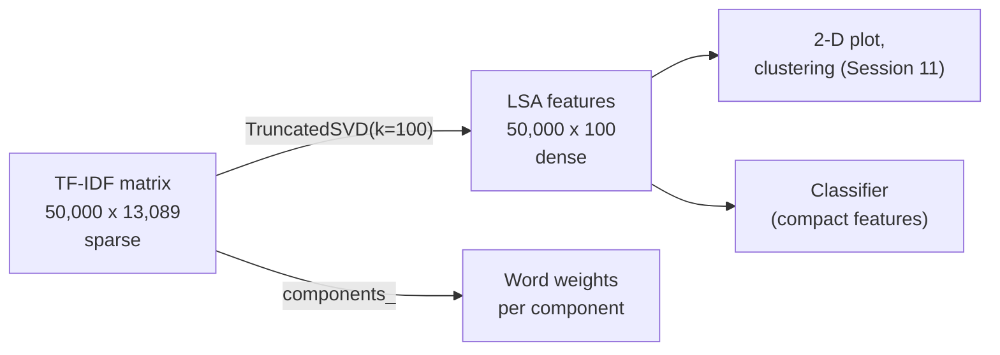
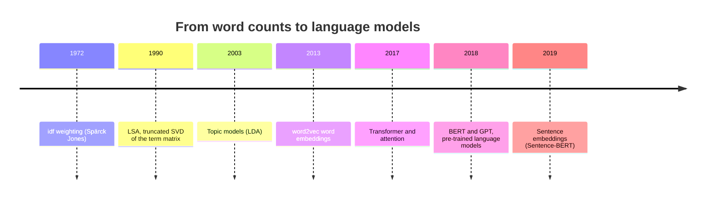

# Error analysis, model inspection and the limits of word counts

A score tells us how often a model fails, not why. This page shows how to analyse the errors of a text classifier: with the confusion matrix, by reading misclassified reviews, and by inspecting the n-grams the model relies on most. It then introduces truncated singular value decomposition (SVD), which compresses the sparse document-term matrix into a few dense dimensions, and ends with the limits of word counts (word order, synonyms, ambiguity) that motivate the language models of Session 14. The practice task is to analyse 20 misclassified reviews and use the findings to improve the classifier.

The code blocks on this page build on each other; run them in order from the repository root. The first block refits the classifier of [Block 2](02-tfidf-and-text-classification.md).



```python
import numpy as np
import pandas as pd
from sklearn.feature_extraction.text import TfidfVectorizer
from sklearn.linear_model import LogisticRegression
from sklearn.metrics import confusion_matrix, f1_score
from sklearn.model_selection import train_test_split
from sklearn.pipeline import make_pipeline

reviews = pd.read_parquet("case-study/data/train_sample.parquet")
texts = reviews["title"] + " " + reviews["text"]
y = reviews["label"]
X_tr, X_va, y_tr, y_va = train_test_split(texts, y, test_size=0.2, stratify=y, random_state=0)
model = make_pipeline(TfidfVectorizer(ngram_range=(1, 2), min_df=3, sublinear_tf=True),
                      LogisticRegression(C=4, class_weight="balanced", max_iter=2000))
model.fit(X_tr, y_tr)
pred = model.predict(X_va)
print(round(f1_score(y_va, pred, average="macro"), 3))     # 0.739
```

## Error analysis of text models

### Concept

A **confusion matrix** counts, for every true class (row), how often each class was predicted (column). The diagonal holds the correct predictions; every off-diagonal cell is one kind of error. Dividing each row by its total gives the **recall** of each class on the diagonal.

**Error analysis** means reading a sample of misclassified examples and sorting them into categories, for example:

| Category | Example (shortened) |
|---|---|
| mixed opinion | "Candy floss was fine but the packaging of the cones was not." (5 stars, predicted neg) |
| text and rating disagree | "Not worth the $. Not very sturdy." (3 stars, predicted neg) |
| comparison with another product | "Use Amope brand. They work okay but tore up my feet." (2 stars, predicted pos) |
| negation or very short text | "Won't buy again. Didn't work." (1 star, predicted neu) |
| not about the product | "This took a little over a month to arrive." (3 stars, predicted neg) |
| label noise | "Excellent, perfect, just what I ordered, thanks!" (1–2 stars) |

The **count per category** shows which improvement is worth trying. If most errors are "text and rating disagree", no text model can fix them; if many are negations, bigrams or a better tokeniser may help. Reading errors also reveals **label noise**: examples whose label is probably wrong, such as an enthusiastic review with one star.

Worked example: the validation set has 748 neutral reviews. The model labels 356 correctly, 200 as negative and 192 as positive. Recall for "neu" is 356 / 748 = 0.48. The errors are split almost evenly between both neighbours: a neutral review is a mixture, and the model tips to whichever side has the stronger words.



### Why it matters

A single score says how often the model fails, not why. Error analysis turns the score into a list of concrete next steps, shows where the labels themselves are ambiguous, and gives an honest upper bound: if a third of the errors are reviews whose text contradicts the rating, a perfect text model would still make them. It also prevents a common waste of time, namely tuning hyperparameters when the real problem lies in the data.

### How it works in Python

```python
labels = ["neg", "neu", "pos"]
print(confusion_matrix(y_va, pred, labels=labels))
# [[1616  165  141]
#  [ 200  356  192]
#  [ 192  309 6829]]   rows = true, columns = predicted

val = pd.DataFrame({"text": X_va, "true": y_va, "pred": pred,
                    "rating": reviews.loc[X_va.index, "rating"]})
wrong = val[val["true"] != val["pred"]]
print(len(wrong))                                          # 1199 errors out of 10,000
print(pd.crosstab(wrong["true"], wrong["rating"]))         # which star ratings fail?
# rating    1    2    3    4    5
# neg     137  169    0    0    0
# neu       0    0  392    0    0
# pos       0    0    0  245  256

# the 20 reviews for the practice task (fixed seed, so everyone reads the same ones)
sample = wrong.sample(20, random_state=1)
for _, row in sample.head(3).iterrows():
    print(row["true"], "->", row["pred"], row["rating"], "|", row["text"][:70])
# pos -> neg 5 | Work like a Charm These do the trick. They are large enough to swipe o
# neg -> pos 2 | I wanted to love this because it is made in USA and with natural ingre
# neu -> pos 3 | Pain relief I like the fact it seems to help with the arthritis in the

# the most confident errors often reveal label noise
proba = model.predict_proba(X_va)
col = {c: i for i, c in enumerate(model.classes_)}
val["p_true"] = proba[np.arange(len(val)), val["true"].map(col)]
print(val.nsmallest(2, "p_true")["text"].str[:60].tolist())
# ['Excellent, perfect just what I ordered Excellent, perfect ju',
#  'Great price Great product for the price. I get 1 replacement']   both labelled 'neg'
```

Sorting the 20 sampled errors by hand gave the following counts. Your own categories may differ; the point is to count.

| Category | Count |
|---|---|
| text and rating disagree (mild text, low rating, or the reverse) | 7 |
| mixed opinion (praise and complaint in one review) | 5 |
| comparison with another product | 2 |
| negation, hedging or very short text | 2 |
| not about the product (delivery, packaging) | 1 |
| expectation followed by disappointment ("I wanted to love this...") | 1 |
| no clear reason | 2 |

Seven of twenty errors cannot be fixed from the text alone, and the mixed-opinion reviews are the neutral class's natural territory. This suggests that gains will come from the neutral class, for example from features that capture contrast ("but", "however") in context, rather than from more tuning.

### In practice

- Andrew Ng's *Machine Learning Yearning* (2018) recommends reading about 100 misclassified development-set examples by hand and counting error categories before deciding what to improve.
- Teams that build content-moderation or ticket-triage classifiers review misclassified cases regularly and use them to update the labelling guidelines.
- Northcutt, Athalye and Mueller (2021) found label errors in the test sets of ten widely used benchmark datasets, among them an estimated 3–4 % in the Amazon Reviews sentiment test set; confident errors of a model were their main tool for finding them.

> [!TIP]
> Fix the random seed when you sample errors (`random_state=1`), so that the whole team discusses the same reviews, and write the category of each review into a column. A spreadsheet of 20–100 labelled errors is one of the most useful artefacts of a text project.

## The most informative n-grams per class

### Concept

In a linear model each feature has one **coefficient** per class. A large positive coefficient means that the n-gram pushes the score towards that class; a large negative one pushes it away. Because TF-IDF features are on comparable scales (each row has length 1), sorting the coefficients gives a direct ranking of the most informative n-grams per class.

This inspection is also a check for **shortcuts**: features that predict the label in the training data for reasons unrelated to the task, and that may not exist in new data.



The figure shows sensible signals ("disappointed", "useless", "however", "but", "love", "perfect") and one suspicious group: "two stars", "three stars", "five stars", "four stars". These are automatic titles: in the training data, 15 % of all reviews (7,544 of 50,000) have a title that is only the star rating, and all but one were written before 2019. In the test years 2022–2023 such titles occur only 3 times. The model has learned a rule ("the title says three stars → neutral") that is almost perfectly right in training and useless on the leaderboard.

### Why it matters

Reading the top features confirms that the model has learned plausible signals and exposes shortcuts before they cause failures on new data. Here the shortcut also explains most of the gap between validation and leaderboard: on validation reviews *without* star titles, macro-F1 is 0.69, the same as on the public leaderboard. Removing the star titles from the training data does not change the leaderboard score (0.687 instead of 0.686): the shortcut did not harm the test predictions, it only made the validation score too optimistic. The lesson is to validate on data that look like the test data. Coefficients are also an explanation that can be shown to users and auditors.

### How it works in Python

```python
vec, clf = model.named_steps["tfidfvectorizer"], model.named_steps["logisticregression"]
names = vec.get_feature_names_out()
for k, label in enumerate(clf.classes_):
    top = np.argsort(clf.coef_[k])[::-1][:6]
    print(label, list(names[top]))
# neg ['two stars', 'not', 'one star', 'disappointed', 'useless', 'not good']
# neu ['three stars', 'however', 'but', 'three', 'okay', 'ok']
# pos ['great', 'love', 'five stars', 'perfect', 'five', 'four stars']

# how common are titles that only state the rating?
star = reviews["title"].str.fullmatch(r"(?:one|two|three|four|five) stars?", case=False)
test = pd.read_parquet("case-study/data/test.parquet")
star_test = test["title"].str.fullmatch(r"(?:one|two|three|four|five) stars?", case=False)
print(int(star.sum()), int(star_test.sum()))               # 7544 in the sample, 3 in the test set
print(pd.to_datetime(reviews.loc[star, "date"]).dt.year.value_counts().sort_index().tail(3).to_dict())
# {2017: 2297, 2018: 1346, 2020: 1}: the automatic titles stop after 2018

# validation score without the shortcut reviews is close to the leaderboard (0.69)
keep = ~star.loc[X_va.index]
print(round(f1_score(y_va[keep], pred[keep.to_numpy()], average="macro"), 3))   # 0.693
```

### In practice

- Ribeiro, Singh and Guestrin (2016) showed with their LIME method that a classifier for the 20 Newsgroups data separated "Christianity" from "atheism" mostly through e-mail header words such as "posting" and "host", not through the content.
- In medical imaging, Zech et al. (2018) found that pneumonia classifiers partly recognised the hospital that took the X-ray (from markers on the image) instead of the disease; the same kind of shortcut as the star titles.
- The European Union's General Data Protection Regulation gives people subject to some automated decisions a right to meaningful information about the logic involved; for linear text models the coefficients are one direct way to provide it.

> [!WARNING]
> Coefficients are comparable only when the features are on the same scale and not strongly correlated. "five" and "five stars" share their signal, so neither coefficient alone tells the full story. Treat the ranking as a diagnostic, not as a causal statement about words.

## Dimensionality reduction with truncated SVD

### Concept

The TF-IDF matrix has tens of thousands of sparse columns. **Truncated singular value decomposition** (truncated SVD) approximates it by k dense columns, for example k = 100. Each new column, a **component**, is a weighted combination of words that tend to occur together. Applied to a document-term matrix, the method is called **latent semantic analysis** (LSA; Deerwester et al., 1990).

The idea in one picture: the document-term matrix X (documents × words) is written approximately as a product X ≈ U Σ Vᵀ, where V (words × k) describes each component by its word weights and U Σ (documents × k) gives the coordinates of each document on the components. Words that co-occur ("great", "product", "price", "value") load on the same component, so two reviews can get similar coordinates even when they share few exact words.

Truncated SVD is closely related to PCA (Session 11). The difference: PCA first subtracts the column means, which would turn every zero into a non-zero number and destroy sparsity. Truncated SVD works on the sparse matrix directly.



### Why it matters

Truncated SVD gives a compact, dense representation that methods needing dense input can use: k-means clustering, nearest-neighbour search, plots, or tree models. It also groups related words, which addresses the synonym problem a little. The price is information: 100 components keep about 27 % of the variance of the TF-IDF matrix, and a classifier on them is weaker than on the full sparse matrix. LSA is therefore mainly a tool for exploration and for methods that cannot handle sparse input, and the historical step towards the learned embeddings of Session 14.

### How it works in Python

```python
from sklearn.decomposition import TruncatedSVD
from sklearn.preprocessing import Normalizer

uni = TfidfVectorizer(min_df=3, sublinear_tf=True)
T = uni.fit_transform(texts)
svd = TruncatedSVD(n_components=100, random_state=0).fit(T)
print(T.shape, "->", (T.shape[0], svd.n_components))      # (50000, 13089) -> (50000, 100)
print(round(svd.explained_variance_ratio_.sum(), 2))      # 0.27 of the variance kept

words = uni.get_feature_names_out()
for i in [1, 2, 3]:                                        # component 0 is a general average
    print(i, list(words[np.argsort(svd.components_[i])[::-1][:6]]))
# 1 ['five', 'stars', 'great', 'four', 'good', 'works']
# 2 ['great', 'product', 'works', 'price', 'value', 'quality']
# 3 ['good', 'very', 'product', 'quality', 'price', 'four']

# LSA features as classifier input: compact but weaker than sparse TF-IDF (0.691 with unigrams)
lsa = make_pipeline(TfidfVectorizer(min_df=3, sublinear_tf=True),
                    TruncatedSVD(n_components=300, random_state=0), Normalizer(),
                    LogisticRegression(C=4, class_weight="balanced", max_iter=3000))
lsa.fit(X_tr, y_tr)
print(round(f1_score(y_va, lsa.predict(X_va), average="macro"), 3))   # 0.679
```

### In practice

- LSA was developed at Bellcore for information retrieval (Deerwester et al., 1990) so that a search for "car" could also find documents about "automobiles".
- Landauer and Dumais (1997) reported that LSA trained on an encyclopedia answered the synonym questions of the TOEFL English test about as well as non-native applicants to US universities.
- The scikit-learn example *Clustering text documents using k-means* (workbook 06) uses LSA before k-means on news articles, because k-means works poorly on the raw sparse matrix.

> [!NOTE]
> The sign of an SVD component is arbitrary, and component 0 usually captures the average document (frequent words). Interpret components by their top *and* bottom words, and do not expect every component to have a clear meaning.

## The limits of word counts

### Concept

Bag-of-words, TF-IDF and n-grams share four blind spots:

1. **Word order beyond n words.** "The cream did not help, my skin is great now that I stopped" and "The cream helped, my skin is great; I did not stop" contain almost the same words. Bigrams capture "not help" but not who did what across a sentence.
2. **Synonyms.** "The batteries died after two days" and "It stopped working almost immediately" mean nearly the same but share no word, so their TF-IDF cosine similarity is 0. Each synonym must be learned separately from labelled data.
3. **Ambiguity (polysemy).** "light" in "a light lamp" and "very light to carry" is one column with two meanings.
4. **Unknown words.** A word that is not in the training vocabulary, such as a new product name or a misspelling, gets no column at all.

Each limit has a classic patch: n-grams (order), stemming and LSA (synonyms), character n-grams (unknown words). None solves the problem in general, because all of them still represent a word by its identity, not by its meaning. **Language models** take the other route: they learn from large amounts of unlabelled text that "died" and "stopped working" occur in similar contexts, and represent words and whole texts as dense vectors in which such phrases are close (Session 14).



### Why it matters

Knowing the limits explains the errors of Block 3 (mixed opinions, contrast, negation outside the bigram window) and sets the expectations for Session 14: language models are not automatically better, but they address exactly these blind spots. It also explains why TF-IDF remains a strong baseline: for sentiment, single words and short phrases carry much of the signal, and TF-IDF models are fast, cheap and transparent.

### How it works in Python

```python
from sklearn.metrics.pairwise import cosine_similarity

pairs = ["The batteries died after two days.", "It stopped working almost immediately."]
V = TfidfVectorizer().fit_transform(pairs)
print(cosine_similarity(V)[0, 1])            # 0.0: same meaning, no shared word

# word order: unigram vectors are identical, so the model cannot tell them apart
a, b = "not good, actually bad", "not bad, actually good"
U = TfidfVectorizer().fit_transform([a, b])
print(round(cosine_similarity(U)[0, 1], 3))  # 1.0

# the trained model sees only known n-grams: new words are ignored
print(len(vec.vocabulary_), "zzzquil" in vec.vocabulary_)   # 78132 False
print(model.predict(["Zzzquil knocked me out, exactly as advertised"]))
# ['pos']: the product name is ignored; only 'knocked', 'out', 'exactly', 'advertised' count
```

### In practice

- Google reported in 2019 that applying the language model BERT to search queries helped mainly with longer queries where small words such as "to" and "for" change the meaning, a case that keyword matching handles poorly.
- Many production systems still use BM25 or TF-IDF for a first, cheap retrieval step and a language model only for the final ranking, combining the speed of counts with the semantics of embeddings (Session 15).
- Wang and Manning (2012) found that on short sentiment snippets, simple bigram models matched or beat the more complex models of their time, which is why TF-IDF baselines remain mandatory in text-classification studies.

> [!IMPORTANT]
> Keep the TF-IDF classifier as the baseline for every later text model in the project. A language model is worth its extra cost only if it beats this baseline on the same validation data by a margin that matters (Session 14).

## Practice: analyse 20 misclassified reviews and improve the classifier

Workbook [07-case-study-error-analysis.ipynb](../workbooks/07-case-study-error-analysis.ipynb) guides through the task:

1. Fit the Block 2 classifier, draw the 20 errors with `random_state=1`, and write a category for each one.
2. Count the categories and choose one change that addresses the largest fixable category (for example: remove automatic star titles, keep negations as bigrams, add character n-grams, tune `C`, or change `class_weight`).
3. Re-validate on reviews *without* star titles and, if the change helps, submit again.

## Check your understanding

1. In the confusion matrix above, what share of the reviews predicted as "neu" are truly neutral (precision)? Which off-diagonal cell is the largest, and why?
2. Name two error categories that a better text model could fix and one that no text model can fix.
3. Why do "three stars" and "five stars" have large coefficients, and why does this hurt the leaderboard score but not the validation score?
4. Why does scikit-learn offer `TruncatedSVD` for text instead of `PCA`?
5. Give an example pair of reviews for each of the four limits of word counts.

## Further reading

- Ng, A. (2018). *Machine Learning Yearning*, chapters 14–19 on error analysis. https://info.deeplearning.ai/machine-learning-yearning-book
- scikit-learn developers. *Clustering text documents using k-means* (example with LSA). https://scikit-learn.org/stable/auto_examples/text/plot_document_clustering.html
- Ribeiro, M. T., Singh, S. and Guestrin, C. (2016). "Why should I trust you?": explaining the predictions of any classifier. *Proceedings of KDD 2016*, 1135–1144. https://arxiv.org/abs/1602.04938
- Jurafsky, D. and Martin, J. H. (2026). *Speech and Language Processing*, 3rd ed. draft, chapter "Embeddings" (vector semantics and the limits of sparse vectors). https://web.stanford.edu/~jurafsky/slp3/
