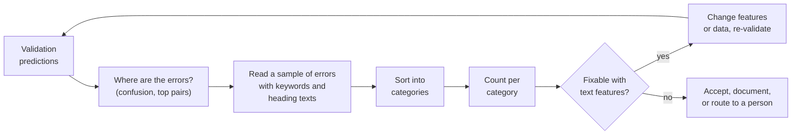
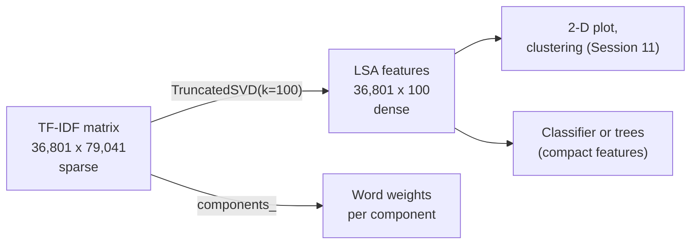

# Error analysis, model inspection and the limits of word counts

A score tells us how often a model fails, not why. This page shows how to analyse the errors of a text classifier with about 1,000 classes: with a confusion matrix for a group of neighbouring headings, by reading misclassified decisions next to their English keywords and the English text of the headings, and by inspecting the n-grams the model relies on most. It then measures a trap that error analysis can hide: a text column that contains the answer but exists only after the decision (the customs' justification). The page then introduces truncated singular value decomposition (SVD), which compresses the sparse document-term matrix into a few dense dimensions, and ends with the limits of word counts (synonyms, other languages, word order, unknown words) that motivate the language models of Session 14. The practice task is to analyse 20 misclassified decisions and use the findings to improve the classifier.

The code blocks on this page build on each other; run them in order from the repository root. The first block refits the word model of [Block 2](02-tfidf-and-text-classification.md) on the decisions of 2017–2021 and predicts the validation years 2022–2023 (about 30 seconds).



```python
import numpy as np
import pandas as pd
from sklearn.feature_extraction.text import TfidfVectorizer
from sklearn.linear_model import SGDClassifier
from sklearn.metrics import accuracy_score, confusion_matrix, f1_score
from sklearn.pipeline import make_pipeline

decisions = pd.read_parquet("case-study/data/train_sample.parquet")
nomenclature = pd.read_parquet("case-study/data/nomenclature.parquet").set_index("heading")
year = decisions["start_date"].dt.year
train, valid = decisions[year <= 2021], decisions[year >= 2022]
model = make_pipeline(TfidfVectorizer(min_df=2, sublinear_tf=True),
                      SGDClassifier(loss="hinge", alpha=1e-5, max_iter=20, tol=None,
                                    random_state=0, n_jobs=-1))
model.fit(train["description"], train["heading"])
pred = model.predict(valid["description"])
print(round(accuracy_score(valid["heading"], pred), 3))     # 0.772
```

## Error analysis of text models

### Concept

A **confusion matrix** counts, for every true class (row), how often each class was predicted (column). The diagonal holds the correct predictions; every off-diagonal cell is one kind of error. Dividing each row by its total gives the **recall** of each class on the diagonal. With 1,000 headings the full matrix has a million cells and cannot be read; we look instead at **groups of neighbouring headings** (one chapter) and at the **most frequent pairs** of true and predicted heading.

**Error analysis** means reading a sample of misclassified examples and sorting them into categories. For a multilingual corpus two helpers make this possible for everyone: the English **keywords** that customs assigned to each training decision, and the English **heading description** from the nomenclature. Keywords are *not* a model input (customs assigns them together with the classification, and the test set does not have them), but they are allowed for reading.

Categories that occur in the case study:

| Category | Example from the validation years (shortened) |
|---|---|
| material versus function | a fibre-optic splice box "mainly made of plastic" (true 8536, switching apparatus; predicted 3926, articles of plastics) |
| borderline between related headings | curry powder for sauces (true 0910, spices; predicted 2103, sauces and condiments) |
| rare language, few examples | a Slovak description of birch-wood bed slats (true 4421, wooden articles; predicted 7606, aluminium sheets) |
| technical or chemical knowledge needed | disodium pyrophosphate (true 2835, phosphates; predicted 2918, carboxylic acids) |
| sets and composite goods | a travel set of bottles and spatulas (true 9605, travel sets; predicted 3301, essential oils) |
| new heading after a nomenclature change | a nicotine product without tobacco (true 2404, created in HS 2022; predicted 3824) |

The **count per category** shows which improvement is worth trying. "Material versus function" and "borderline" errors follow from the legal rules of the tariff (the General Interpretative Rules and the section and chapter notes), which no description-only model sees; "rare language" errors may shrink with more data or character n-grams.

Worked example from the footwear chapter (figure below): the validation years contain 104 decisions of heading 6404 (textile uppers). The model labels 88 correctly, 10 as 6405 (other footwear), 5 as 6403 (leather uppers) and 1 as 6402. Recall for 6404 is 88 / 104 = 0.85. Heading 6406 (parts of footwear) has a recall of only 0.43: parts are described with the same words as complete shoes.


### Why it matters

A single score says how often the model fails, not why. Error analysis turns the score into a list of concrete next steps, shows where the labels depend on rules the model cannot see, and gives an honest upper bound: if a third of the errors need the legal notes of the tariff, a better text representation alone will not fix them. It also prevents a common waste of time, namely tuning hyperparameters when the real problem lies in the data or the task.

### How it works in Python

```python
shoes = ["6401", "6402", "6403", "6404", "6405", "6406"]
in64 = valid["heading"].isin(shoes).to_numpy()
print(confusion_matrix(valid["heading"][in64], pred[in64], labels=shoes))
# [[  1   0   0   0   0   0]
#  [  0  44   2   0   0   0]
#  [  0   0 112   0   0   0]
#  [  0   1   5  88  10   0]
#  [  0   0   0   0  71   0]
#  [  0   1   0   0   3   6]]   rows = true, columns = predicted (outside predictions not shown)

val = valid.assign(pred=pred)
wrong = val[val["heading"] != val["pred"]]
print(len(wrong), round((wrong["heading"].str[:2] == wrong["pred"].str[:2]).mean(), 2))
# 3003 0.3: only 30 % of the errors stay inside the right chapter
print(wrong[["heading", "pred"]].value_counts().head(3))
# 8524 -> 8548  17    flat-panel display modules: heading 8524 was created in HS 2022
# 8539 -> 9405  13    LED lamps versus luminaires
# 8524 -> 8529  12

# the 20 decisions for the practice task (fixed seed, so everyone reads the same ones)
errors20 = wrong.sample(20, random_state=1)
for _, row in errors20.head(2).iterrows():
    print(row["heading"], "->", row["pred"], row["language"],
          "|", nomenclature.loc[row["heading"], "heading_description"][:50],
          "|", nomenclature.loc[row["pred"], "heading_description"][:50])
    print("   keywords:", row["keywords"][:80])
# 9605 -> 3301 nl | Travel sets; for personal toilet, sewing, shoe or c | Oils; essential (concretes, absolutes); concentrat
#    keywords: AEROPLANES,BOTTLES,EMPTY,FOR FILLING,OF PLASTICS,SPATULAS,TRANSPARENT,TRAVEL SETS
# 9027 -> 8543 fr | Instruments and apparatus; for physical or chemical | Electrical machines and apparatus; having individu
#    keywords: ACIDS,AS MODULE,CHROMOTOGRAPHS,FOR MEDICAL USE,FOR PHARMACEUTICALS,PUMPS,SCIENTIFIC AND
```

Sorting the 20 sampled errors by hand gave the following counts. Your own categories may differ; the point is to count.

| Category | Count |
|---|---|
| borderline between related headings (orange drink 2202/2106, curry 0910/2103, tags 4821/4911, ...) | 6 |
| rare language or few examples (Czech, Slovak, Bulgarian, Polish, Spanish descriptions) | 5 |
| material versus function (plastic splice box, plastic filter column, wooden dry toilet, glass ornament with LED) | 4 |
| technical or chemical knowledge needed | 2 |
| sets and composite goods | 1 |
| new heading after HS 2022 (2404, nicotine products) | 1 |
| no clear reason | 1 |

Eleven of twenty errors (borderline, material versus function, sets) depend on classification rules rather than on vocabulary. Five involve languages with few training decisions, which suggests more data or character n-grams. This is the pattern the Block 2 results already showed: character n-grams help a little, the full training set helps more, and a large part of the errors remains.

### In practice

- Andrew Ng's *Machine Learning Yearning* (2018) recommends reading about 100 misclassified development-set examples by hand and counting error categories before deciding what to improve.
- Customs classification is reviewed by people: an officer checks a suggested code, and BTI decisions themselves are binding only after a customs expert has classified the goods. A model that reports its confidence can route uncertain cases to an expert (Session 14, abstention).
- Northcutt, Athalye and Mueller (2021) found label errors in the test sets of ten widely used benchmark datasets; confident errors of a model were their main tool for finding them. In the EBTI data, some "errors" may also be decisions that were later revoked (`invalidation_reason`).

> [!TIP]
> Fix the random seed when you sample errors (`random_state=1`), so that the whole team discusses the same decisions, and write the category of each one into a column. A spreadsheet of 20–100 categorised errors is one of the most useful artefacts of a text project.

## Leakage through the customs' justification

### Concept

**Target leakage** (Sessions 7 and 9, with the leaking revenue columns of the Airbnb price model) means that a feature contains information about the label that will not be available when the model is used. Every training decision has a column `classification_justification`, the text in which customs explain their classification. It is written *with* the decision, and it usually names the result:

> CLASSIFICATION HAS BEEN DETERMINED IN ACCORDANCE WITH THE FOLLOWING: GIR 1 HAS BEEN USED TO CLASSIFY THE PRODUCT BY THE TERMS OF HEADING 4303 - ARTICLES OF APPAREL, CLOTHING ACCESSORIES AND OTHER ARTICLES OF FURSKIN ...

In the sample, 70 % of the justifications contain the decision's own heading, and a rule that simply reads the first four-digit number of the justification gets 64 % of the headings right, without any model. A new request has no justification, and the test set does not contain the column. The same holds for `keywords` and `cn_code`.

### Why it matters

No validation scheme detects this kind of leak, because the justification is present in every validation decision as well. A model that uses it looks excellent in validation and fails in use. The only protection is to ask, for every column, *"would I have this value at the moment of prediction?"*, and to answer it from how the data are produced, not from the scores. For an officer, the consequence would be concrete: a tool that was validated at 96 % and is wrong for three requests in ten.

### How it works in Python

Append the justification to the description and validate as a careless notebook would, with a random split inside the training years. Then apply the model where it will be used: to the decisions of 2022–2023, which, like a new request, have only a description.

```python
from sklearn.model_selection import train_test_split

just = decisions["classification_justification"].fillna("")
print(round(np.mean([h in j for h, j in zip(decisions["heading"], just)]), 2))   # 0.7
first_number = just.str.extract(r"\b(\d{4})\b", expand=False)
print(round((first_number == decisions["heading"]).mean(), 2))   # 0.64: the answer, without a model

with_just = decisions["description"] + " " + just
past = (year <= 2021).to_numpy()
tr, va = train_test_split(np.flatnonzero(past), test_size=0.2, random_state=0)   # within 2017-2021
later = np.flatnonzero(~past)                                                    # 2022-2023
leak_model = make_pipeline(TfidfVectorizer(min_df=2, sublinear_tf=True),
                           SGDClassifier(alpha=1e-5, random_state=0, n_jobs=-1))
for name, X in [("description only", decisions["description"]), ("+ justification", with_just)]:
    leak_model.fit(X.iloc[tr], decisions["heading"].iloc[tr])
    acc_val = accuracy_score(decisions["heading"].iloc[va], leak_model.predict(X.iloc[va]))
    acc_use = accuracy_score(decisions["heading"].iloc[later],
                             leak_model.predict(decisions["description"].iloc[later]))   # no justification
    print(f"{name:17s} validation {acc_val:.3f}   in use (2022-2023, description only) {acc_use:.3f}")
# description only  validation 0.804   in use (2022-2023, description only) 0.753
# + justification   validation 0.957   in use (2022-2023, description only) 0.707
```

Validation reports a jump from 0.80 to 0.96. In use, where only the description exists, the leaking model is *worse* than the honest one (0.707 against 0.753): it has learned to rely on a text that is missing, and it learned less from the description itself.

### In practice

- KDD Cup 2008 (breast cancer detection): patient identifiers were predictive of the label because of how the data had been assembled; Kaufman et al. (2012) use it as a textbook case of leakage.
- Hospital data: a feature such as "antibiotic prescribed" can reveal the diagnosis a model is supposed to predict, because it is recorded after the doctor suspected it.
- Churn data: fields such as "reason for leaving" are filled only for customers who have already left.

> [!WARNING]
> A large jump in the validation score from one new column is a warning sign, not a success. Check when and by whom that column is written before you celebrate. For the leaderboard: never use `classification_justification`, `keywords`, `cn_code`, `chapter`, `status`, `end_date` or `invalidation_reason` as inputs.

> [!NOTE]
> Reading the keywords and the justification **during error analysis** is fine, as in the previous section: they help a person understand a decision. The rule concerns model inputs only.

## The most informative n-grams per class

### Concept

In a linear model each feature has one **coefficient** per class. A large positive coefficient means that the n-gram pushes the score towards that class. Because TF-IDF features are on comparable scales (each row has length 1), sorting the coefficients gives a direct ranking of the most informative n-grams per class.

This inspection is also a check for **shortcuts**: features that predict the label for reasons unrelated to the content of the goods.


The figure shows three things. First, the model learns the same concept separately in every language: `jouet`, `spielzeug`, `speelgoed`, `leksak` and `toy` for toys. Second, the material words that the legal text names (`cuir`, `leder`, `leather`; `textile`, `spinnstoffen`) dominate the footwear headings, as they should. Third, **numbers** are among the strongest features: `6403`, `1200`, `1910`, `1100`. Traders and customs often quote tariff codes in the description ("keine Ware der Position 6403", "sous-position 6404 19 10"). The case-study data replace numbers that repeat the decision's *own* code by `<CODE>`, but a quoted heading number survives when it comes with a different subheading.

### Why it matters

In the validation years, 24.6 % of the descriptions contain their own four-digit heading as a number. For these the model is right 98 % of the time; for the others only 70.5 %. Is this leakage? No: the numbers are part of what the trader or customs wrote, and the test descriptions contain them at a similar rate (26 % in 2024–2026), so the feature is available at prediction time. But it changes how we read the score: about a quarter of the task is "read the code that is already there", and the hard part is the remaining three quarters. Report both numbers.

### How it works in Python

```python
import re

has_number = pd.Series([bool(re.search(rf"(?<!\d){h}(?!\d)", t))
                        for h, t in zip(valid["heading"], valid["description"])], index=valid.index)
print(round(has_number.mean(), 3))                         # 0.246 of descriptions quote their heading
print(val.groupby(has_number).apply(lambda g: round((g["heading"] == g["pred"]).mean(), 3)).to_dict())
# {False: 0.705, True: 0.98}

vec, clf = model.named_steps["tfidfvectorizer"], model.named_steps["sgdclassifier"]
names = vec.get_feature_names_out()
for heading in ["6403", "6404", "3926"]:
    k = list(clf.classes_).index(heading)
    print(heading, list(names[np.argsort(clf.coef_[k])[::-1][:8]]))
# 6403 ['cuir', '6403', '24', 'leder', '1200', 'leather', 'naturel', '24cm']
# 6404 ['kunststoff', 'textile', '1910', 'caoutchouc', '1100', 'sole', 'spinnstoffen', '6404']
# 3926 ['3926', 'ouvrage', 'plastique', 'statuetten', 'andere', 'műanyagból', 'bâche', 'kunststoffen']
```

### In practice

- Ribeiro, Singh and Guestrin (2016) showed with their LIME method that a classifier for the 20 Newsgroups data separated "Christianity" from "atheism" mostly through e-mail header words such as "posting" and "host", not through the content.
- In medical imaging, Zech et al. (2018) found that pneumonia classifiers partly recognised the hospital that took the X-ray (from markers on the image) instead of the disease, a shortcut that failed in other hospitals.
- The EU's General Data Protection Regulation gives people subject to some automated decisions a right to meaningful information about the logic involved; for linear text models the coefficients are one direct way to provide it.

> [!WARNING]
> Coefficients are comparable only when the features are on the same scale and not strongly correlated. `leder` and `leather` share their signal across languages, so neither coefficient alone tells the full story. Treat the ranking as a diagnostic, not as a causal statement about words.

## Dimensionality reduction with truncated SVD

### Concept

The TF-IDF matrix has tens of thousands of sparse columns. **Truncated singular value decomposition** (truncated SVD) approximates it by k dense columns, for example k = 100. Each new column, a **component**, is a weighted combination of words that tend to occur together. Applied to a document-term matrix, the method is called **latent semantic analysis** (LSA; Deerwester et al., 1990).

The idea in one picture: the document-term matrix X (documents × words) is written approximately as a product X ≈ U Σ Vᵀ, where V (words × k) describes each component by its word weights and U Σ (documents × k) gives the coordinates of each document on the components. Words that co-occur load on the same component.

Truncated SVD is closely related to PCA (Session 11). The difference: PCA first subtracts the column means, which would turn every zero into a non-zero number and destroy sparsity. Truncated SVD works on the sparse matrix directly.



### Why it matters

Truncated SVD gives a compact, dense representation that methods needing dense input can use: k-means clustering, nearest-neighbour search, plots, or the tree models of Session 10. On the case study it also shows what dominates the co-occurrence structure: the first components separate **languages** (French and Dutch function words against German ones), not product groups, because words of one language co-occur with each other. Only later components pick up topics such as footwear. 100 components keep 19 % of the variance, and a classifier on 300 LSA components reaches 0.615 accuracy against 0.772 on the full sparse matrix. LSA is therefore mainly a tool for exploration and for methods that cannot handle sparse input, and the historical step towards the learned embeddings of Session 14, which map texts of different languages into one space.

### How it works in Python

```python
from sklearn.decomposition import TruncatedSVD
from sklearn.preprocessing import Normalizer

T = vec.transform(train["description"])
svd = TruncatedSVD(n_components=100, random_state=0).fit(T)
print(round(svd.explained_variance_ratio_.sum(), 2))      # 0.19 of the variance kept
for i in [1, 2, 3]:                                        # component 0 is a general average
    c = svd.components_[i]
    print(i, list(names[np.argsort(c)[::-1][:6]]), list(names[np.argsort(c)[:4]]))
# 1 ['de', 'en', 'la', 'et', 'un', 'une'] ['oberteil', 'aus', 'mit', 'laufsohlen']   French vs German
# 2 ['oberteil', 'laufsohlen', 'spinnstoff', 'kunststoff', 'schuhe', 'antrag'] ['die', 'es', 'um', 'handelt']
# 3 ['een', 'van', 'met', 'het', 'voor', 'volgende'] ['la', 'et', 'un', 'une']         Dutch vs French

# LSA features as classifier input: compact but much weaker than sparse TF-IDF (0.772)
lsa = make_pipeline(TfidfVectorizer(min_df=2, sublinear_tf=True),
                    TruncatedSVD(n_components=300, random_state=0), Normalizer(),
                    SGDClassifier(loss="hinge", alpha=1e-5, max_iter=20, tol=None,
                                  random_state=0, n_jobs=-1))
lsa.fit(train["description"], train["heading"])
pred_lsa = lsa.predict(valid["description"])
print(round(accuracy_score(valid["heading"], pred_lsa), 3),
      round(f1_score(valid["heading"], pred_lsa, average="macro"), 3))   # 0.615 0.296
```

### In practice

- LSA was developed at Bellcore for information retrieval (Deerwester et al., 1990) so that a search for "car" could also find documents about "automobiles".
- Landauer and Dumais (1997) reported that LSA trained on an encyclopedia answered the synonym questions of the TOEFL English test about as well as non-native applicants to US universities.
- The scikit-learn example *Clustering text documents using k-means* (workbook 06) uses LSA before k-means on news articles, because k-means works poorly on the raw sparse matrix.

> [!NOTE]
> The sign of an SVD component is arbitrary, and component 0 usually captures the average document (frequent words). Interpret components by their top *and* bottom words, and do not expect every component to have a clear meaning.

## The limits of word counts

### Concept

Bag-of-words, TF-IDF and n-grams share four blind spots, and the case study shows each of them:

1. **Other languages and synonyms.** "Spielzeugauto aus Kunststoff", "Voiture jouet en matière plastique" and "Toy car of plastics" describe the same good but share no word: their TF-IDF cosine similarity is 0. The model must learn each language separately from labelled examples; for Bulgarian or Slovak there are few.
2. **Word order beyond n words.** "Shoes with a textile upper and a leather sole" and "with a leather upper and a textile sole": bigrams help only if the material and the part stand next to each other.
3. **Ambiguity.** "Zubehör" (accessories) or "set" mean different things for different goods; one column has many meanings.
4. **Unknown words and short texts.** A word that is not in the training vocabulary gets no column. A short description gives the model little to go on: "Aufsteckbürste für elektrische Zahnbürsten" (replacement head for electric toothbrushes) is predicted as 6301 (blankets) instead of 9603 (brushes).

Each limit has a classic patch: n-grams (order), stemming and LSA (synonyms within one language), character n-grams (compounds, unknown words). None solves the problem in general, because all of them still represent a word by its identity, not by its meaning. **Language models** take the other route: they learn from large amounts of unlabelled text, in many languages, that "jouet", "Spielzeug" and "toy" occur in similar contexts, and represent texts as dense vectors in which such descriptions are close (Session 14).


### Why it matters

Knowing the limits explains part of the errors above (rare languages, short texts) and sets the expectations for Session 14: language models are not automatically better, but they address exactly these blind spots, in particular the language barrier. It also explains why TF-IDF remains a strong baseline: with 300,000 labelled decisions, every frequent heading has enough examples in the main languages, and TF-IDF models are fast, cheap and transparent.

### How it works in Python

```python
from sklearn.metrics.pairwise import cosine_similarity

same_good = ["Spielzeugauto aus Kunststoff", "Voiture jouet en matière plastique", "Toy car of plastics"]
V = TfidfVectorizer().fit_transform(same_good)
print(cosine_similarity(V).round(2))     # identity matrix: the three languages share no word
# [[1. 0. 0.]
#  [0. 1. 0.]
#  [0. 0. 1.]]

# a short description: the model sees only a few known words
print("zahnbürstenaufsatz" in vec.vocabulary_, "zahnbürste" in vec.vocabulary_)   # False True
guess = model.predict(["Aufsteckbürste für elektrische Zahnbürsten"])[0]
print(guess, nomenclature.loc[guess, "heading_description"][:30])   # 6301 Blankets and travelling rugs
```

### In practice

- Google reported in 2019 that applying the language model BERT to search queries helped mainly with longer queries where small words such as "to" and "for" change the meaning, a case that keyword matching handles poorly.
- Many production systems still use BM25 or TF-IDF for a first, cheap retrieval step and a language model only for the final ranking, combining the speed of counts with the semantics of embeddings (Session 15).
- Multilingual search in EU institutions relies on translation or cross-lingual representations because keyword matching cannot connect 24 languages; the same need arises when a German customs officer looks for similar French decisions.

> [!IMPORTANT]
> Keep the TF-IDF classifier as the baseline for every later text model in the project. A language model is worth its extra cost only if it beats this baseline on the same validation years by a margin that matters (Session 14).

## Practice: analyse 20 misclassified decisions and improve the classifier

Workbook [07-case-study-error-analysis.ipynb](../workbooks/07-case-study-error-analysis.ipynb) guides through the task:

1. Fit the Block 2 classifier on 2017–2021, draw the 20 errors with `random_state=1`, read each one with its keywords and the English heading texts, and write a category for each.
2. Count the categories and choose one change that addresses the largest fixable category (for example: character n-grams, `min_df`, `alpha`, class weights for rare headings, or more training data).
3. Re-validate on 2022–2023, report accuracy and macro-F1 separately for descriptions with and without a quoted heading number, and, if the change helps, submit again.
4. Measure the justification leak yourself: train with and without `classification_justification` and compare the validation score with the score on 2022–2023 descriptions alone.

## Check your understanding

1. In the footwear confusion matrix, what share of the decisions predicted as 6405 are truly 6405 (precision)? Which off-diagonal cell is the largest, and why could that be?
2. Name two error categories that a better text representation could fix and one that it cannot fix.
3. Descriptions that quote their heading number are 98 % correct. Is this leakage? Compare it with the justification of the leakage section: when is each text written?
4. Why does the first SVD component of the case study separate French from German rather than toys from shoes?
5. A teammate adds `keywords` to the description and reports 0.93 validation accuracy. What do you expect on the leaderboard, and how do you show it without submitting?

## Further reading

- Ng, A. (2018). *Machine Learning Yearning*, chapters 14–19 on error analysis. https://info.deeplearning.ai/machine-learning-yearning-book
- scikit-learn developers. *Clustering text documents using k-means* (example with LSA). https://scikit-learn.org/stable/auto_examples/text/plot_document_clustering.html
- World Customs Organization. *General Interpretative Rules for the classification of goods in the Harmonized System*, part of the HS nomenclature overview. https://www.wcoomd.org/en/topics/nomenclature/overview/what-is-the-harmonized-system.aspx
- Ribeiro, M. T., Singh, S. and Guestrin, C. (2016). "Why should I trust you?": explaining the predictions of any classifier. *Proceedings of KDD 2016*, 1135–1144. https://arxiv.org/abs/1602.04938
