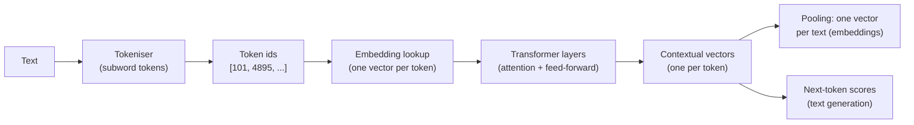
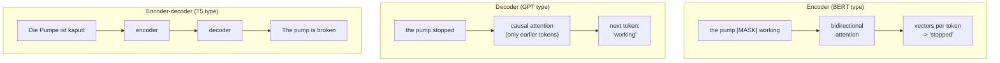

# From words to vectors: tokens, embeddings and transformer models

Session 13 ended with the limits of word counts: synonyms share no column, and word order is lost. Language models address both by representing text as dense vectors learned from very large amounts of unlabelled text. This page explains, at a conceptual level, how they do it: subword tokens, embeddings, attention and pre-training; the three families of transformer models (encoder, decoder, encoder–decoder); and sentence-embedding models, which turn a whole review into one vector. The mathematics of neural networks and their training belong to module 3.4; here the aim is to understand what these models do, what goes in and what comes out, so that we can use them responsibly.

The code blocks on this page build on each other; run them in order from the repository root. They need `sentence-transformers` and `tiktoken` (see the session [README](../README.md#setup)); the first run downloads the model `all-MiniLM-L6-v2` (about 90 MB). No API key is needed.



## Tokens: how a language model splits text

### Concept

A language model has a fixed vocabulary of **subword tokens**, typically 30,000 to 200,000 entries. Frequent words are single tokens ("heads"); rare words are split into pieces ("toothbrush" → "tooth" + "##brush"). Because single characters are also in the vocabulary, *every* string can be represented: there are no out-of-vocabulary words as in Session 13.

Two families of tokenisers are common:

- **WordPiece** (BERT-type models): pieces that continue a word are marked with `##`.
- **Byte-pair encoding** (BPE; GPT-type models): starts from single bytes and repeatedly merges the most frequent adjacent pair into a new token, until the vocabulary has the desired size (Sennrich, Haddow and Birch, 2016). A leading space is part of the token (" heads").

Worked example of BPE training on a tiny corpus: "low" (3 times), "lower" (once), "newest" (twice). Start from single characters and count adjacent pairs:

| Step | Most frequent pair (count) | Merge | Words afterwards |
|---|---|---|---|
| 0 | | | l o w (×3), l o w e r, n e w e s t (×2) |
| 1 | `l o` (4) | `lo` | lo w (×3), lo w e r, n e w e s t (×2) |
| 2 | `lo w` (4) | `low` | low (×3), low e r, n e w e s t (×2) |
| 3 | `n e` (2) | `ne` | low (×3), low e r, ne w e s t (×2) |

After two merges, "low" is a single token and "lower" is `low` + `e` + `r`. Repeating this tens of thousands of times on a large corpus yields tokens for frequent words and for frequent word pieces; rare words remain split into pieces.


### Why it matters

Tokens are the unit of everything that follows: the model's input limit (the **context window**), the price of an API call and the processing time are all counted in tokens, not words. English review text needs about 1.2–1.3 tokens per word. Other languages often need more: the German phrase in the figure needs 10 GPT tokens for 3 words. Petrov et al. (2023) showed that the same text can cost several times more tokens in some languages than in English, which makes language models slower and more expensive for those languages.

### How it works in Python

```python
import pandas as pd
import tiktoken
from sentence_transformers import SentenceTransformer

model = SentenceTransformer("sentence-transformers/all-MiniLM-L6-v2")   # 90 MB, first run only
bert_tok = model.tokenizer                                 # WordPiece tokeniser of the model
gpt_tok = tiktoken.get_encoding("o200k_base")              # BPE tokeniser of GPT-4o-type models

text = "Unbelievably overpriced toothbrush heads"
print(bert_tok.tokenize(text))
# ['un', '##bel', '##ie', '##va', '##bly', 'over', '##pr', '##ice', '##d', 'tooth', '##brush', 'heads']
ids = gpt_tok.encode(text)
print(ids[:3], [gpt_tok.decode([i]) for i in ids])
# [2265, 9880, 153516] ['Un', 'bel', 'ievably', ' overpriced', ' toothbrush', ' heads']

# token counts of 2,000 reviews
reviews = pd.read_parquet("case-study/data/train_sample.parquet")
texts = (reviews["title"] + ". " + reviews["text"]).sample(2000, random_state=0)
counts = pd.DataFrame({
    "words": texts.str.split().str.len(),
    "wordpiece": texts.map(lambda t: len(bert_tok.tokenize(t))),
    "bpe_o200k": texts.map(lambda t: len(gpt_tok.encode(t))),
})
print(counts.sum().to_dict())     # about {'words': 81000, 'wordpiece': 104000, 'bpe_o200k': 99000}
print(round((counts["wordpiece"] > model.max_seq_length).mean(), 3))
# 0.018: about 2 % of reviews are longer than the 256-token input limit of the model
```

### In practice

- OpenAI, Anthropic and Google all bill their language-model APIs per token, separately for input and output tokens; their tokeniser libraries (such as `tiktoken`) exist so that customers can count tokens before sending a request.
- Petrov et al. (2023, NeurIPS) measured that for some languages the same content needs up to about 15 times as many tokens as in English, with direct effects on price, speed and the amount of text that fits into the context window.
- The German BERT models of deepset (`gbert`, Chan, Schweter and Möller, 2020) use a vocabulary trained on German text, so that German words are split into fewer pieces than with an English vocabulary such as MiniLM's (14 pieces for three words in the figure).

> [!WARNING]
> Every model has its own tokeniser. Token counts from `tiktoken` are exact only for OpenAI models; for other models use their own tokeniser (for example `AutoTokenizer.from_pretrained(...)` from Hugging Face) or the token counts reported in the API response.

## Embeddings: words and texts as vectors

### Concept

An **embedding** is a vector of real numbers (typically 300–4,000 numbers) that represents a token, a word or a whole text, learned so that similar items get nearby vectors. Compare this with Session 13: a bag-of-words vector has one dimension per vocabulary word, mostly zeros; an embedding is **dense** (all dimensions are used) and **low-dimensional**, and the individual dimensions have no readable meaning.

Similarity between embeddings is measured with **cosine similarity**: cos(a, b) = a·b / (‖a‖ ‖b‖). It depends only on the angle between the vectors and ranges from −1 to 1. For vectors normalised to length 1 it equals the dot product.

Worked example with made-up three-dimensional vectors: good = (0.9, 0.1, 0.3), great = (0.8, 0.2, 0.4), pump = (0.1, 0.9, 0.2).

- good · great = 0.72 + 0.02 + 0.12 = 0.86; ‖good‖ = 0.954, ‖great‖ = 0.917; cos = 0.86 / 0.875 = 0.98.
- cos(good, pump) = (0.09 + 0.09 + 0.06) / (0.954 × 0.927) = 0.27.

In bag-of-words, "good" and "great" are different columns, so their cosine is 0, the same as "good" and "pump".

Embeddings are learned from the **distributional hypothesis**: words that occur in similar contexts have similar meanings (Firth, 1957: "You shall know a word by the company it keeps"). **word2vec** (Mikolov et al., 2013) learns one vector per word by predicting neighbouring words. Its limit: "light" gets one vector, whether it means weight or brightness. Transformer models produce **contextual embeddings**: the vector of a token depends on the whole sentence around it.

### Why it matters

Embeddings turn meaning into geometry. Once texts are vectors, "find similar reviews", "group reviews by topic" and "use the text as a feature" all become standard operations on vectors: nearest neighbours, k-means and logistic regression (Block 2). Because embedding models are pre-trained on billions of words, they bring knowledge about synonyms and paraphrases that no small labelled dataset contains.

### How it works in Python

```python
import numpy as np


def cosine(a, b):
    return a @ b / (np.linalg.norm(a) * np.linalg.norm(b))


good, great, pump = np.array([0.9, 0.1, 0.3]), np.array([0.8, 0.2, 0.4]), np.array([0.1, 0.9, 0.2])
print(round(cosine(good, great), 3), round(cosine(good, pump), 3))   # 0.983 0.271
onehot = np.eye(3)                                         # bag-of-words: one column per word
print(cosine(onehot[0], onehot[1]))                        # 0.0 for any two different words

# contextual embeddings: the vector of a token depends on its sentence
def token_vector(sentence, word):
    vecs = model.encode(sentence, output_value="token_embeddings")   # one vector per token
    tokens = bert_tok.convert_ids_to_tokens(bert_tok(sentence)["input_ids"])  # with [CLS], [SEP]
    return vecs[tokens.index(word)].cpu().numpy()

a = token_vector("this lamp gives a bright light", "light")
b = token_vector("the frame is very light to carry", "light")
c = token_vector("a warm light for reading", "light")
print(round(float(cosine(a, b)), 2), round(float(cosine(a, c)), 2))
# 0.51 0.75: the two 'brightness' uses are closer to each other than to the 'weight' use
```

### In practice

- Grbovic and Cheng (2018) described how Airbnb learns embeddings of listings from users' click sequences and uses them for similar-listing recommendations and search ranking.
- Tshitoyan et al. (2019, *Nature*) trained word2vec on materials-science abstracts; vectors trained only on older abstracts pointed to thermoelectric materials that were reported in later years.
- Bolukbasi et al. (2016) showed that word embeddings trained on news text reproduce gender stereotypes ("man is to computer programmer as woman is to homemaker"), a widely cited warning that embeddings inherit the biases of their training text.

> [!CAUTION]
> Embeddings capture what texts are *about* more strongly than what they *say about it*. "smells great" and "smells terrible" are close, because both are about smell. For sentiment, this is a weakness; Block 2 measures it.

## Attention and pre-training (conceptual)

### Concept

A **transformer** (Vaswani et al., 2017) turns the sequence of token embeddings into a sequence of contextual vectors by stacking layers. The key operation in each layer is **attention**: every token's vector is replaced by a weighted average of the vectors of all tokens in the text, with weights that depend on how relevant each other token is.

In "the pump stopped because it overheated", the vector for "it" should take information from "pump". Attention computes, for each pair of tokens, a relevance score and turns the scores of each row into weights that sum to 1 (with the softmax function). Technically each token has a **query** (what it looks for), a **key** (what it offers) and a **value** (what it passes on); the score of token i for token j is the dot product of query i and key j. A model has several such attention "heads" per layer and many layers, so it can track several relations at once.


**Pre-training** teaches the model language before it sees any task. It needs no labels, only text:

- **masked language modelling** (BERT): hide 15 % of the tokens and predict them from both sides: "the pump [MASK] working" → "stopped";
- **next-token prediction** (GPT): predict each token from all tokens before it: "the pump stopped" → "working".

Repeating this on billions of sentences forces the model to learn grammar, word meanings and a great deal of world knowledge. **Fine-tuning** then continues training on a smaller labelled dataset for one task (for example sentiment); **instruction tuning** fine-tunes a generative model on examples of instructions and good answers so that it follows prompts (Block 3).

### Why it matters

Attention is what bag-of-words lacks: the representation of a word depends on its context, at any distance, so "not" can modify "recommend" five words later, and "light" gets different vectors in different sentences. Pre-training on unlabelled text is why these models work with few or even no labelled examples. Both together explain why language models address the limits of Session 13, and why they need far more computation.

### How it works in Python

The numbers below are a toy: three tokens with two-dimensional vectors. Real models use hundreds of dimensions, many heads and learned matrices for queries, keys and values.

```python
def softmax(z):
    e = np.exp(z - z.max(axis=-1, keepdims=True))
    return e / e.sum(axis=-1, keepdims=True)

Q = np.array([[1.0, 0.0], [0.0, 1.0], [1.0, 1.0]])   # queries: what each token looks for
K = np.array([[1.0, 0.0], [0.0, 1.0], [0.5, 0.5]])   # keys: what each token offers
V = np.array([[1.0, 2.0], [3.0, 4.0], [5.0, 6.0]])   # values: what each token passes on
A = softmax(Q @ K.T / np.sqrt(2))                    # attention weights, one row per token
print(A.round(2))
# [[0.46 0.22 0.32]
#  [0.22 0.46 0.32]
#  [0.33 0.33 0.33]]
print((A @ V).round(2))                              # new vector per token = weighted mix of values
# [[2.73 3.73]
#  [3.19 4.19]
#  [3.   4.  ]]
```

### In practice

- Google announced in 2019 that it uses BERT to interpret about one in ten English search queries in the United States, in particular longer queries in which small words such as "for" and "to" matter.
- The transformer was designed for machine translation (Vaswani et al., 2017); today's translation services and speech-recognition models such as OpenAI's Whisper (2022) are transformers.
- Training large models is expensive: Strubell, Ganesh and McCallum (2019) estimated the energy use and carbon emissions of training NLP models and started a debate about the environmental cost of pre-training.

> [!NOTE]
> Attention weights are tempting to read as explanations ("the model looked at 'pump'"), but research has shown that they are not a reliable account of why a model made a prediction (Jain and Wallace, 2019). Treat figures like the one above as an illustration of the mechanism.

## Encoder, decoder and encoder–decoder models

### Concept

Transformer models come in three families, depending on which tokens attention may look at and what the model is trained to produce.

| Family | Attention | Pre-training | Typical output | Examples |
|---|---|---|---|---|
| **Encoder** (BERT type) | every token sees all tokens (bidirectional) | masked language modelling | one vector per token or per text | BERT, RoBERTa, MiniLM, German `gbert` |
| **Decoder** (GPT type) | every token sees only earlier tokens (causal) | next-token prediction | generated text, one token at a time | GPT-4o, Llama, Qwen, Mistral |
| **Encoder–decoder** | encoder reads the input; decoder generates and attends to the encoder | reconstruct or transform text | a new text from an input text | T5, BART, Whisper, translation models |



Rules of thumb: use an **encoder** when you need a representation of a text (classification, semantic search, clustering); use a **decoder** when you need to generate text or follow free-form instructions; use an **encoder–decoder** for tasks that map one text to another (translation, summarisation, speech to text). Large decoders can do all of these tasks through prompting, at higher cost.

### Why it matters

Choosing the family decides cost and fit. An encoder such as MiniLM (23 million parameters) embeds thousands of reviews per minute on a laptop. A decoder with billions of parameters needs a GPU server or a paid API and returns text that must be parsed. Many practical systems combine both: an encoder for search, a decoder for the answer (Session 15).

### How it works in Python

```python
print(model)                         # Transformer (BertModel) -> Pooling (mean) -> Normalize
bert = model[0].auto_model
print(type(bert).__name__, bert.config.num_hidden_layers, bert.config.hidden_size)
# BertModel 6 384: an encoder with 6 layers and 384-dimensional vectors
print(round(sum(p.numel() for p in bert.parameters()) / 1e6, 1))   # 22.7 million parameters
```

### In practice

- Encoders: the German BERT models of deepset (`gbert`) are used for classification and search in German-language applications; Google Search uses BERT-type encoders to understand queries.
- Decoders: chat assistants such as ChatGPT (released in November 2022) and code assistants such as GitHub Copilot are decoder models.
- Encoder–decoders: OpenAI's Whisper transcribes speech with an encoder for the audio and a decoder for the text; T5 (Raffel et al., 2020) cast every NLP task as "text in, text out".

> [!TIP]
> In the Hugging Face model hub, the model card states the architecture. "fill-mask" or "feature-extraction" usually means encoder; "text-generation" means decoder; "text2text-generation", "translation" or "summarization" usually means encoder–decoder. Workbook 04 runs one example of each.

## Embedding models (sentence-transformers)

### Concept

A **sentence-embedding model** maps a whole text to one vector so that texts with similar meaning get a high cosine similarity. **Sentence-BERT** (Reimers and Gurevych, 2019) takes a pre-trained encoder, averages its token vectors (**mean pooling**) and fine-tunes it on millions of pairs of texts that mean the same (question and answer, duplicate questions, paraphrases), so that paired texts move close together and unrelated texts move apart (**contrastive training**).

The `sentence-transformers` library provides hundreds of such models. `all-MiniLM-L6-v2` is small (6 layers, 384 dimensions, about 90 MB), runs on a laptop CPU and truncates inputs after 256 tokens. Larger and multilingual models are compared on the **MTEB** benchmark (Muennighoff et al., 2023). The option `normalize_embeddings=True` scales every vector to length 1, so the matrix product `E @ E.T` gives all pairwise cosine similarities.

### Why it matters

Sentence embeddings compare meaning rather than shared words. "The batteries died after two days" and "It stopped working almost immediately" share no word (TF-IDF cosine 0), but their embeddings have a clearly higher similarity than unrelated pairs. This is the basis for semantic search, clustering of feedback and the retrieval step of retrieval-augmented generation (Session 15). Encoding is a one-time cost: the vectors can be stored and reused.

### How it works in Python

```python
from sklearn.feature_extraction.text import TfidfVectorizer
from sklearn.metrics.pairwise import cosine_similarity

sents = ["The batteries died after two days.",
         "It stopped working almost immediately.",
         "Excellent value, works perfectly.",
         "Arrived quickly and well packaged."]
E = model.encode(sents, normalize_embeddings=True)
print(E.shape)                                   # (4, 384): one vector per sentence
print((E @ E.T).round(2))                        # cosine similarities (vectors have length 1)
# [[1.   0.44 0.2  0.14]
#  [0.44 1.   0.3  0.13]
#  [0.2  0.3  1.   0.14]
#  [0.14 0.13 0.14 1.  ]]
print(cosine_similarity(TfidfVectorizer().fit_transform(sents)).round(2)[0])
# [1. 0. 0. 0.]: with TF-IDF, sentences 1 and 2 share no word and look unrelated
```

Absolute values depend on the model: for MiniLM, 0.44 is a clear similarity and 0.14 means unrelated. Compare similarities with each other, not with a fixed threshold.

### In practice

- Semantic Scholar represents scientific papers with SPECTER document embeddings (Cohan et al., 2020), trained so that papers that cite each other get similar vectors, and uses them to recommend related papers.
- Customer-feedback teams cluster the embeddings of thousands of free-text comments to find recurring topics without reading every comment (Block 2).
- Duplicate detection: Quora released its Question Pairs dataset (2017) for recognising questions with the same meaning; it is one of the datasets sentence-transformers models are trained on.

> [!WARNING]
> Text longer than the model's limit (256 tokens for `all-MiniLM-L6-v2`) is silently cut off. For long documents, split them into passages and embed each passage (Session 15). Check `model.max_seq_length` before you rely on the vector of a long review.

> [!TIP]
> For German or mixed-language texts use a multilingual model such as `paraphrase-multilingual-MiniLM-L12-v2` (about 0.5 GB); English-only models embed German text poorly.

## Practice: tokenise reviews and compute semantic similarity

Workbook [01-case-study-tokens-and-similarity.ipynb](../workbooks/01-case-study-tokens-and-similarity.ipynb):

1. Tokenise 2,000 reviews with a WordPiece and a BPE tokeniser; compare token counts with word counts per class and estimate how many reviews exceed the model's input limit.
2. Embed a handful of review sentences, compute the similarity matrix and compare it with TF-IDF similarities.
3. Find pairs where embeddings and TF-IDF disagree most, and explain why.

## Check your understanding

1. Why can a subword tokeniser represent any word, while `CountVectorizer` cannot? What is the price?
2. A review has 300 words. Roughly how many tokens is that, and does it fit into `all-MiniLM-L6-v2` without truncation?
3. Compute the cosine similarity of (1, 0, 1) and (1, 1, 0) by hand.
4. Explain in two sentences what attention does, using the example "The cream did not help, it made my skin worse."
5. Which model family would you choose for (a) finding similar complaints, (b) writing a reply to a complaint, (c) translating reviews into German? Why?

## Further reading

- Alammar, J. (2018). *The Illustrated Transformer*. https://jalammar.github.io/illustrated-transformer/ (linked only)
- Hugging Face. *LLM Course*, chapters 1 (transformer models) and 6 (tokenisers). https://huggingface.co/learn/llm-course
- Jurafsky, D. and Martin, J. H. (2026). *Speech and Language Processing*, 3rd ed. draft, chapters on embeddings, transformers and large language models. https://web.stanford.edu/~jurafsky/slp3/
- Reimers, N. and Gurevych, I. (2019). Sentence-BERT: sentence embeddings using Siamese BERT-networks. *Proceedings of EMNLP-IJCNLP 2019*. https://arxiv.org/abs/1908.10084 · documentation: https://sbert.net/
