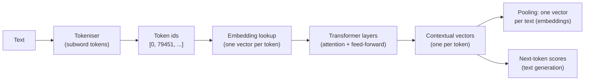
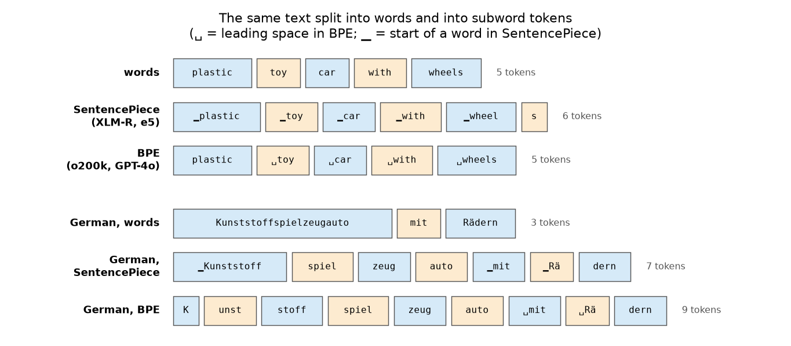
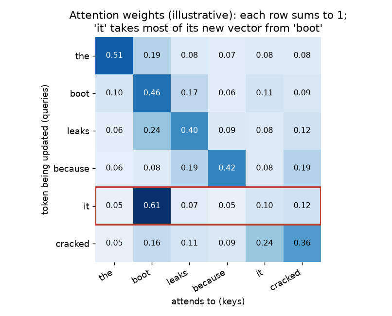
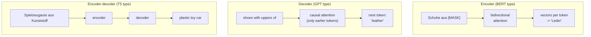

# From words to vectors: tokens, embeddings and transformer models

Session 13 ended with the limits of word counts: "Spielzeug", "jouet" and "toy" share no column, and word order is mostly lost. Language models address both by representing text as dense vectors learned from very large amounts of unlabelled text, in many languages at once. This page explains, at a conceptual level, how they do it: subword tokens, embeddings, attention and pre-training; the three families of transformer models (encoder, decoder, encoder–decoder); and sentence-embedding models, which turn a whole description of goods into one vector. The mathematics of neural networks and their training belong to module 3.4; here the aim is to understand what these models do, what goes in and what comes out, so that we can use them responsibly.

The code blocks on this page build on each other; run them in order from the repository root. They need `sentence-transformers` and `tiktoken` (see the session [README](../README.md#setup)); the first run downloads the multilingual model `intfloat/multilingual-e5-small` (about 470 MB). No API key is needed.



## Tokens: how a language model splits text

### Concept

A language model has a fixed vocabulary of **subword tokens**, typically 30,000 to 250,000 entries. Frequent words are single tokens ("plastic"); rare words and compounds are split into pieces ("Kunststoffspielzeugauto" → "Kunststoff" + "spiel" + "zeug" + "auto"). Because single characters are also in the vocabulary, *every* string can be represented: there are no out-of-vocabulary words as in Session 13.

Two families of tokenisers are common:

- **SentencePiece** (multilingual encoders such as XLM-RoBERTa and multilingual-e5): learned on text in about 100 languages; a piece that starts a new word is marked with `▁`.
- **Byte-pair encoding** (BPE; GPT-type models): starts from single bytes and repeatedly merges the most frequent adjacent pair into a new token, until the vocabulary has the desired size (Sennrich, Haddow and Birch, 2016). A leading space is part of the token (" toy").

Worked example of BPE training on a tiny corpus: "low" (3 times), "lower" (once), "newest" (twice). Start from single characters and count adjacent pairs:

| Step | Most frequent pair (count) | Merge | Words afterwards |
|---|---|---|---|
| 0 | | | l o w (×3), l o w e r, n e w e s t (×2) |
| 1 | `l o` (4) | `lo` | lo w (×3), lo w e r, n e w e s t (×2) |
| 2 | `lo w` (4) | `low` | low (×3), low e r, n e w e s t (×2) |
| 3 | `n e` (2) | `ne` | low (×3), low e r, ne w e s t (×2) |

After two merges, "low" is a single token and "lower" is `low` + `e` + `r`. Repeating this tens of thousands of times on a large corpus yields tokens for frequent words and for frequent word pieces. For German this has a welcome side effect: compounds are split into their parts, which is exactly what the character n-grams of Session 13 approximated.



### Why it matters

Tokens are the unit of everything that follows: the model's input limit (the **context window**), the price of an API call and the processing time are all counted in tokens, not words. The descriptions of goods need about two tokens per word. Languages differ: with the GPT-4o tokeniser, one token covers 3.8 characters of French and 3.7 of German but only 2.9 of Polish and 2.7 of Czech, so the same content costs about a third more in Czech. Petrov et al. (2023) showed that such differences between languages can be much larger and make language models slower and more expensive for some languages.

### How it works in Python

```python
import pandas as pd
import tiktoken
from sentence_transformers import SentenceTransformer

model = SentenceTransformer("intfloat/multilingual-e5-small")   # 470 MB, first run only
sp_tok = model.tokenizer                                   # SentencePiece tokeniser of the model
gpt_tok = tiktoken.get_encoding("o200k_base")              # BPE tokeniser of GPT-4o-type models

for text in ["Kunststoffspielzeug in Form eines Autos", "plastic toy in the shape of a car"]:
    print(sp_tok.tokenize(text))
    print([gpt_tok.decode([i]) for i in gpt_tok.encode(text)])
# ['▁Kunststoff', 'spiel', 'zeug', '▁in', '▁Form', '▁eines', '▁Auto', 's']
# ['K', 'unst', 'stoff', 'spiel', 'zeug', ' in', ' Form', ' eines', ' Autos']
# ['▁plastic', '▁toy', '▁in', '▁the', '▁shape', '▁of', '▁a', '▁car']
# ['plastic', ' toy', ' in', ' the', ' shape', ' of', ' a', ' car']

# token counts of 2,000 descriptions
decisions = pd.read_parquet("case-study/data/train_sample.parquet")
sample = decisions.sample(2000, random_state=0)
counts = pd.DataFrame({
    "language": sample["language"],
    "characters": sample["description"].str.len(),
    "words": sample["description"].str.split().str.len(),
    "xlmr": sample["description"].map(lambda t: len(sp_tok.tokenize(t))),
    "o200k": sample["description"].map(lambda t: len(gpt_tok.encode(t))),
})
print(counts[["words", "xlmr", "o200k"]].sum().to_dict())
# {'words': 181130, 'xlmr': 345535, 'o200k': 357514}: about two tokens per word
per_lang = counts.groupby("language")[["characters", "o200k"]].sum()
print((per_lang["characters"] / per_lang["o200k"]).loc[["de", "fr", "en", "pl", "cs"]].round(1).to_dict())
# {'de': 3.7, 'fr': 3.8, 'en': 3.2, 'pl': 2.9, 'cs': 2.7}: characters per token
print(model.max_seq_length, round((counts["xlmr"] > model.max_seq_length - 2).mean(), 3))
# 512 0.007: fewer than 1 % of descriptions are longer than the model's input limit
```

The English descriptions in the data are often written in capitals, which tokenises less efficiently (3.2 characters per token) than ordinary English text.

### In practice

- OpenAI, Anthropic and Google all bill their language-model APIs per token, separately for input and output tokens; their tokeniser libraries (such as `tiktoken`) exist so that customers can count tokens before sending a request.
- Petrov et al. (2023, NeurIPS) measured that for some languages the same content needs up to about 15 times as many tokens as in English, with direct effects on price, speed and the amount of text that fits into the context window.
- XLM-RoBERTa (Conneau et al., 2020) was trained with one SentencePiece vocabulary of 250,000 tokens on text in 100 languages; multilingual-e5 reuses this tokeniser, which is why German compounds and Czech inflections are split into reusable pieces.

> [!WARNING]
> Every model has its own tokeniser. Token counts from `tiktoken` are exact only for OpenAI models; for other models use their own tokeniser (for example `AutoTokenizer.from_pretrained(...)` from Hugging Face) or the token counts reported in the API response.

## Embeddings: words and texts as vectors

### Concept

An **embedding** is a vector of real numbers (typically 300–4,000 numbers) that represents a token, a word or a whole text, learned so that similar items get nearby vectors. Compare this with Session 13: a bag-of-words vector has one dimension per vocabulary word, mostly zeros; an embedding is **dense** (all dimensions are used) and **low-dimensional**, and the individual dimensions have no readable meaning.

Similarity between embeddings is measured with **cosine similarity**: cos(a, b) = a·b / (‖a‖ ‖b‖). It depends only on the angle between the vectors and ranges from −1 to 1. For vectors normalised to length 1 it equals the dot product.

Worked example with made-up three-dimensional vectors: toy = (0.9, 0.1, 0.3), jouet = (0.8, 0.2, 0.4), shoe = (0.1, 0.9, 0.2).

- toy · jouet = 0.72 + 0.02 + 0.12 = 0.86; ‖toy‖ = 0.954, ‖jouet‖ = 0.917; cos = 0.86 / 0.875 = 0.98.
- cos(toy, shoe) = (0.09 + 0.09 + 0.06) / (0.954 × 0.927) = 0.27.

In bag-of-words, "toy" and "jouet" are different columns, so their cosine is 0, the same as "toy" and "shoe".

Embeddings are learned from the **distributional hypothesis**: words that occur in similar contexts have similar meanings (Firth, 1957: "You shall know a word by the company it keeps"). **word2vec** (Mikolov et al., 2013) learns one vector per word by predicting neighbouring words. Its limit: "Maus" gets one vector, whether it is a computer mouse (heading 8471) or a plush toy mouse (9503). Transformer models produce **contextual embeddings**: the vector of a token depends on the whole sentence around it. **Multilingual** models are trained on many languages together, and some are trained on translation pairs, so that "Spielzeug" and "jouet" end up close.

### Why it matters

Embeddings turn meaning into geometry. Once texts are vectors, "find similar decisions", "group decisions by product type" and "use the text as a feature" all become standard operations on vectors: nearest neighbours, k-means and linear classifiers (Block 2). Because embedding models are pre-trained on billions of words in many languages, they bring knowledge about synonyms and translations that no labelled dataset of 50,000 decisions contains.

### How it works in Python

```python
import numpy as np


def cosine(a, b):
    return a @ b / (np.linalg.norm(a) * np.linalg.norm(b))


toy, jouet, shoe = np.array([0.9, 0.1, 0.3]), np.array([0.8, 0.2, 0.4]), np.array([0.1, 0.9, 0.2])
print(round(cosine(toy, jouet), 3), round(cosine(toy, shoe), 3))   # 0.984 0.271
onehot = np.eye(3)                                         # bag-of-words: one column per word
print(cosine(onehot[0], onehot[1]))                        # 0.0 for any two different words


# contextual embeddings: the vector of a token depends on its sentence
def token_vector(sentence, piece):
    vecs = model.encode(sentence, output_value="token_embeddings")      # one vector per token
    tokens = sp_tok.convert_ids_to_tokens(sp_tok(sentence)["input_ids"])
    return vecs[tokens.index(piece)].cpu().numpy()


a = token_vector("passage: wireless mouse for a computer with USB receiver", "▁mouse")
b = token_vector("passage: plush toy shaped like a mouse for children", "▁mouse")
c = token_vector("passage: optical mouse with scroll wheel for laptops", "▁mouse")
print(round(float(cosine(a, b)), 2), round(float(cosine(a, c)), 2))
# 0.92 0.94: the two computer mice are a little closer to each other than to the toy mouse
```

The difference is small for this model: e5 was trained to produce good *sentence* vectors, and its token vectors carry a lot of the whole sentence. The direction is still the expected one.

### In practice

- Grbovic and Cheng (2018) described how Airbnb learns embeddings of listings from users' click sequences and uses them for similar-listing recommendations and search ranking.
- Tshitoyan et al. (2019, *Nature*) trained word2vec on materials-science abstracts; vectors trained only on older abstracts pointed to thermoelectric materials that were reported in later years.
- Bolukbasi et al. (2016) showed that word embeddings trained on news text reproduce gender stereotypes ("man is to computer programmer as woman is to homemaker"), a widely cited warning that embeddings inherit the biases of their training text.

> [!CAUTION]
> Embeddings capture what texts are *about*. Two descriptions of shoes, one with leather uppers (6403) and one with textile uppers (6404), are very close in embedding space, although the tariff separates them. For fine distinctions that depend on one word (the material of the upper), a model trained on labels can beat raw similarity; Block 2 measures this.

## Attention and pre-training (conceptual)

### Concept

A **transformer** (Vaswani et al., 2017) turns the sequence of token embeddings into a sequence of contextual vectors by stacking layers. The key operation in each layer is **attention**: every token's vector is replaced by a weighted average of the vectors of all tokens in the text, with weights that depend on how relevant each other token is.

In "the boot leaks because it cracked", the vector for "it" should take information from "boot". Attention computes, for each pair of tokens, a relevance score and turns the scores of each row into weights that sum to 1 (with the softmax function). Technically each token has a **query** (what it looks for), a **key** (what it offers) and a **value** (what it passes on); the score of token i for token j is the dot product of query i and key j. A model has several such attention "heads" per layer and many layers, so it can track several relations at once, for example which part of a shoe a material word refers to.



**Pre-training** teaches the model language before it sees any task. It needs no labels, only text:

- **masked language modelling** (BERT, XLM-RoBERTa): hide 15 % of the tokens and predict them from both sides: "Schuhe mit Oberteil aus [MASK]" → "Leder";
- **next-token prediction** (GPT): predict each token from all tokens before it: "shoes with uppers of" → "leather".

Repeating this on billions of sentences forces the model to learn grammar, word meanings and a great deal of world knowledge. **Fine-tuning** then continues training on a smaller labelled dataset for one task; **contrastive training** on pairs of texts with the same meaning produces sentence-embedding models (last section); **instruction tuning** fine-tunes a generative model on examples of instructions and good answers so that it follows prompts (Block 3).

### Why it matters

Attention is what bag-of-words lacks: the representation of a word depends on its context, at any distance, so "Leder" can be linked to "Oberteil" and not to "Laufsohle" five words later. Pre-training on unlabelled text is why these models work with few or even no labelled examples, and pre-training on many languages is why one model can compare a Polish and a German description. Both together explain why language models address the limits of Session 13, and why they need far more computation.

### How it works in Python

The numbers below are a toy: three tokens with two-dimensional vectors. Real models use hundreds of dimensions, many heads and learned matrices for queries, keys and values.

```python
def softmax(z):
    e = np.exp(z - z.max(axis=-1, keepdims=True))
    return e / e.sum(axis=-1, keepdims=True)


Q = np.array([[1.0, 0.0], [0.0, 1.0], [1.0, 1.0]])   # queries: what each token looks for
K = np.array([[1.0, 0.0], [0.0, 1.0], [0.5, 0.5]])   # keys: what each token offers
V = np.array([[1.0, 2.0], [3.0, 4.0], [5.0, 6.0]])   # values: what each token passes on
A = softmax(Q @ K.T / np.sqrt(2))                    # attention weights, one row per token
print(A.round(2))
# [[0.46 0.22 0.32]
#  [0.22 0.46 0.32]
#  [0.33 0.33 0.33]]
print((A @ V).round(2))                              # new vector per token = weighted mix of values
# [[2.73 3.73]
#  [3.19 4.19]
#  [3.   4.  ]]
```

### In practice

- Google announced in 2019 that it uses BERT to interpret about one in ten English search queries in the United States, in particular longer queries in which small words such as "for" and "to" matter.
- The transformer was designed for machine translation (Vaswani et al., 2017); today's neural machine-translation services, such as the European Commission's eTranslation for the EU languages, and speech-recognition models such as OpenAI's Whisper (2022) build on this architecture.
- Training large models is expensive: Strubell, Ganesh and McCallum (2019) estimated the energy use and carbon emissions of training NLP models and started a debate about the environmental cost of pre-training.

> [!NOTE]
> Attention weights are tempting to read as explanations ("the model looked at 'boot'"), but research has shown that they are not a reliable account of why a model made a prediction (Jain and Wallace, 2019). Treat figures like the one above as an illustration of the mechanism.

## Encoder, decoder and encoder–decoder models

### Concept

Transformer models come in three families, depending on which tokens attention may look at and what the model is trained to produce.

| Family | Attention | Pre-training | Typical output | Examples |
|---|---|---|---|---|
| **Encoder** (BERT type) | every token sees all tokens (bidirectional) | masked language modelling | one vector per token or per text | BERT, XLM-RoBERTa, multilingual-e5, German `gbert` |
| **Decoder** (GPT type) | every token sees only earlier tokens (causal) | next-token prediction | generated text, one token at a time | GPT-4o, Llama, Qwen, Mistral |
| **Encoder–decoder** | encoder reads the input; decoder generates and attends to the encoder | reconstruct or transform text | a new text from an input text | T5, BART, Whisper, translation models |



Rules of thumb: use an **encoder** when you need a representation of a text (classification, semantic search, clustering); use a **decoder** when you need to generate text or follow free-form instructions; use an **encoder–decoder** for tasks that map one text to another (translation, summarisation, speech to text). Large decoders can do all of these tasks through prompting, at higher cost.

### Why it matters

Choosing the family decides cost and fit. An encoder such as multilingual-e5-small (118 million parameters, 96 million of them in the token-embedding table for 250,000 tokens) embeds a few hundred descriptions per second on a laptop with a GPU. A decoder with billions of parameters needs a GPU server or a paid API and returns text that must be parsed. Many practical systems combine both: an encoder for search, a decoder for the answer (Session 15).

### How it works in Python

```python
print(model)          # Transformer (BertModel architecture) -> Pooling (mean) -> Normalize
enc = model[0].auto_model
print(type(enc).__name__, enc.config.num_hidden_layers, enc.config.hidden_size)
# BertModel 12 384: an encoder with 12 layers and 384-dimensional vectors
n_all = sum(p.numel() for p in enc.parameters())
n_emb = enc.embeddings.word_embeddings.weight.numel()
print(round(n_all / 1e6, 1), round(n_emb / 1e6, 1))
# 117.7 96.0: million parameters in total and in the token-embedding table alone
```

### In practice

- Encoders: the German BERT models of deepset (`gbert`, Chan, Schweter and Möller, 2020) are used for classification and search in German-language applications; multilingual encoders such as XLM-RoBERTa are the default when texts come in many languages.
- Decoders: chat assistants such as ChatGPT (released in November 2022) and code assistants such as GitHub Copilot are decoder models.
- Encoder–decoders: OpenAI's Whisper transcribes speech with an encoder for the audio and a decoder for the text; T5 (Raffel et al., 2020) cast every NLP task as "text in, text out".

> [!TIP]
> In the Hugging Face model hub, the model card states the architecture. "fill-mask" or "feature-extraction" usually means encoder; "text-generation" means decoder; "text2text-generation", "translation" or "summarization" usually means encoder–decoder. Workbook 04 runs one example of each.

## Embedding models (sentence-transformers)

### Concept

A **sentence-embedding model** maps a whole text to one vector so that texts with similar meaning get a high cosine similarity. **Sentence-BERT** (Reimers and Gurevych, 2019) takes a pre-trained encoder, averages its token vectors (**mean pooling**) and fine-tunes it on millions of pairs of texts that mean the same (question and answer, duplicate questions, translations), so that paired texts move close together and unrelated texts move apart (**contrastive training**).

The `sentence-transformers` library provides hundreds of such models. Two small multilingual ones fit the case study:

| Model | Size | Dimensions | Input limit | Notes |
|---|---|---|---|---|
| `intfloat/multilingual-e5-small` (Wang et al., 2024) | about 470 MB | 384 | 512 tokens | inputs need a prefix: `"query: "` for questions, `"passage: "` for documents |
| `sentence-transformers/paraphrase-multilingual-MiniLM-L12-v2` | about 470 MB | 384 | 128 tokens | no prefix; truncates 65 % of the descriptions |

The course uses multilingual-e5-small because its 512-token limit covers 99 % of the descriptions. Larger models are compared on the **MTEB** benchmark (Muennighoff et al., 2023). The option `normalize_embeddings=True` scales every vector to length 1, so the matrix product `E @ E.T` gives all pairwise cosine similarities.

### Why it matters

Sentence embeddings compare meaning rather than shared words, across languages. "Spielzeugauto aus Kunststoff", "Voiture jouet en matière plastique" and "Toy car of plastics" share no word (TF-IDF cosine 0), but their embeddings are close. This is the basis for cross-lingual search, clustering of decisions and the retrieval step of retrieval-augmented generation (Session 15). Encoding is a one-time cost: the vectors can be stored and reused.

### How it works in Python

```python
from sklearn.feature_extraction.text import TfidfVectorizer
from sklearn.metrics.pairwise import cosine_similarity

sents = ["passage: Spielzeugauto aus Kunststoff, mit Rädern",
         "passage: Voiture jouet en matière plastique, avec roues",
         "passage: Toy car of plastics with wheels",
         "passage: Damenschuhe mit Oberteil aus Leder",
         "passage: Ladies' shoes with leather uppers"]
E = model.encode(sents, normalize_embeddings=True)
print(E.shape)                                   # (5, 384): one vector per text
print((E @ E.T).round(2))                        # cosine similarities (vectors have length 1)
# [[1.   0.94 0.91 0.86 0.81]
#  [0.94 1.   0.91 0.83 0.82]
#  [0.91 0.91 1.   0.77 0.8 ]
#  [0.86 0.83 0.77 1.   0.9 ]
#  [0.81 0.82 0.8  0.9  1.  ]]
print(cosine_similarity(TfidfVectorizer().fit_transform([s[9:] for s in sents])).round(2)[0])
# [1.  0.  0.  0.3 0. ]: with TF-IDF, the German toy car only resembles the German shoes ('aus', 'mit')
```

The three toy cars (0.91–0.94) are closer to each other than to the shoes, and the German and English shoes are close (0.90). Note the narrow range: for e5, unrelated texts still score about 0.75–0.8. Compare similarities with each other, never with a fixed threshold such as 0.5.

### In practice

- Semantic Scholar represents scientific papers with SPECTER document embeddings (Cohan et al., 2020), trained so that papers that cite each other get similar vectors, and uses them to recommend related papers.
- Multilingual sentence embeddings are used to find translations in large web corpora (bitext mining) and to search document collections across languages, for example in the LASER and LaBSE projects of Meta and Google.
- Duplicate detection: Quora released its Question Pairs dataset (2017) for recognising questions with the same meaning; it is one of the datasets sentence-transformers models are trained on. In the EBTI data, renewed decisions with near-identical descriptions are such duplicates.

> [!WARNING]
> Text longer than the model's limit (512 tokens for multilingual-e5-small, 128 for paraphrase-multilingual-MiniLM) is silently cut off. For long documents, split them into passages and embed each passage (Session 15). Check `model.max_seq_length` before you rely on the vector of a long description.

> [!TIP]
> Forgetting the e5 prefixes does not raise an error, but it lowers retrieval quality. Use `"passage: "` for the decisions you store and `"query: "` for the text you search with; for classification features, the e5 authors recommend `"query: "` for all texts.

## Practice: tokenise decisions and compute semantic similarity

Workbook [01-case-study-tokens-and-similarity.ipynb](../workbooks/01-case-study-tokens-and-similarity.ipynb):

1. Tokenise 2,000 descriptions with the SentencePiece tokeniser of multilingual-e5 and with the GPT-4o tokeniser; compare token counts with word counts per language and estimate how many descriptions exceed the model's input limit.
2. Embed short descriptions of the same goods in several languages, compute the similarity matrix and compare it with TF-IDF similarities.
3. Find pairs where embeddings and TF-IDF disagree most, and explain why.

## Check your understanding

1. Why can a subword tokeniser represent any word, while `CountVectorizer` cannot? What is the price?
2. A Czech description has 400 characters. Roughly how many GPT-4o tokens is that, and how many for a German description of the same length?
3. Compute the cosine similarity of (1, 0, 1) and (1, 1, 0) by hand.
4. Explain in two sentences what attention does, using the example "Schuhe mit Oberteil aus Leder und Laufsohle aus Kunststoff".
5. Which model family would you choose for (a) finding decisions similar to a new request, (b) writing a short justification for a proposed heading, (c) translating a Polish description into English? Why?

## Further reading

- Alammar, J. (2018). *The Illustrated Transformer*. https://jalammar.github.io/illustrated-transformer/ (linked only)
- Hugging Face. *LLM Course*, chapters 1 (transformer models) and 6 (tokenisers). https://huggingface.co/learn/llm-course
- Reimers, N. and Gurevych, I. (2020). Making monolingual sentence embeddings multilingual using knowledge distillation. *Proceedings of EMNLP 2020*. https://arxiv.org/abs/2004.09813 · documentation: https://sbert.net/
- Wang, L. et al. (2024). Multilingual E5 text embeddings: a technical report. arXiv:2402.05672. https://arxiv.org/abs/2402.05672
