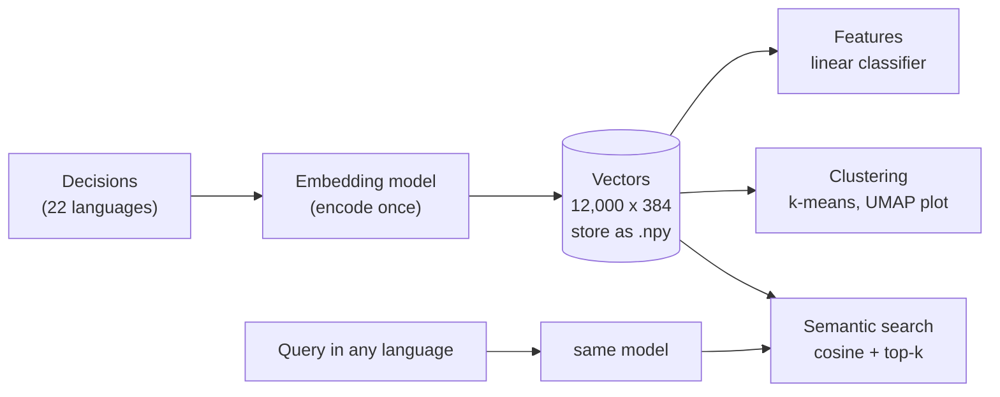

# Applications of embedding models: search, clustering and features

Block 1 showed how a multilingual embedding model turns a description of goods into a vector of 384 numbers. This page uses those vectors for three tasks that recur in almost every text project: **semantic search** (find the decisions closest in meaning to a query, in any language), **clustering** (group decisions with the k-means method of Session 11) and **classification features** (use the vectors instead of TF-IDF as input to a linear classifier). For each task we compare embeddings with the TF-IDF representation of Session 13 on the same data, because whether embeddings help is an empirical question. The short answer for the case study: embeddings are clearly better for search across languages, useful for exploration, and *worse* than TF-IDF as classification features.

The code blocks on this page build on each other; run them in order from the repository root. They need `sentence-transformers`; the first block encodes 12,000 descriptions (about 40 seconds on a laptop with a GPU, a few minutes on a CPU).



```python
import time

import numpy as np
import pandas as pd
from sentence_transformers import SentenceTransformer

decisions = pd.read_parquet("case-study/data/train_sample.parquet")
year = decisions["start_date"].dt.year
train = decisions[year <= 2021].sample(10_000, random_state=0)     # validation by time, as before
valid = decisions[year >= 2022].sample(2_000, random_state=0)

model = SentenceTransformer("intfloat/multilingual-e5-small")
t0 = time.perf_counter()
E_tr = model.encode(("passage: " + train["description"]).tolist(), batch_size=64, normalize_embeddings=True)
E_va = model.encode(("query: " + valid["description"]).tolist(), batch_size=64, normalize_embeddings=True)
print(E_tr.shape, E_va.shape)          # (10000, 384) (2000, 384)
print(f"{time.perf_counter() - t0:.0f} s")   # about 40 s with a GPU; several minutes on a CPU
```

## Semantic search

### Concept

**Semantic search** retrieves documents by meaning instead of shared keywords. The procedure has two phases:

1. **Indexing** (once): embed every document and store the vectors.
2. **Querying** (per request): embed the query with the same model, compute the cosine similarity between the query vector and every document vector, and return the k documents with the highest similarity (**top-k**).

With vectors of length 1, cosine similarity is a dot product, so step 2 is one matrix–vector product: for 10,000 decisions and 384 dimensions, about four million multiplications, which takes about a millisecond. For millions of documents, **approximate nearest-neighbour indexes** (FAISS, pgvector in PostgreSQL, the DuckDB `vss` extension) find the top-k without comparing the query with every vector; Session 15 uses them.

Worked example: three decision vectors (already normalised) r1 = (0.8, 0.6), r2 = (0.6, 0.8), r3 = (−0.6, 0.8) and a query q = (1, 0). The similarities are q·r1 = 0.8, q·r2 = 0.6, q·r3 = −0.6, so the ranking is r1, r2, r3.

**Keyword search** with TF-IDF works the same way, but with sparse TF-IDF vectors; it finds only documents that share words with the query, which across languages means almost none.

A useful special case for the case study: use the description of a **new** decision as the query. The headings of its nearest neighbours are candidate headings: this is a **k-nearest-neighbour classifier**, and the share of queries whose true heading appears among the k neighbours ("hit@k") measures how useful the search is for a customs officer.

### Why it matters

A customs officer in Germany who classifies a new product wants to see how other member states classified similar goods, whatever the language of their decisions. Semantic search makes this possible without translating anything. It is also the retrieval step of retrieval-augmented generation (Session 15). Keyword search remains useful for exact terms (product codes, brand names, CAS numbers of chemicals), and many systems combine both (**hybrid search**).

### How it works in Python

```python
from sklearn.feature_extraction.text import TfidfVectorizer

german = (train["language"] == "de").to_numpy()            # search only the German decisions
tfidf = TfidfVectorizer(min_df=2, sublinear_tf=True).fit(train["description"])
T_de = tfidf.transform(train["description"][german])
heads_de = train["heading"].to_numpy()[german]


def search(query, k=5):
    q = model.encode("query: " + query, normalize_embeddings=True)
    emb_scores = E_tr[german] @ q                          # cosine similarity with every decision
    kw_scores = (T_de @ tfidf.transform([query]).T).toarray().ravel()
    for name, scores in [("embedding", emb_scores), ("tf-idf", kw_scores)]:
        top = np.argsort(-scores)[:k]
        print(name, [(heads_de[i], round(float(scores[i]), 2)) for i in top])


search("disposable face masks")                            # an English query, German documents
# embedding [('6307', 0.81), ('3401', 0.8), ('3401', 0.8), ('3214', 0.8), ('9033', 0.79)]
# tf-idf    [('9018', 0.0), ('9403', 0.0), ...]            no shared word: all scores are 0
search("toys for children")
# embedding [('9503', 0.83), ('9503', 0.83), ('9503', 0.83), ('9503', 0.83), ('9503', 0.83)]
# tf-idf    [('8471', 0.04), ('8536', 0.03), ...]

# nearest neighbours as candidate headings for the 2,000 validation decisions
S = E_va @ E_tr.T
nn = np.argsort(-S, axis=1)[:, :5]
heads = train["heading"].to_numpy()
print(round(float(np.mean(heads[nn[:, 0]] == valid["heading"].to_numpy())), 3),       # 1-NN
      round(float(np.mean([h in heads[r] for h, r in zip(valid["heading"], nn)])), 3))  # hit@5
# 0.56 0.718
same_lang = train["language"].to_numpy()[nn] == valid["language"].to_numpy()[:, None]
print(round(float(same_lang.mean()), 3))     # 0.971: neighbours are almost always in the same language

# cross-lingual: non-German queries searched only among German decisions
other = (valid["language"] != "de").to_numpy()
nn_x = np.argsort(-(E_va[other] @ E_tr[german].T), axis=1)[:, :5]
print(round(float(np.mean([h in heads_de[r] for h, r in zip(valid["heading"][other], nn_x)])), 3))
# 0.416 hit@5 with embeddings
T_tr, T_va = tfidf.transform(train["description"]), tfidf.transform(valid["description"])
nn_kx = np.argsort(-(T_va[other] @ T_tr[german].T).toarray(), axis=1)[:, :5]
print(round(float(np.mean([h in heads_de[r] for h, r in zip(valid["heading"][other], nn_kx)])), 3))
# 0.166 hit@5 with TF-IDF (shared numbers, brand names and loan words)
```

Three findings. First, the English queries find German mask and toy decisions; TF-IDF finds nothing. Second, when all languages are allowed, 97 % of the neighbours share the query's language: the model places texts of one language closer together than translations, so a cross-lingual search must be asked for explicitly, for example by filtering the corpus. Third, restricted to German decisions, embeddings find the right heading among five neighbours for 42 % of the non-German queries, two and a half times as often as TF-IDF.

### In practice

- Elasticsearch, OpenSearch and PostgreSQL (with the pgvector extension) store dense vectors next to the text and support nearest-neighbour queries, so semantic search can be added to existing search systems.
- Thakur et al. (2021) compared retrieval methods on the 18 datasets of the BEIR benchmark and found that the keyword method BM25 remained a strong baseline across domains, while dense embedding retrieval was better in some domains and worse in others. This is the main argument for hybrid search (Session 15).
- The European Commission's EBTI database itself offers keyword and code search; a cross-lingual similarity search is the kind of tool that would let officers find relevant decisions of other member states without knowing their language.

> [!WARNING]
> Query and documents must be embedded with the **same model** (and the same version and prefixes). Vectors from different models live in different spaces; comparing them gives meaningless numbers without an error message.

## Clustering decisions

### Concept

**Clustering** groups documents without labels (Session 11). Embeddings make text clustering easier than raw counts: they are dense, low-dimensional and place paraphrases close together. The standard recipe:

1. Embed and normalise the documents (for normalised vectors, Euclidean distance and cosine similarity rank pairs identically).
2. Run k-means for several values of k; inspect the silhouette score and, more importantly, the content of the clusters.
3. **Describe** each cluster by its most distinctive words (TF-IDF mean in the cluster divided by the overall mean), its most frequent heading and language, and a few example documents.
4. **Visualise** with UMAP or PCA in two dimensions (Session 11), keeping in mind that the 2-D picture distorts distances.


The figure shows what the embeddings capture. Colour by chapter (left): footwear, toys, knitted clothing, beverages and electrical machinery form separate groups. Colour by language (right): every German chapter forms its own island, while the decisions in other languages sit together in a central region, still ordered by chapter but closer to each other than to the German decisions of the same chapter. Both **topic and language** shape the space.

### Why it matters

Clustering embeddings is a fast way to discover what a large text collection is about: which product types appear within a chapter, which decisions look unusual, how the requests of different countries differ. It supports exploration and reporting and can reveal problems in the labels: a decision far from the other decisions of its heading is worth a second look, the same idea as the distance-based anomaly detection of Session 11. Because language also shapes the space, clusters must be checked for whether they reflect goods or only languages.

### How it works in Python

```python
from sklearn.cluster import KMeans
from sklearn.metrics import adjusted_rand_score, silhouette_score

shoes = (train["chapter"] == "64").to_numpy()             # the footwear chapter: 368 decisions
km = KMeans(n_clusters=6, n_init=10, random_state=0).fit(E_tr[shoes])
print(shoes.sum(), round(silhouette_score(E_tr[shoes], km.labels_), 3),
      round(adjusted_rand_score(train["heading"][shoes], km.labels_), 2))
# 368 0.115 0.36: weak cluster structure; partial agreement with the six headings
words = TfidfVectorizer(min_df=3).fit(train["description"][shoes])
W = words.transform(train["description"][shoes])
names = words.get_feature_names_out()
overall = np.asarray(W.mean(axis=0)).ravel()
for c in range(6):
    in_c = km.labels_ == c
    lift = np.asarray(W[in_c].mean(axis=0)).ravel() / (overall + 1e-9)   # distinctive words
    lift[np.asarray((W[in_c] > 0).sum(axis=0)).ravel() < 5] = 0          # ignore very rare words
    part = train[shoes][in_c]
    print(c, in_c.sum(), list(names[np.argsort(-lift)[:4]]),
          part["heading"].value_counts().index[0], part["language"].value_counts().index[0])
# 0 98 ['wade', 'jedoch', '9110', '9105'] 6403 de
# 1 68 ['männerschuhe', '9998', '9950', '9991'] 6403 de
# 2 17 ['obuv', 'údajů', 'jedná', 'dle'] 6403 cs          <- a Czech cluster
# 3 121 ['hausschuhe', 'ausstattung', 'labilem', 'weichem'] 6404 de   <- slippers, textile uppers
# 4 17 ['with', 'and', 'the', 'sole'] 6403 en             <- an English cluster
# 5 47 ['et', 'matière', 'une', 'semelle'] 6405 fr        <- a French cluster
```

Cluster 3 collects slippers ("Hausschuhe"), almost all heading 6404 (103 of 121); clusters 2, 4 and 5 are defined by language. An adjusted Rand index of 0.36 means partial agreement with the headings. Choose k by whether the clusters are useful and distinct when you read them, not by the silhouette score alone.

### In practice

- BERTopic (Grootendorst, 2022) builds topic models this way (embeddings, UMAP, density-based clustering, then class-based TF-IDF to describe clusters) and is widely used in social-science and business research on large text collections.
- Customer-experience and case-handling teams cluster free-text tickets to find recurring problems; the share of each cluster over time becomes a monitoring indicator.
- The scikit-learn example on text clustering (Session 13, workbook 06) does the same with LSA vectors instead of neural embeddings, which allows a direct comparison of both representations.

> [!CAUTION]
> Clusters are not facts about the data; they depend on the model, k, the random seed and the preprocessing. With multilingual data, cross-tabulate clusters against `language` before you interpret them as product groups.

## Embedding features versus TF-IDF

### Concept

Embeddings can replace the TF-IDF matrix as input to any classifier. Each description becomes a dense vector of 384 numbers, and the linear classifier learns one weight per dimension and heading. The embedding model is used **frozen**: its weights are not changed; only the classifier on top is trained. (Fine-tuning the whole model on the labels is possible, but belongs to module 3.4.)

A fair comparison uses the same decisions, the same split, the same classifier type and the same metrics for both representations:

| Representation | Dimensions | Sparse? | Knows translations? | Sees one decisive word? | Cost |
|---|---|---|---|---|---|
| TF-IDF word unigrams | about 30,000 | yes | no | yes (one column per word) | very low |
| multilingual-e5 embeddings | 384 | no | yes | weakly (averaged into 384 numbers) | encoding time; GPU helps |
| both, concatenated | about 30,000 + 384 | mixed | yes | yes | both |

### Why it matters

Pre-trained embeddings are expected to help most when labelled data are scarce, because they bring knowledge from pre-training. Tariff classification is a hard test for this expectation: the classes are fine-grained (leather versus textile uppers, phosphates versus carboxylic acids), and the decisive information is often one word or one number that an averaged 384-dimensional vector blurs. On the case study, TF-IDF wins clearly, and the combination adds a little.

### How it works in Python

```python
from scipy.sparse import csr_matrix, hstack
from sklearn.linear_model import SGDClassifier
from sklearn.metrics import accuracy_score, f1_score


def svm():
    return SGDClassifier(loss="hinge", alpha=1e-5, max_iter=20, tol=None, random_state=0, n_jobs=-1)


def report(name, clf, X):
    p = clf.predict(X)
    print(name, round(accuracy_score(valid["heading"], p), 3),
          round(f1_score(valid["heading"], p, average="macro"), 3))


report("embeddings", svm().fit(E_tr, train["heading"]), E_va)    # embeddings 0.567 0.303
report("tf-idf    ", svm().fit(T_tr, train["heading"]), T_va)    # tf-idf     0.662 0.411
H_tr = hstack([T_tr, csr_matrix(E_tr)]).tocsr()                  # both side by side
H_va = hstack([T_va, csr_matrix(E_va)]).tocsr()
report("both      ", svm().fit(H_tr, train["heading"]), H_va)    # both       0.675 0.423
```

| Training decisions | 1-NN on embeddings | 1-NN on TF-IDF |
|---|---|---|
| 500 | 0.27 | 0.34 |
| 2,000 | 0.40 | 0.47 |
| 10,000 | 0.56 | 0.62 |

All values are accuracy on the same 2,000 validation decisions (2022–2023); the 1-nearest-neighbour rows come from the course team's runs with the same vectors. Two points matter. TF-IDF is better at every training size: the expected advantage of embeddings with few labels does not appear, because with 1,000 headings and 500 examples most headings have no example at all, whatever the representation. And the accuracies here are lower than in Session 13 (0.77) because only 10,000 training decisions are used. With 2,000 validation decisions, differences below about two points are within noise; a bootstrap interval (Session 7) makes this precise.

### In practice

- Tunstall et al. (2022) showed with SetFit that sentence-transformers fine-tuned on as few as eight labelled examples per class can compete with much larger models on tasks with a handful of classes; fine-tuning, not frozen vectors, is what makes embeddings strong classifiers.
- Embedding features combined with tabular features are used in product categorisation and in fraud and risk models that contain free-text fields, such as claim descriptions in insurance.
- The MTEB benchmark (Muennighoff et al., 2023) reports classification, clustering and retrieval scores per embedding model and language, so that a model can be chosen for the task before running one's own comparison.

> [!IMPORTANT]
> Report the TF-IDF baseline next to every embedding result. On the EBTI data, a free, fast TF-IDF model beats frozen multilingual embeddings as classification features. The embeddings earn their cost through cross-lingual search, exploration, and as candidate retrieval for a language model (Block 3, Session 15).

> [!TIP]
> Encoding is the expensive step. Encode once and save the vectors (`np.save("embeddings.npy", E)`), together with the model name, the prefix and the decision ids, instead of re-encoding in every notebook run.

## Practice: embedding features versus TF-IDF and nearest-neighbour search

Workbook [05-case-study-embeddings-vs-tfidf.ipynb](../workbooks/05-case-study-embeddings-vs-tfidf.ipynb):

1. Encode 10,000 training and 2,000 validation decisions (cached to disk) and train a linear classifier on embeddings, on TF-IDF and on both; report accuracy and macro-F1.
2. Draw a learning curve (500 / 2,000 / 10,000 training decisions) for both representations.
3. Build a nearest-neighbour search over the decisions and compare it with TF-IDF search for three queries of your own, in English and in another language; note one query where each method is better.

## Check your understanding

1. Rank three documents for the query q = (0.6, 0.8) when d1 = (1, 0), d2 = (0, 1), d3 = (0.8, 0.6), all of length 1.
2. An English query finds German mask decisions with embeddings but nothing with TF-IDF. Why? Why does TF-IDF still find the right heading for 17 % of the non-German queries in the cross-lingual test?
3. 97 % of the nearest neighbours share the query's language. What does this mean for a customs officer who wants to see decisions of other member states?
4. Embeddings lose to TF-IDF as classification features even with 500 training decisions. Give two reasons specific to tariff classification.
5. Your team wants to use embeddings for its own project texts. Which two things do you check before choosing a model?

## Further reading

- Reimers, N. *Sentence-Transformers documentation*: semantic search, clustering and multilingual models. https://sbert.net/examples/sentence_transformer/applications/semantic-search/README.html
- Wang, L. et al. (2024). Multilingual E5 text embeddings: a technical report. arXiv:2402.05672. https://arxiv.org/abs/2402.05672
- Muennighoff, N., Tazi, N., Magne, L. and Reimers, N. (2023). MTEB: massive text embedding benchmark. *Proceedings of EACL 2023*. Leaderboard: https://huggingface.co/spaces/mteb/leaderboard
- Thakur, N., Reimers, N., Rücklé, A., Srivastava, A. and Gurevych, I. (2021). BEIR: a heterogeneous benchmark for zero-shot evaluation of information retrieval models. *NeurIPS 2021 Datasets and Benchmarks*. https://arxiv.org/abs/2104.08663
