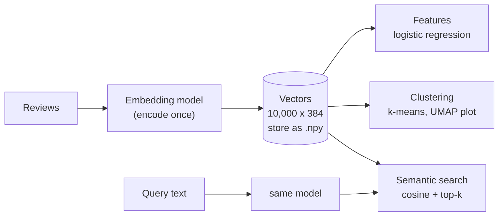
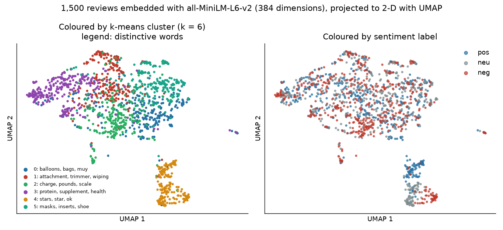

# Applications of embedding models: search, clustering and features

Block 1 showed how an embedding model turns a review into a vector of 384 numbers. This page uses those vectors for three tasks that recur in almost every text project: **semantic search** (find the reviews closest in meaning to a query), **clustering** (group reviews by topic with the k-means method of Session 11) and **classification features** (use the vectors instead of TF-IDF as input to logistic regression). For each task we compare embeddings with the TF-IDF representation of Session 13 on the same data, because whether embeddings help is an empirical question.

The code blocks on this page build on each other; run them in order from the repository root. They need `sentence-transformers`; the first block encodes 10,000 reviews (a few seconds on a recent laptop with GPU support, about one minute on a CPU).



```python
import time

import numpy as np
import pandas as pd
from sentence_transformers import SentenceTransformer
from sklearn.model_selection import train_test_split

reviews = pd.read_parquet("case-study/data/train_sample.parquet")
sub = reviews.groupby("label").sample(frac=0.2, random_state=0)       # 10,000 reviews, stratified
texts, y = sub["title"] + ". " + sub["text"], sub["label"]
X_tr, X_va, y_tr, y_va = train_test_split(texts, y, test_size=0.25, stratify=y, random_state=0)

model = SentenceTransformer("sentence-transformers/all-MiniLM-L6-v2")
t0 = time.perf_counter()
E_tr = model.encode(X_tr.tolist(), batch_size=64, normalize_embeddings=True)
E_va = model.encode(X_va.tolist(), batch_size=64, normalize_embeddings=True)
print(E_tr.shape, E_va.shape)          # (7500, 384) (2500, 384)
print(f"{time.perf_counter() - t0:.0f} s for 10,000 reviews")   # about 5 s (GPU) to 60 s (CPU)
```

## Semantic search

### Concept

**Semantic search** retrieves documents by meaning instead of shared keywords. The procedure has two phases:

1. **Indexing** (once): embed every document and store the vectors.
2. **Querying** (per request): embed the query with the same model, compute the cosine similarity between the query vector and every document vector, and return the k documents with the highest similarity (**top-k**).

With vectors of length 1, cosine similarity is a dot product, so step 2 is one matrix–vector product: for 2,500 reviews and 384 dimensions, about one million multiplications, which takes well under a millisecond. For millions of documents, **approximate nearest-neighbour indexes** (FAISS, pgvector in PostgreSQL, the DuckDB `vss` extension) find the top-k without comparing the query with every vector; Session 15 uses them.

Worked example: three review vectors (already normalised) r1 = (0.8, 0.6), r2 = (0.6, 0.8), r3 = (−0.6, 0.8) and a query q = (1, 0). The similarities are q·r1 = 0.8, q·r2 = 0.6, q·r3 = −0.6, so the ranking is r1, r2, r3.

**Keyword search** with TF-IDF works the same way, but with sparse TF-IDF vectors; it finds only documents that share words with the query.

### Why it matters

Users rarely phrase a query with the exact words of the document they want. Semantic search finds "Stop working after 2 months" for the query "stopped working after a week", and it works across synonyms and spelling variants. It is also the retrieval step of retrieval-augmented generation (Session 15). Keyword search remains useful for exact terms (product codes, names, negations), and many systems combine both (**hybrid search**).

### How it works in Python

```python
from sklearn.feature_extraction.text import TfidfVectorizer

corpus = X_va.tolist()                                   # search over the 2,500 validation reviews
tfidf = TfidfVectorizer().fit(corpus)
T = tfidf.transform(corpus)


def search(query, k=3):
    q = model.encode(query, normalize_embeddings=True)
    emb_scores = E_va @ q                                # cosine similarity with every review
    kw_scores = (T @ tfidf.transform([query]).T).toarray().ravel()
    for name, scores in [("embedding", emb_scores), ("tf-idf", kw_scores)]:
        top = np.argsort(-scores)[:k]
        print(name, [(round(float(scores[i]), 2), corpus[i][:45]) for i in top])


search("stopped working after a week")
# embedding [(0.62, 'Failed - Stopped working after 2 weeks.. It s'), (0.59, 'Stop working after 2 months. ...'), ...]
# tf-idf    [(0.57, 'The worst product I have ever purchased. It st'), (0.53, 'Failed - Stopped working ...'), ...]
search("smells terrible")
# embedding [(0.56, 'Bad packaging, smells great. ...'), (0.55, 'Not for me!. Smells soooo bad ...'), ...]
# tf-idf    [(0.37, 'Five Stars. Love the way it smells.'), ...]   'terrible' does not occur
```

The second query shows a limit of embeddings: "smells great" is the top hit for "smells terrible". The model represents the *topic* (smell) more strongly than the *opinion*.

### In practice

- Elasticsearch, OpenSearch and PostgreSQL (with the pgvector extension) store dense vectors next to the text and support nearest-neighbour queries, so semantic search can be added to existing search systems.
- Thakur et al. (2021) compared retrieval methods on the 18 datasets of the BEIR benchmark and found that the keyword method BM25 remained a strong baseline across domains, while dense embedding retrieval was better in some domains and worse in others. This is the main argument for hybrid search.
- Spotify (2022) described natural-language search for podcast episodes based on sentence embeddings of queries and episode descriptions.

> [!WARNING]
> Query and documents must be embedded with the **same model** (and the same version). Vectors from different models live in different spaces; comparing them gives meaningless numbers without an error message.

## Clustering reviews by topic

### Concept

**Clustering** groups documents without labels (Session 11). Embeddings make text clustering much easier than raw counts: they are dense, low-dimensional and place paraphrases close together. The standard recipe:

1. Embed and normalise the documents (for normalised vectors, Euclidean distance and cosine similarity rank pairs identically).
2. Run k-means for several values of k; inspect the silhouette score and, more importantly, the content of the clusters.
3. **Describe** each cluster by its most distinctive words (TF-IDF mean in the cluster divided by the overall mean) and by a few example documents.
4. **Visualise** with UMAP or PCA in two dimensions (Session 11), keeping in mind that the 2-D picture distorts distances.



The figure shows what embeddings capture. The clusters are **topics**: product groups (supplements; masks and shoe inserts; trimmers and attachments; scales), plus one cluster of automatic "Five Stars"-type titles (Session 13) and a small cluster of Spanish reviews. Colouring by sentiment (right) shows that positive, neutral and negative reviews are mixed within each topic, except inside the star-title cluster, where the title itself states the rating.

### Why it matters

Clustering embeddings is a fast way to discover what a large text collection is about: which products or problems people write about, and how often. It supports exploration and reporting (which topics have the most negative reviews?) and can produce candidate labels for a later classifier. Because embeddings separate topics better than sentiment, clustering is the right tool for "what about" questions, and supervised classification remains the tool for "how good".

### How it works in Python

```python
from sklearn.cluster import KMeans
from sklearn.metrics import silhouette_score

for k in [4, 6, 8, 10]:
    km = KMeans(n_clusters=k, n_init=10, random_state=0).fit(E_va)
    print(k, round(silhouette_score(E_va, km.labels_, random_state=0), 3))
# silhouette between 0.05 and 0.07 for all k: no sharp cluster boundaries, as usual for text

km = KMeans(n_clusters=6, n_init=10, random_state=0).fit(E_va)
words_vec = TfidfVectorizer(min_df=5, stop_words="english").fit(corpus)
W = words_vec.transform(corpus)
names = words_vec.get_feature_names_out()
overall = np.asarray(W.mean(axis=0)).ravel()
for c in range(6):
    in_c = km.labels_ == c
    lift = np.asarray(W[in_c].mean(axis=0)).ravel() / (overall + 1e-9)   # distinctive words
    lift[np.asarray((W[in_c] > 0).sum(axis=0)).ravel() < 5] = 0          # ignore very rare words
    neg_share = (y_va.to_numpy()[in_c] == "neg").mean()
    print(c, in_c.sum(), list(names[np.argsort(-lift)[:4]]), f"neg {neg_share:.0%}")
# 0 412 ['cushion', 'posture', 'seat', 'gloves'] neg 19%
# 1 501 ['yoga', 'fragrance', 'remover', 'drain'] neg 18%
# 2 436 ['stopped', 'muy', 'batteries', 'talk'] neg 32%    <- devices that failed
# 3 350 ['stars', 'star', 'returned', 'excellent'] neg 13% <- automatic star titles
# 4 440 ['cards', 'print', 'playing', 'party'] neg 15%
# 5 361 ['protein', 'stomach', 'ingredients', 'vitamin'] neg 17%
```

Cluster 2 collects failing devices and batteries and has the highest share of negative reviews (32 % against 19 % overall): a topic that a product manager would want to see. Silhouette values near 0.06 are typical for text embeddings: topics overlap, and the "right" k depends on the purpose. Choose k by whether the clusters are useful and distinct when you read them.

### In practice

- BERTopic (Grootendorst, 2022) builds topic models exactly this way (embeddings, UMAP, density-based clustering, then class-based TF-IDF to describe clusters) and is widely used in social-science and business research on large text collections.
- Customer-experience teams cluster free-text survey answers or support tickets to find recurring problems; the share of each cluster over time becomes a monitoring indicator.
- The scikit-learn example on text clustering (Session 13, workbook 06) does the same with LSA vectors instead of neural embeddings, which allows a direct comparison of both representations.

> [!CAUTION]
> Clusters are not facts about the data; they depend on the model, k, the random seed and the preprocessing. Before you report "six topics", rerun with other seeds and values of k, and read at least ten example reviews per cluster.

## Embedding features versus TF-IDF

### Concept

Embeddings can replace the TF-IDF matrix as input to any classifier. Each review becomes a dense vector of 384 numbers, and logistic regression learns one weight per dimension and class. The embedding model is used **frozen**: its weights are not changed; only the classifier on top is trained. (Fine-tuning the whole model on the labels is possible, but belongs to module 3.4.)

A fair comparison uses the same reviews, the same split, the same classifier type and the same metric for both representations:

| Representation | Dimensions | Sparse? | Knows synonyms? | Sees negation in phrases? | Cost |
|---|---|---|---|---|---|
| TF-IDF 1–2-grams | about 50,000 | yes | no | partly (bigrams) | very low |
| MiniLM embeddings | 384 | no | yes | weakly | encoding time; GPU helps |
| both, concatenated | about 50,000 + 384 | mixed | yes | partly | both |

### Why it matters

Pre-trained embeddings help most when labelled data are scarce or texts are short and varied, because they bring knowledge from pre-training. With many labels, TF-IDF often catches up or wins on sentiment, because it can learn exactly which words and phrases signal each class in this domain. The result on the case study illustrates both effects: with 200 labelled reviews embeddings are clearly better; with 7,500 TF-IDF is better; the combination is best.

### How it works in Python

```python
from scipy.sparse import csr_matrix, hstack
from sklearn.linear_model import LogisticRegression
from sklearn.metrics import f1_score
from sklearn.pipeline import make_pipeline


def macro_f1(model, X, y_true):
    return round(f1_score(y_true, model.predict(X), average="macro"), 3)


emb_clf = LogisticRegression(C=1, class_weight="balanced", max_iter=3000).fit(E_tr, y_tr)
tfidf_clf = make_pipeline(TfidfVectorizer(ngram_range=(1, 2), min_df=3, sublinear_tf=True),
                          LogisticRegression(C=4, class_weight="balanced", max_iter=2000))
tfidf_clf.fit(X_tr, y_tr)
print("embeddings", macro_f1(emb_clf, E_va, y_va))       # 0.664
print("tf-idf    ", macro_f1(tfidf_clf, X_va, y_va))     # 0.707

# both representations side by side in one sparse matrix
vec = tfidf_clf.named_steps["tfidfvectorizer"]
H_tr = hstack([vec.transform(X_tr), csr_matrix(E_tr)]).tocsr()
H_va = hstack([vec.transform(X_va), csr_matrix(E_va)]).tocsr()
both = LogisticRegression(C=4, class_weight="balanced", max_iter=3000).fit(H_tr, y_tr)
print("both      ", macro_f1(both, H_va, y_va))          # 0.735

# with few labels, pre-trained embeddings win
small = y_tr.groupby(y_tr).sample(frac=200 / len(y_tr), random_state=0).index
pos = X_tr.index.get_indexer(small)                      # rows of the 200 reviews in E_tr
emb_small = LogisticRegression(C=10, class_weight="balanced", max_iter=3000).fit(E_tr[pos], y_tr[small])
tf_small = make_pipeline(TfidfVectorizer(ngram_range=(1, 2), sublinear_tf=True),
                         LogisticRegression(C=4, class_weight="balanced", max_iter=2000))
tf_small.fit(X_tr[small], y_tr[small])
print("200 labels:", macro_f1(emb_small, E_va, y_va), macro_f1(tf_small, X_va, y_va))
# 200 labels: 0.564 (embeddings) vs 0.512 (tf-idf)
```

| Training reviews | Embeddings + logistic regression | TF-IDF + logistic regression |
|---|---|---|
| 200 | 0.56 | 0.51 |
| 1,000 | 0.61 | 0.64 |
| 7,500 | 0.66 | 0.71 |
| 7,500, both combined | 0.735 | |

All values are macro-F1 on the same 2,500 validation reviews. With 2,500 reviews and about 190 neutral ones, differences below about 0.02 are within noise; a bootstrap interval (Session 7) makes this precise.

### In practice

- Tunstall et al. (2022) showed with SetFit that sentence-transformers fine-tuned on as few as eight labelled examples per class can compete with much larger models trained on far more labels, which makes embeddings attractive for new label sets.
- Embedding features combined with tabular features are used in product categorisation and in fraud and risk models that contain free-text fields, such as claim descriptions in insurance.
- The MTEB benchmark (Muennighoff et al., 2023) reports classification and clustering scores per embedding model, so that a model can be chosen for the task and language before running one's own comparison.

> [!IMPORTANT]
> Report the TF-IDF baseline next to every embedding result. On the review data, a free, fast TF-IDF model beats frozen MiniLM embeddings once a few thousand labels exist. The embeddings earn their cost through the combination, the low-label regime, or tasks such as search and clustering.

> [!TIP]
> Encoding is the expensive step. Encode once and save the vectors (`np.save("embeddings.npy", E)`), together with the model name and the review ids, instead of re-encoding in every notebook run.

## Practice: embedding features versus TF-IDF and nearest-neighbour search

Workbook [05-case-study-embeddings-vs-tfidf.ipynb](../workbooks/05-case-study-embeddings-vs-tfidf.ipynb):

1. Encode a stratified subsample of 10,000 reviews (cached to disk) and train logistic regression on embeddings, on TF-IDF and on both; report macro-F1 and per-class F1.
2. Draw a learning curve (200 / 1,000 / 7,500 training reviews) for both representations.
3. Build a nearest-neighbour search over the reviews and compare its top results with TF-IDF search for three queries of your own; note one query where each method is better.

## Check your understanding

1. Rank three documents for the query q = (0.6, 0.8) when d1 = (1, 0), d2 = (0, 1), d3 = (0.8, 0.6), all of length 1.
2. Why does semantic search return "smells great" for the query "smells terrible"? What would you add to the system to fix this?
3. Why is the silhouette score of text clusters usually low, and how should k be chosen instead?
4. Embeddings beat TF-IDF with 200 labels but lose with 7,500. Explain both results.
5. Your team wants to use embeddings of German product descriptions. Which two things do you check before choosing a model?

## Further reading

- Reimers, N. *Sentence-Transformers documentation*: semantic search, clustering and the model overview. https://sbert.net/examples/sentence_transformer/applications/semantic-search/README.html
- Grootendorst, M. (2022). BERTopic: neural topic modeling with a class-based TF-IDF procedure. arXiv:2203.05794. https://maartengr.github.io/BERTopic/
- Muennighoff, N., Tazi, N., Magne, L. and Reimers, N. (2023). MTEB: massive text embedding benchmark. *Proceedings of EACL 2023*. Leaderboard: https://huggingface.co/spaces/mteb/leaderboard
- Thakur, N., Reimers, N., Rücklé, A., Srivastava, A. and Gurevych, I. (2021). BEIR: a heterogeneous benchmark for zero-shot evaluation of information retrieval models. *NeurIPS 2021 Datasets and Benchmarks*. https://arxiv.org/abs/2104.08663
