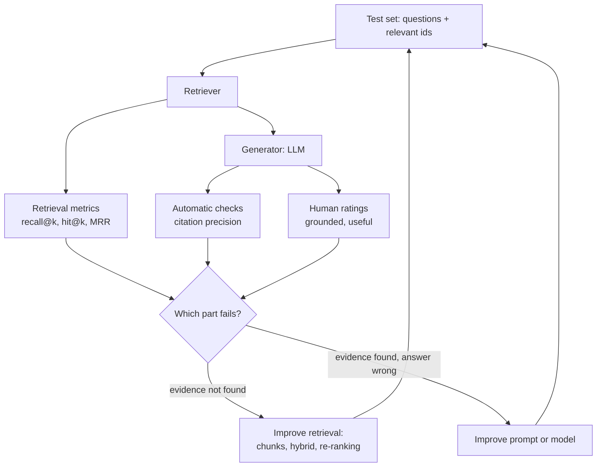
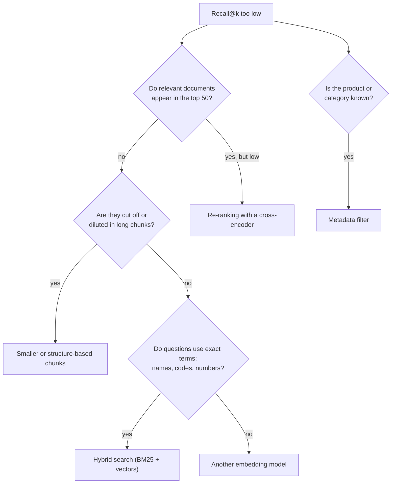

# Evaluating and improving RAG

A RAG prototype that gives a plausible answer to three hand-picked questions proves little. This page shows how to evaluate a RAG system like any other model: with a fixed test set of questions, metrics for the retrieval step (recall@k), checks and human ratings for the answers (groundedness), and a disciplined way to try improvements (chunk size, hybrid search, re-ranking). The workbook `04-case-study-rag-evaluation.ipynb` carries out every step on ten labelled questions about products.

Evaluation follows the two halves of the pipeline. If the right reviews are not retrieved, no prompt can produce a grounded answer; if they are retrieved, the answer can still be wrong. We therefore measure the two halves separately.



## A test set of questions

### Concept

A **labelled test set** for retrieval lists questions and, for each question, the ids of *all* documents in the collection that are relevant to it. The labels are called **relevance judgements**. They are made by people:

1. Write questions that users would really ask (here: questions a product team asks about reviews).
2. For each question, collect candidate documents with several searches (keyword search, semantic search, a filter by product).
3. Read the candidates and decide for each whether it helps to answer the question.

The set is small (10–50 questions are common for a first prototype), but it must be fixed *before* tuning, just like a test split in Session 7. Otherwise we tune the system to the questions we happen to look at.

Worked example from the case study: for the question *"Can you adjust the volume of the Marpac Dohm white noise machine?"*, two of the 20 reviews of the product are relevant: `r003861` ("adjustable sound control by opening and closing the openings in the sides") and `r005523` ("You moderate the noise by turning the plastic casing"). Reviews that only say "great white noise" are not relevant to *this* question.

### Why it matters

Without a test set, every change to the system is judged by impression on a few examples, and improvements cannot be told apart from noise. With one, a change in chunk size or model can be compared on the same questions, and regressions are detected when the system is changed later.

### How it works in Python

The ten questions of the workbook, with the ids found relevant by the course team:

```python
test_set = {
    "The smart scale will not connect to my WiFi network": {"r006688", "r006941", "r007834", "r009514"},
    "Does this fish oil give you fishy burps?": {"r006960", "r082069", "r102598", "r114099"},
    "Is the face mask big enough for an adult with a large face?": {"r325547", "r326996", "r331242", "r332009"},
    "The lids of the pill box open by themselves": {"r163757", "r169573", "r178628", "r180913", "r184429", "r191360"},
    "The heating pad stopped working after a few months": {"r224359", "r237231", "r252220", "r259580",
                                                           "r343446", "r344999", "r356255"},
    "Is the GermGuardian UV sanitizer noisy?": {"r008885", "r009564", "r012771"},
    "Does Nerdwax keep glasses in place all day or does it wear off?": {"r062078", "r063993", "r064806",
                                                                        "r070674", "r067183"},
    "Can you adjust the volume of the Marpac Dohm white noise machine?": {"r003861", "r005523"},
    "Do Magic Eraser sponges fall apart quickly?": {"r035340", "r036315", "r038171", "r031760"},
    "Does the plug-in UV air sanitizer remove bad smells from a room?": {"r000987", "r004506", "r007112",
                                                                         "r008013", "r011183"},
}
print(len(test_set), "questions,", sum(len(v) for v in test_set.values()), "relevant reviews")   # 10 questions, 44
```

### In practice

- The TREC evaluation campaigns of the US National Institute of Standards and Technology (NIST) have evaluated search systems with human relevance judgements since 1992.
- The BEIR benchmark (Thakur et al., 2021) compares retrieval models on 18 datasets with labelled queries; MTEB (Muennighoff et al., 2023) extends this to many embedding tasks.
- Teams that build internal assistants keep a "golden set" of questions with known source documents and rerun it after every change (Husain 2024 describes this practice).

> [!WARNING]
> Relevance judgements are incomplete: the labellers read only the candidates their searches found. A new retriever can find a relevant review nobody labelled, and is then scored too low. When a variant "loses", read its top results before concluding.

> [!TIP]
> Write questions in the words of users, not in the words of the documents. A test set whose questions copy phrases from the reviews favours keyword search.

## Recall@k and related retrieval metrics

### Concept

For one question, the retriever returns a ranking of document ids. Three metrics summarise how good it is:

- **Recall@k**: the share of the relevant documents that appear in the top *k*. Relevant {r1, r4}, ranking [r3, r1, r7, r4]: the top 3 contain r1 only, so recall@3 = 1/2.
- **Hit@k** (also *success@k*): 1 if at least one relevant document is in the top *k*, else 0. In the example, hit@1 = 0 and hit@2 = 1.
- **Reciprocal rank**: 1 divided by the rank of the first relevant document, here 1/2. Its mean over all questions is the **mean reciprocal rank (MRR)**.

Recall asks "did we find the evidence?", hit@k asks "did we find any evidence?", MRR asks "how early?". We choose *k* to match the number of chunks that go into the prompt: with five sources in the prompt, recall@5 is the relevant measure.

When a question has more relevant documents than *k*, recall@k cannot reach 1: for seven relevant reviews, the best possible recall@5 is 5/7 ≈ 0.71.

### Why it matters

The language model can only use what retrieval gives it. Measuring retrieval separately tells us which half of the system to improve, and it is cheap: no LLM calls are needed, so hundreds of variants can be compared in minutes.

### How it works in Python

The metrics are pure functions: lists and sets in, a number out. The same functions, with tests, are in `workspace/src/review_assistant/metrics.py`.

```python
def recall_at_k(ranked: list, relevant: set, k: int) -> float:
    return len(set(ranked[:k]) & relevant) / len(relevant)

def hit_at_k(ranked: list, relevant: set, k: int) -> float:
    return float(bool(set(ranked[:k]) & relevant))

def reciprocal_rank(ranked: list, relevant: set) -> float:
    return next((1 / i for i, r in enumerate(ranked, start=1) if r in relevant), 0.0)

ranked, relevant = ["r3", "r1", "r7", "r4"], {"r1", "r4"}
print(recall_at_k(ranked, relevant, 3), hit_at_k(ranked, relevant, 1), reciprocal_rank(ranked, relevant))
# 0.5 0.0 0.5
```

Applied to the dense retriever of page 1 (all-MiniLM-L6-v2, chunks of 120 words):

```python
import numpy as np
import pandas as pd
from sentence_transformers import SentenceTransformer

reviews = pd.read_parquet("case-study/data/train_sample.parquet")
top = reviews["parent_asin"].value_counts().index[:300]
docs = (reviews[reviews["parent_asin"].isin(top) & (reviews["text"].str.len() > 0)]
        .groupby("parent_asin").head(20).reset_index(drop=True))
docs["doc"] = docs["title"] + ". " + docs["text"]

def chunk(text, size=120, overlap=20):
    words = text.split()
    return [" ".join(words[s:s + size]) for s in range(0, max(len(words) - overlap, 1), size - overlap)]

model = SentenceTransformer("sentence-transformers/all-MiniLM-L6-v2")
chunks = docs.assign(chunk=docs["doc"].map(chunk)).explode("chunk", ignore_index=True)
emb = model.encode(chunks["chunk"].tolist(), batch_size=64, normalize_embeddings=True)

def dense_search(query, k=50, ch=chunks, E=emb):
    hits = ch.assign(score=E @ model.encode(query, normalize_embeddings=True))
    return hits.sort_values("score", ascending=False).drop_duplicates("review_id")["review_id"].head(k).tolist()

def evaluate(search_fn, k=5):
    rows = [{"recall": recall_at_k(search_fn(q), rel, k), "hit": hit_at_k(search_fn(q), rel, k),
             "rr": reciprocal_rank(search_fn(q), rel)} for q, rel in test_set.items()]
    return pd.DataFrame(rows).mean().round(3).to_dict()

print(evaluate(dense_search))     # {'recall': 0.372, 'hit': 0.9, 'rr': 0.567}
```

A mean recall@5 of 0.37 means that the five retrieved reviews contain about a third of the relevant evidence; a hit@5 of 0.9 means that for nine of ten questions at least one relevant review is among them.

The curves show recall@k for *k* from 1 to 20 for three retrievers of the next sections. All rise with *k*: more sources contain more evidence, but they also cost more tokens.


### In practice

- Web search engines are evaluated with rank-based metrics such as MRR and nDCG (normalised discounted cumulative gain) on judged queries.
- Open-source RAG evaluation tools such as Ragas and the LLM Zoomcamp course of DataTalksClub compute hit rate and MRR for the retrieval step.
- Recommender systems report recall@k on held-out interactions, with the same definition.

> [!CAUTION]
> With ten questions, one question changes the mean recall by up to 0.1. Report per-question results next to the mean, and treat differences smaller than about 0.05 as noise unless the test set is much larger.

## Groundedness

### Concept

An answer is **grounded** (also *faithful*) when every statement in it is supported by the sources it was given. Groundedness is different from correctness: an answer can be grounded in a review that is itself wrong, and an answer can be correct by luck without support.

Automatic checks catch some failures cheaply:

- **Citation precision**: the share of cited ids that were actually retrieved. Below 1 means invented sources.
- **Citation coverage**: does every sentence carry at least one citation?
- **Abstention**: for questions the collection cannot answer, does the answer say so?

They do not catch a real citation that does not support its claim. That needs a reader.

### Why it matters

Users see answers, not retrieval scores. An ungrounded answer with a confident tone is the failure that harms trust most, as the court cases of page 1 show. Groundedness checks on a fixed set of questions show whether a change to the prompt, the model or *k* improves the system, and they detect regressions.

### How it works in Python

```python
import re

retrieved = dense_search("The heating pad stopped working after a few months", k=5)
answer = ("Customers report a pad that shorted out within a month [r224359] and one that failed "
          "shortly after the one-year warranty ended [r237231]. Others say it died after four "
          "months [r344999].")                           # an answer as an LLM might return it
cited = list(dict.fromkeys(re.findall(r"\[(r\d{6})\]", answer)))
print(retrieved)                                       # ['r200742', 'r188823', 'r224359', 'r237231', 'r091391']
print(sorted(set(cited) - set(retrieved)))             # ['r344999']: cited, but never shown to the model
print(round(len(set(cited) & set(retrieved)) / len(cited), 2))   # citation precision 0.67
sentences = [s for s in re.split(r"(?<=\.)\s+", answer) if s]
print(sum(bool(re.search(r"\[r\d{6}\]", s)) for s in sentences) / len(sentences))   # coverage 1.0
```

The review `r344999` is relevant (the test set lists it), but it was not among the five retrieved reviews; the model cannot have read it. Either the model invented the id or it remembered something. In both cases, the claim is not grounded in the prompt.

### In practice

- Ragas (Es et al., 2024) defines *faithfulness* as the share of statements in an answer that can be inferred from the retrieved context, judged by an LLM.
- Legal research providers check citations in generated briefs against their databases; a study by Stanford RegLab and HAI (Magesh et al., 2024) found hallucinated or unsupported citations in commercial legal AI tools.
- Product teams sample logged answers each week and label them grounded or not (error analysis), then add failures to the test set.

> [!WARNING]
> A citation precision of 1.0 is necessary, not sufficient. Always read a sample of answers with their sources.

## Human ratings

### Concept

Whether a statement is supported, correct and useful is judged by people with a short **rubric**: a fixed list of criteria with defined scales. A minimal rubric for the case study:

| Criterion | Scale | Question for the rater |
|---|---|---|
| grounded | 0 / 1 | Is every statement supported by a cited review? |
| correct | 0 / 1 | Is the answer right, given all reviews of the product? |
| useful | 1–5 | Would a product manager act on this answer? |

Two raters rate the same answers independently. **Cohen's kappa** (κ) measures their agreement beyond chance: κ = (p_o − p_e) / (1 − p_e), where p_o is the observed share of agreement and p_e the agreement expected by chance from each rater's label shares. κ = 0 is chance level, κ = 1 perfect agreement; values above about 0.6 are usually read as substantial agreement.

An **LLM-as-judge** applies the rubric automatically. It is only useful after it has been validated: it must agree with people on a labelled sample about as well as people agree with each other.

### Why it matters

Ratings by people are the reference against which all automatic metrics are judged. Low agreement between raters shows that the rubric is unclear, which is worth knowing before anyone trusts a number based on it.

### How it works in Python

Worked example: two raters label ten answers as grounded (1) or not (0).

```python
from sklearn.metrics import cohen_kappa_score

human = [1, 1, 0, 1, 1, 0, 1, 1, 1, 0]        # a person
judge = [1, 1, 1, 1, 1, 0, 1, 1, 1, 1]        # an LLM judge on the same ten answers
p_o = sum(h == j for h, j in zip(human, judge)) / 10          # 0.8 observed agreement
p_e = 0.7 * 0.9 + 0.3 * 0.1                                   # 0.66 expected by chance
print(p_o, round((p_o - p_e) / (1 - p_e), 2), round(cohen_kappa_score(human, judge), 2))   # 0.8 0.41 0.41
```

The judge agrees with the person on 8 of 10 answers, but because both say "grounded" most of the time, much of that agreement is expected by chance: κ = 0.41, moderate. The judge is also more lenient (90 % grounded against 70 %). It should not replace the person yet.

### In practice

- Zheng et al. (2023) found that GPT-4 as a judge agreed with human preferences on chatbot answers about as often as humans agreed with each other, and documented position and verbosity biases of the judge.
- Search engines employ trained raters with written guidelines; Google publishes its *Search Quality Rater Guidelines*.
- Annotation tools such as Label Studio and Argilla support rating LLM outputs with rubrics and measuring agreement.

> [!TIP]
> Rate before you read the automatic scores, and keep the rater blind to which system produced an answer. Otherwise expectations leak into the ratings.

## Improving retrieval: chunk size, hybrid search, re-ranking

### Concept

Once retrieval is measured, we can try improvements one at a time on the same test set:

- **Chunk size.** Larger chunks keep more context; smaller chunks are more specific. Reviews are short, so the effect is small here; for long documents it is large.
- **Metadata filter.** When the product is known (the user is on its page), search only its reviews.
- **Hybrid search.** **BM25** is a keyword ranking function: it scores a document by the query words it contains, weighting rare words more and long documents less. It finds exact terms (product names, model numbers) that embeddings blur. Hybrid search runs keyword and vector search and merges the two rankings with **reciprocal rank fusion (RRF)**: each document gets the sum of 1 / (60 + rank) over the rankings (Cormack et al., 2009).
- **Re-ranking.** The embedding model is a **bi-encoder**: query and document are embedded separately, which is fast. A **cross-encoder** reads query and document *together* and outputs one relevance score, which is slower but often more accurate. The usual design retrieves 30–100 candidates with the fast method and re-ranks them with the cross-encoder.

Worked example of RRF with two rankings, dense [a, b, c] and keyword [c, a]: a gets 1/61 + 1/62, c gets 1/63 + 1/61, b gets 1/62. The fused order is a, c, b.

A decision guide for which improvement to try first:



### Why it matters

Each improvement has a cost: re-ranking adds latency, hybrid search adds a second index, smaller chunks add rows. Measuring each change on the test set shows which costs are worth paying. Often the result is surprising, as below.

### How it works in Python

This block continues the previous one (`dense_search`, `evaluate`, `chunks`).

```python
import math
import re
from collections import Counter

def build(size):
    ch = docs.assign(chunk=docs["doc"].map(lambda t: chunk(t, size, size // 6))).explode("chunk", ignore_index=True)
    return ch, model.encode(ch["chunk"].tolist(), batch_size=64, normalize_embeddings=True)

for size in (60, 250):                                   # chunk size
    ch_s, emb_s = build(size)
    print(size, "words", evaluate(lambda q: dense_search(q, ch=ch_s, E=emb_s)))
# 60 words {'recall': 0.319, ...}   250 words {'recall': 0.411, ...}

tok = [Counter(re.findall(r"[a-z0-9]+", t.lower())) for t in chunks["chunk"]]
length = np.array([sum(c.values()) for c in tok])
df_count, N = Counter(w for c in tok for w in c), len(tok)

def bm25_search(query, k=50, k1=1.5, b=0.75):
    scores = np.zeros(N)
    for w in set(re.findall(r"[a-z0-9]+", query.lower())):
        if w in df_count:
            idf = math.log(1 + (N - df_count[w] + 0.5) / (df_count[w] + 0.5))
            tf = np.array([c.get(w, 0) for c in tok])
            scores += idf * tf * (k1 + 1) / (tf + k1 * (1 - b + b * length / length.mean()))
    return chunks.assign(s=scores).sort_values("s", ascending=False).drop_duplicates("review_id")["review_id"].head(k).tolist()

def rrf(rankings, k=60):
    scores = {}
    for ranking in rankings:
        for rank, doc_id in enumerate(ranking, start=1):
            scores[doc_id] = scores.get(doc_id, 0) + 1 / (k + rank)
    return sorted(scores, key=lambda d: -scores[d])

print(rrf([["a", "b", "c"], ["c", "a"]]))                # ['a', 'c', 'b']
print("BM25  ", evaluate(bm25_search))                   # recall 0.332
print("hybrid", evaluate(lambda q: rrf([dense_search(q), bm25_search(q)])))   # recall 0.367, rr 0.727
```

Re-ranking with a cross-encoder (downloads `cross-encoder/ms-marco-MiniLM-L-6-v2`, about 90 MB):

```python
from sentence_transformers import CrossEncoder

cross = CrossEncoder("cross-encoder/ms-marco-MiniLM-L-6-v2")
first_chunk = chunks.drop_duplicates("review_id").set_index("review_id")["chunk"]

def rerank_search(query, n_candidates=30):
    candidates = rrf([dense_search(query), bm25_search(query)])[:n_candidates]
    scores = cross.predict([(query, first_chunk[c]) for c in candidates])
    return [candidates[i] for i in np.argsort(-scores)]

print("re-ranked", evaluate(rerank_search))              # recall 0.314, rr 0.694
```

The results on the ten questions (recall@5 / MRR, from the workbook):

| Variant | recall@5 | MRR |
|---|---|---|
| dense, 120-word chunks (baseline) | 0.372 | 0.567 |
| dense, 60-word chunks | 0.319 | 0.559 |
| dense, 250-word chunks | 0.411 | 0.578 |
| keyword (BM25) | 0.332 | 0.625 |
| hybrid (RRF) | 0.367 | 0.727 |
| hybrid + cross-encoder re-ranking | 0.314 | 0.694 |
| dense + product filter (when the product is known) | 0.417 | 0.608 |

None of the methods is clearly better on ten questions. Hybrid search puts the first relevant review earlier (higher MRR) but does not find more of them. The cross-encoder was trained on web search queries (MS MARCO), not on product reviews, and does not help here. The product filter helps most, at no cost, when the product is known. These are honest findings for this collection and test set; on other data the ranking differs, which is exactly why we measure.

### In practice

- Elasticsearch and OpenSearch offer reciprocal rank fusion to combine keyword and vector results; pgvector's documentation shows hybrid search with PostgreSQL full-text search.
- Cohere and other providers sell re-ranking models as a separate API step after a first retrieval.
- Anthropic (2024) reported in its *Contextual Retrieval* experiments that combining embeddings with BM25 and then re-ranking reduced failed retrievals; the size of such gains depends on the data.

> [!WARNING]
> Change one thing at a time and keep the test set fixed. If you change the chunk size and the model together, you cannot tell which change caused the difference.

> [!CAUTION]
> Do not add the questions you used for tuning to the final evaluation as if they were new. Keep a second, untouched set of questions for the final number, as with a test split.

## Check your understanding

1. Relevant {r2, r5, r9}, ranking [r5, r1, r2, r7, r3]. Compute recall@3, recall@5, hit@1 and the reciprocal rank.
2. Why can recall@5 not reach 1 for the heating-pad question of the test set?
3. An answer cites three reviews; all three were retrieved. Is the answer grounded? What else must be checked?
4. Two raters agree on 90 % of answers, and both rate 95 % of answers as grounded. Is their agreement impressive? Compute p_e.
5. Hybrid search raised MRR but not recall@5 on the test set. What does that mean for the answers a user sees?

## Further reading

- Thakur, N., Reimers, N., Rücklé, A., Srivastava, A. and Gurevych, I. (2021). *BEIR: A Heterogeneous Benchmark for Zero-shot Evaluation of Information Retrieval Models*. NeurIPS Datasets and Benchmarks. [arXiv:2104.08663](https://arxiv.org/abs/2104.08663)
- Husain, H. (2024). *Your AI Product Needs Evals*. [hamel.dev/blog/posts/evals](https://hamel.dev/blog/posts/evals/)
- Es, S., James, J., Espinosa-Anke, L. and Schockaert, S. (2024). *RAGAs: Automated Evaluation of Retrieval Augmented Generation*. EACL 2024 demos. [arXiv:2309.15217](https://arxiv.org/abs/2309.15217)
- Cormack, G. V., Clarke, C. L. A. and Büttcher, S. (2009). *Reciprocal Rank Fusion Outperforms Condorcet and Individual Rank Learning Methods*. SIGIR 2009. [doi:10.1145/1571941.1572114](https://doi.org/10.1145/1571941.1572114)
