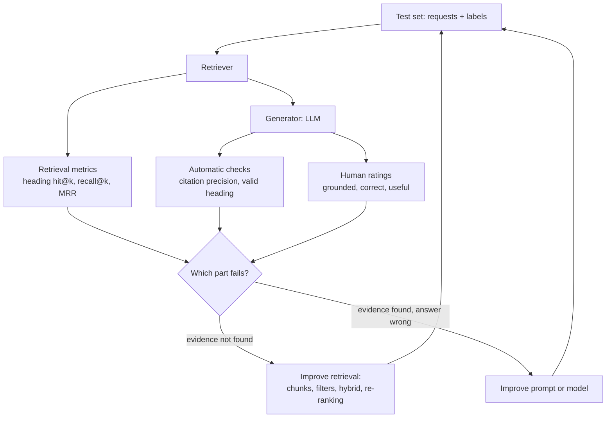
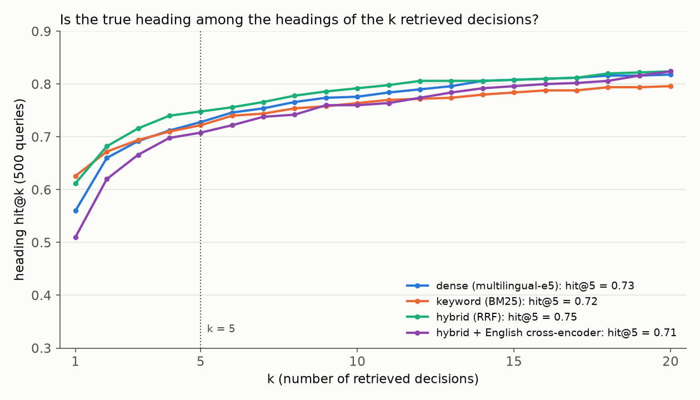
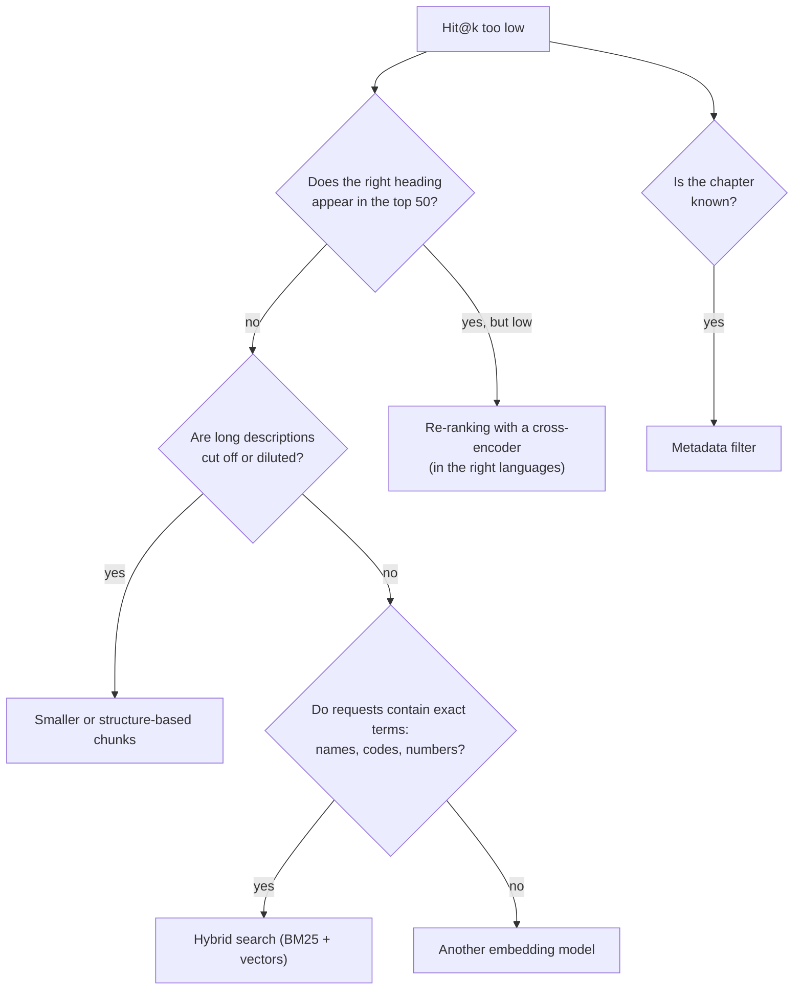

# Evaluating and improving RAG

A RAG prototype that gives a plausible answer to three hand-picked requests proves little. This page shows how to evaluate a RAG system like any other model: with a fixed test set, metrics for the retrieval step (recall@k and, for the classification assistant, heading hit@k), checks and human ratings for the answers (groundedness), and a disciplined way to try improvements (chunk size, metadata filters, hybrid search, re-ranking). The workbook `04-case-study-rag-evaluation.ipynb` carries out every step on ten labelled requests and on 500 more.

Evaluation follows the two halves of the pipeline. If the right decisions are not retrieved, no prompt can produce a grounded answer; if they are retrieved, the answer can still be wrong. We therefore measure the two halves separately.



## A test set of questions

### Concept

A **labelled test set** for retrieval lists requests and, for each request, what counts as a relevant result. The labels are called **relevance judgements**. In general they are made by people:

1. Write requests that users would really ask.
2. For each request, collect candidate documents with several searches (keyword search, semantic search, a filter).
3. Read the candidates and decide for each whether it helps to answer the request.

The classification assistant has a shortcut that most RAG projects do not have: the labels already exist. A decision of 2022–2023 can play the role of a **new request**: its description is the query, and its heading, which customs decided, is the label. A retrieved past decision is relevant if it carries the same heading. This gives thousands of labelled requests for free. It measures one thing only (does retrieval surface decisions with the right heading?); questions such as "how were face masks classified?" still need judgements by people.

The set must be fixed *before* tuning, just like a test split in Session 7. Otherwise we tune the system to the requests we happen to look at.

Worked example: the request `"Gleichstrommotor, Elektromotor, zylinderförmiger, permanent erregt ..."` (a German decision of 2022, heading 8501, electric motors) is relevant to every past decision of heading 8501, and to no other.

### Why it matters

Without a test set, every change to the system is judged by impression on a few examples, and improvements cannot be told apart from noise. With one, a change in chunk size or model can be compared on the same requests, and regressions are detected when the system is changed later.

### How it works in Python

The collection of page 1 (10,000 decisions of 2017–2021) and two test sets drawn from 2022–2023: ten labelled requests, one per language, as in the practice task, and 500 more for a stable estimate.

```python
import math
import re
import time
from collections import Counter

import numpy as np
import pandas as pd
from sentence_transformers import SentenceTransformer

decisions = pd.read_parquet("case-study/data/train_sample.parquet")
year = decisions["start_date"].dt.year
docs = decisions[year <= 2021].sample(10_000, random_state=0).reset_index(drop=True)
requests = decisions[year >= 2022].sample(2_000, random_state=0).reset_index(drop=True)
languages = ["de", "fr", "en", "nl", "pl", "cs", "es", "it", "sv", "da"]
ten = requests.groupby("language").head(1)
ten = ten[ten["language"].isin(languages)].reset_index(drop=True)   # ten labelled requests
print(ten[["language", "heading"]].values.tolist())
# [['de', '8501'], ['fr', '1902'], ['pl', '9403'], ['sv', '6912'], ['es', '2710'],
#  ['cs', '7325'], ['nl', '2208'], ['en', '3824'], ['it', '6303'], ['da', '9603']]
evalset = requests.iloc[:500]                                         # 500 labelled requests
print(evalset["heading"].isin(set(docs["heading"])).mean())          # 0.982: 2 % have no example at all
```

### In practice

- The TREC evaluation campaigns of the US National Institute of Standards and Technology (NIST) have evaluated search systems with human relevance judgements since 1992.
- The BEIR benchmark (Thakur et al., 2021) compares retrieval models on 18 datasets with labelled queries; MTEB (Muennighoff et al., 2023) extends this to many embedding tasks and languages.
- Teams that build internal assistants keep a "golden set" of questions with known source documents and rerun it after every change (Husain 2024 describes this practice).

> [!WARNING]
> Labels from an existing decision are not perfect relevance judgements. A past decision with a *different* heading can still be useful to an officer (it shows where the border between two headings lies), and a decision with the same heading can describe quite different goods. Read the top results of a few requests before you trust a metric.

> [!TIP]
> When you write requests by hand, use the words of users, not of the documents. A test set whose requests copy phrases from the descriptions favours keyword search.

## Recall@k and related retrieval metrics

### Concept

For one request, the retriever returns a ranking of documents. Four metrics summarise how good it is:

- **Recall@k**: the share of the relevant documents that appear in the top *k*. Relevant {d1, d4}, ranking [d3, d1, d7, d4]: the top 3 contain d1 only, so recall@3 = 1/2.
- **Hit@k** (also *success@k*): 1 if at least one relevant document is in the top *k*, else 0. In the example, hit@1 = 0 and hit@2 = 1.
- **Reciprocal rank**: 1 divided by the rank of the first relevant document, here 1/2. Its mean over all requests is the **mean reciprocal rank (MRR)**.
- **Heading hit@k** (the case-study version of hit@k): 1 if the true heading is the heading of at least one of the top *k* retrieved decisions. Headings of the ranking [3926, 6404, 6403, 6403], true heading 6403: heading hit@2 = 0, heading hit@3 = 1, reciprocal rank 1/3.

Recall asks "did we find all the evidence?", hit@k asks "did we find any evidence?", MRR asks "how early?". For the classification assistant, heading hit@k is the natural choice: the language model can only propose a heading that one of the retrieved decisions supports, so heading hit@k is an **upper bound** on the accuracy of the whole assistant. We choose *k* to match the number of decisions that go into the prompt.

### Why it matters

The language model can only use what retrieval gives it. Measuring retrieval separately tells us which half of the system to improve, and it is cheap: no LLM calls are needed, so many variants can be compared in minutes.

### How it works in Python

The metrics are pure functions: lists in, a number out. The same functions, with tests, are in `workspace/src/bti_assistant/metrics.py`.

```python
def heading_hit_at_k(ranked_headings, true_heading, k):
    return float(true_heading in list(ranked_headings)[:k])


def reciprocal_rank(ranked_headings, true_heading):
    return next((1 / i for i, h in enumerate(ranked_headings, start=1) if h == true_heading), 0.0)


ranked = ["3926", "6404", "6403", "6403"]
print(heading_hit_at_k(ranked, "6403", 2), heading_hit_at_k(ranked, "6403", 3),
      reciprocal_rank(ranked, "6403"))                     # 0.0 1.0 0.3333333333333333
```

Applied to the dense retriever of page 1 (multilingual-e5-small, one vector per description; about 30 seconds to embed the collection):

```python
model = SentenceTransformer("intfloat/multilingual-e5-small")
E = model.encode(("passage: " + docs["description"]).tolist(), batch_size=64, normalize_embeddings=True)
H = docs["heading"].to_numpy()


def dense_search(query, depth=50):
    q = model.encode("query: " + query, normalize_embeddings=True)
    return list(np.argsort(-(E @ q))[:depth])                # row numbers of the best decisions


def evaluate(search_fn, requests, k=5):
    rows = []
    for desc, true in zip(requests["description"], requests["heading"]):
        heads = H[search_fn(desc)]
        rows.append({"hit@1": heading_hit_at_k(heads, true, 1), f"hit@{k}": heading_hit_at_k(heads, true, k),
                     "mrr": reciprocal_rank(heads, true)})
    return pd.DataFrame(rows).mean().round(3).to_dict()


print(evaluate(dense_search, ten))       # {'hit@1': 0.2, 'hit@5': 0.4, 'mrr': 0.296}
print(evaluate(dense_search, evalset))   # {'hit@1': 0.56, 'hit@5': 0.728, 'mrr': 0.64}
```

The same retriever scores 0.40 on the ten requests and 0.73 on 500. Neither number is wrong: ten requests are simply too few. With ten requests, each one moves heading hit@5 by 0.1; with 500, the standard error of the mean is about 0.02. The ten requests are good for reading answers; the 500 are needed for comparing variants.

The curves show heading hit@k for *k* from 1 to 20 for four retrievers of the next sections, on the 500 requests. All rise with *k*: more decisions contain the right heading more often, but they also cost more tokens.



### In practice

- Web search engines are evaluated with rank-based metrics such as MRR and nDCG (normalised discounted cumulative gain) on judged queries.
- Open-source RAG evaluation tools such as Ragas and the LLM Zoomcamp course of DataTalksClub compute hit rate and MRR for the retrieval step.
- Recommender systems report recall@k on held-out interactions, with the same definition.

> [!CAUTION]
> With ten requests, one request changes the mean by 0.1. Report per-request results next to the mean, and compare variants on hundreds of requests whenever labels allow it.

## Groundedness

### Concept

An answer is **grounded** (also *faithful*) when every statement in it is supported by the sources it was given. Groundedness is different from correctness: an answer can be grounded in a decision that was later revoked, and a heading can be correct by luck without support.

Automatic checks catch some failures cheaply:

- **Citation precision**: the share of cited BTI references that were actually retrieved. Below 1 means invented sources.
- **Valid proposal**: the proposed heading is one of the headings of the retrieved decisions (the candidates).
- **Abstention**: for requests the collection cannot answer (2 % of the requests have a heading without a single example in the collection), does the answer say so?

They do not catch a real citation that does not support its claim. That needs a reader.

### Why it matters

Users see answers, not retrieval scores. An ungrounded answer with a confident tone is the failure that harms trust most, as the court cases of page 1 show. Groundedness checks on a fixed set of requests show whether a change to the prompt, the model or *k* improves the system, and they detect regressions.

### How it works in Python

```python
hits = docs.iloc[dense_search(ten["description"][0])[:5]]          # the motor request
print(hits[["bti_reference", "heading"]].values.tolist()[:3])
# [['DEBTI22550/21-1', '8501'], ['DEBTI8894/19-1', '8501'], ['DEBTI31636/18-1', '8504']]
answer = {"heading": "8501", "references": [hits["bti_reference"].iloc[0], "DEBTI99999/22-1"],
          "reason": "a permanent-magnet DC motor"}                  # an answer as an LLM might return it
cited = list(dict.fromkeys(answer["references"]))
print(sorted(set(cited) - set(hits["bti_reference"])))               # ['DEBTI99999/22-1']: never shown
print(round(len(set(cited) & set(hits["bti_reference"])) / len(cited), 2))   # citation precision 0.5
print(answer["heading"] in set(hits["heading"]))                    # True: the proposal is a candidate
```

The second reference was never shown to the model: either the model invented it or it "remembered" something. In both cases, the claim is not grounded in the prompt, and the workspace function `suggest_heading` reports it.

### In practice

- Ragas (Es et al., 2024) defines *faithfulness* as the share of statements in an answer that can be inferred from the retrieved context, judged by an LLM.
- Legal research providers check citations in generated briefs against their databases; a study by Stanford RegLab and HAI (Magesh et al., 2024) found hallucinated or unsupported citations in commercial legal AI tools.
- Product teams sample logged answers each week and label them grounded or not (error analysis), then add failures to the test set.

> [!WARNING]
> A citation precision of 1.0 is necessary, not sufficient. Always read a sample of answers with their sources.

## Human ratings

### Concept

Whether a statement is supported, correct and useful is judged by people with a short **rubric**: a fixed list of criteria with defined scales. A minimal rubric for the classification assistant:

| Criterion | Scale | Question for the rater |
|---|---|---|
| grounded | 0 / 1 | Does every cited decision support what the answer says about it? |
| correct | 0 / 1 | Is the proposed heading the one customs decided? (known for test requests) |
| useful | 1–5 | Would a customs officer save time with this proposal and its sources? |

Two raters rate the same answers independently. **Cohen's kappa** (κ) measures their agreement beyond chance: κ = (p_o − p_e) / (1 − p_e), where p_o is the observed share of agreement and p_e the agreement expected by chance from each rater's label shares. κ = 0 is chance level, κ = 1 perfect agreement; values above about 0.6 are usually read as substantial agreement.

An **LLM-as-judge** applies the rubric automatically. It is only useful after it has been validated: it must agree with people on a labelled sample about as well as people agree with each other.

### Why it matters

Ratings by people are the reference against which all automatic metrics are judged. Low agreement between raters shows that the rubric is unclear, which is worth knowing before anyone trusts a number based on it. "Correct" can be checked automatically here; "grounded" and "useful" cannot.

### How it works in Python

Worked example: two raters label ten answers as grounded (1) or not (0).

```python
from sklearn.metrics import cohen_kappa_score

human = [1, 1, 0, 1, 1, 0, 1, 1, 1, 0]        # a person
judge = [1, 1, 1, 1, 1, 0, 1, 1, 1, 1]        # an LLM judge on the same ten answers
p_o = sum(h == j for h, j in zip(human, judge)) / 10          # 0.8 observed agreement
p_e = 0.7 * 0.9 + 0.3 * 0.1                                   # 0.66 expected by chance
print(p_o, round((p_o - p_e) / (1 - p_e), 2), round(cohen_kappa_score(human, judge), 2))   # 0.8 0.41 0.41
```

The judge agrees with the person on 8 of 10 answers, but because both say "grounded" most of the time, much of that agreement is expected by chance: κ = 0.41, moderate. The judge is also more lenient (90 % grounded against 70 %). It should not replace the person yet.

### In practice

- Zheng et al. (2023) found that GPT-4 as a judge agreed with human preferences on chatbot answers about as often as humans agreed with each other, and documented position and verbosity biases of the judge.
- Search engines employ trained raters with written guidelines; Google publishes its *Search Quality Rater Guidelines*.
- Annotation tools such as Label Studio and Argilla support rating LLM outputs with rubrics and measuring agreement.

> [!TIP]
> Rate before you read the automatic scores, and keep the rater blind to which system produced an answer. Otherwise expectations leak into the ratings.

## Improving retrieval: chunk size, hybrid search, re-ranking

### Concept

Once retrieval is measured, we can try improvements one at a time on the same test set:

- **Chunk size.** Larger chunks keep more context; smaller chunks are more specific. Most descriptions are short, so the effect is small here; for long documents it is large.
- **Metadata filter.** When the chapter is known (an officer who specialises in footwear), search only decisions of that chapter.
- **Hybrid search.** **BM25** is a keyword ranking function: it scores a document by the query words it contains, weighting rare words more and long documents less. It finds exact terms (brand names, model numbers, CAS numbers, quoted tariff codes) that embeddings blur. Hybrid search runs keyword and vector search and merges the two rankings with **reciprocal rank fusion (RRF)**: each document gets the sum of 1 / (60 + rank) over the rankings (Cormack et al., 2009).
- **Re-ranking.** The embedding model is a **bi-encoder**: query and document are embedded separately, which is fast. A **cross-encoder** reads query and document *together* and outputs one relevance score, which is slower but often more accurate. The usual design retrieves 20–100 candidates with the fast method and re-ranks them with the cross-encoder.

Worked example of RRF with two rankings, dense [a, b, c] and keyword [c, a]: a gets 1/61 + 1/62, c gets 1/63 + 1/61, b gets 1/62. The fused order is a, c, b.

A decision guide for which improvement to try first:



### Why it matters

Each improvement has a cost: re-ranking adds latency, hybrid search adds a second index, smaller chunks add rows. Measuring each change on the test set shows which costs are worth paying. Often the result is surprising, as below.

### How it works in Python

This block continues the previous ones (`dense_search`, `evaluate`, `E`, `H`). BM25 in plain Python takes about a minute for the 500 requests.

```python
TOKEN = re.compile(r"\w+")
tok = [Counter(TOKEN.findall(t.lower())) for t in docs["description"]]
length = np.array([sum(c.values()) for c in tok])
df_count, N, avg = Counter(w for c in tok for w in c), len(tok), length.mean()
postings = {}                                            # word -> [(row, count), ...]
for i, c in enumerate(tok):
    for w, n in c.items():
        postings.setdefault(w, []).append((i, n))


def bm25_search(query, depth=50, k1=1.5, b=0.75):
    scores = np.zeros(N)
    for w in set(TOKEN.findall(query.lower())):
        if w in df_count:
            idf = math.log(1 + (N - df_count[w] + 0.5) / (df_count[w] + 0.5))
            for i, tf in postings[w]:
                scores[i] += idf * tf * (k1 + 1) / (tf + k1 * (1 - b + b * length[i] / avg))
    return list(np.argsort(-scores)[:depth])


def rrf(rankings, k=60):
    scores = {}
    for ranking in rankings:
        for rank, doc in enumerate(ranking, start=1):
            scores[doc] = scores.get(doc, 0) + 1 / (k + rank)
    return sorted(scores, key=lambda d: -scores[d])


print(rrf([["a", "b", "c"], ["c", "a"]]))                # ['a', 'c', 'b']


def hybrid(query):
    return rrf([dense_search(query), bm25_search(query)])


print("BM25  ", evaluate(bm25_search, evalset))          # {'hit@1': 0.626, 'hit@5': 0.722, 'mrr': 0.672}
print("hybrid", evaluate(hybrid, evalset))               # {'hit@1': 0.612, 'hit@5': 0.748, 'mrr': 0.676}

# metadata filter: search only the chapter of the true heading (as if the officer knew it)
CH = docs["heading"].str[:2].to_numpy()
hits_filtered = []
for desc, true in zip(evalset["description"], evalset["heading"]):
    q = model.encode("query: " + desc, normalize_embeddings=True)
    ranking = np.argsort(-np.where(CH == true[:2], E @ q, -np.inf))[:5]
    hits_filtered.append(heading_hit_at_k(H[ranking], true, 5))
print("dense + chapter filter, hit@5", round(np.mean(hits_filtered), 3))   # 0.874
```

Re-ranking with a cross-encoder (downloads `cross-encoder/ms-marco-MiniLM-L-6-v2`, about 90 MB; about one minute):

```python
from sentence_transformers import CrossEncoder

cross = CrossEncoder("cross-encoder/ms-marco-MiniLM-L-6-v2")    # trained on English web search queries


def rerank_search(query, n_candidates=20):
    candidates = hybrid(query)[:n_candidates]
    scores = cross.predict([(query, docs["description"][i]) for i in candidates])
    return [candidates[i] for i in np.argsort(-scores)]


print("re-ranked", evaluate(rerank_search, evalset))      # {'hit@1': 0.51, 'hit@5': 0.708, 'mrr': 0.602}
```

The results on the 500 requests (the chunk-size rows come from workbook 04, which re-embeds the collection for each size):

| Variant | heading hit@1 | heading hit@5 | MRR |
|---|---|---|---|
| dense, one vector per description (baseline) | 0.560 | 0.728 | 0.640 |
| dense, 120-word chunks, best chunk per decision | 0.564 | 0.714 | 0.647 |
| dense, 40-word chunks, best chunk per decision | 0.542 | 0.740 | 0.639 |
| keyword (BM25) | 0.626 | 0.722 | 0.672 |
| hybrid (RRF) | 0.612 | **0.748** | **0.676** |
| hybrid + English cross-encoder re-ranking | 0.510 | 0.708 | 0.602 |
| dense + chapter filter (when the chapter is known) | 0.716 | 0.874 | 0.801 |

Three findings. First, keyword search is a strong baseline on this data: it is best at rank 1, because quoted codes, brand names and technical terms match exactly (Session 13). Hybrid search combines both and is best at k = 5. Second, the cross-encoder makes things worse: it was trained on English web queries (MS MARCO), and most descriptions are German or French. A multilingual cross-encoder would be the next thing to test. Third, knowing the chapter helps most, at no cost. The chunk-size differences (within about three points, in opposite directions for hit@1 and hit@5) are below what 500 requests can resolve. These are honest findings for this collection and test set; on other data the ranking differs, which is exactly why we measure.

### In practice

- Elasticsearch and OpenSearch offer reciprocal rank fusion to combine keyword and vector results; pgvector's documentation shows hybrid search with PostgreSQL full-text search.
- Cohere and other providers sell re-ranking models, including multilingual ones, as a separate API step after a first retrieval.
- Anthropic (2024) reported in its *Contextual Retrieval* experiments that combining embeddings with BM25 and then re-ranking reduced failed retrievals; the size of such gains depends on the data, as the cross-encoder result above shows.

> [!WARNING]
> Change one thing at a time and keep the test set fixed. If you change the chunk size and the model together, you cannot tell which change caused the difference.

> [!CAUTION]
> Do not add the requests you used for tuning to the final evaluation as if they were new. Keep a second, untouched set of requests for the final number, as with a test split.

## Check your understanding

1. Headings of a ranking: [9403, 9401, 9403, 7326, 9403]; true heading 9401. Compute heading hit@1, heading hit@3 and the reciprocal rank.
2. Why is heading hit@5 an upper bound on the accuracy of an assistant that lets the LLM choose among the headings of five retrieved decisions?
3. An answer cites three decisions; all three were retrieved. Is the answer grounded? What else must be checked?
4. The same retriever scores 0.40 on ten requests and 0.73 on 500. Which number would you report, and what are the ten requests still good for?
5. The English cross-encoder lowered hit@1 from 0.61 to 0.51. Give two possible reasons and one experiment to test them.

## Further reading

- Thakur, N., Reimers, N., Rücklé, A., Srivastava, A. and Gurevych, I. (2021). *BEIR: A Heterogeneous Benchmark for Zero-shot Evaluation of Information Retrieval Models*. NeurIPS Datasets and Benchmarks. [arXiv:2104.08663](https://arxiv.org/abs/2104.08663)
- Husain, H. (2024). *Your AI Product Needs Evals*. [hamel.dev/blog/posts/evals](https://hamel.dev/blog/posts/evals/)
- Es, S., James, J., Espinosa-Anke, L. and Schockaert, S. (2024). *RAGAs: Automated Evaluation of Retrieval Augmented Generation*. EACL 2024 demos. [arXiv:2309.15217](https://arxiv.org/abs/2309.15217)
- Cormack, G. V., Clarke, C. L. A. and Büttcher, S. (2009). *Reciprocal Rank Fusion Outperforms Condorcet and Individual Rank Learning Methods*. SIGIR 2009. [doi:10.1145/1571941.1572114](https://doi.org/10.1145/1571941.1572114)
