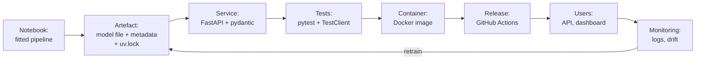
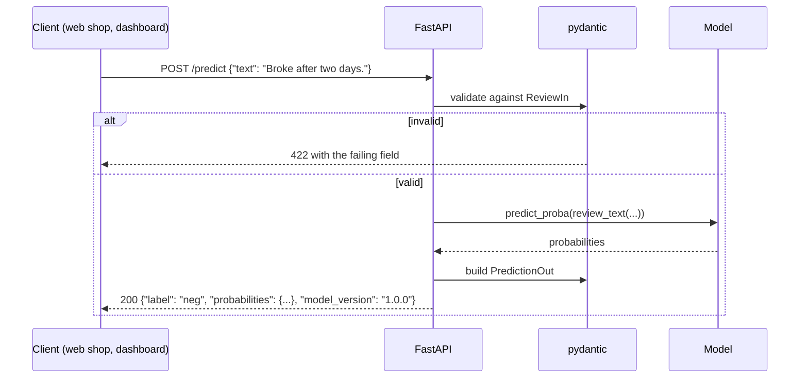

# From notebook to service

A model in a notebook helps only the person who runs the notebook. To reach its users, it must become a **service**: a program that runs without us, answers requests from other programs, and can be tested, versioned and replaced. This page covers the first steps: saving the fitted pipeline with its environment and version, a prediction API with FastAPI and pydantic (building on the minimal API of Session 2), and automated tests for the service. The workspace `workspace/` contains the complete sentiment service; the code below shows its core in a few lines each.

The path of a model from a notebook to its users, and what this session adds at each step:



## From notebook to artefact: saving pipelines

### Concept

A **fitted pipeline** is the object that holds everything learned from the training data: for the case study, the TF-IDF vocabulary with its idf weights and the coefficients of the logistic regression. **Serialisation** writes this Python object to a file, and **deserialisation** restores it in another process.

- `joblib.dump` and `joblib.load` serialise with Python's `pickle` format, efficiently for objects with large numpy arrays. Loading a pickle **runs code** stored in the file, so a pickle from an unknown source is a security risk.
- **skops** (`skops.io.dump` and `skops.io.load`) stores scikit-learn objects in a format that is inspected before loading: types that are not known to be safe must be trusted explicitly.

Save the **whole pipeline**, not only the classifier, so that new text goes through exactly the same preprocessing. The model file together with a small **metadata** file (version, library versions, training data, validation scores) is the **artefact**: the unit that is tested, released and deployed.

### Why it matters

Most failures after deployment are not statistical: a missing preprocessing step, a different library version, a hard-coded path. Saving the full pipeline with its metadata removes these causes and makes a result reproducible months later. A preprocessing step that differs between training and serving is called **training–serving skew**; it is avoided by using one function for both.

### How it works in Python

```python
import json
import tempfile
from pathlib import Path

import joblib
import pandas as pd
import sklearn
from sklearn.feature_extraction.text import TfidfVectorizer
from sklearn.linear_model import LogisticRegression
from sklearn.metrics import f1_score
from sklearn.pipeline import make_pipeline

def review_text(title, text):              # ONE preprocessing function for training and serving
    return f"{title}. {text}" if title else text

df = pd.read_parquet("case-study/data/train_sample.parquet").sort_values("date").tail(10_000)
X = [review_text(t, x) for t, x in zip(df["title"], df["text"])]
y = df["label"].tolist()
cut = 8_000                                # time-based split: the newest 2,000 reviews validate
pipe = make_pipeline(TfidfVectorizer(ngram_range=(1, 2), sublinear_tf=True, min_df=2),
                     LogisticRegression(C=4, class_weight="balanced", max_iter=2000)).fit(X[:cut], y[:cut])
f1 = f1_score(y[cut:], pipe.predict(X[cut:]), average="macro")

out = Path(tempfile.mkdtemp())             # in the workspace: models/
joblib.dump(pipe, out / "model.joblib")    # vocabulary, idf weights and coefficients in one file
meta = {"model_version": "1.0.0", "scikit_learn": sklearn.__version__, "n_train": cut,
        "validation": {"scheme": "time-based, newest 2,000", "macro_f1": round(f1, 3)}}
(out / "metadata.json").write_text(json.dumps(meta, indent=2))

restored = joblib.load(out / "model.joblib")   # e.g. at start-up of the API process
print(meta["validation"], restored.predict(["Broke after two days. Waste of money.", "Works well, fair price."]))
# {'scheme': 'time-based, newest 2,000', 'macro_f1': 0.675} ['neg' 'pos']
```

The same with skops (`uv run --with skops ...`):

```python
import skops.io as sio

sio.dump(pipe, out / "model.skops")
untrusted = sio.get_untrusted_types(file=out / "model.skops")
print(untrusted)                          # [] here; otherwise: types skops does not trust, read them before loading
safe = sio.load(out / "model.skops", trusted=untrusted)
print(safe.predict(["Waste of money."]))  # ['neg']
```

### In practice

- Model registries such as MLflow store each model file with its metrics, parameters and environment, so a team can roll back to an earlier version.
- The scikit-learn documentation on model persistence warns that pickled models are not guaranteed to load across library versions and recommends recording the versions used.
- The Hugging Face Hub introduced the `safetensors` format and pickle scanning because pickled model files from strangers can run arbitrary code when loaded.

> [!CAUTION]
> Never load a joblib or pickle file that you did not create or whose origin you cannot verify. Loading it can run any code on your machine. Use skops or a checksum of a file you made yourself (the workspace stores a SHA-256 checksum in `metadata.json` and refuses a changed file).

## Versioning

### Concept

A **version** identifies one artefact. **Semantic versioning** writes it as MAJOR.MINOR.PATCH: a new major version for a change that users notice in behaviour (new training data or method), a minor version for a compatible addition (a new endpoint), a patch for a bug fix. Three things are versioned together:

| What | How | Where |
|---|---|---|
| code | Git commits and tags (`v1.0.0`) | GitHub |
| model artefact | version in `metadata.json`, file checksum | release assets or a model registry |
| data | file name, date range and checksum of the training data | `metadata.json`; DVC or a data catalogue for larger setups |

The API reports the model version in every response, so that each logged prediction can be traced to one artefact.

### Why it matters

When a user reports a strange prediction, or the monitoring shows a drop in quality, we must know which model made the prediction, on which data it was trained and how to restore the previous one. Without versions, a rollback is guesswork.

### How it works in Python

```python
import hashlib

def sha256(path):
    return hashlib.sha256(Path(path).read_bytes()).hexdigest()

meta["model_sha256"] = sha256(out / "model.joblib")
meta["training_data"] = {"file": "train_sample.parquet", "sha256": sha256("case-study/data/train_sample.parquet")[:12],
                         "date_max": str(df["date"].max().date())}
print(meta["model_version"], meta["training_data"])
```

### In practice

- MLflow, Weights & Biases and DVC record model versions together with the data and code versions that produced them.
- Python packages on PyPI follow semantic versioning, which is why `uv` can choose compatible updates.
- GitHub releases attach files (here: the model) to a Git tag, which links code and artefact.

> [!TIP]
> Keep the version in one place (the metadata) and let everything else read it: the API response, the container tag and the model card.

## Pinned dependencies

### Concept

A model file is only valid together with the code that reads it. **Pinning** means recording the exact version of every package, including the indirect ones. With uv:

- `pyproject.toml` lists the **direct** dependencies with lower bounds (`scikit-learn>=1.5`);
- `uv lock` resolves all direct and indirect dependencies into **`uv.lock`**, with exact versions and file hashes;
- `uv sync --frozen` recreates exactly that environment on another machine, in CI or in a container.

Settings that differ between machines (paths, ports, keys) are not pinned in code but read from **environment variables**, for example `MODEL_DIR=models`.

### Why it matters

"It works on my laptop" is the symptom of an environment that is not pinned. A minor update of a library can change results or break loading of a saved model. The lock file turns the environment into a reproducible artefact as well.

### How it works in Python

```bash
cd sessions/16-deployment-and-monitoring/workspace
uv add scikit-learn fastapi        # adds lower bounds to pyproject.toml and updates uv.lock
uv lock --upgrade-package fastapi  # a deliberate update of one package
uv sync --frozen                   # recreate exactly the locked versions (CI, Docker)
uv tree --depth 1                  # what is installed, and why
```

```python
import os

model_dir = Path(os.environ.get("MODEL_DIR", "models"))   # configuration from the environment
print(model_dir)
```

### In practice

- The Twelve-Factor App method, widely used for web services, requires dependencies to be declared explicitly and configuration to be kept in environment variables.
- Reproducible research guides, such as *The Turing Way*, recommend lock files or containers for every published analysis.
- Security scanners (for example GitHub Dependabot) read lock files to report known vulnerabilities in exact versions.

> [!WARNING]
> `pip install scikit-learn` without a version installs whatever is newest today. A model trained with scikit-learn 1.9 and loaded with a later version may warn, fail or behave differently. The workspace's `load_model` warns when the versions differ.

## The prediction API with FastAPI and pydantic

### Concept

A **web API** lets any program send a request over HTTP and receive a response, usually in JSON (Session 2). An **endpoint** is one URL with one method:

- `GET /health` returns the state of the service, for load balancers and container platforms;
- `POST /predict` receives a review and returns a prediction.

**FastAPI** maps Python functions to endpoints with decorators such as `@app.post("/predict")`; **uvicorn** is the server that runs the application. **pydantic** models describe the request and the response as Python classes with typed fields. FastAPI validates every request against the request model *before* our function runs: an empty text or a missing field is rejected with status code **422** (unprocessable content) and a message that names the field. The response model documents and checks the output. From these models, FastAPI generates interactive documentation at `/docs`.

The model is loaded **once at start-up** (in the **lifespan** function), not per request.



### Why it matters

An API separates the model from the programs that use it: the web shop needs only a URL and the JSON format, and the model can be replaced without changing the shop. Input validation keeps malformed requests away from the model and gives clear error messages instead of crashes.

### How it works in Python

A compact version of `workspace/src/sentiment_service/app.py` (it uses `pipe` and `meta` from above):

```python
from contextlib import asynccontextmanager
from typing import Annotated, Literal

from fastapi import FastAPI
from pydantic import BaseModel, ConfigDict, StringConstraints

class ReviewIn(BaseModel):                         # request body: validated before our code runs
    model_config = ConfigDict(extra="forbid")      # unknown fields -> 422
    text: Annotated[str, StringConstraints(strip_whitespace=True, min_length=1, max_length=10_000)]
    title: str = ""

class PredictionOut(BaseModel):                    # response body: documented and checked
    label: Literal["neg", "neu", "pos"]
    probabilities: dict[str, float]
    model_version: str

state = {}

@asynccontextmanager
async def lifespan(app: FastAPI):
    state["model"], state["meta"] = pipe, meta     # in the service: load_model(MODEL_DIR) at start-up
    yield

app = FastAPI(title="Review sentiment API", version="1.0.0", lifespan=lifespan)

@app.get("/health")
def health() -> dict:
    return {"status": "ok", "model_version": state["meta"]["model_version"]}

@app.post("/predict", response_model=PredictionOut)
def predict(review: ReviewIn) -> PredictionOut:
    model = state["model"]
    proba = model.predict_proba([review_text(review.title, review.text)])[0]
    probs = {str(c): round(float(p), 4) for c, p in zip(model.classes_, proba)}
    return PredictionOut(label=max(probs, key=probs.get), probabilities=probs,
                         model_version=state["meta"]["model_version"])
```

Started from the workspace with `MODEL_DIR=models uv run uvicorn sentiment_service.app:app --reload`; the documentation is then at `http://localhost:8000/docs`.

### In practice

- Content moderation and spam filters run as prediction services that other systems call for every new message or review.
- Hospitals integrate risk scores into clinical information systems through web APIs, so the model can be updated without changing the hospital software.
- Many public open-data portals publish documented REST APIs with OpenAPI descriptions, the same format FastAPI generates.

> [!WARNING]
> Do not load the model inside the endpoint function. Loading a 10 MB pipeline for every request makes each request slow and the service fragile under load.

> [!TIP]
> Put the model version into every response and every log line. It costs nothing and makes every later analysis traceable.

## Tests for the service

### Concept

An **automated test** calls the code and **asserts** what the result must be; **pytest** finds every function whose name starts with `test_` (Session 2). FastAPI's **TestClient** sends HTTP requests to the application inside the test process, without starting a server, so API tests run in a fraction of a second. Using `with TestClient(app) as client:` also runs the lifespan, as a real server start would.

Three kinds of tests:

- **Contract tests** check the interface: status codes, field names, probabilities that sum to one.
- **Validation tests** check that invalid input is rejected with 422.
- **Behavioural tests** check the model on a few obvious cases, for example that a clearly negative review is negative. They catch a broken model file or a swapped label order, not small changes in accuracy (Ribeiro et al. 2020 call these *minimum functionality tests*).

Tests must not depend on the real data or on a large model file: the workspace trains a **fixture model** on twelve built-in sentences in a few milliseconds.

### Why it matters

Tests turn assumptions about the service into checks that run on every change. Together with continuous integration (next page), a change that breaks the API cannot reach the main branch unnoticed.

### How it works in Python

```python
from fastapi.testclient import TestClient    # needs httpx (or httpx2): uv run --with httpx2

def test_service():
    with TestClient(app) as client:           # `with` runs the lifespan
        r = client.get("/health")
        assert r.status_code == 200 and r.json()["status"] == "ok"

        r = client.post("/predict", json={"text": "Broke after two days. Waste of money."})
        body = r.json()
        assert r.status_code == 200 and set(body) == {"label", "probabilities", "model_version"}
        assert abs(sum(body["probabilities"].values()) - 1) < 0.01          # contract
        assert body["label"] == "neg"                                         # behaviour

        for bad in ({"text": ""}, {"text": "   "}, {"review": "Great"}, {"text": "ok", "rating": 5}):
            assert client.post("/predict", json=bad).status_code == 422      # validation

test_service()
print("all assertions passed")
```

In the workspace, `uv run pytest -q` runs 26 such tests in under a second.

### In practice

- Breck et al. (Google, 2017) list tests of the serving infrastructure and of model behaviour in the *ML Test Score*, a rubric for production readiness.
- Ribeiro et al. (2020) used simple behavioural tests (*CheckList*) to find failures in commercial sentiment analysis APIs.
- Open-source projects such as scikit-learn and FastAPI run thousands of tests on every pull request before merging.

> [!IMPORTANT]
> A behavioural test must use cases that any acceptable model gets right. "Broke after two days. Waste of money." is negative for every reasonable model; a borderline review is not a test case but a question for the evaluation.

## Check your understanding

1. Why should you save the whole pipeline and not only the logistic regression?
2. What risk does `joblib.load` carry with a file from an unknown source, and what does skops do differently?
3. Which three things are versioned together, and where does the workspace record each of them?
4. A request sends `{"text": "Great", "stars": 5}`. What does the API of this page return, and why?
5. Give one contract test, one validation test and one behavioural test for the sentiment service.

## Further reading

- FastAPI documentation: [Tutorial – User Guide](https://fastapi.tiangolo.com/tutorial/) and [Testing](https://fastapi.tiangolo.com/tutorial/testing/) (MIT licence).
- scikit-learn developers. *Model persistence*. [scikit-learn.org/stable/model_persistence.html](https://scikit-learn.org/stable/model_persistence.html)
- Breck, E., Cai, S., Nielsen, E., Salib, M. and Sculley, D. (2017). The ML Test Score: A rubric for ML production readiness and technical debt reduction. *IEEE Big Data 2017*. [research.google/pubs/pub46555](https://research.google/pubs/the-ml-test-score-a-rubric-for-ml-production-readiness-and-technical-debt-reduction/)
- Mohandas, G. *Made With ML*. [madewithml.com](https://madewithml.com/) (MIT licence).
