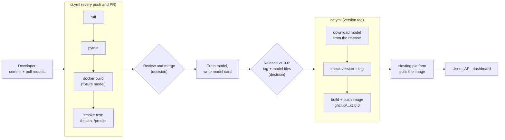
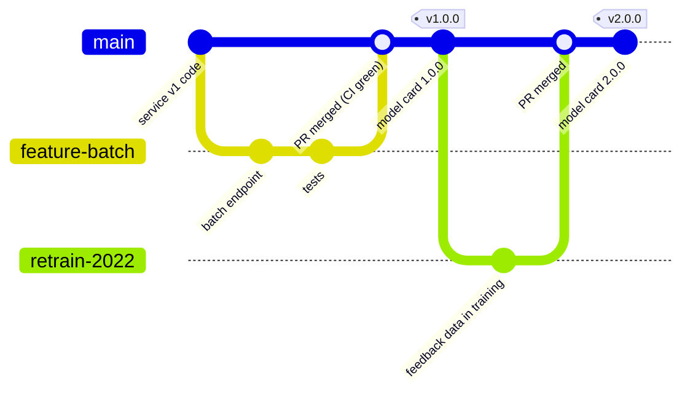
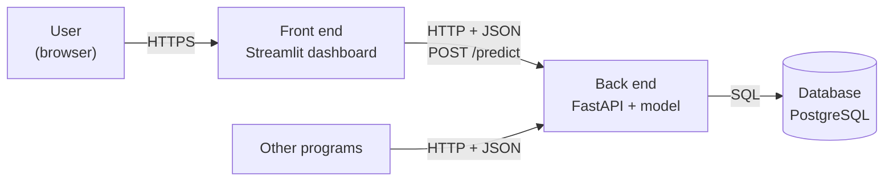
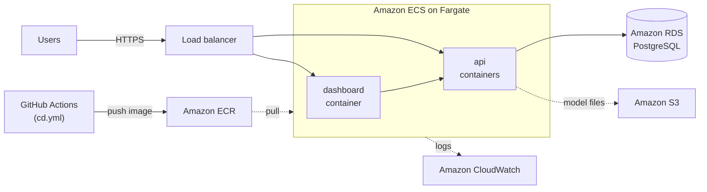
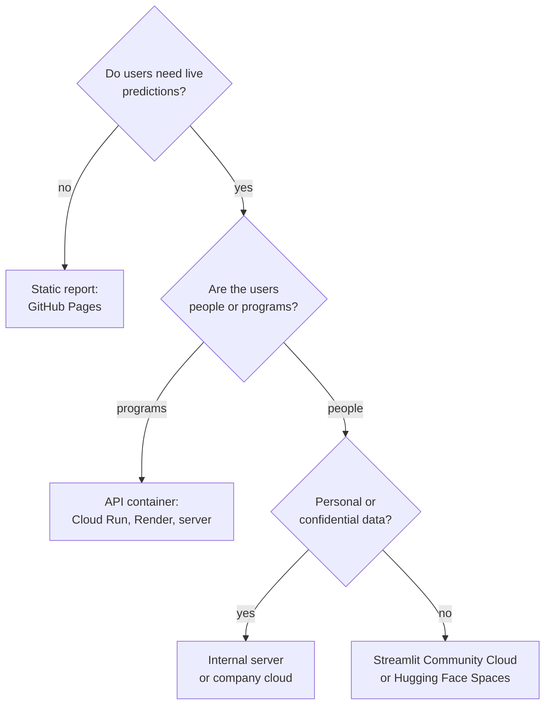

# Containers, continuous delivery and cloud architecture

A tested service on a laptop is still not available to its users. This page covers the steps that get it there: packaging the service with all its dependencies in a **container**, releasing it automatically with **continuous delivery** in GitHub Actions, and an introduction to **system design and cloud architecture**: how a front end, a back end and a database work together, and which cloud services run them. A last, optional section shows simple ways of **publishing a dashboard**. In this course we do not run servers in class for everyone; the workspace contains a Dockerfile and two workflows that you can read line by line and run in your own repository.

The deployment pipeline of the tariff heading service. Every arrow is automated except the two marked as decisions.



## Containers with Docker

### Concept

A **container image** bundles an application with everything it needs to run: an operating-system layer, Python, the locked packages, the code and the model file. A **container** is a running instance of an image; it behaves the same on a laptop, a university server or a cloud platform. **Docker** is the most widely used tool to build and run containers; Podman is an open-source alternative with the same commands.

A **Dockerfile** lists the steps to build the image:

| Instruction | Meaning |
|---|---|
| `FROM python:3.12-slim` | start from a published base image |
| `COPY src ./src` | copy files from the project into the image |
| `RUN uv sync --frozen` | run a command while building |
| `ENV MODEL_DIR=/app/models` | set an environment variable |
| `USER appuser` | run as this (non-root) user |
| `EXPOSE 8000` | document the port the service listens on |
| `CMD ["uvicorn", ...]` | the command that starts the service |

Each instruction creates a **layer**, and Docker reuses unchanged layers from earlier builds (the **build cache**). Therefore copy `pyproject.toml` and `uv.lock` and install the dependencies *first*, then copy the code: changing the code then does not reinstall the packages. A `.dockerignore` file keeps data, virtual environments and tests out of the image.

Worked example of the cache: you change one line in `app.py` and rebuild. Layers 1–4 (base image, uv, lock file, dependency install) are reused; only the layers from `COPY src` onwards are rebuilt. The rebuild takes seconds instead of minutes.

### Why it matters

A container removes the difference between the developer's machine and the server: the same image that passed the tests in CI runs in production. Images are the unit that hosting platforms, Kubernetes clusters and CI pipelines accept, so a container makes the service portable between them.

### How it works in Python

The Dockerfile of the workspace (`workspace/Dockerfile`):

```dockerfile
FROM python:3.12-slim

# uv from its official image, pinned to a minor version
COPY --from=ghcr.io/astral-sh/uv:0.12 /uv /uvx /bin/
ENV UV_COMPILE_BYTECODE=1 UV_LINK_MODE=copy UV_PYTHON_DOWNLOADS=never
WORKDIR /app

# 1. dependencies first: this layer is reused until pyproject.toml or uv.lock change
COPY pyproject.toml uv.lock README.md ./
RUN uv sync --frozen --no-dev --no-install-project --no-cache

# 2. then the code and the model files
COPY src ./src
RUN uv sync --frozen --no-dev --no-editable --no-cache
COPY models ./models
ENV MODEL_DIR=/app/models PATH="/app/.venv/bin:$PATH"

# 3. run as a non-root user
RUN useradd --create-home --uid 10001 appuser
USER appuser
EXPOSE 8000
HEALTHCHECK --interval=30s --timeout=3s --start-period=10s \
    CMD python -c "import urllib.request; urllib.request.urlopen('http://localhost:8000/health')"
CMD ["uvicorn", "tariff_service.app:app", "--host", "0.0.0.0", "--port", "8000"]
```

Build and run it (if Docker or Podman is installed):

```bash
cd sessions/16-deployment-and-monitoring/workspace
uv run python -m tariff_service.train --data ../../../case-study/data/train_sample.parquet --version 1.0.0
docker build -t tariff-service:1.0.0 .
docker run --rm -p 8000:8000 tariff-service:1.0.0     # then open http://localhost:8000/docs
docker images tariff-service                           # size of the image
```

Any program can then use the service. A client in Python:

```python
# requires the running container (docker run ... above)
import httpx

r = httpx.post("http://localhost:8000/predict",
               json={"description": "Masque de protection à usage unique, en non-tissé de polypropylène",
                     "language": "fr"})
print(r.status_code, r.json()["heading"], [t["heading"] for t in r.json()["top"]])
# 200, then the top heading and the three suggestions, e.g. 6307 ['6307', ...]
```

### In practice

- Cloud platforms such as Google Cloud Run, AWS App Runner and Azure Container Apps run any container image that listens on a port.
- Kubernetes, the container orchestration system released by Google in 2014 and now maintained by the Cloud Native Computing Foundation, runs and restarts containers across many machines.
- Research groups publish containers with their analysis so that results can be reproduced with the original software versions; journals and the Binder project support this.

> [!WARNING]
> Never copy secrets (API keys, passwords, `.env` files) into an image: anyone who can pull the image can read them. Pass them at run time as environment variables or through the platform's secret store.

> [!TIP]
> Use a slim base image, a `.dockerignore`, and a non-root user. The image of the workspace contains no tests, notebooks or data.

## Continuous delivery with GitHub Actions

### Concept

**Continuous integration** (CI, Session 2) tests every push and pull request automatically on a clean machine. **Continuous delivery** (CD) extends this: every change that passes the tests produces a releasable artefact, and a release is one deliberate action (here: pushing a version tag). **Continuous deployment** goes one step further and deploys every passing change automatically.

In **GitHub Actions**, a **workflow** is a YAML file in `.github/workflows/` at the repository root. It names the **events** that trigger it (`push`, `pull_request`, a tag), and **jobs** that run on fresh virtual machines (`runs-on: ubuntu-latest`). A job executes **steps**: either a published **action** (`uses: actions/checkout@v7`) or a shell command (`run: uv run pytest -q`). A job can depend on another (`needs: test`).

The workspace has two workflows:

| Workflow | Trigger | Steps |
|---|---|---|
| `ci.yml` | every push to `main` and every pull request | ruff, pytest; then build the image with the fixture model and smoke-test `/health` and `/predict` |
| `cd.yml` | a tag `v*.*.*` | download the model files of that GitHub release; check that the version in `metadata.json` equals the tag; build and push the image to `ghcr.io` |

The model file is attached to the **GitHub release**, not committed to Git: model files are large binary files, and the training data may not be redistributed.

A release as a Git history: features are merged through pull requests, and a tag on `main` triggers the release.



### Why it matters

CD makes a release repeatable and auditable: the image for version 2.0.0 is built the same way as for 1.0.0, from a tagged commit, with a checked model file. Nobody builds an image on a laptop with uncommitted changes, and a rollback means redeploying the image of the previous tag.

### How it works in Python

The release job of `workspace/.github/workflows/cd.yml`, shortened:

```yaml
name: cd
on:
  push:
    tags: ["v*.*.*"]
permissions:
  contents: read
  packages: write          # push to the GitHub container registry
jobs:
  release-image:
    runs-on: ubuntu-latest
    steps:
      - uses: actions/checkout@v7
      - name: Download the model files of this release
        env:
          GH_TOKEN: ${{ github.token }}
        run: gh release download "${GITHUB_REF_NAME}" --pattern "model.joblib" --pattern "metadata.json" --dir models
      - uses: docker/login-action@v4
        with:
          registry: ghcr.io
          username: ${{ github.actor }}
          password: ${{ secrets.GITHUB_TOKEN }}
      - id: meta
        uses: docker/metadata-action@v6
        with:
          images: ghcr.io/${{ github.repository }}
          tags: type=semver,pattern={{version}}
      - uses: docker/build-push-action@v7
        with:
          context: .
          push: true
          tags: ${{ steps.meta.outputs.tags }}
```

The release itself, from the command line with the GitHub CLI:

```bash
uv run python -m tariff_service.train --data ../../../case-study/data/train_sample.parquet --version 1.0.0
git tag v1.0.0 && git push origin v1.0.0
gh release create v1.0.0 models/model.joblib models/metadata.json --title "Model 1.0.0" --notes-file MODEL_CARD.md
```

The version check of the workflow is a small Python condition:

```python
import json

metadata = {"model_version": "1.0.0"}            # in the workflow: json.load(open("models/metadata.json"))
tag = "v1.0.0"                                   # in the workflow: the environment variable GITHUB_REF_NAME
assert "v" + metadata["model_version"] == tag, "metadata version and tag differ"
print("release", tag, "matches the model metadata")
```

### In practice

- Most open-source Python projects on GitHub, including pandas and scikit-learn, run their test suites with CI on every pull request and publish releases from tags.
- Companies protect their main branch so that a pull request can only be merged when the CI checks pass ("branch protection").
- The GitHub container registry (`ghcr.io`) and Docker Hub host images that platforms pull by name and tag.

> [!IMPORTANT]
> Workflows run only from `.github/workflows/` at the **root** of a repository. The files in the course repository are examples; copy them to the root of your team repository.

> [!CAUTION]
> A workflow that pushes images or deploys needs credentials. Use the built-in `GITHUB_TOKEN` with minimal `permissions`, store other keys as repository secrets, and never print them in a step.

## System design and cloud architecture

This section is an introduction. Its aim is that you can read and sketch the architecture of a data application and know which cloud services exist for each part, not that you operate them.

### Concept

**System design** is the decision about which parts an application consists of, what each part does and how the parts communicate. Most data applications follow the same three-part pattern:

| Part | What it does | In the tariff example |
|---|---|---|
| **Front end** | What users see and click: a web page or a dashboard | the Streamlit dashboard, where an officer pastes a description |
| **Back end** | The logic behind it, offered as an API: validation, the model, the rules | the FastAPI service that returns the top three headings |
| **Database** | Data that must outlive a single request | PostgreSQL with the prediction log, the raw data of every drift check (block 3) |

The parts talk over the network: the front end sends HTTP requests with JSON to the back end (Session 2), the back end sends SQL to the database (Session 3). Only the front end and the API are reachable from outside; the database is not.



Why separate the parts instead of putting everything into one script?

- **One model, several clients.** The dashboard, a batch job and another team's software can all use the same API, and a new model version is deployed in one place.
- **Independent scaling.** If many requests arrive, more copies of the back end are started; the database stays one.
- **Security.** The database holds the data and is reachable only from the back end, never from the internet.
- **Replaceable parts.** The Streamlit front end can later be replaced by a web page without touching the model.

Not every project needs all three parts. Three common designs:

| Design | Parts | Example |
|---|---|---|
| Interactive model service | front end → back end → database | the tariff heading service in this workspace |
| Analytics dashboard | front end → database, refreshed by a scheduled job | a dashboard of Berlin rental prices, reloaded every night by the loading script |
| Batch scoring | scheduled job → database → reporting tool | churn scores computed every Monday for all customers and read by the CRM team |

**Locally**, each part runs in its own container, and **Docker Compose** starts them together from one file, `compose.yaml`. The containers share a private network in which they find each other by service name: the dashboard calls `http://api:8000`, the API connects to the host `db`.

**In the cloud**, the same parts run on managed services. A provider such as **Amazon Web Services (AWS)** offers a service for each part:

| Part | Locally (Compose) | AWS service | What the service does |
|---|---|---|---|
| Container images | `docker build` | **Amazon ECR** (Elastic Container Registry) | stores the images that CI builds |
| Front end and back end | containers `dashboard`, `api` | **Amazon ECS with AWS Fargate** | runs containers without managing servers; starts more copies under load |
| Entry point | `ports:` | **Elastic Load Balancing** (Application Load Balancer) | receives HTTPS traffic and distributes it to the containers |
| Database | container `db` | **Amazon RDS for PostgreSQL** | managed PostgreSQL with backups and updates |
| Files: model, raw data | `models/` folder | **Amazon S3** | object storage for files of any size |
| Passwords and keys | `environment:` | **AWS Secrets Manager** | stores secrets and passes them to the containers |
| Logs and metrics | `docker logs` | **Amazon CloudWatch** | collects logs, metrics and alarms |



Microsoft Azure and Google Cloud offer the same building blocks under other names, for example Azure Container Apps or Google Cloud Run for the containers and Azure Database for PostgreSQL or Cloud SQL for the database. The design stays the same; only the names change.

### Why it matters

Data scientists rarely set up cloud infrastructure alone, but they take part in the decisions: where the model runs, where the data live, who can reach them and what it costs. A sketch of the architecture is the common language for these discussions with engineers, IT security and the budget holder. It also makes data protection visible: in the diagram you can point to the one place where confidential requests are stored.

### How it works in Python

The workspace contains the three-part version of the service. `compose.yaml`, shortened:

```yaml
services:
  db:                                     # database: no "ports", so not reachable from outside
    image: postgres:17
    environment: {POSTGRES_USER: tariff, POSTGRES_PASSWORD: tariff, POSTGRES_DB: tariff}
  api:                                    # back end: the image of the Dockerfile above
    build: .
    environment: {DATABASE_URL: "postgresql://tariff:tariff@db:5432/tariff"}
    ports: ["8000:8000"]
  dashboard:                              # front end: sends every description to the API
    build: dashboard
    environment: {API_URL: "http://api:8000"}
    ports: ["8501:8501"]
```

```bash
cd sessions/16-deployment-and-monitoring/workspace
docker compose up --build        # dashboard: http://localhost:8501, API: http://localhost:8000/docs
docker compose exec db psql -U tariff -c "SELECT heading, language, model_version FROM predictions"
docker compose down              # add -v to delete the database volume as well
```

The service code itself hardly changes: with the environment variable `DATABASE_URL` set, the API writes its prediction log to PostgreSQL instead of a file (`monitoring.py`), and with `API_URL` set, the dashboard calls the API instead of loading the model (`dashboard/streamlit_app.py`). Settings that differ between laptop and cloud come from the environment, not from the code (*The Twelve-Factor App*).

### In practice

- AWS, Azure and Google Cloud each publish a "well-architected framework" with design principles for reliability, security, cost and performance; the AWS Well-Architected Framework is a common reference in job interviews and design reviews.
- Many companies run their containers on Kubernetes (Amazon EKS, Azure AKS, Google GKE) once they have many services; for a few services, managed container platforms such as ECS on Fargate are simpler.
- Architecture diagrams with the providers' official icons are a standard part of project documentation and of the review before a system goes live.

> [!CAUTION]
> Cloud resources cost money while they exist, whether or not anyone uses them: a load balancer and a database are billed by the hour. The free offers for new accounts are limited in time and amount, and their terms change; check them, set a budget alarm, and delete what you created after an experiment.

## Publishing a dashboard (optional)

### Concept

Not every model needs an API. For many projects, the users are people who want to explore results: a **dashboard** is a web page with charts, filters and perhaps a form that calls the model. **Streamlit** turns a Python script into such a web app: every widget (`st.text_area`, `st.selectbox`) is a line of Python, and the script reruns when the user changes an input. `@st.cache_resource` keeps the loaded model in memory between reruns.

Publishing options differ in what they run and what they cost. Free tiers change often; check the current terms before you choose.

| Option | Runs | Fits | Notes |
|---|---|---|---|
| Streamlit Community Cloud | Streamlit apps from a public GitHub repository | team dashboards, course projects | free; the app sleeps when unused; files must be in the repository or downloaded at start |
| Hugging Face Spaces | Gradio, Streamlit, static and Docker apps | model demos | free hardware only for some app types; paid hardware for others |
| Render, Google Cloud Run and similar | any container image | the API container | free quotas with limits; some need a billing account |
| A university or company server | containers with Docker or Podman | internal or personal data | data stay inside the organisation |
| A static report (Quarto, Jupyter Book on GitHub Pages) | HTML without a server | results that do not need live predictions | cheapest and most robust |

A decision guide:



### Why it matters

A model that nobody can use has no effect. For a project manager, choosing where and how results are published is a decision about cost, maintenance and data protection: a public free tier is fine for a demo on published BTI decisions, not for pending requests, which contain confidential business information.

### How it works in Python

`workspace/dashboard/streamlit_app.py`, the core:

```python
# requires: uv sync --extra dashboard, then: MODEL_DIR=models uv run streamlit run dashboard/streamlit_app.py
import os
from pathlib import Path

import pandas as pd
import streamlit as st

from tariff_service.model import decision_text, load_model, top_k

@st.cache_resource                      # load once per server process
def get_model():
    return load_model(Path(os.environ.get("MODEL_DIR", "models")))

pipe, meta = get_model()
st.title("Tariff heading suggestion")
st.caption(f"Model {meta['model_version']} · validation accuracy {meta['validation']['accuracy']}")
text = st.text_area("Description of goods", "Masque de protection à usage unique, en non-tissé")
ranked = top_k(pipe, [decision_text(text)], k=3)[0]          # [(heading, score), ...]
st.dataframe(pd.DataFrame([{"heading": h, "score": sc, "text": meta["headings"].get(h, "")}
                           for h, sc in ranked]))
```

To publish it on Streamlit Community Cloud: push the repository to GitHub (public), sign in at [share.streamlit.io](https://share.streamlit.io/) with GitHub, choose the repository and the file `dashboard/streamlit_app.py`, and add the dependencies in a `requirements.txt` next to the app or in `pyproject.toml`. The model files must be reachable: commit a small model (a few MB), or download it from the GitHub release at start-up.

### In practice

- The COVID-19 dashboard of Johns Hopkins University (Dong, Du and Gardner, 2020) showed how a regularly updated public dashboard can become a primary information source.
- Our World in Data publishes its charts and the code behind them openly, and links every chart to its data source.
- Many data science teams publish internal Streamlit or Dash apps for colleagues instead of sending notebooks.

> [!WARNING]
> A public dashboard is public: anyone can use it, and every prediction costs computing time. Do not publish personal data, and do not connect a public app to a paid API without limits.

## Check your understanding

1. Why does the Dockerfile copy `uv.lock` and install the dependencies before it copies `src/`?
2. What is the difference between continuous integration, continuous delivery and continuous deployment?
3. Why is the model file attached to a GitHub release instead of being committed to the repository?
4. The CD workflow stops with "metadata version 1.1.0 != tag". What went wrong in the release, and how do you fix it?
5. Your team's dashboard classifies pending BTI requests that customs officers paste into it. Which publishing option do you choose, and why?
6. Sketch the architecture of your team project: which parts does it need (front end, back end, database, scheduled job), and which AWS service would run each part?
7. Why does `compose.yaml` publish ports for the dashboard and the API but not for the database?

## Further reading

- Docker Inc. *Docker: Get started*. [docs.docker.com/get-started](https://docs.docker.com/get-started/)
- FastAPI documentation. *FastAPI in Containers – Docker*. [fastapi.tiangolo.com/deployment/docker](https://fastapi.tiangolo.com/deployment/docker/) (MIT licence)
- GitHub. *GitHub Actions documentation: Publishing Docker images*. [docs.github.com/actions/publishing-packages/publishing-docker-images](https://docs.github.com/en/actions/publishing-packages/publishing-docker-images)
- Docker Inc. *Docker Compose: How Compose works*. [docs.docker.com/compose/intro/compose-application-model](https://docs.docker.com/compose/intro/compose-application-model/)
- Amazon Web Services. *AWS Well-Architected Framework*. [docs.aws.amazon.com/wellarchitected/latest/framework/welcome.html](https://docs.aws.amazon.com/wellarchitected/latest/framework/welcome.html)
- Amazon Web Services. *What is Amazon Elastic Container Service?* [docs.aws.amazon.com/AmazonECS/latest/developerguide/Welcome.html](https://docs.aws.amazon.com/AmazonECS/latest/developerguide/Welcome.html)
- Streamlit. *Deploy your app on Community Cloud*. [docs.streamlit.io/deploy/streamlit-community-cloud](https://docs.streamlit.io/deploy/streamlit-community-cloud)
