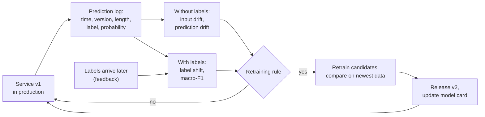
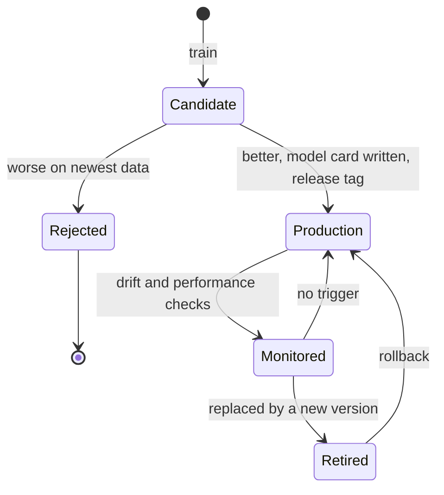

# Monitoring, retraining and the model card

A deployed model starts to age on its first day. The reviews it receives change, the products change, and the share of unhappy customers changes. This page explains how to notice such changes (data drift with the KS test and the population stability index, prediction drift, label shift), how to decide on retraining and keep versions apart, and how to document a model in a **model card**. The case study provides a real example: from 2021 to 2022 the share of negative reviews rose from 19 % to 26 %. The workbook `01-case-study-drift-and-retraining.ipynb` detects this shift, retrains and produces the final leaderboard submission.

Monitoring is a loop around the deployed model:



## Data drift: the KS test and the population stability index

### Concept

**Data drift** (also *covariate shift*) is a change in the distribution of the inputs P(x) between the **reference** data (training or validation data) and the **current** data (recent requests). For text, we monitor numeric summaries of the input: the length, the share of words the model has never seen (out-of-vocabulary rate), or metadata such as the share of verified purchases.

**Kolmogorov–Smirnov (KS) test.** For one numeric feature, the two-sample KS test compares the two **empirical distribution functions** (the share of values ≤ t, for every t). Its statistic D is the largest vertical distance between them, between 0 (identical) and 1 (no overlap). Worked example: reference [1, 2, 3, 4], current [3, 4, 5, 6]. At t = 2, 50 % of the reference and 0 % of the current values are ≤ t; no other point has a larger gap, so D = 0.5.

**Population stability index (PSI).** Divide the reference into bins (usually its deciles, so each bin holds 10 % of the reference), compute the share p of the reference and q of the current data in each bin, and sum

PSI = Σ (q − p) · ln(q / p).

Worked example with two bins: p = (0.5, 0.5), q = (0.6, 0.4). Then (0.1 · ln 1.2) + (−0.1 · ln 0.8) = 0.0182 + 0.0223 = 0.041. A common rule of thumb, from credit scoring: **below 0.1 stable, 0.1–0.25 moderate shift, above 0.25 large shift**.

### Why it matters

Labels usually arrive late or never, but inputs are available immediately. Input drift is the earliest warning that the model is being used on data unlike its training data. The two statistics complement each other: the KS test comes with a p-value, PSI with an interpretable scale and a breakdown per bin.

### How it works in Python

```python
import numpy as np
import pandas as pd
from scipy import stats

def text_of(df):
    return np.where(df["title"].fillna("") != "", df["title"].fillna("") + ". " + df["text"].fillna(""),
                    df["text"].fillna(""))

train = pd.read_parquet("case-study/data/train_sample.parquet")
test = pd.read_parquet("case-study/data/test.parquet")            # the 2022-2023 requests, without labels
ref = np.log1p(pd.Series(text_of(train)).str.len())
cur = np.log1p(pd.Series(text_of(test[test["date"].dt.year == 2022])).str.len())

print(stats.ks_2samp([1, 2, 3, 4], [3, 4, 5, 6]).statistic)       # 0.5, the worked example
ks = stats.ks_2samp(ref, cur)
print(round(ks.statistic, 3), f"{ks.pvalue:.0e}")                 # 0.106 4e-220

def psi(reference, current, bins=10, eps=1e-4):
    edges = np.unique(np.quantile(reference, np.linspace(0, 1, bins + 1))[1:-1])   # inner decile edges
    p = np.bincount(np.searchsorted(edges, reference, side="right"), minlength=len(edges) + 1) / len(reference)
    q = np.bincount(np.searchsorted(edges, current, side="right"), minlength=len(edges) + 1) / len(current)
    p, q = np.clip(p, eps, None), np.clip(q, eps, None)            # avoid ln(0) for empty bins
    return float(np.sum((q - p) * np.log(q / p)))

print(round(psi(ref, cur), 3))                                     # 0.146: a moderate shift
print(round(float(np.sum((np.array([0.6, 0.4]) - 0.5) * np.log(np.array([0.6, 0.4]) / 0.5))), 4))   # 0.0405
```

The same functions, tested, are in `workspace/src/sentiment_service/drift.py`.


The figure below breaks the PSI down by decile. Almost all of it comes from the first bin: very short reviews ("Good", "Great product") made up 10 % of the training data but only 2 % of the 2022 data. Part of this is an artefact of how the course data were prepared: test reviews whose exact text also appears in the training data were removed to prevent leakage, and short, generic texts are the ones most often repeated. Drift monitoring detects changes in the data *pipeline* as well as changes in the world, and both need an explanation.


### In practice

- Credit-scoring teams have used PSI for decades to check whether the applicant population still matches the development sample of a scorecard (Siddiqi 2006).
- During the COVID-19 pandemic, many demand-forecasting and fraud models failed because customer behaviour changed abruptly (Heaven, *MIT Technology Review*, 2020).
- Open-source tools such as Evidently and NannyML compute drift reports with KS tests and PSI for every feature of a deployed model; the workbook `02-evidently-data-drift-report.ipynb` shows Evidently's report.

> [!WARNING]
> With tens of thousands of requests, the KS test finds even irrelevant differences "significant" (here p ≈ 10⁻²²⁰ for a moderate shift). Judge the size of the shift (D, PSI) and its effect on the model, not the p-value.

> [!CAUTION]
> PSI depends on the binning. Compute the bin edges from the reference once, store them with the model (the workspace keeps them in `metadata.json`), and reuse them for every check; otherwise the numbers of different weeks are not comparable.

## Prediction drift and label shift

### Concept

Three kinds of shift, written with the input x and the label y:

| Shift | What changes | Measurable | Effect on the model |
|---|---|---|---|
| **data drift** (covariate shift) | P(x): the inputs | at once | may or may not hurt |
| **label shift** (prior shift) | P(y): the class shares | when labels arrive | changes the right decision thresholds and the class mix of errors |
| **concept drift** | P(y \| x): what an input means | when labels arrive | makes the model wrong |

**Prediction drift** is a change in the distribution of the model's *outputs*. It can be measured at once, without labels, and is often the first sign of label shift: if the model predicts more negative reviews, either there are more of them or the model reacts to something else.

In the case study: the true negative share rose from 19.2 % (training data, to 2021) to 26.5 % (2022). The model predicted 24.4 % negative on held-out reviews of the training period and 28.7 % on 2022. When the 2022 labels arrived, macro-F1 had changed only from 0.694 to 0.689, and the recall of each class was almost unchanged. The model followed a real change in the world: label shift, little concept drift.

### Why it matters

The type of shift determines the response. Label shift alone may call only for updated reporting or recalibrated thresholds; concept drift calls for retraining with new labels. A product manager also needs to know whether "more negative reviews" is a fact about the products or an error of the model.

### How it works in Python

Label shares and a chi-square test (the 2022 shares are the published values from `case-study/README.md`; the workbook computes them from the feedback labels):

```python
labels = ["neg", "neu", "pos"]
p = train["label"].value_counts(normalize=True).reindex(labels).to_numpy()   # 0.192 0.075 0.733
q = np.array([0.265, 0.079, 0.656])                                          # 2022, from the feedback data
print(p.round(3), q, "PSI of the shares:", round(float(np.sum((q - p) * np.log(q / p))), 3))   # 0.032

counts = np.array([p * 50_000, q * 40_784]).round()
print(f"chi-square p = {stats.chi2_contingency(counts).pvalue:.0e}")          # far below 0.05
```

Prediction drift, with model v1 trained on the sample (about 15 seconds):

```python
from sklearn.feature_extraction.text import TfidfVectorizer
from sklearn.linear_model import LogisticRegression
from sklearn.pipeline import make_pipeline

v1 = make_pipeline(TfidfVectorizer(ngram_range=(1, 2), sublinear_tf=True, min_df=2, max_features=200_000),
                   LogisticRegression(C=4, class_weight="balanced", max_iter=2000)).fit(text_of(train), train["label"])
pred = pd.Series(v1.predict(text_of(test)))
print(pred.groupby(test["date"].dt.year.to_numpy()).value_counts(normalize=True).unstack().round(3))
#       neg    neu    pos
# 2022  0.287  0.083  0.630
# 2023  0.268  0.085  0.647
```

With three classes, PSI of the shares is small (about 0.03) although the negative share rose by seven points: PSI was designed for about ten bins. Report the shares themselves.

### In practice

- Lipton, Wang and Smola (2018) showed how label shift can be detected and corrected with the confusion matrix of a black-box classifier.
- Clinical prediction models are recalibrated when disease prevalence changes between hospitals or over time, a form of label shift.
- Google Flu Trends overestimated influenza levels for several seasons after 2011 because the relation between search terms and illness had changed (Lazer et al., 2014): concept drift.

> [!NOTE]
> Monitoring summary statistics of the *logged* requests requires a log. The workspace's `PredictionLogger` writes one JSON line per request with time, model version, text length, label and highest probability, and deliberately not the text.

## Retraining triggers and versioning

### Concept

Drift alerts without a decision rule are noise. A **retraining trigger** is a written rule that says when a new model is trained, for example:

- **performance trigger**: macro-F1 on newly labelled data falls more than 0.03 below the validation score;
- **drift trigger**: the PSI of an important input exceeds 0.25;
- **schedule**: a new model whenever a new year (or month) of labels is available.

Retraining is not replacing. The procedure:

1. Train **candidates** (more data, a recent window, higher weight for recent data).
2. Compare them with the current model **on the newest labelled data**, which none of them saw in training (here: October–December 2022).
3. Release the winner as a new **version** with metadata and model card; keep the old version for a **rollback**.
4. Update the reference statistics for the next monitoring period.

The life cycle of model versions:



### Why it matters

A written rule (which metric, which threshold, who decides) turns monitoring into maintenance, and it is what the model card promises to users. The fair comparison prevents the most common mistake: replacing a model with one that looks better only because it was evaluated on data it was trained on.

### How it works in Python

```python
def retrain_needed(f1_recent, f1_reference, psi_input, tolerance=0.03, psi_threshold=0.25):
    """Retrain if performance on newly labelled data drops or an input shifts strongly."""
    reasons = []
    if f1_recent is not None and f1_recent < f1_reference - tolerance:
        reasons.append(f"macro-F1 {f1_recent:.3f} < {f1_reference:.3f} - {tolerance}")
    if psi_input > psi_threshold:
        reasons.append(f"input PSI {psi_input:.3f} > {psi_threshold}")
    return bool(reasons), reasons

print(retrain_needed(f1_recent=0.689, f1_reference=0.694, psi_input=0.146))   # (False, [])
print(retrain_needed(f1_recent=0.640, f1_reference=0.694, psi_input=0.146))   # (True, ['macro-F1 0.640 < ...'])
```

The candidates of the workbook, trained without and evaluated on October–December 2022 (macro-F1):

| Model | Training data | macro-F1 |
|---|---|---|
| v1 | up to 2021 | 0.691 |
| v2a | up to 2021 + Jan–Sep 2022 feedback | 0.696 |
| v2b | 2019–2021 + Jan–Sep 2022 feedback | 0.697 |
| v2c | as v2a, 2022 reviews weighted 3× | 0.691 |

The gain of the best candidate over v1 is 0.006, with a bootstrap 95 % interval from −0.008 to 0.019: retraining does not hurt, but the evidence for an improvement is weak. That is a common, honest result after a label shift that the model already handles well.

### In practice

- Spam and fraud filters are retrained regularly because adversaries adapt to the model.
- Recommender systems at large platforms are retrained daily or continuously because the catalogue and user preferences change constantly.
- Zillow closed its home-buying business Zillow Offers in 2021 after its price forecasts failed to keep up with a fast-changing housing market, with losses of several hundred million US dollars.

> [!IMPORTANT]
> Decide the rule *before* you look at the new data, and write it into the model card. A rule invented after seeing the numbers can justify any decision.

## Documenting a model in a model card

### Concept

A **model card** (Mitchell et al., 2019) is a short document that accompanies a trained model, written for the people who use, maintain or audit it. Its sections:

1. **Model details**: name, version, date, type, software, licence, developers.
2. **Intended use**: primary uses and users; **out-of-scope** uses.
3. **Factors**: groups or conditions across which performance may differ (review length, verified purchase, category, year).
4. **Metrics**: which measures and why (macro-F1), decision threshold, uncertainty.
5. **Evaluation data** and 6. **training data**: what, from when, how labelled.
7. **Quantitative analyses**: results overall *and per factor*.
8. **Ethical considerations**: personal data, misuse, groups that may be harmed.
9. **Caveats and recommendations**: known limits, monitoring and retraining plan.

The workspace contains a template, `workspace/MODEL_CARD.md`, pre-filled with the case-study values of version 1.0.0.

### Why it matters

Documentation travels with the model when its developers have moved on. A card with intended and out-of-scope uses prevents the most likely misuse (here: judging individual customers by a review classifier), and per-factor results show where the model is weak before users find out.

### How it works in Python

Generate the quantitative part of the card from the metadata, so that card and model cannot disagree:

```python
meta = {"model_version": "1.0.0", "scikit_learn": "1.9.1",
        "validation": {"scheme": "time-based, newest 20 % up to 2021", "macro_f1": 0.694, "f1_neg": 0.805,
                       "f1_neu": 0.345, "f1_pos": 0.932, "accuracy": 0.857},
        "reference": {"label_shares": {"neg": 0.192, "neu": 0.075, "pos": 0.733}}}
v = meta["validation"]
card = f"""## Quantitative analyses (model {meta['model_version']}, scikit-learn {meta['scikit_learn']})

| Data | Macro-F1 | F1 neg | F1 neu | F1 pos | Accuracy |
|---|---|---|---|---|---|
| {v['scheme']} | {v['macro_f1']:.3f} | {v['f1_neg']:.3f} | {v['f1_neu']:.3f} | {v['f1_pos']:.3f} | {v['accuracy']:.3f} |
"""
print(card)
```

### In practice

- Hugging Face shows a model card for every model on its Hub, with a standard metadata header; models without one are flagged.
- Google, Meta and other companies publish model cards or system cards for their released models.
- Public-sector algorithm registers, for example those of Amsterdam and Helsinki, describe each system's purpose, data and oversight in a similar structured format.

> [!TIP]
> Write the card while you build the model, not after the release. Sections you cannot fill (for example per-factor results) show what is still missing in the evaluation.

## Check your understanding

1. Reference shares p = (0.25, 0.25, 0.25, 0.25), current q = (0.40, 0.20, 0.20, 0.20). Compute the PSI. Is the shift stable, moderate or large?
2. The KS test of text length gives D = 0.02 and p = 0.001 on 50,000 requests. What do you report to the product team?
3. The predicted negative share rises from 24 % to 29 %. Name two different explanations and how you would tell them apart once labels arrive.
4. Why must the retraining candidates be compared on data that none of them saw in training?
5. Which section of the model card tells a reader that the sentiment model must not be used to judge individual customers?

## Further reading

- Mitchell, M., Wu, S., Zaldivar, A., Barnes, P., Vasserman, L., Hutchinson, B., Spitzer, E., Raji, I. D. and Gebru, T. (2019). Model Cards for Model Reporting. *Proceedings of FAT\* 2019*, 220–229. [arXiv:1810.03993](https://arxiv.org/abs/1810.03993)
- Lipton, Z. C., Wang, Y.-X. and Smola, A. (2018). Detecting and Correcting for Label Shift with Black Box Predictors. *ICML 2018*. [arXiv:1802.03916](https://arxiv.org/abs/1802.03916)
- Kästner, C. *Machine Learning in Production: From Models to Products*. Open textbook, Carnegie Mellon University. [mlip-cmu.github.io/book](https://mlip-cmu.github.io/book/)
- Evidently AI. *Data drift: metrics and presets* (Apache-2.0). [docs.evidentlyai.com](https://docs.evidentlyai.com/)
