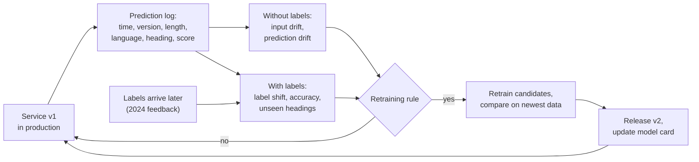
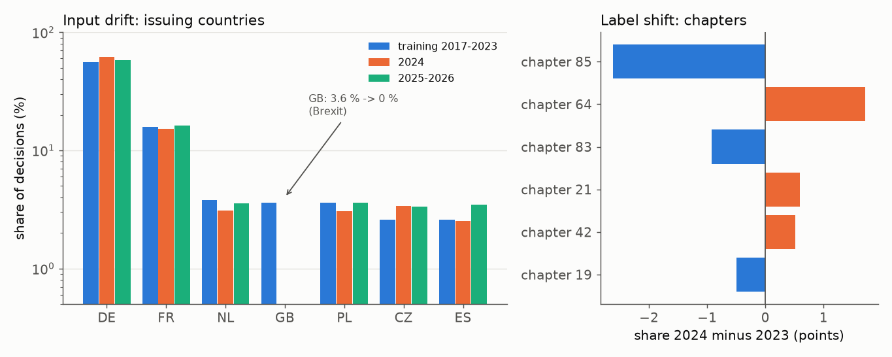
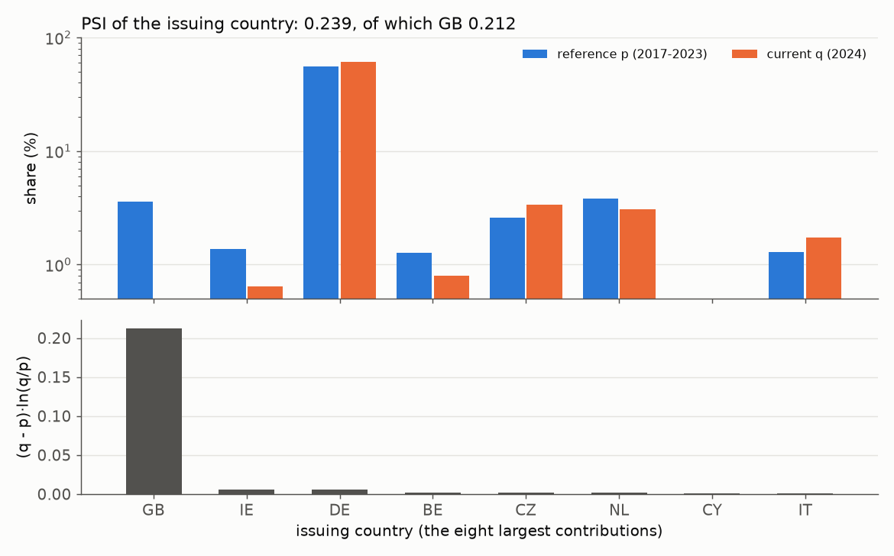
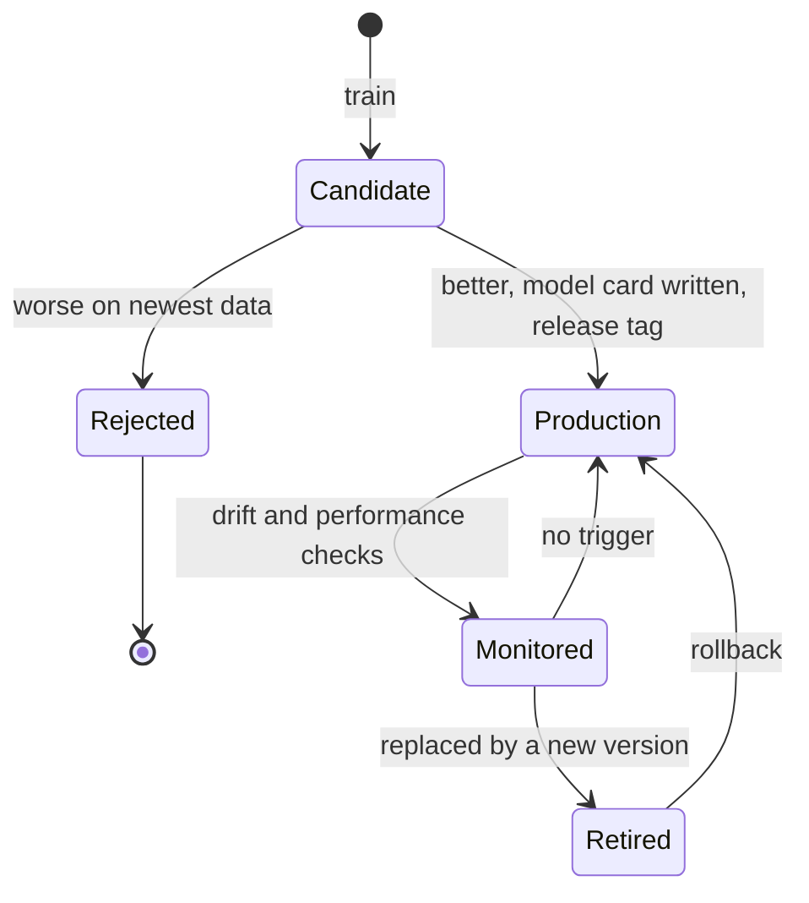

# Monitoring, retraining and the model card

A deployed model starts to age on its first day. The requests it receives change, the goods change, the member states that send requests change, and the nomenclature itself is revised every five years. This page explains how to notice such changes (data drift with the KS test and the population stability index, prediction drift, label shift), how to decide on retraining and keep versions apart, and how to document a model in a **model card**. The case study provides real examples: after Brexit the United Kingdom issues no more decisions, and between 2023 and 2024 the share of chapter 85 (electrical machinery) falls from 14.3 % to 11.7 %. The workbook `01-case-study-drift-and-retraining.ipynb` detects these shifts with the released 2024 labels, compares retraining candidates and produces the final leaderboard submission (L3).

Monitoring is a loop around the deployed model:



## Data drift: the KS test and the population stability index

### Concept

**Data drift** (also *covariate shift*) is a change in the distribution of the inputs P(x) between the **reference** data (training or validation data) and the **current** data (recent requests). For text, we monitor numeric and categorical summaries of the input: the length of the description, the share of words the model has never seen (out-of-vocabulary rate), and metadata such as the language and the issuing country.

**Kolmogorov–Smirnov (KS) test.** For one numeric feature, the two-sample KS test compares the two **empirical distribution functions** (the share of values ≤ t, for every t). Its statistic D is the largest vertical distance between them, between 0 (identical) and 1 (no overlap). Worked example: reference [1, 2, 3, 4], current [3, 4, 5, 6]. At t = 2, 50 % of the reference and 0 % of the current values are ≤ t; no other point has a larger gap, so D = 0.5.

**Population stability index (PSI).** Divide the reference into bins (for a numeric feature usually its deciles, so each bin holds 10 % of the reference; for a categorical feature one bin per category), compute the share p of the reference and q of the current data in each bin, and sum

PSI = Σ (q − p) · ln(q / p).

Worked example with two bins: p = (0.5, 0.5), q = (0.6, 0.4). Then (0.1 · ln 1.2) + (−0.1 · ln 0.8) = 0.0182 + 0.0223 = 0.041. A common rule of thumb, from credit scoring: **below 0.1 stable, 0.1–0.25 moderate shift, above 0.25 large shift**. A category that disappears (q = 0) makes ln(q/p) infinite; in practice shares are clipped at a small value such as 0.0001, so a vanished category contributes a large but finite amount.

### Why it matters

Labels arrive late (a year later in the case study) or never, but inputs are available immediately. Input drift is the earliest warning that the model is being used on data unlike its training data. The two statistics complement each other: the KS test comes with a p-value, PSI with an interpretable scale and a breakdown per bin.

### How it works in Python

```python
import numpy as np
import pandas as pd
from scipy import stats

train = pd.read_parquet("case-study/data/train_sample.parquet")
test = pd.read_parquet("case-study/data/test.parquet")            # 2024-2026 requests, without labels
t2024 = test[test["start_date"].dt.year == 2024]
ref = np.log1p(train["description"].str.len())
cur = np.log1p(t2024["description"].str.len())

print(stats.ks_2samp([1, 2, 3, 4], [3, 4, 5, 6]).statistic)       # 0.5, the worked example
ks = stats.ks_2samp(ref, cur)
print(round(ks.statistic, 3), f"{ks.pvalue:.0e}")                 # 0.071 3e-97


def psi(reference, current, bins=10, eps=1e-4):
    edges = np.unique(np.quantile(reference, np.linspace(0, 1, bins + 1))[1:-1])   # inner decile edges
    p = np.bincount(np.searchsorted(edges, reference, side="right"), minlength=len(edges) + 1) / len(reference)
    q = np.bincount(np.searchsorted(edges, current, side="right"), minlength=len(edges) + 1) / len(current)
    p, q = np.clip(p, eps, None), np.clip(q, eps, None)            # avoid ln(0) for empty bins
    return float(np.sum((q - p) * np.log(q / p)))


def psi_shares(p, q, eps=1e-4):                                   # categorical: {category: share}
    cats = sorted(set(p) | set(q))
    p = np.clip([p.get(c, 0) for c in cats], eps, None)
    q = np.clip([q.get(c, 0) for c in cats], eps, None)
    return float(np.sum((q - p) * np.log(q / p)))


print(round(psi(ref, cur), 3))                                     # 0.035: description length is stable
p_country = train["issuing_country"].value_counts(normalize=True).to_dict()
q_country = t2024["issuing_country"].value_counts(normalize=True).to_dict()
print(round(psi_shares(p_country, q_country), 3), round(p_country["GB"], 3), q_country.get("GB", 0))
# 0.239 0.036 0: a moderate shift, almost all of it from the United Kingdom
p_lang = train["language"].value_counts(normalize=True).to_dict()
q_lang = t2024["language"].value_counts(normalize=True).to_dict()
print(round(psi_shares(p_lang, q_lang), 3), round(p_lang["en"], 3), round(q_lang["en"], 3))
# 0.095 0.052 0.009: English descriptions fall from 5 % to 1 %
```

The same functions, tested, are in `workspace/src/tariff_service/drift.py`.



The figure below breaks the country PSI down by category. Of the total of 0.239, 0.212 comes from one country: the United Kingdom issued 3.6 % of the training decisions (until 2020) and none since the end of the Brexit transition period. Since GB decisions were all written in English, the language PSI moves as well. This is a change in the world, not in the data pipeline, and it was already visible in 2021–2023 inside the training data: a monitoring system that compares with all training years flags it every month, one that compares with the most recent year does not.



### In practice

- Credit-scoring teams have used PSI for decades to check whether the applicant population still matches the development sample of a scorecard (Siddiqi 2006).
- During the COVID-19 pandemic, many demand-forecasting and fraud models failed because customer behaviour changed abruptly (Heaven, *MIT Technology Review*, 2020).
- Open-source tools such as Evidently and NannyML compute drift reports with KS tests and PSI for every feature of a deployed model; the workbook `02-evidently-data-drift-report.ipynb` shows Evidently's report.

> [!WARNING]
> With tens of thousands of requests, the KS test finds even irrelevant differences "significant" (here p ≈ 10⁻⁹⁷ for a PSI of 0.035, a stable distribution by the rule of thumb). Judge the size of the shift (D, PSI) and its effect on the model, not the p-value.

> [!CAUTION]
> PSI depends on the binning and on the reference period. Compute the bin edges and reference shares once, store them with the model (the workspace keeps them in `metadata.json`), and reuse them for every check; otherwise the numbers of different months are not comparable.

## Prediction drift and label shift

### Concept

Three kinds of shift, written with the input x and the label y:

| Shift | What changes | Measurable | Effect on the model |
|---|---|---|---|
| **data drift** (covariate shift) | P(x): the inputs | at once | may or may not hurt |
| **label shift** (prior shift) | P(y): the heading or chapter shares | when labels arrive | changes the mix of errors |
| **concept drift** | P(y \| x): what an input means | when labels arrive | makes the model wrong |

**Concept drift** has a concrete form in tariff classification: the **nomenclature revision**. With HS 2022, some headings were created (for example 8524, flat panel display modules; 2404, nicotine products), others split or deleted (65 headings that occur before 2022 do not occur afterwards in the case-study data; some were deleted, others are simply rare). The same description of goods then belongs to a different heading. A model trained on older decisions cannot predict a heading it has never seen; the share of such **unseen headings** among new labels measures this directly.

**Prediction drift** is a change in the distribution of the model's *outputs*. It can be measured at once, without labels, and is often the first sign of label shift.

In the case study: the model v1 (trained on the sample, 2017–2023) predicts chapter 85 for 14.7 % of the training decisions and for 12.0 % of the 2024 requests; when the 2024 labels arrive, the true share is 11.7 % (14.3 % in 2023). The model follows a real change in the mix of goods. Only 0.4 % of the 2024 decisions have a heading that v1 never saw, and its accuracy on 2024 (0.80) is not lower but higher than its time-based validation accuracy (0.77–0.78): label shift and data drift without a loss of quality.

### Why it matters

The type of shift determines the response. Label shift alone may call only for updated reporting; concept drift (a new nomenclature) calls for retraining with new labels, and possibly for mapping old labels to new ones. A customs office also needs to know whether "fewer electrical goods" is a fact about trade or an error of the model.

### How it works in Python

Prediction drift, with model v1 trained on the sample (about 10 seconds):

```python
from sklearn.feature_extraction.text import TfidfVectorizer
from sklearn.linear_model import SGDClassifier
from sklearn.pipeline import make_pipeline

v1 = make_pipeline(TfidfVectorizer(sublinear_tf=True, min_df=2),
                   SGDClassifier(loss="hinge", alpha=1e-5, max_iter=20, tol=None, random_state=0, n_jobs=-1))
v1.fit(train["description"], train["heading"])
pred_chapter = pd.Series(v1.predict(test["description"])).str[:2]
period = np.where(test["start_date"].dt.year == 2024, "2024", "2025-26")
p_chapter = train["chapter"].value_counts(normalize=True).to_dict()
print(round(p_chapter["85"], 3))                                    # 0.147 in training
for name in ["2024", "2025-26"]:
    q = pred_chapter[period == name].value_counts(normalize=True).to_dict()
    print(name, round(psi_shares(p_chapter, q), 3), round(q["85"], 3))
# 2024 0.063 0.12
# 2025-26 0.058 0.128
```

Label shift, once the 2024 labels are released (the lecturer shares `feedback_2024.csv` in this session):

```python
# requires the feedback file of this session: case-study/data/feedback_2024.csv (columns id, heading)
feedback = pd.read_csv("case-study/data/feedback_2024.csv", dtype=str)
fb = t2024.merge(feedback, on="id")
y2023 = train[train["start_date"].dt.year == 2023]
p23 = y2023["chapter"].value_counts(normalize=True).to_dict()
q24 = fb["heading"].str[:2].value_counts(normalize=True).to_dict()
print(round(psi_shares(p23, q24), 3), round(p23["85"], 3), round(q24["85"], 3))   # 0.052 0.143 0.117
print(round(psi_shares(y2023["heading"].value_counts(normalize=True).to_dict(),
                       fb["heading"].value_counts(normalize=True).to_dict()), 3))     # 0.229 over headings
print(round((~fb["heading"].isin(v1.classes_)).mean(), 4))          # 0.0041: headings v1 never saw
print(round(float((v1.predict(fb["description"]) == fb["heading"]).mean()), 3))   # 0.803 accuracy on 2024
```

PSI over 1,000 headings (0.229) is much larger than over 97 chapters (0.052), because rare headings fluctuate by chance from year to year. Compare drift statistics only at the same level of aggregation, and prefer the level at which decisions are taken.

### In practice

- Lipton, Wang and Smola (2018) showed how label shift can be detected and corrected with the confusion matrix of a black-box classifier.
- Clinical prediction models are recalibrated when disease prevalence changes between hospitals or over time, a form of label shift.
- The World Customs Organization publishes correlation tables between HS editions (2017 to 2022) so that statistics and models can map old codes to new ones; a nomenclature revision is planned concept drift.

> [!NOTE]
> Monitoring summary statistics of the *logged* requests requires a log. The workspace's `PredictionLogger` writes one JSON line per request with time, model version, description length, language, top heading and score, and deliberately not the description, which is confidential before a decision.

## Retraining triggers and versioning

### Concept

Drift alerts without a decision rule are noise. A **retraining trigger** is a written rule that says when a new model is trained, for example:

- **performance trigger**: accuracy on newly labelled data falls more than 0.03 below the validation score;
- **drift trigger**: the PSI of an important input exceeds 0.25;
- **schedule**: a new model whenever a new year of labels is available, and after every nomenclature revision.

Retraining is not replacing. The procedure:

1. Train **candidates** (more data, a recent window, higher weight for recent data).
2. Compare them with the current model **on the newest labelled data**, which none of them saw in training (here: October–December 2024).
3. Release the winner as a new **version** with metadata and model card; keep the old version for a **rollback**.
4. Update the reference statistics for the next monitoring period.

The life cycle of model versions:



### Why it matters

A written rule (which metric, which threshold, who decides) turns monitoring into maintenance, and it is what the model card promises to users. The fair comparison prevents the most common mistake: replacing a model with one that looks better only because it was evaluated on data it was trained on. The case study adds a second lesson: a performance trigger that waits for a drop can miss an improvement.

### How it works in Python

```python
def retrain_needed(acc_recent, acc_reference, psi_input, tolerance=0.03, psi_threshold=0.25):
    """Retrain if performance on newly labelled data drops or an input shifts strongly."""
    reasons = []
    if acc_recent is not None and acc_recent < acc_reference - tolerance:
        reasons.append(f"accuracy {acc_recent:.3f} < {acc_reference:.3f} - {tolerance}")
    if psi_input > psi_threshold:
        reasons.append(f"input PSI {psi_input:.3f} > {psi_threshold}")
    return bool(reasons), reasons


print(retrain_needed(acc_recent=0.803, acc_reference=0.778, psi_input=0.239))   # (False, [])
print(retrain_needed(acc_recent=0.700, acc_reference=0.778, psi_input=0.239))   # (True, ['accuracy 0.700 < ...'])
```

The candidates of the workbook, trained without and evaluated on October–December 2024 (word TF-IDF + linear SVM on the 50,000-decision sample):

| Candidate | Training data | Accuracy Oct–Dec 2024 | Macro-F1 Oct–Dec 2024 |
|---|---|---|---|
| A: v1 | 2017–2023 | 0.793 | 0.541 |
| B | 2017–2023 + Jan–Sep 2024 feedback | **0.819** | **0.595** |
| C | 2020–2023 + Jan–Sep 2024 feedback (older years forgotten) | 0.808 | 0.576 |

Candidate B gains 2.6 points of accuracy over v1, about six standard errors on 10,000 validation decisions. The written rule did not fire, yet retraining clearly helps: the newest labels are the most informative ones, and the old years still add information (C, which drops 2017–2019, is worse than B). Released as v2 (trained on all of 2017–2024), the model reaches 0.807 private accuracy on 2025–2026 against 0.776 for v1; on the full training set the same step gives 0.857 against 0.847.

### In practice

- Spam and fraud filters are retrained regularly because adversaries adapt to the model.
- Recommender systems at large platforms are retrained daily or continuously because the catalogue and user preferences change constantly.
- Zillow closed its home-buying business Zillow Offers in 2021 after its price forecasts failed to keep up with a fast-changing housing market, with losses of several hundred million US dollars.

> [!IMPORTANT]
> Decide the rule *before* you look at the new data, and write it into the model card. A rule invented after seeing the numbers can justify any decision. A scheduled retraining when a new year of labels arrives is a sound default for the case study.

## Documenting a model in a model card

### Concept

A **model card** (Mitchell et al., 2019) is a short document that accompanies a trained model, written for the people who use, maintain or audit it. Its sections:

1. **Model details**: name, version, date, type, software, licence, developers.
2. **Intended use**: primary uses and users; **out-of-scope** uses.
3. **Factors**: groups or conditions across which performance may differ (language, issuing country, description length, quoted codes, frequency of the heading, year).
4. **Metrics**: which measures and why (accuracy, macro-F1, top-3 accuracy), decision rule, uncertainty.
5. **Evaluation data** and 6. **training data**: what, from when, how labelled.
7. **Quantitative analyses**: results overall *and per factor*.
8. **Ethical and legal considerations**: confidential data, consequences of errors, who decides.
9. **Caveats and recommendations**: known limits, monitoring and retraining plan.

The workspace contains a template, `workspace/MODEL_CARD.md`, pre-filled with the case-study values of version 1.0.0.

### Why it matters

Documentation travels with the model when its developers have moved on. A card with intended and out-of-scope uses prevents the most likely misuse (here: treating a suggestion as a binding classification), and per-factor results show where the model is weak before users find out. In the case study, the per-factor view is striking: on the 2024 decisions v1 is right for 96 % of the German descriptions but for only 37–64 % of the descriptions in Czech, Dutch, Polish or French. Two facts explain most of it: German makes up 57 % of the training data, and 44 % of the German 2024 descriptions quote their own heading number, against almost none in the other languages (Session 13). The overall accuracy of 0.80 hides this completely.

### How it works in Python

Generate the quantitative part of the card from the metadata, so that card and model cannot disagree:

```python
meta = {"model_version": "1.0.0", "scikit_learn": "1.9.1",
        "validation": {"scheme": "time-based, newest 20 % (2022-2023)", "accuracy": 0.779,
                       "macro_f1": 0.519, "top3_accuracy": 0.848, "chapter_accuracy": 0.844}}
v = meta["validation"]
card = f"""## Quantitative analyses (model {meta['model_version']}, scikit-learn {meta['scikit_learn']})

| Data | Accuracy | Macro-F1 | Top-3 accuracy | Chapter accuracy |
|---|---|---|---|---|
| {v['scheme']} | {v['accuracy']:.3f} | {v['macro_f1']:.3f} | {v['top3_accuracy']:.3f} | {v['chapter_accuracy']:.3f} |
"""
print(card)
```

### In practice

- Hugging Face shows a model card for every model on its Hub, with a standard metadata header; models without one are flagged.
- Google, Meta and other companies publish model cards or system cards for their released models.
- Public-sector algorithm registers, for example those of Amsterdam and Helsinki, describe each system's purpose, data and oversight in a similar structured format.

> [!TIP]
> Write the card while you build the model, not after the release. Sections you cannot fill (for example per-language results) show what is still missing in the evaluation.

## Check your understanding

1. Reference shares p = (0.25, 0.25, 0.25, 0.25), current q = (0.40, 0.20, 0.20, 0.20). Compute the PSI. Is the shift stable, moderate or large?
2. The KS test of description length gives D = 0.07 and p = 10⁻⁹⁷ on 40,000 requests. What do you report to the head of the classification unit?
3. The predicted share of chapter 85 falls from 14.7 % to 12.0 %. Name two different explanations and how you would tell them apart once labels arrive.
4. Why must the retraining candidates be compared on data that none of them saw in training? Why did the written rule not fire although candidate B is better?
5. Which section of the model card tells a reader that the service must not issue BTI decisions, and which section shows that it works much better for German than for Czech descriptions?

## Further reading

- Mitchell, M., Wu, S., Zaldivar, A., Barnes, P., Vasserman, L., Hutchinson, B., Spitzer, E., Raji, I. D. and Gebru, T. (2019). Model Cards for Model Reporting. *Proceedings of FAT\* 2019*, 220–229. [arXiv:1810.03993](https://arxiv.org/abs/1810.03993)
- Lipton, Z. C., Wang, Y.-X. and Smola, A. (2018). Detecting and Correcting for Label Shift with Black Box Predictors. *ICML 2018*. [arXiv:1802.03916](https://arxiv.org/abs/1802.03916)
- Kästner, C. *Machine Learning in Production: From Models to Products*. Open textbook, Carnegie Mellon University. [mlip-cmu.github.io/book](https://mlip-cmu.github.io/book/)
- European Commission. *Harmonized System* (HS revisions and the EU Combined Nomenclature). [taxation-customs.ec.europa.eu](https://taxation-customs.ec.europa.eu/customs/common-customs-tariff-cct/tariff-classification-goods/harmonized-system_en)
