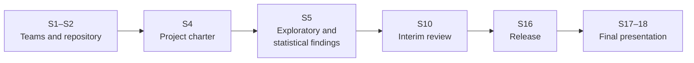

# Final project

Teams of three (one team of four) work on one project for the whole semester and present it in Sessions 17 and 18. The project is the only graded part of the module (100 %). Weekly exercises and the leaderboard are not graded; they prepare you for the project.

> [!IMPORTANT]
> Every member presents a part of the project and answers individual questions. Make sure each of you has written, reviewed and can explain a substantial part of the code.

## Choose an emphasis

All projects share the same base. In the project charter (Session 4) your team chooses an **analytics** or a **machine learning** emphasis, which decides what you build on that base.

|  | Analytics emphasis | Machine learning emphasis |
|---|---|---|
| Shared base | Problem definition with a stakeholder; public data loaded and cleaned by a reproducible script; documented data quality; Git repository with reviewed pull requests and CI; presentation | Same |
| Core of the project | Answers a decision question: SQL analysis, exploratory findings, statistical tests or an A/B-test design with uncertainty | Predicts an outcome: baseline, validated model, error analysis |
| Delivery | Dashboard or automated report for the stakeholder | Deployed model service with a monitoring plan and a model card |
| Typical roles | Data or business analyst | Data scientist, ML engineer |

## Milestones

| Session | What is due | Feedback |
|---|---|---|
| S1 | Teams formed; shortlist of three topics | Lecturer, in class |
| S2 | Team repository from the template, with branch protection and CI | Lecturer, in the repository |
| S3 | Data sources identified; a first extract loaded into the team database | — |
| S4 | **Project charter**: question, stakeholder, emphasis, metric, baseline, data loaded | Written feedback within one week |
| S5 | Exploratory and statistical findings, presented in a short team review | In class |
| S6–S9 | Machine learning teams: first model, validation plan, features. Analytics teams: statistical analysis and the uncertainty of key results | On request |
| S10 | **Interim review** (10 minutes per team): model or dashboard, validation, plan to the end | In class, not graded |
| S11–S15 | Segmentation, forecasting, text or language-model components where the project needs them, each evaluated against a baseline | On request |
| S16 | **Release**: dashboard or deployed model; repository and documentation complete | — |
| S17–S18 | **Final presentation** (graded) | Grade and written feedback |

## Project charter (Session 4)

One page in the team repository (`docs/charter.md`):

1. **Question**: one sentence; the decision it supports.
2. **Stakeholder**: who would use the answer, and how.
3. **Emphasis**: analytics or machine learning, with a reason.
4. **Data**: sources with links, licence and size; evidence that the data are loaded (a script that reads each source and prints its shape).
5. **Metric and baseline**: how you will judge success, and the simplest result you must beat.
6. **Risks**: data quality, legal or ethical issues, and what you will do if a source fails.

## Presentation and assessment

Freeze your repository with a release tag the day before Session 17; the assessment uses that version. Each team presents for 15 minutes, including a live demonstration, followed by 10 minutes of questions with individual questions to each member. The assessment covers the presentation and the submitted repository. The first five criteria (80 %) are assessed per team; *collaboration and presentation* (20 %) is assessed per member, from your presented part, your answers to individual questions and your pull requests.

| Criterion | Weight | Evidence | Expected for a very good grade |
|---|---|---|---|
| Problem definition | 10 % | Charter, presentation | A clear question and stakeholder; the metric and the baseline are justified by the decision the result supports |
| Data | 20 % | Repository | Sources documented with origin and licence; loading and cleaning reproducible by a script that anyone can rerun from the raw data; quality checked, with every cleaning decision recorded |
| Analysis or model | 25 % | Repository, presentation | Analytics: sound exploration and correct, well-chosen statistical methods. Machine learning: suitable models compared fairly with the baseline |
| Uncertainty and validation | 15 % | Repository, questions | Analytics: confidence intervals, effect sizes and limitations. Machine learning: validation without leakage, error analysis and a held-out test |
| Delivery | 10 % | Live demonstration | Analytics: a dashboard or automated report the stakeholder can use. Machine learning: a deployed service with a monitoring plan and a model card |
| Collaboration and presentation (per member) | 20 % | Pull requests, presentation, questions | Own reviewed pull requests with passing CI; a clear presented part; correct and confident answers to individual questions |

Use of AI tools is permitted and must be documented with the HTW declaration. You must be able to explain and test all code you submit.

## Topics

Choose a topic from the list or propose your own of comparable scope. Most topics work with either emphasis. In the descriptions, the lines *Statistics* and *Delivery* apply to both emphases; the line *Models* is required for the machine learning emphasis and optional for the analytics emphasis.

| Topic | Domain | Methods | Level |
|---|---|---|---|
| Short-term rentals in Berlin under EU Regulation 2024/1028 | Housing | NLP, Time series, Spatial | Standard |
| A rent checker based on the Berlin Mietspiegel 2026 | Housing | Spatial | Standard |
| Screening for displacement pressure in Berlin planning areas | Housing | Spatial | Advanced |
| Residential construction in Berlin: from building permits to completions | Housing | Time series | Standard |
| A searchable database of answers to written questions in the Berlin parliament | Housing | NLP | Advanced |
| Language requirements in Berlin job advertisements | Migration | NLP, Time series | Standard |
| Availability of Berlin's public-service information in English | Migration | NLP | Standard |
| A validated database of BAMF asylum statistics | Migration | Time series | Standard |
| Integration courses in Berlin after the 2026 budget cuts | Migration | Time series, Spatial | Advanced |
| Heat and health in Berlin: effects and short-term forecasts | Health | Time series | Standard |
| Ambulance response times and social disadvantage in Berlin | Health | Time series, Spatial | Standard |
| Wastewater surveillance as an early indicator of respiratory infection waves | Health | Time series | Standard |
| Reconstructing the history of drug shortages in Germany | Health | NLP, Time series | Advanced |
| Heat vulnerability and access to cool rooms in Berlin | Environment | Spatial | Standard |
| Volunteer watering and street-tree survival in Berlin | Environment | Spatial, Time series | Standard |
| Air quality after the partial withdrawal of Tempo 30 zones in Berlin | Environment | Time series | Advanced |
| Progress towards Berlin's heat-planning and solar targets by district | Environment | Time series, Spatial | Standard |
| Student-proposed topic (including company or NGO partners) | Open | NLP, Time series, Spatial | Standard |

Housing: 5 topics in detail

### Short-term rentals in Berlin under EU Regulation 2024/1028

The project analyses short-term rental listings in Berlin at area level in order to support enforcement without identifying individuals. Core scope: validate the registration numbers in the listings, identify hosts who operate several listings commercially, and estimate how many dwellings are withdrawn from the long-term rental market per area. The comparison before and after May 2026 is part of the extension.

- **Stakeholder:** District offices responsible for the Zweckentfremdung (housing-misuse) law, SenSBW (Senate Department for Urban Development), housing journalists
- **Background:** EU Regulation 2024/1028 has applied since 20 May 2026, and Berlin has amended its Zweckentfremdung (housing-misuse) law. In the June 2026 snapshot, 31 % of Berlin listings show no registration number. ([source](https://www.berlin.de/rbmskzl/aktuelles/pressemitteilungen/2026/pressemitteilung.1658086.php))
- **Data:** [Inside Airbnb Berlin (quarterly snapshots)](https://insideairbnb.com/get-the-data/); [Written parliamentary question on enforcement, Drs. 19/24602](https://pardok.parlament-berlin.de/starweb/adis/citat/VT/19/SchrAnfr/S19-24602.pdf); [Berlin GDI WFS (LOR 2021, Milieuschutz areas)](https://gdi.berlin.de/services/wfs/lor_2021)
- **Data quality:** Registration numbers are free text in several formats. Occupancy is a model estimate by Inside Airbnb, not an observed value. Older snapshots must be requested from Inside Airbnb. Host information is personal data.
- **Statistics:** Robust estimates of withdrawn housing with bootstrap confidence intervals
- **Models:** Rule-based (regular expression) validation of registration numbers, with an optional LLM comparison; a classifier that identifies commercial operators from listing text, evaluated on a hand-labelled reference set
- **Delivery:** District-level dashboard and API; a drift report for each new snapshot
- **Extension:** Before/after comparison around 20 May 2026 (difference-in-differences across districts); text analysis of guest reviews; linkage with the Zensus 100 m rent grids to estimate the local rent pressure of withdrawn units
- **Ethics:** Price prediction alone is not a sufficient project goal. Results are reported in aggregate by area and no individual hosts are named. The Inside Airbnb data are themselves obtained by web scraping, which must be discussed.

### A rent checker based on the Berlin Mietspiegel 2026

The project develops a rent checker that takes an address and the characteristics of a flat and returns the local reference rent and the legal maximum rent, with an explanation of how both were derived. It then estimates, with uncertainty, how often advertised rents exceed this maximum.

- **Stakeholder:** Berliner Mieterverein (tenants' association), the Senate's Mietpreisprüfstelle (rent-review office), tenants
- **Background:** The tenants' association found that 46 % of 25,000 Berlin listings exceeded the rent cap (Mietpreisbremse), and more than a third reached the threshold for excessive rent (Mietwucher). The new Mietspiegel (rent index) has applied since May 2026. ([source](https://mieterbund.de/app/uploads/2025/12/FactSheet_DMB_Mietenmonitor_2025.pdf))
- **Data:** [Mietspiegel 2026 (PDF tables + orientation guide)](https://mietspiegel.berlin.de/wp-content/uploads/2026/05/mietspiegel2026.pdf); [Residential-location class per address (Wohnlage, WFS wohnlagenadr2026, 400k addresses)](https://gdi.berlin.de/services/wfs/wohnlagenadr2026); [Zensus 2022 100 m grid: average net rent](https://www.destatis.de/static/DE/zensus/gitterdaten/Zensus2022_Durchschn_Nettokaltmiete.zip); [RWI-GEO-RED listing data (FDZ Ruhr, free Campus Files)](https://www.rwi-essen.de/en/research-advice/further/research-data-center-ruhr-fdz/data-sets/rwi-geo-red/x-real-estate-data-and-price-indices)
- **Data quality:** The Mietspiegel tables are published as a PDF and must be converted into rules, including the surcharges and deductions for individual features. Addresses must be matched to the residential-location layer. Zensus cells are perturbed for confidentiality and use EPSG:3035. The Campus Files contain only coarse locations.
- **Statistics:** Quantile and Huber regression of rents; bootstrap confidence intervals for the share of listings above the legal maximum; a stratified validation sample
- **Models:** Rule engine validated against the Senate's official online calculator (100–200 addresses); optional LLM extraction of flat characteristics from listing text
- **Delivery:** FastAPI endpoint /rent-check and a map application
- **Extension:** Time series of residential-location (Wohnlage) reclassifications from 2003 to 2026 as an indicator of gentrification
- **Ethics:** The application provides information, not legal advice. ImmoScout24 and WG-Gesucht are not scraped, as this would violate their terms of service. Listings entered by users are stored only with their consent, as required by the GDPR.

### Screening for displacement pressure in Berlin planning areas

The project builds a composite index that ranks LOR planning areas by displacement pressure using open small-area data. Core scope: construct the index at LOR level, test its sensitivity to the choice of weights, and check whether areas that districts have already designated receive high scores.

- **Stakeholder:** District urban-planning offices, SenSBW, tenant initiatives
- **Background:** Districts must justify every social preservation area (soziale Erhaltungsverordnung, 'Milieuschutz') with evidence. The municipal right of pre-emption has been restricted since the 2021 ruling of the Federal Administrative Court, and the Zensus counts 40,681 vacant flats in Berlin. ([source](https://www.destatis.de/DE/Presse/Pressemitteilungen/Zensus2022-Pressemitteilungen/PM_zenus2022_46.html))
- **Data:** [Zensus 2022 100 m grids (vacancy, ownership, building age, heating)](https://www.zensus2022.de/DE/Ergebnisse-des-Zensus/gitterzellen.html); [Milieuschutz areas, land values brw2026, social monitoring mss_2025 (Berlin GDI WFS)](https://gdi.berlin.de/services/wfs/mss_2025); [Berlin open-data catalogue API](https://datenregister.berlin.de/api/3/action/package_search?q=wohnatlas)
- **Data quality:** Four geometries must be combined: the 100 m grid, 542 LOR areas, land-value zones and sale locations (points only, without prices). The 2021 LOR reform breaks time series. Small cells are suppressed.
- **Statistics:** Robust composite index with sensitivity analysis of the weights; Moran's I and LISA
- **Models:** Spatially blocked cross-validation; out-of-sample check of whether existing preservation areas receive high scores
- **Delivery:** API at LOR level and a map
- **Extension:** Robust spatial regression; scenario analysis of which areas would qualify under alternative criteria
- **Ethics:** Only aggregate data are used. The tool must not be usable as a guide for investors on where to buy.

### Residential construction in Berlin: from building permits to completions

The project describes how building permits translate into completions, forecasts completions by district with prediction intervals, and quantifies the gap to the target of the StEP Wohnen 2040 (urban development plan for housing).

- **Stakeholder:** SenSBW, IBB (Investitionsbank Berlin), BBU (association of housing companies)
- **Background:** Berlin completed 11,027 flats in 2025, 28 % fewer than in the previous year and well below the target of about 20,000 per year, while 48,394 approved flats have not yet been built. ([source](https://www.statistik-berlin-brandenburg.de/presse/2026/59-baufertigstellungen-2025-berlin/))
- **Data:** [AfS statistical reports F II 1 (permits, monthly)](https://www.statistik-berlin-brandenburg.de/f-ii-1-j/); [AfS statistical reports F II 2 (completions)](https://www.statistik-berlin-brandenburg.de/f-ii-2-j/); [Eurostat house price index (prc_hpi_q)](https://ec.europa.eu/eurostat/data/database)
- **Data quality:** The reports are PDF and XLSX files with changing layouts, revised releases ('Korrektur') and reporting lags. GENESIS now requires a free access token. District breakdowns are available only in some tables.
- **Statistics:** Distributed-lag model from permits to completions; robust trend estimates
- **Models:** ETS/ARIMA compared with LightGBM, with hierarchical reconciliation (districts to Berlin total); rolling-origin backtests
- **Delivery:** Monitoring dashboard and forecast API with monthly updates
- **Extension:** Nowcasting of completions using construction-price indices
- **Ethics:** Gaps to the target are presented with their uncertainty and without political evaluation.

### A searchable database of answers to written questions in the Berlin parliament

The project converts the answer PDFs into a searchable fact database in which every figure is linked to its source. Core scope: ingest the documents for a defined set of topics (e.g. housing), extract the tables, and classify the documents by topic. A question-answering component based on retrieval-augmented generation (RAG) with citations is part of the extension.

- **Stakeholder:** Journalists (e.g. Tagesspiegel), FragDenStaat, tenant and migrant organisations, members of parliament
- **Background:** Many facts on housing and migration are available only in answers to written parliamentary questions (PDFs), for example cases under the housing-misuse law, losses of social housing and the backlog of naturalisation applications. These answers are not compiled in any central place. ([source](https://www.parlament-berlin.de/dokumente/open-data))
- **Data:** [PARDOK XML export, legislative term 19 (daily)](https://www.parlament-berlin.de/opendata/pardok-wp19.xml)
- **Data quality:** Tables are embedded in PDFs, district answers use different formats, some documents are scanned, and the topics are mixed.
- **Statistics:** Accuracy of the extracted figures against a manually checked reference set, with confidence intervals; trends in the extracted series
- **Models:** PDF table extraction; topic classifier evaluated against a baseline
- **Delivery:** Search application with nightly ingestion
- **Extension:** Question answering with RAG and mandatory citations, evaluated for groundedness and citation accuracy; notifications when a new answer changes a known series
- **Ethics:** Members of parliament are public figures; the names of officials mentioned in answers are removed from the index.

Migration: 4 topics in detail

### Language requirements in Berlin job advertisements

The project builds a regularly updated monitor of language requirements in Berlin job advertisements. It examines which occupations accept English, which CEFR level is required, and how long vacancies that accept English remain open.

- **Stakeholder:** Berlin Business Immigration Service, IQ Netzwerk Berlin, university career services, MPMD students
- **Background:** An analysis by CHE of 1.7 million job advertisements for graduates found that 39.9 % require German and that advertisements requiring only English are rare. No weekly updated overview at the level of Berlin and individual occupations exists. ([source](https://www.che.de/2026/sprachkenntnisse-im-beruf-fuer-akademikerinnen-zaehlt-die-kombination-deutsch-und-englisch/))
- **Data:** [Bundesagentur für Arbeit Jobsuche API (docs)](https://github.com/bundesAPI/jobsuche-api); [BA Engpassanalyse (shortage occupations)](https://statistik.arbeitsagentur.de/DE/Statischer-Content/Statistiken/Themen-im-Fokus/Fachkraeftebedarf/Fachkraefteengpassanalyse/Fachkraefteengpassanalyse.html)
- **Data quality:** The API is unofficial, so data must be collected with rate limits and restraint. Advertisements are syndicated and duplicated. Texts mix languages. The Bundesagentur board does not include advertisements that technology companies post only on LinkedIn, and this coverage bias must be quantified.
- **Statistics:** Logistic and mixed-effects models of whether English is accepted, by occupation and company size; survival curves for vacancy duration; comparison with the CHE aggregates
- **Models:** Language detection and extraction of CEFR levels (rules compared with an LLM), evaluated on 500 hand-labelled advertisements (Cohen's κ, F1 per class)
- **Delivery:** API and dashboard; weekly data collection via GitHub Actions
- **Extension:** Extraction of salary ranges and remote-work options from advertisements
- **Ethics:** Only employer names are stored, never contact persons. The results describe the labour market and are not presented as advice against learning German.

### Availability of Berlin's public-service information in English

The project measures the gap in accessibility: which services that newcomers need most are not available in English or are written in complex administrative German. Core scope: quantify the language coverage and readability of all services and rank them by a need × gap priority score. An English question-answering component over the official pages is part of the extension.

- **Stakeholder:** Senatskanzlei (Senate Chancellery, Chief Digital Officer), Landesamt für Einwanderung (State Office for Immigration), Integration Commissioner, migrant organisations
- **Background:** Naturalisation at the immigration office (LEA) takes 7–9 months, and the office inherited 40,000 pending cases. In the English export of the service portal, only 358 of 1,140 services are actually available in English. ([source](https://www.nd-aktuell.de/artikel/1188077.einbuergerung-zentrale-einbuergerung-in-berlin-mit-digitalen-tuecken.html))
- **Data:** [service.berlin.de export — German (1,140 services)](https://service.berlin.de/export/dienstleistungen/json/); [service.berlin.de export — English](https://service.berlin.de/export/dienstleistungen/json/en/); [Berlin immigration portal (English)](https://www.berlin.de/einwanderung/en/)
- **Data quality:** The JSON fields contain HTML. The 'translated' flag is unreliable. There is no explicit licence, so permission must be requested from the Senatskanzlei. Legal terms are difficult to translate.
- **Statistics:** Readability indices (LIX, Amstad); a need × gap priority score with uncertainty
- **Models:** Plain-language classifier; quality estimation for machine translation
- **Delivery:** Dashboard of the coverage gap and an API
- **Extension:** English question answering with RAG and mandatory citations, evaluated for groundedness together with questions from migrant organisations; suggestions for plain-German rewrites, evaluated by native speakers
- **Ethics:** Incorrect legal information can harm people, so every answer must cite the official page. The application does not scrape the booking system or book appointments.

### A validated database of BAMF asylum statistics

The project builds a validated and documented pipeline from the monthly BAMF PDFs into a clean database, reconciles the figures with Eurostat and UNHCR, and reports nowcasts and protection rates in neutral terms with their uncertainty.

- **Stakeholder:** Mediendienst Integration, refugee councils (Flüchtlingsräte), data journalists
- **Background:** BAMF (Federal Office for Migration and Refugees) publishes monthly asylum statistics by country of origin only as PDFs. The figures do not always agree with Eurostat, although they play a central role in policy debates. ([source](https://www.bamf.de/SharedDocs/Anlagen/DE/Statistik/Asylgeschaeftsstatistik/hkl-statistik-august-2026.pdf?__blob=publicationFile&v=4))
- **Data:** [BAMF monthly country-of-origin statistics (PDF)](https://www.bamf.de/SharedDocs/Anlagen/DE/Statistik/Asylgeschaeftsstatistik/hkl-statistik-august-2026.pdf?__blob=publicationFile&v=4); [Eurostat migration database (migr_asyappctzm, migr_asydcfsta)](https://ec.europa.eu/eurostat/data/database); [UNHCR population API (use cf_type=ISO)](https://api.unhcr.org/population/v1/population/?cf_type=ISO)
- **Data quality:** The PDFs are layout-based, with German number formats, '-' meaning zero and headers split over several lines. Country lists change. Counting units differ (persons vs applications), and figures are revised retroactively.
- **Statistics:** Wilson confidence intervals for protection rates; change-point detection around policy changes; analysis of differences between sources
- **Models:** PDF table extraction validated with row and column totals; nowcasting of applications by nationality
- **Delivery:** API for the cleaned data and a dashboard, with the parsing steps documented
- **Extension:** Automated monthly release with notes on changes
- **Ethics:** The topic is highly sensitive: wording is neutral, every chart provides context, and only aggregate data are used.

### Integration courses in Berlin after the 2026 budget cuts

The project maps the gap between demand for and supply of integration courses by district. It also specifies, in advance, a design for estimating the effect of the budget cuts once the 2026 data become available.

- **Stakeholder:** Berlin adult-education centres (Volkshochschulen), course providers, SVR (Expert Council on Integration and Migration), refugee councils
- **Background:** The 2026 federal budget plans about 20 % less for integration courses than was spent in 2025, and groups without a legal entitlement lose access. ([source](https://biaj.de/archiv-kurzmitteilungen/2203-integrationskurse-im-bundeshaushalt-2026-20-prozent-weniger-mittel-soll-als-2025-ausgegeben-wurden.html))
- **Data:** [BAMF integration-course statistics by district (XLSX, 2023–2025)](https://www.bamf.de/DE/Themen/Statistik/Integrationskurszahlen/integrationskurszahlen-node.html); [BA Migrationsmonitor (monthly, by state)](https://statistik.arbeitsagentur.de/)
- **Data quality:** The Excel layout changes every year. Small counts are suppressed. District codes change after administrative reforms. The 2026 data may be published late, so the analysis should be prepared with synthetic placeholder data.
- **Statistics:** Robust participation ratios; panel models; a pre-registered difference-in-differences design by entitlement group
- **Models:** Short-term demand forecast per district
- **Delivery:** Map of the demand–supply gap and an API
- **Extension:** Scenario tool for alternative budget levels
- **Ethics:** Aggregate data do not support conclusions about individuals (ecological fallacy).

Health: 4 topics in detail

### Heat and health in Berlin: effects and short-term forecasts

The project quantifies the relationship between heat and emergency-department visits and excess mortality in Berlin/Brandenburg. Core scope: estimate the exposure–response relationship with lag structure and forecast the share of heat-related emergency visits for the following days, with an archive comparing forecasts with observed values.

- **Stakeholder:** SenWGP (Senate Department for Health), district public-health offices, Aktionsbündnis Hitzeschutz Berlin (heat-protection alliance)
- **Background:** The RKI estimates about 14,000 heat-related deaths in Germany in 2025. Berlin adopted a heat action plan (Hitzeaktionsplan) with 72 measures in Nov 2025, and critics say that implementation is lagging. ([source](https://www.bund-berlin.de/service/presse/detail/news/berliner-hitzekationsplan-ohne-aktion/))
- **Data:** [RKI emergency-department surveillance (daily, includes a HEAT syndrome)](https://github.com/robert-koch-institut/Daten_der_Notaufnahmesurveillance); [RKI excess-mortality data (weekly, by federal state)](https://github.com/robert-koch-institut/Daten_des_Uebersterblichkeitsberichts); [DWD Climate Data Center (station data, felt temperature)](https://opendata.dwd.de/climate_environment/CDC/)
- **Data quality:** The emergency-department data are relative figures and not specific to Berlin, so the spatial mismatch must be discussed openly. Heat is measured daily but mortality weekly, and the lag structure is unknown. Nowcasts are revised. The COVID years act as confounders.
- **Statistics:** Distributed-lag non-linear models (quasi-Poisson/negative binomial); bootstrap confidence intervals for the attributable burden; threshold detection
- **Models:** 1–7-day forecast of the share of the HEAT syndrome (gradient boosting compared with SARIMAX); rolling-origin backtests; coverage of prediction intervals
- **Delivery:** API and dashboard for heat-related health burden, updated daily
- **Extension:** Comparison with a pretrained time-series model (Chronos-2 with covariates); forecasts driven by DWD weather forecasts; linkage with the cool-room coverage project for a combined view of heat protection
- **Ethics:** The tool does not provide medical advice. Results avoid causal over-interpretation and the ecological fallacy.

### Ambulance response times and social disadvantage in Berlin

The project examines whether socially disadvantaged areas wait longer for an ambulance. Core scope: estimate the share of missions that meet the response target per planning area with its uncertainty, and model response times as a function of the social index. A forecast of daily mission volume for staffing is part of the extension.

- **Stakeholder:** Berliner Feuerwehr (fire and rescue service), SenInnSport (Senate Department for the Interior), members of parliament, aid organisations
- **Background:** Berlin's rescue service has repeatedly declared an 'Ausnahmezustand' (state of emergency), the 10-minute response target is often missed, and the rescue-service law is being reformed. ([source](https://www.berliner-kurier.de/berlin/berlin-streicht-ausnahmezustand-schoensprech-offensive-bei-der-feuerwehr-li.2253230))
- **Data:** [Berliner Feuerwehr open data (one row per mission, 2018–2026)](https://github.com/Berliner-Feuerwehr/BF-Open-Data); [Social monitoring MSS 2023 (WFS)](https://gdi.berlin.de/services/wfs/mss_2023); [LOR 2021 planning areas (WFS)](https://gdi.berlin.de/services/wfs/lor_2021)
- **Data quality:** A new dispatch system left code fields empty. Response times are missing for non-urgent missions. The data contain dates but no times of day. LOR boundaries changed in 2021. Response times are censored and contain outliers.
- **Statistics:** Quantile regression of response time on the social index; permutation tests; Moran's I; bootstrap confidence intervals for the share meeting the target
- **Models:** Daily demand forecast with weather features (Poisson gradient boosting compared with SARIMAX), evaluated with backtests
- **Delivery:** Dashboard on regional differences and an API
- **Extension:** Survival analysis of response times; respiratory-wave features in the demand forecast; weekly load-forecast API; simulation of the effect of an additional ambulance station (location optimisation)
- **Ethics:** The topic is politically sensitive and requires careful framing. A public analysis notebook for this dataset already exists on Kaggle, so descriptive analysis alone is not sufficient.

### Wastewater surveillance as an early indicator of respiratory infection waves

The project examines whether the viral load measured in Berlin's treatment plants leads clinical data by 1–3 weeks, and builds a calibrated nowcast of acute respiratory illness and severe hospitalised cases (ARE/SARI) from wastewater data, with an archive of past forecasts.

- **Stakeholder:** RKI, UBA, LAGeSo (Berlin State Office for Health and Social Affairs), Berliner Wasserbetriebe (water utility)
- **Background:** Funding for AMELAG, the national wastewater monitoring programme, was extended only from year to year. The Federal Ministry of Health now plans permanent operation, which requires evidence of its value. ([source](https://www.aerzteblatt.de/news/abwassermonitoring-soll-trotz-vorlaeufiger-haushaltsfuehrung-2025-weitergehen-8256a1eb-ab35-4f6c-8a30-2bca34c98669))
- **Data:** [RKI AMELAG wastewater surveillance (per plant, weekly)](https://github.com/robert-koch-institut/Abwassersurveillance_AMELAG); [RKI GrippeWeb / ARE / SARI data (GitHub)](https://github.com/robert-koch-institut); [ECDC respiratory virus weekly data](https://github.com/EU-ECDC/Respiratory_viruses_weekly_data)
- **Data quality:** Laboratory changes cause level shifts. Values below the detection limit are censored. Rainfall dilutes samples (join with DWD data). Treatment-plant catchments do not correspond to districts. Case data are revised.
- **Statistics:** Censored (Tobit) regression; change-point detection at laboratory changes; lead–lag analysis
- **Models:** Dynamic regression or state-space models compared with gradient-boosting nowcasts; evaluation with the weighted interval score (WIS) against a naive baseline
- **Delivery:** Weekly early-warning API and dashboard
- **Extension:** Hierarchical model across all German treatment plants
- **Ethics:** The privacy risk is low. The main risk lies in how alerts are communicated, so false-alarm rates are reported.

### Reconstructing the history of drug shortages in Germany

The official CSV file contains only the current state of shortage reports. The project sets up a daily collector, reconstructs the history from archived snapshots, models the duration of shortages, and classifies the reasons given in free text.

- **Stakeholder:** BfArM advisory board on supply shortages, pharmacists' associations, hospital pharmacies, journalists
- **Background:** In 2025 there were 1,514 shortage reports covering 1,041 shortages, and antibiotic syrups for children were in shortage until March 2026. ([source](https://deutsch.medscape.com/viewarticle/lieferengp%C3%A4sse-hunderte-medikamente-fehlen-und-jahren-2026a10007z8))
- **Data:** [BfArM shortage reports (live CSV); access via the BfArM supply-shortage page](https://www.bfarm.de/DE/Arzneimittel/Arzneimittelinformationen/Lieferengpaesse/_node.html); [BfArM shortage information pages](https://www.bfarm.de/DE/Arzneimittel/Arzneimittelinformationen/Lieferengpaesse/Archiv/antibiotika.html)
- **Data quality:** The data are snapshots only (Latin-1 encoded, ';'-separated), so shortage events must be reconstructed from initial and update reports. One shortage covers many product numbers. Reasons are given as German free text. End dates change.
- **Statistics:** Survival analysis of shortage duration (Kaplan–Meier, Cox) with right-censoring
- **Models:** Classification of reasons (TF-IDF compared with a German BERT model or an LLM), evaluated on a hand-labelled set
- **Delivery:** API for shortage risk and duration, and publication of the reconstructed dataset
- **Extension:** Forecast of new reports per ATC drug class; test of whether demand waves (from the wastewater project) precede shortages
- **Ethics:** Contact e-mail addresses and telephone numbers of manufacturers are removed from the CSV. The tool gives no guarantee of supply.

Environment: 4 topics in detail

### Heat vulnerability and access to cool rooms in Berlin

The project compares heat vulnerability with access to cool rooms by block and planning area. Core scope: construct a vulnerability index, measure walking-time access to existing cool rooms, and identify the areas with the largest gap. Recommending locations for the next N cool rooms is part of the extension.

- **Stakeholder:** SenWGP, district climate-adaptation managers, ODIS/CityLAB, welfare organisations (Caritas, Diakonie)
- **Background:** Berlin has about 80 official cool rooms, none of them in Friedrichshain-Kreuzberg or Lichtenberg, and only 7 districts have their own heat plans. ([source](https://www.bund-berlin.de/service/presse/detail/news/berliner-hitzekationsplan-ohne-aktion/))
- **Data:** [Umweltatlas climate analysis 2022 (WFS ua_klimaanalyse_2022)](https://gdi.berlin.de/services/wfs/ua_klimaanalyse_2022); [Environmental justice 2021 (WFS ua_umweltgerechtigkeit_2021)](https://gdi.berlin.de/services/wfs/ua_umweltgerechtigkeit_2021); [Cool rooms (WFS kuehle_raeume)](https://gdi.berlin.de/services/wfs/kuehle_raeume); [Social monitoring MSS 2023 (WFS)](https://gdi.berlin.de/services/wfs/mss_2023)
- **Data quality:** Blocks, LOR areas and districts require areal interpolation. The data use EPSG:25833. Opening hours are free text, and the datasets date from 2021 and 2023.
- **Statistics:** Robust composite vulnerability index with Monte Carlo sensitivity analysis of the weights; LISA clusters
- **Models:** LLM parsing of opening hours, evaluated on a reference set
- **Delivery:** Map application and API
- **Extension:** Maximum-coverage facility-location optimisation proposing the top-N sites under walking-time constraints; validation against satellite land-surface temperature; linkage with the heat-related emergency-department syndrome from the heat and health project
- **Ethics:** The normative choices in the index are documented and can be adjusted in the user interface.

### Volunteer watering and street-tree survival in Berlin

The project analyses where volunteers water trees and which trees are not reached, estimates whether watering improves the survival of young trees, and produces a weekly watering-priority list for districts.

- **Stakeholder:** SenMVKU (Senate Department for Mobility, Transport, Climate Protection and the Environment), district green-space offices, CityLAB (Gieß den Kiez), BUND, NABU
- **Background:** In 2025 Berlin felled 5,643 street trees and planted 2,736. Volunteers water trees through the Gieß den Kiez app, but it is not known whether this watering reaches the trees most at risk. ([source](https://www.entwicklungsstadt.de/strassenbaeume-in-berlin-erstmals-seit-jahren-verbessert-sich-der-zustand/))
- **Data:** [Gieß den Kiez watering events (open data)](https://github.com/technologiestiftung/giessdenkiez-de-opendata); [Berlin tree cadastre (WFS baumbestand, 434k street trees)](https://gdi.berlin.de/services/wfs/baumbestand); [DWD soil moisture and precipitation grids](https://opendata.dwd.de/climate_environment/CDC/)
- **Data quality:** Tree identifiers differ between systems. The loss of a tree can only be inferred by comparing cadastre snapshots. Volunteers are self-selected. Watering volumes are self-reported and contain outliers.
- **Statistics:** Robust GLMs; hot-spot analysis of watering in relation to the social index and heat exposure; matched comparison of survival between watered and unwatered trees
- **Models:** Weekly forecast of watering demand from soil moisture; priority scoring
- **Delivery:** Watering-priority API (which could feed into Gieß den Kiez)
- **Extension:** Satellite NDVI (vegetation index) as an independent measure of tree health
- **Ethics:** Watering events are aggregated, and no records at the level of individual users are published. The survival analysis draws causal conclusions from observational data and must state its limitations.

### Air quality after the partial withdrawal of Tempo 30 zones in Berlin

The project estimates how NO₂ concentrations and traffic speeds changed on the affected streets compared with similar untreated streets, after adjusting for weather, and updates the estimate as new data arrive.

- **Stakeholder:** SenMVKU, Deutsche Umwelthilfe, BUND, district offices, journalists
- **Background:** The 3rd update of the Luftreinhalteplan (air-quality plan, Sep 2025) lifts the 30 km/h limit on 34 routes, and Deutsche Umwelthilfe (DUH) is considering legal action. The change constitutes a natural experiment. ([source](https://www.berlin.de/sen/uvk/umwelt/luft/luftreinhaltung/luftreinhalteplan-3-fortschreibung/))
- **Data:** [BLUME air-quality API](https://luftdaten.berlin.de/api/doc); [Berlin traffic detection (VIZ)](https://api.viz.berlin.de/daten/verkehrsdetektion); [UBA air data](https://www.umweltbundesamt.de/en/data/air/air-data)
- **Data quality:** The list of affected streets is available only as a PDF. Detectors and measuring stations must be matched to road segments. Detectors have outages. Signs were changed on different dates. Weather confounds the effect.
- **Statistics:** Weather normalisation; difference-in-differences; placebo tests; power analysis (few treated stations)
- **Models:** Gradient-boosting weather-normalisation model validated on the pre-intervention period
- **Delivery:** Public dashboard and API
- **Extension:** Synthetic control method; noise effects based on the environmental-justice layers
- **Ethics:** The topic is politically contested. Low statistical power is reported openly.

### Progress towards Berlin's heat-planning and solar targets by district

The project tracks the expansion of solar power and other energy-transition measures per district and neighbourhood against the targets, with projections and their uncertainty. The end of the balcony-PV subsidy is analysed as a natural experiment.

- **Stakeholder:** SenMVKU, Solarzentrum Berlin, BEW (Berliner Energie und Wärme, heat utility), tenant and climate initiatives
- **Background:** The Senate adopted Berlin's heat plan (Wärmeplan) in June 2026, and the Solarcity plan targets 25 % solar power by 2035. Solar capacity grew from 391 to 487 MWp in 2025, and the subsidy for balcony PV systems ended in Dec 2025. ([source](https://www.berlin.de/rbmskzl/aktuelles/pressemitteilungen/2026/pressemitteilung.1682253.php))
- **Data:** [Marktstammdatenregister daily export (federal register of energy installations)](https://www.marktstammdatenregister.de/MaStR/Datendownload); [open-mastr Python package](https://github.com/OpenEnergyPlatform/open-MaStR); [Heat plan layers (WFS ua_waermeplanung)](https://gdi.berlin.de/services/wfs/ua_waermeplanung)
- **Data quality:** Installations are registered late and sometimes backdated. Small systems can only be located by postcode. Units are duplicated. Heat pumps are not included in the register (a proxy is needed, or the gap must be documented). Postcodes, LOR areas and heat-plan blocks do not align.
- **Statistics:** Robust growth models; projection of the gap to the target with uncertainty; before/after comparison around the end of the subsidy
- **Models:** Nowcast that corrects for registration delays; small-area regression of PV uptake on the share of owner-occupiers and the social index
- **Delivery:** Progress-monitoring API and dashboard per district
- **Extension:** Comparison of rooftop potential with actual uptake (Solaratlas)
- **Ethics:** Only aggregate data are used. The project discusses how the benefits of the energy transition are distributed between tenants and owners.

Open: 1 topic in detail

### Student-proposed topic (including company or NGO partners)

Teams may propose their own topic if it has a named stakeholder, uses data that may legally be used, and meets the requirements of the shared base and of its emphasis (see above). Kaggle and other prepared datasets with a predefined target variable are excluded.

- **Stakeholder:** A named partner, such as the employer of a working student, a Berlin NGO or a public office
- **Background:** A partner provides a real problem and real data, which also gives students a relevant reference for later job applications. ([source](https://daten.berlin.de/))
- **Data:** [Berlin Open Data portal](https://daten.berlin.de/); [EU open data portal](https://data.europa.eu/en); [GovData](https://www.govdata.de/)
- **Data quality:** The team must show that it sources, joins and cleans at least two real data sources itself.
- **Statistics:** Required: at least one robust statistical method, with justification
- **Models:** Machine learning emphasis: a model compared with a baseline, with an evaluation plan. Analytics emphasis: optional
- **Delivery:** A dashboard, report or service at a public URL (synthetic data may be used if the real data are confidential)
- **Extension:** Agreed individually
- **Ethics:** Company data require written permission and a data-protection review. Personal data may not leave the company.

