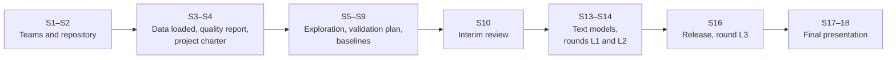

# Final project

All teams work on the same project: **predict the four-digit customs heading of an EU binding tariff decision from its description of goods**, as accurately as possible on the hidden test set of the class leaderboard. Teams of three (one team of four) work on it during the semester and present their final solution in Sessions 17 and 18. The project is the only graded part of the module (100 %).

> [!IMPORTANT]
> Every member presents a part of the project and answers individual questions. Make sure each of you has written, reviewed and can explain a substantial part of the code.

## The task

A trader asks the customs authority of a member state how a product is classified in the customs tariff; the authority answers with a binding decision that states the code, and the European Commission publishes all decisions (EBTI). Your model suggests the heading of a new request, so that a customs officer can check it faster.

- **Data:** 309,529 decisions from 2017–2023 for training; 113,188 decisions from 2024–2026 without headings as the test set. Descriptions are written in 23 languages. Prepare them with `uv run python case-study/prepare_data.py` ([case-study/README.md](../../case-study/README.md)).
- **Inputs:** only what exists when a request arrives: the description, the issuing country, the language and the date. The customs' justification, the keywords, the CN code, the chapter, the status, the end date and the invalidation reason are written with or after the decision and must not be model inputs (Session 13).
- **Leaderboard:** the decisions of 2024 form the public leaderboard (you see your score after each submission), those of 2025–2026 the private leaderboard (shown in Session 18). Accuracy is the main metric, with macro-F1 alongside.
- **Rounds:** L1 with TF-IDF models (Session 13), L2 with embeddings or language models (Session 14), L3 the final model after retraining with the released 2024 labels (Session 16).

> [!NOTE]
> Aim for the highest accuracy you can reach, but the score is not converted into marks. The grade rewards how you frame the problem, handle the data, build and validate the model and explain your results (see the criteria below). A team with a lower score that is well validated and well explained can receive a better grade than a team with a higher score that it cannot explain.

## Milestones

The challenge is introduced in Session 1. Your team first loads, checks and explores the data and sets up baselines and a validation plan (Sessions 3–9), then builds the text models in Sessions 13–16.

| Session | What is due | Feedback |
|---|---|---|
| S1 | Challenge introduced in class; teams formed | Lecturer, in class |
| S2 | Team repository from the template, with branch protection and CI | Lecturer, in the repository |
| S3 | Customs decisions downloaded with the provided script and loaded into the team database; first counts per year, language and member state in SQL | — |
| S4 | Data quality report of the decisions and **project charter** | Written feedback within one week |
| S5 | Exploratory findings: decisions per heading, language, member state and year; the long tail of rare headings | In class |
| S6–S7 | Baselines (most frequent heading; a simple rule) and the **validation plan**: split by time, metrics, uncertainty, forbidden inputs | On request |
| S8–S9 | A first classifier on simple features (language, member state, description length) in a pipeline, evaluated with accuracy and macro-F1; how the team will deal with rare headings | On request |
| S10 | **Interim review** (10 minutes per team): data, validation plan, baselines, plan for Sessions 13–16 | In class, not graded |
| S11–S12 | Open points from the interim review | — |
| S13 | TF-IDF classifier on the team's validation scheme, error analysis, round **L1** | Leaderboard |
| S14 | Evidence whether embeddings or a language model improve the model, round **L2** | Leaderboard |
| S15 | Optional: a language-model component (for example a classification assistant with retrieval), with its evaluation | On request |
| S16 | **Release**: tested service with the top-3 headings, monitoring plan and model card; retraining with the 2024 labels, round **L3** | Leaderboard |
| S17–S18 | **Final presentation** (graded) | Grade and written feedback |

## Project charter (Session 4)

One page in the team repository (`docs/charter.md`):

1. **Use**: who would use the suggestions, for which decision, and what a wrong suggestion costs.
2. **Metric and baseline**: accuracy and macro-F1, and whether the model may abstain on uncertain cases (then also coverage); the simplest result you must beat.
3. **Validation**: how you split the training years by time, and why.
4. **Data**: evidence that the decisions are loaded (a script that prints row counts per year), the main quality problems found, and the list of columns you will not use as inputs.
5. **Plan and roles**: who works on what until the interim review.
6. **Risks**: rare headings, languages with few decisions, changes of the nomenclature, and what you will do about them.

## Rules

- The final submission must be reproducible: the lecturer must be able to rerun the tagged repository from the official export to the submitted file. A submission that the repository cannot reproduce is not assessed.
- Do not look up test decisions in the public EBTI database or use their headings in any form. Every test decision can be found there; that is why the score itself earns no marks.
- Never commit data or submission files to the repository.

## Presentation and assessment

Freeze your repository with a release tag the day before Session 17; the assessment uses that version. Each team presents for 15 minutes, including a live demonstration, followed by 10 minutes of questions with individual questions to each member. The assessment covers the presentation and the submitted repository. The first five criteria (80 %) are assessed per team; *collaboration and presentation* (20 %) is assessed per member, from your presented part, your answers to individual questions and your pull requests.

| Criterion | Weight | Evidence | Expected for a very good grade |
|---|---|---|---|
| Problem definition | 10 % | Charter, presentation | The use of the suggestions is clear; metric, baseline and, if used, abstention are justified by that use |
| Data | 20 % | Repository | A pipeline that reruns from the official export to the submission; quality checked, with every cleaning decision recorded; inputs limited to what exists when a request arrives |
| Model | 25 % | Repository, presentation | Several approaches compared fairly with the baseline and with each other on the same validation scheme; the final choice justified |
| Reliability of the results | 15 % | Repository, questions | Validation by time without leakage; uncertainty of the differences between models; error analysis by language, heading frequency and chapter; validation and leaderboard scores compared and differences explained |
| Delivery | 10 % | Live demonstration | A tested service that returns the top-3 headings, with a monitoring plan and a model card |
| Collaboration and presentation (per member) | 20 % | Pull requests, presentation, questions | Own reviewed pull requests with passing CI; a clear presented part; correct and confident answers to individual questions |

Use of AI tools is permitted and must be documented with the HTW declaration. You must be able to explain and test all code you submit.
