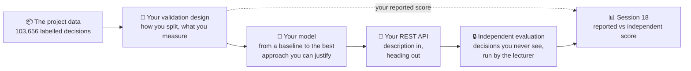
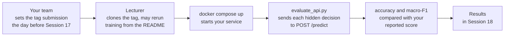

# Final project · Suggest the customs heading of a product

Every product that enters the European Union needs a customs code, and the code decides the duty. When traders are unsure, customs experts classify the product for them in a **Binding Tariff Information (BTI) decision**. Your team builds a service that reads such a product description, in any of 23 languages, and suggests the four-digit **heading**, so that a customs officer can check it faster.

All teams work on the same task, from Session 1 to Session 16, and present their solution in Session 17 or 18. The project is the only graded part of the module (100 %). You work as a team, but **every member is graded individually**: 20 % for your presentation and 80 % for your own paper and your own code ([Presentation and assessment](#presentation-and-assessment)).


```mermaid
flowchart LR
  A["📦 The project data<br/>103,656 labelled decisions"] --> B["🧪 Your validation design<br/>how you split, what you measure"]
  B --> C["🧠 Your model<br/>from a baseline to the best<br/>approach you can justify"]
  C --> D["🔌 Your REST API<br/>description in,<br/>heading out"]
  D --> E["🔒 Independent evaluation<br/>decisions you never see,<br/>run by the lecturer"]
  B -. "your reported score" .-> F["📊 Session 18<br/>reported vs independent score"]
  E --> F
```

## The goal in one sentence

> Build a **REST API** that takes the description of a product and returns its four-digit HS heading, **report how well your final design works**, and show that your report can be trusted.

The last part matters most. The lecturer keeps an **independent evaluation set** of decisions that no team ever sees, and runs every team's API on it after the code freeze. If your reported score is close to your independent score, your validation design worked. If there is a large gap, for example a reported accuracy of 0.95 and an independent accuracy of 0.80, the validation design overestimated the model, and your presentation should explain why.

## Rules

Read these first: they apply from Session 1. Breaking a rule lowers the grade more than a better model can raise it.

- **Reproducible on any computer.** Your work must run on another machine, not only on yours. The tagged repository rebuilds the model from the project data and starts the service with `docker compose up`, and its README says how. The lecturer may follow your README to rerun the training and deployment scripts. Code that does not rerun cannot be checked, so it cannot count for the members who wrote it. A service that does not start from the tag is not evaluated. Reproducibility is one of the most important habits in machine learning, and the first thing a colleague will test in your job.
- **Collaborate through GitHub.** Work on branches, open pull requests and review each other's code before it is merged. The lecturer reads the Git history and the pull requests to see how the team worked together and who did what.
- **Train only on the data you are given.** Do not add decisions downloaded from the public EBTI database: the held-back evaluation decisions are in it too, so your model would have seen the evaluation data during training. This is called **data leakage**: information that the model should not have reaches it during training, and the score looks better than it is.
- **Predict, never look up.** Your service must predict the heading from the description, not search for the decision online or in a copy of the database.
- **Only inputs that exist when a request arrives:** the description, and optionally the language. The justification, keywords, CN code, chapter and dates are written with or after the decision; a model that uses them looks excellent in validation and fails in use (Session 13).
- **No data in Git.** Never commit data, models larger than a few megabytes, or credentials.
- **AI tools** are allowed and must be documented with the HTW declaration. You must be able to explain and test all code you submit.

## The data

You work with the project data from the course drive: 103,656 labelled decisions (`decisions.parquet`) and the EU goods nomenclature. [Getting the data](../../case-study/README.md#getting-the-data) explains the download and the files; [the introduction to the EBTI data](../../case-study/ebti/README.md) explains where the data come from, what a decision looks like and its pitfalls. Read both first.

There is **no ready-made split**. How you divide the decisions to develop, tune and judge your model is your first design decision, and you justify it (Sessions 6–9). Things to weigh: about 1,000 headings, with a **long tail** (a few headings have thousands of decisions, hundreds have fewer than ten), 23 languages, decisions from late 2023 to 2026, and near-identical texts across decisions (exact repeats were removed).

## What you deliver

### 1 · A REST API

Your service must answer this interface. The Session 16 workspace already implements it; you may extend it, but not change it.

```http
POST /predict
Content-Type: application/json

{"description": "Damenstiefel mit Oberteil aus Rindleder und Laufsohle aus Gummi", "language": "de"}
```

```json
{
  "heading": "6403",
  "top": [
    {"heading": "6403", "score": 2.1},
    {"heading": "6405", "score": 0.4},
    {"heading": "6402", "score": 0.1}
  ]
}
```

- `description` (text, required) and `language` (two-letter code, optional) are the only inputs.
- `heading` (four digits) is required in the answer and is what gets scored; `top` (your three best headings) is shown in your demonstration. Other fields are allowed.
- `GET /health` answers `{"status": "ok"}` when the model is loaded.
- The service starts with `docker compose up` from your tagged repository, listens on port 8000, needs no internet access while it answers, and answers a single request within two seconds.

#### Check your API before you submit

The lecturer evaluates every service with the script `case-study/evaluate_api.py` of the course repository. Run it yourself on your own validation decisions first.

**1. Save your validation decisions** as a Parquet file. `validation` is your validation table, rows of `decisions.parquet` that your model was not trained on:

```python
validation[["description", "language", "heading"]].to_parquet("my_validation.parquet")
```

The file then looks like this (one row per decision):

| description | language | heading |
|---|---|---|
| Polished granite slabs , not carved of weight of 10kg or more | en | 6802 |
| Peigne pour cheveux composé à 100% de bois. | fr | 9615 |
| Chaise d'extérieur en acier avec dossier et assise en matière textile non rembourrés. | fr | 9401 |

- `description` and `heading` are required; `heading` is text with four digits, such as `0901`.
- `language` is optional. When the column is there, its value is sent with each description.

**2. Start your service**, then run the script from the course repository folder (add `--limit 200` for a quick check):

```bash
uv run python case-study/evaluate_api.py --url http://localhost:8000 --data my_validation.parquet
```

The script first calls `GET /health`. It then sends each description to `POST /predict`, one at a time, and compares the answer with `heading`. At the end it prints five lines (the numbers here are an example):

```text
decisions          14,808
failed requests    0
accuracy           0.8810
macro-F1           0.7120
seconds per answer median 0.015, max 0.210
```

| Line | Meaning |
|---|---|
| `decisions` | how many decisions were sent |
| `failed requests` | answers that were an error, a timeout (10 seconds) or had no `heading`; each counts as wrong |
| `accuracy` | share of decisions whose `heading` was right: the main metric |
| `macro-F1` | F1 per heading, averaged so that every heading counts equally: shows how you do on rare headings |
| `seconds per answer` | median and slowest response time; both must stay under two seconds |

### 2 · The reported score and one paper per member

- **The team's reported score**, in a section *Results* of the repository README: the **accuracy and macro-F1 of your final design**, how you estimated them and how uncertain they are. It is your prediction of how the service will do on decisions it has never seen. It is not graded on its own; every paper refers to it.
- **An individual paper by every member**, written alone with the **[paper template](paper-template.md)**. It explains the part of the project you were responsible for: the choices you made and the alternatives, the theory behind them, your results and how reliable they are, and what you learned from the group work. It also documents your use of AI tools. Other members may read and comment on your paper, but they do not write it.

### 3 · The repository and the presentation

- A **tagged repository** that rebuilds everything from the project data to the running service, with a README that tells a stranger how (see *Reproducible on any computer* under [Rules](#rules)).
- A **15-minute presentation** with a live demonstration (Sessions 17–18).

#### How to submit: the `submission` tag

You submit by setting **one Git tag named exactly `submission`** on your repository on GitHub. There is nothing to upload or send: the lecturer takes the commit this tag points to, and that commit is your submission. A **tag** is a fixed name for one commit; unlike a branch it never moves ([Session 2](../02-software-engineering/workbooks/02-lecture-notebook-to-application-git-and-ci.ipynb) explains tags and GitHub releases).

**Deadline:** the **code freeze**, the day before Session 17. The lecturer announces the exact date and time.

**Steps** (one team member does this, after the team agrees that `main` is ready):

1. Merge every pull request that should be part of the submission into `main`, and check that CI is green on `main`.
2. Check the submission as a stranger would: clone the repository into a new folder, follow your README from the project data to the running service, and run `case-study/evaluate_api.py` against it (see [Check your API before you submit](#check-your-api-before-you-submit)).
3. Set the tag on the latest commit of `main` and push it:

   ```bash
   git switch main
   git pull                                              # the latest merged state
   git tag -a submission -m "Final project submission"   # an annotated tag: records who and when
   git push origin submission                            # a plain git push does not send tags
   ```

4. Check on GitHub: under *Code → Tags*, `submission` is listed and points to the commit you meant.
5. Check that the tag works: `git clone --branch submission <your repository URL> check-submission`, then follow the README in that folder once more.

**Rules for the tag**

- **Exactly one tag named `submission`**, annotated (`-a`), on the `main` branch. Version tags from Session 16 such as `v2.0.0` may stay; the same commit may carry both. Only `submission` is evaluated.
- **Only the tagged commit counts.** At the code freeze the lecturer records the commit the tag points to. The evaluation run, the rerun from the README and the grading of code, papers and Git history all use that commit.
- **After the freeze, do not move, delete or recreate the tag.** A tag changed after the freeze is not accepted; the commit recorded at the freeze is graded. If you find a bug afterwards, say so in the presentation, with the fix you would make: knowing the limits of your release counts in your favour.
- **You may keep pushing commits after the tag** (for example to tidy your slides), but they are not graded and do not reach the evaluation.
- **Wrong commit tagged before the freeze?** Delete the tag and set it again: `git tag -d submission`, `git push origin --delete submission`, then step 3.
- **No tag at the freeze means no submission:** there is nothing to evaluate.

## How the evaluation works


```mermaid
flowchart LR
  A["Your team<br/>sets the tag submission<br/>the day before Session 17"] --> B["Lecturer<br/>clones the tag, may rerun<br/>training from the README"]
  B --> C["docker compose up<br/>starts your service"]
  C --> D["evaluate_api.py<br/>sends each hidden decision<br/>to POST /predict"]
  D --> E["accuracy and macro-F1<br/>compared with your<br/>reported score"]
  E --> F["Results<br/>in Session 18"]
```

The evaluation set holds decisions of the same kind as yours, held back before the project data was handed out: a random sample with the same mix of headings and languages ([what was held back](../../case-study/README.md#ebti-classifying-goods-in-the-eu-customs-tariff-sessions-1316)). The lecturer runs the same script as in [Check your API before you submit](#check-your-api-before-you-submit) on it, so you see the same five lines in Session 18. To practise monitoring and retraining, Session 16 treats your own decisions of 2026 as the requests that arrive after a release.

## Suggested check-ins

Nothing is graded before the final presentation, and you do not have to hand in anything along the way. The table is a suggested pace; the only fixed date is the code freeze. At each check-in the lecturer looks at what teams choose to share, so sharing intermediate results is how you get early feedback.

| Session | Suggested state of the work | What the lecturer offers |
|---|---|---|
| S1 | Challenge introduced; teams formed | Answers in class |
| S2 | Team repository from the template, with branch protection and CI | A look at the repository, if you ask |
| S3 | `decisions.parquet` loaded into the team's SQLite database; first counts per year, language and member state in SQL | None |
| S4 | Data quality report and a short **project charter** | Written comments, if you share them |
| S5 | Exploration: decisions per heading, language, member state and year; the long tail | In class |
| S6–S7 | Baselines (most frequent heading, a simple rule) and the **validation design**: how you split, which metrics, how you measure uncertainty, which inputs are forbidden | On request |
| S8–S9 | A first classifier on simple features in a pipeline, with accuracy and macro-F1; a plan for rare headings | On request |
| S10 | **Interim review** (10 minutes per team): data, validation design, baselines, plan for S13–S16 | Feedback in class |
| S11–S12 | Open points from the interim review | None |
| S13 | TF-IDF classifier and error analysis; **checkpoint 1**: your validation score and design on the class board | Comparison with other teams in class |
| S14 | Do embeddings or a language model help? **Checkpoint 2** on the class board | Comparison with other teams in class |
| S15 | Optional: a language-model component (for example a classification assistant with retrieval), with its evaluation | On request |
| S16 | **API release**: tested service with the top-3 headings, started with Docker Compose and released through CI/CD; monitoring plan and model card. You retrain on all your decisions, the newest included, and update your reported score | A check that your API answers the interface, if you ask |
| Day before S17 | **Code freeze**: the tag `submission` set on `main` (**required**, see [How to submit](#how-to-submit-the-submission-tag)) | None |
| S17–S18 | **Final presentation** (graded); independent scores revealed in Session 18 | Grade and written feedback |

Posting at the checkpoints is voluntary. Teams that post see how the others validate, early enough to change their own design.

## Project charter (Session 4)

Half a page in your repository (`docs/charter.md`) with your **plan**, written before you build anything. It is not graded on its own; its points later become the starting point of your papers.

1. **Use:** who would use the suggestions, and what a wrong suggestion costs.
2. **Metric and baseline:** what you measure, and the simplest result you must beat.
3. **Validation design:** how you split the decisions, and why.
4. **Areas of responsibility:** one clear area per member (for example data and validation, models, the service), which that member later presents and writes the paper about. You still help each other in every area.

> **Note.** The charter is not the model card. The charter is the plan at the start, for your team; the [model card](../16-deployment-and-monitoring/workspace/MODEL_CARD.md) (Session 16) describes the finished model at its release, for the people who will use it.

## Presentation and assessment

The project is team work, but **the grade is individual**: every member receives their own grade, from their own presentation, paper and code. No part of the grade is given to the team as a whole, so two members of the same team can receive different grades. The grade is given once, after the final presentation.

| Part | Weight | What is assessed | Evidence |
|---|---|---|---|
| Individual presentation | 20 % | Your part of the team's talk, and your answers to the questions asked to you | The presentation; a short protocol of the individual questions |
| Individual paper and code | 80 % | Your paper and the code you wrote | Your paper; your commits, pull requests and reviews in the Git history at the `submission` tag; the rerun from the README |

**The presentation (20 %).** Each team presents for 15 minutes, including a live demonstration of the API, followed by 10 minutes of questions. Every member presents their own area of responsibility. The questions to each member are like a short job interview on the project: explain the choices made in your part and in the team's design, the theory behind them, and how they apply to the practical problem.

**The paper and code (80 %).** The lecturer reads your paper together with the code you wrote and forms one overall judgement. These aspects are considered, as far as they concern your part of the project; they carry no fixed weights, because members work on different parts:

- **Problem definition:** the use of the suggestions is clear; metric, baseline and, if used, abstention follow from that use.
- **Data:** a pipeline that reruns from the project data on another computer; quality checked; every cleaning decision recorded; inputs limited to what exists when a request arrives.
- **Models:** approaches compared fairly with the baseline and with each other on the same validation design; the final choice justified.
- **Reliability of the results:** a validation design without leakage, with its uncertainty; error analysis by language, heading frequency and chapter; a reported score with its uncertainty, and a reasoned expectation for the independent evaluation.
- **Delivery:** an API that meets the interface, starts from the tag and answers within the limits; tests, monitoring plan and model card.
- **Code quality and collaboration:** readable, tested code in your own commits; reviewed pull requests with passing CI; useful reviews of the work of others.
- **Theory and reflection:** your choices explained with their theoretical foundations and sources; what you learned from the group work and what you would do differently.

**The independent score itself is not converted into marks.** A well-validated, well-explained model with 0.84 can earn a better grade than an unexplained one with 0.88. What counts is how well you know your own model.

## Questions and answers

**Why is there no training, validation and test split in the download?**
Because choosing it is part of the work. Random, stratified (by heading, or by heading and language, as the evaluation set), grouped by near-identical texts, or by date: each answers a different question. Sessions 7, 9 and 13 show the options and what stratification does with rare headings; your README and your papers say which one you took and why.

**What should I report as "my score"?**
The accuracy and macro-F1 of the design you submit, measured on decisions that played no part in building or tuning it, with an interval. If you tried many models, choose the final one before you look at that last measurement. Otherwise the score is too optimistic, because it also measures how well your choice fits that particular data.

**Can I train on all 103,656 decisions for the final service?**
Yes, and it is usually a good idea once the design is fixed. Report the score you measured before the final refit and say so.

**What if a heading in the evaluation set never occurs in my data?**
It happens for a few rare headings ([pitfalls of the data](../../case-study/ebti/README.md#things-to-keep-in-mind)). No model trained on the project data gets them right, so it costs every team the same.

**Do I have to use a language model?**
No. A well-tuned TF-IDF model is a strong baseline (about 0.88 accuracy, see the [reference values](../../case-study/README.md#reference-values)). Use embeddings or a language model only if your validation shows that they help.

**What if the live demonstration fails?**
Have a recorded fallback ready. The evaluation run uses your tag, not the demonstration.

**May I use AI to write my paper?**
Yes, for drafting and for code, as long as you can explain every sentence of your paper and every line of your code, and the section on AI use in your paper says what you used it for. The paper must describe your own work and your own thinking.

**Why is a team project graded individually?**
A grade must reflect what each person did and understood. You still build one service together, and good team work shows in your code, your reviews and your paper.

**Who do I ask?**
The lecturer, about the task, the data or the team work: open an issue in your team repository and mention the lecturer, or ask in class.
